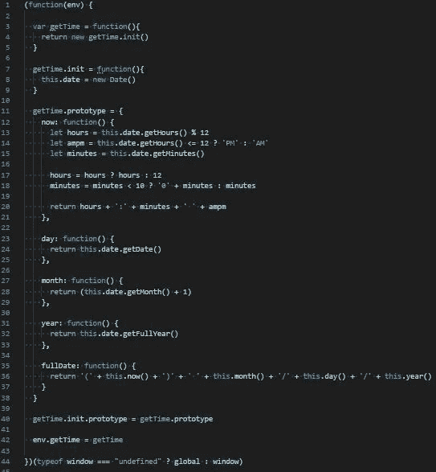

# JavaScript 函数构造(第 3 部分)

> 原文：<https://levelup.gitconnected.com/javascript-function-construction-part-3-d673ff247541>

## 生活和原型遗传

[第 1 部分](/function-construction-whats-your-function-5a282b81fc62) | [第 2 部分](/function-construction-part-2-f6a711075b11) | **第 3 部分** | [第 4 部分](/javascript-function-construction-part-4-d532f0a5e4af) | [第 5 部分](/javascript-function-construction-part-5-90733a0e6369) | [第 6 部分](/javascript-function-construction-part-6-72cfd6b18a7c) | [第 7 部分](/javascript-function-construction-part-7-17c5661e6ea7)

在我之前关于函数构造器的博客中，我们将 getTime 库变成了一个 IIFE(或 IIFC ),并想出了如何正确地将其导入和导出到其他普通 JS 脚本以及浏览器中。我们还设法弄清楚如何让`getTime.js`同时在 VSC 和浏览器中正常运行。

我们取得了很大进步，但我认为还有进一步改进的空间。

但是在我们开始重构`getTime.js`之前，让我们花点时间回顾一下将会推动我们今天所做的改变的一些方法。

再说遗产。

## 继承客观的客观性

继承可以被定义为一种共享对象的方法和属性的方式。当一个对象获得对另一个对象的属性和方法的访问权，或者从一个单独的对象接收属性时，我们说它继承了它们。我们可以通过几种不同的方式做到这一点。

一个例子是使用`.call()`方法。`.call()`方法调用一个函数，并允许对`‘this’`变量进行重新赋值。`.call()`方法还让我们在对象之间传递参数。

在下面的例子中，我们有两个函数使用`‘this’`关键字将属性分配给两个独立的函数构造函数。在第二个对象中，我们用`.call()`方法调用`obj1`。这允许我们将`obj1`的属性传递给`obj2`，并且我们可以通过将`‘this’`关键字作为参数传递来将`obj1`的执行上下文发送给`obj2`。

如果我们将每个对象存储到一个变量中并对它们进行`console.log`，我们将会看到`obj2`通过`.call()`方法继承了 obj1 的属性:

```
function obj1() {
 this.prop1 = ‘string1’
 this.prop2 = ‘string2’
}function obj2() {
 obj1.call(this) this.prop3 = 1
 this.prop4 = 2
}let createObj1 = new obj1()
let createObj2 = new obj2()console.log(createObj1)
console.log(createObj2)
```


很简单…但是如果我们想在一个对象被创建后给它添加一个属性或函数呢？

这是我们可以利用另一个概念的地方，我们会看到很多所谓的原型继承。

## **你是原型**

所有对象、函数和数组都有一个原型对象。该对象包含 JavaScript 引擎为给定数据类型预先定义的一组方法。

重要的是我们可以使用一个叫做`.prototype`的方法来为我们正在创建的对象或函数分配自定义方法。我们希望将我们的自定义方法存储在`.prototype`对象中，这样我们就不会在每次通过函数构造器构建新对象时都创建一组新方法。请记住，当我们将对象存储到变量中时，我们是通过引用来访问对象的。我们不创造新的物体。这非常适合我们如何使用`.prototype`。

这也节省了内存空间，因为我们不会在每次初始化一个新对象时都创建一组新的方法。最重要的是，`.prototype`方法的伟大之处在于它允许两个独立的对象共享同一个原型对象。这叫做原型继承。

让我们看一些例子。

首先，让我们看看 JavaScript 为我们提供的一些默认方法。

如果我们在浏览器中对一个数组调用`.prototype`，我们会看到很多熟悉的面孔:


或者一个物体:


甚至是一个字符串:


***重要提示*** : *函数构造函数和* `*.prototype*` *不能与箭头函数一起使用。ES6 arrow 函数自动将* `*‘this'*` *关键字绑定到正在创建的执行上下文中，会抛出很多错误。坚持使用熟悉的* `*function(){}*` *。*

酷，但是添加一个我们想写的新方法呢？

好吧，让我们试试。

我们可以创建一个新的函数构造函数，这一次，向构造函数传递一些参数:

```
function createObj(a, b, c) {
 this.prop1 = a
 this.prop2 = b
 this.prop3 = c
}
```

我们可以用`.prototype`添加一个新的属性或功能。我们可以设置方法的名称并将其存储到一个变量中，或者将其设置为另一个函数。

我们还可以使用`‘this’`访问原型方法被添加到的对象的属性:

```
createObj.prototype.addProps = function(){
 return this.prop1 + this.prop2 + this.prop3
}
```

然后创建新对象:

```
let obj1 = new createObj(1, 2, 3)
```

我们正在添加的功能是:

```
console.log(obj1.addProps())
```


我们也可以用`createObject()`创建另一个新对象，但是传递一些不同的变量:

```
let obj2 = new createObj(4, 5, 6)
```

而`console.log`的 `.addProps()`功能对于`obj2`来说又得到一个不同的结果:


在浏览器中，我们可以使用一个叫做`.__proto__`的方法来访问我们的两个对象的原型。

我们应该看到他们继承的`.addProps()`方法:

obj1:


obj2:


我们看到`.addProps()`方法出现在`obj1`和`obj2`中，并且也出现在它们的构造器原型`createObj()`中。

这意味着两个对象共享位于`createObj()`函数构造器原型对象中的`.addProps()`方法。

很好。

***重要提示:*** *使用原型时，* ***仅*** *使用* `*.__proto__*` *进行采样/测试。***使用* `*.prototype*` *方法。由于* `*.__proto___*` *方法处理 JavaScript 引擎提供的默认方法集，修改* `*.__proto__*` *可能会有一些严重的负面影响。**

## ***添加原型***

*我们将进行一些重构。我想把重点放在使用原型继承来改进`getTime.js`的内部功能上。这将最终改善我们用来从其他文件调用`getTime.js`的语法。*

*目前，下面是我们正在处理的文件:*

*文件结构:*

**

*getTime.js:*

```
*(function(env) {
  var getTime = function(){
    return new getTime.init()
  } getTime.init = function(){ this.date = new Date() this.now = function() {
      let hours = this.date.getHours() % 12
      let ampm = this.date.getHours() <= 12 ? ‘PM’ : ‘AM’
      let minutes = this.date.getMinutes() hours = hours ? hours : 12
      minutes = minutes < 10 ? ‘0’ + minutes : minutes return hours + ‘:’ + minutes + ‘ ‘ + ampm
    } this.day = function() {
      return this.date.getDate()
    } this.month = function() {
      return (this.date.getMonth() + 1)
    } this.year = function() {
      return this.date.getFullYear()
    } this.fullDate = function() {
      return ‘(‘ + this.now() + ‘)’ + ‘ ‘ + this.month() + ‘/’ + this.day() + ‘/’ + this.year()
    }
  } env.getTime = getTime})(typeof window === “undefined” ? global : window)*
```

*main.js*

```
*if (typeof window === “undefined”) {
  var getTime = require(‘./getTime’)
  getTime = global.getTime
} else {
  document.addEventListener(“DOMContentLoaded”, addTime)
  function addTime() {
    const timeDiv = document.querySelector(“.time”)
    timeDiv.innerText = `${getTime().now()}`
  }
}console.log(getTime().now())*
```

*index.html:*

```
*<html>
  <head>
    <title>Example</title>
    <script src=’scripts/getTime.js’></script>
    <script src=’scripts/main.js’></script>
  </head>
  <body>
    <div class=’time’></div>
  </body>
</html>*
```

*简而言之，`index.html`加载了我们的两个脚本:`getTime.js`和`main.js`。*

*根据`main.js`执行的环境(VSC 或浏览器)，它需要和/或导入`getTime.js`。*

*然后，`main.js`调用 IIFC 并创建一个内置了我们的方法的新对象。*

*然后返回它创建的对象，并将该对象附加到全局执行上下文中。我们可以通过调用`getTime()`来执行所有这些。*

*然后，我们可以将一个方法链接到那个调用上(比如`.now()`或`.fullDate()`)，并获取当前时间、当前日期、当前年份等等*

*我们通过`main.js`调用`getTime.js`，因为我们希望能够在我们正在处理的任何其他普通 JS 文件中使用`getTime.js`，所以我们正在测试我们的 IIFC 是否被正确地导出/导入到其他普通 JS 文件中。否则，我们可以移除`main.js`并单独运行`getTime.js`。无论哪种方式，它应该没有问题。*

*我们要做的第一件事是向我们的 IIFC 添加一个原型对象。然后我们想让我们的`init()`函数继承我们正在构建的原型对象。*

*我们最终将把我们所有的时间方法移到原型对象中，但是现在让我们只添加一个测试方法:*

```
*getTime.prototype = {
  test: function() {
    return ‘test string’
  }
}*
```

*如果我们在浏览器中尝试 console.log `getTime.js`，我们似乎在任何地方都找不到“测试”功能:*

**

*嗯…我们返回的对象叫做`getTime.init`…而不是 getTime…那么如果我们尝试将`getTime.init`的原型设置为 getTime 的原型，因为我们返回的是对`getTime.init`的调用，会怎么样呢？*

```
*getTime.prototype = {
  test: function() {
    return ‘test string’
  }
}getTime.init.prototype = getTime.prototype*
```

**

*找到了。*

*如果我们`console.log`测试函数:*

**

*太好了。*

*我们将`getTime.init.prototype`设置为等于`getTime.prototype`，因为我们用来构建对象的函数被称为`getTime.init`，而`getTime.init`当前在其原型对象中没有任何内容。所以我们可以设置`getTime.init.prototype`到`getTime.prototype`来建立一个原型链，并继承我们存储在`getTime.prototype`中的方法。*

*当一个对象继承了另一个对象的属性，而没有重写原对象的属性时，称为纯原型继承。*

*如果我们设置`getTime.init.prototype`等于`getTime.prototype`，我们是通过引用访问`getTime.prototype`，而不是创建一个新对象。*

*由于 JavaScript 的原型链，我们还可以访问原型对象中的`.test()`函数，而不必编写`.prototype.test()`。*

*原型链是一个函数、对象或数组从其他函数、对象或数组继承的原型对象链。JavaScript 引擎将在一个链中的所有原型对象中查找属性，但是如果找不到它正在查找的属性或函数，则返回 undefined。*

*示例:如果我们有一个看起来像这样的原型链:*

```
*obj.prototype.prototype.prototype.prop1*
```

*我们只需输入`obj.prop1`就可以访问 prop1*

*现在我们已经建立了基本的原型链，让我们将所有的自定义方法移入原型对象，并将所有内容格式化为键/值对:*

**

*我们唯一没有移入原型的是日期属性。这更像是一个美学原因，我想用一些东西初始化 init 对象(不过我稍后会更改)。如果我们真的想的话，我们可以把日期移到原型对象上。*

*通过将 date 属性保存在 init 对象中，我们可以`console.log(getTime)`获得一个漂亮整洁的对象，日期保存在 init 对象中，其他内容保存在我们的 prototype 对象中:*

**

*那很好。*

*但是如果我们想调用这些方法中的任何一个，我们仍然需要做这样的事情:*

```
*getTime().now()
getTime().day()
getTime().month()
getTime().year()*
```

*…老实说，那个双括号实在是太难看了。*

*如果不是将方法链接到`getTime()`上，而是将参数传递到`getTime()`，并让我们的函数构造器计算出要调用哪个方法，会怎么样？*

*大概是这样的:*

```
*getTime(‘now‘)
getTime(‘day‘)
getTime(‘month‘)
getTime(‘year‘)*
```

*…如果我们不向`getTime()`传递任何参数，我们会得到一个默认方法，或者类似的错误消息？*

*这将是非常巧妙的，对不对？*

*让我们开始吧。*

## ***添加关键字参数***

*我们要做的第一件事是重构我们的`init()`函数，接受我们要传递给它的关键字，然后沿着原型链向下发送，并寻找相应的方法。*

*因此，如果我们用关键字调用`getTime`:*

```
*getTime(‘now‘)*
```

*我们希望 init 函数获取该关键字，并在原型对象中找到匹配的键/值对。我们已经返回了对`init()`的调用，所以我们也可以返回对`init.prototype()`中函数的调用。*

*我们可以这样做:将对`init()`的调用存储到一个变量中，然后通过`init()`的计算成员访问操作符传递我们希望它找到的关键字，并返回它:*

```
*var getTime = function(keyword){
  var init = new getTime.init(keyword)
  return init[keyword]
}*
```

*因此，如果我们将`‘now’`传递给`getTime()`，关键字参数将等于`‘now’`，我们可以将它传递给原型链，并像以前一样返回对`‘now’`函数的调用。*

*目前，如果我们尝试`console.log(getTime(‘now’))`，我们得到的只是一个函数定义。我们得到了`‘now’`的函数定义，所以它的工作方式是:*

**

*如果我们试图引用这个定义呢？*

**

*有意思…*

*如果我们尝试从`init()`函数中调用函数定义会怎么样？*

```
*getTime.init = function(keyword){
  this.date = new Date()
  this[keyword]()
}*
```

*我们再次得到函数定义:*

**

*好吧…奇怪…让我们试着像添加原型对象之前一样，在`init()`函数中设置一个测试变量:*

```
*getTime.init = function(keyword){
  this.date = new Date() this[keyword] = ‘test’
}*
```

*当我们尝试`console.log getTime('now')`时，现在会发生什么？*

**

*我们拿回‘测试’。*

*这很好。*

*这意味着我们正在`init()`中创建一个动态属性。*

*唯一的问题是被调用的函数没有找到它需要的属性。*

*我们知道我们传递的关键字被接受到了`init()` 函数中。我们也知道 JavaScript 总是会沿着原型链寻找变量定义。我们知道，每次调用一个函数都会创建一个新的执行上下文，这会改变“this”关键字所指向的引用。所以我们需要`init()` 在原型对象中找到并调用方法，使`init()`和`init.prototype`共享相同的执行上下文。*

*那么，如果我们将`init()`中的动态属性设置为等于自身的调用，会怎么样呢？*

```
*getTime.init = function(keyword){
  this.date = new Date()
  this[keyword] = this[keyword]()
}*
```

*…如果我们再次尝试`console.log getTime(‘now')`呢？*

**

*杰克波特。*

*我们能在浏览器里`console.log(getTime.prototype)`吗？*

**

*布林戈。*

*如果我们不争论会怎么样？*

**

*嗯……有意思。这很有道理。*

*因为我们没有向`getTime()`传递参数，所以函数构造函数在原型链中没有任何东西可找，并且抛出一个 TypeError，因为它找不到一个带有我们给它的参数的方法(其实什么都没有)。*

*所以让我们做一些错误处理。*

*我们可以使用三元运算符来检查`this[keyword]`是否为真，如果不是，则返回一个错误消息。否则，调用我们沿着原型链发送的动态方法:*

```
*getTime.init = function(keyword){
  this.date = new Date() this[keyword] = this[keyword] ? this[keyword]() : ‘Error. Please pass an argument into getTime()’
}*
```

*现在如果我们没有任何争论？*

**

*太美了。*

*让我们稍微扩展一下这个错误消息。*

*让我们的三元运算符为 falsey 语句返回一个错误函数:*

```
*getTime.init = function(keyword){
  this.date = new Date() this[keyword] = this[keyword] ? this[keyword]() : this.error(keyword)
}*
```

*如果没有传递参数，则返回一条错误消息，如果传递了无效的关键字，则返回一条错误消息:*

*在`getTime.prototype`中:*

```
*error: function(keyword) {
  if (keyword === ‘’ || keyword === null || keyword === undefined) {
    return ‘Please enter a keyword’
  } else {
    return `${keyword} is an invalid keyword`
  }
}*
```

*所以现在如果我们再一次没有任何参数的情况下……*

**

*无效关键词怎么办？*

**

*太棒了。*

*这是对我们的 2 个脚本的最后一次检查(我将 this.date 移动到了原型对象中):*

*getTime.js:*

```
*(function(env) { var getTime = function(keyword){
    var init = new getTime.init(keyword)
    return init[keyword]
  } getTime.init = function(keyword){
    this[keyword] = this[keyword] ? this[keyword]() : this.error(keyword)
  } getTime.prototype = {
    date: new Date(), now: function() {
      let hours = this.date.getHours() % 12
      let ampm = this.date.getHours() <= 12 ? 'AM' : 'PM'
      let minutes = this.date.getMinutes() hours = hours ? hours : 12
      minutes = minutes < 10 ? '0' + minutes : minutes return hours + ':' + minutes + ' ' + ampm
    }, day: function() {
      return this.date.getDate()
    }, month: function() {
      return (this.date.getMonth() + 1)
    }, year: function() {
      return this.date.getFullYear()
    }, fullDate: function() {
      return '(' + this.now() + ')' + ' ' + this.month() + '/' + this.day() + '/' + this.year()
    }, error: function(keyword) {
      if (keyword === '' || keyword === null || keyword === undefined) {
        return 'Please enter a keyword'
      } else {
        return `${keyword} is an invalid keyword`
      }
    }
  } getTime.init.prototype = getTime.prototype env.getTime = getTime})(typeof window === "undefined" ? global : window)*
```

*main.js*

```
*if (typeof window === "undefined") {
  var getTime = require('./getTime')
  getTime = global.getTime
} else {
  document.addEventListener("DOMContentLoaded", addTime)
  function addTime() {
    const timeDiv = document.querySelector(".time")
    timeDiv.innerText = `${getTime('now')}`
  }
}console.log(getTime())*
```

*我们所要做的就是向函数中传递一个关键字来访问原型方法:*

```
*console.log(getTime('now'))
console.log(getTime('day'))
console.log(getTime('month'))
console.log(getTime('year'))
console.log(getTime('fullDate'))*
```

*要获得我们想要的回报:*

**

*太棒了。*

## *任务完成*

*对于我们的`getTime.js`，我们还可以做更多的事情，但我认为这是这个博客的一个很好的停止点。*

*函数构造函数非常有用和灵活，通过我们重构`getTime.js`的方式，我们使用它的结构来构建非常通用的函数构造函数，这些函数构造函数抽象出大量代码，否则我们会重复这些代码(我们将在下一篇关于 fetch 请求的博客中这样做)。*

*我计划的下一篇博客包括一些小的补充，以及如何将`getTime.js`导入 React 应用程序的教程。我希望这篇博客是前两篇的后续，我期待在 JavaScript 函数构造的第 4 部分中讨论这个主题。*

# *JavaScript 函数构造*

*[第 1 部分](/function-construction-whats-your-function-5a282b81fc62) | [第 2 部分](/function-construction-part-2-f6a711075b11) | **第 3 部分** | [第 4 部分](/javascript-function-construction-part-4-d532f0a5e4af) | [第 5 部分](/javascript-function-construction-part-5-90733a0e6369) | [第 6 部分](/javascript-function-construction-part-6-72cfd6b18a7c) | [第 7 部分](/javascript-function-construction-part-7-17c5661e6ea7)*