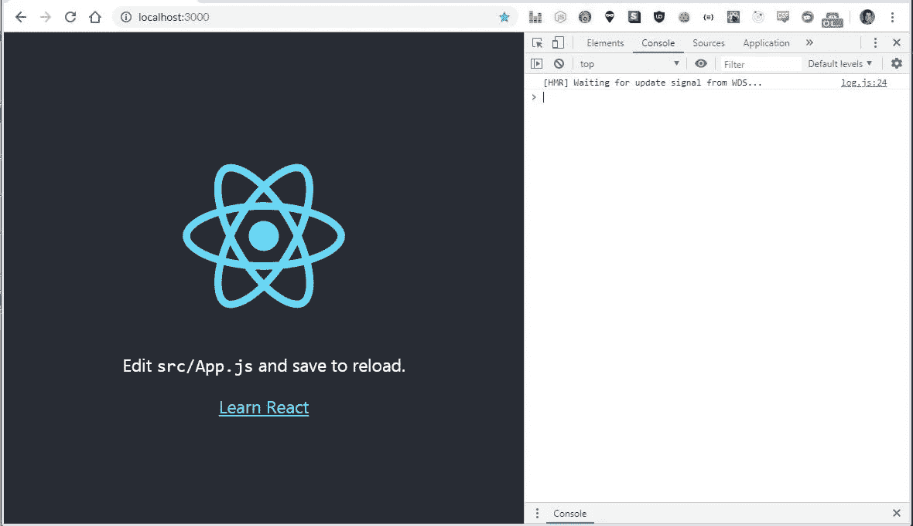
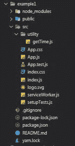
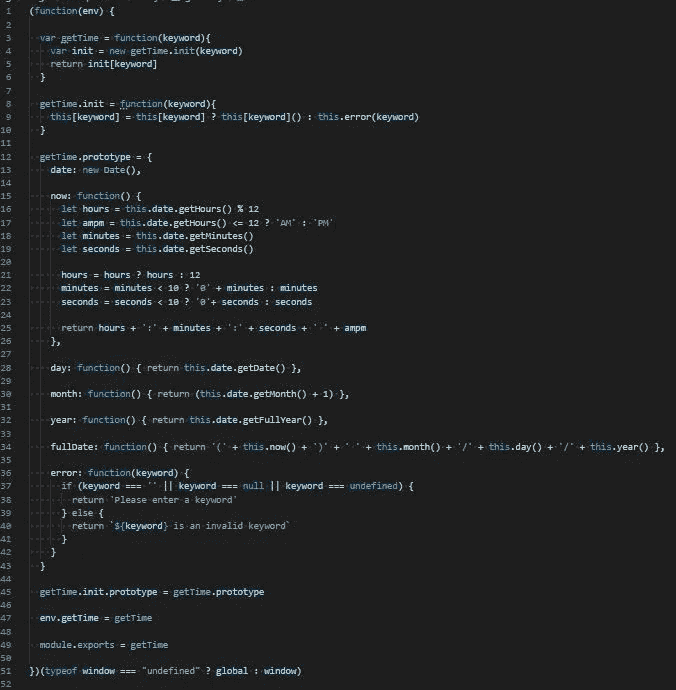
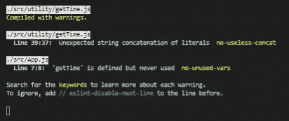
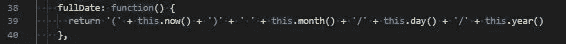
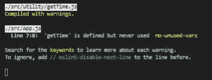
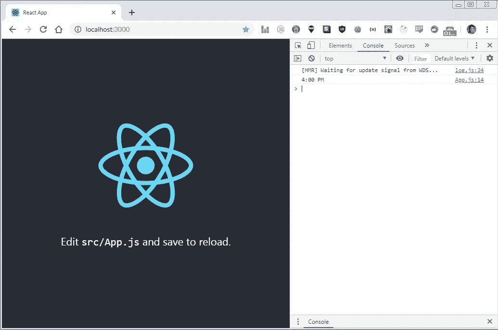
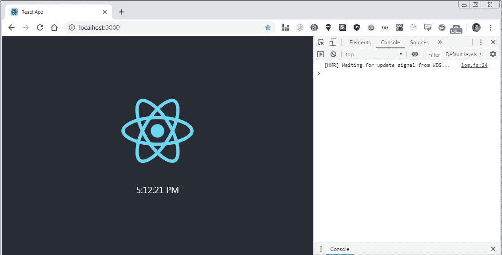
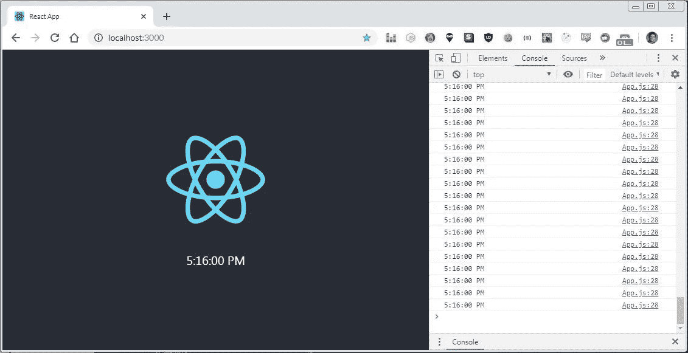
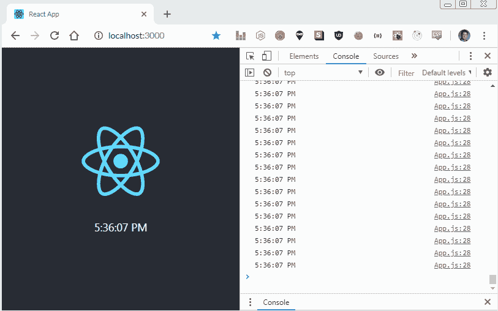

# JavaScript 函数构造(第 4 部分)

> 原文：<https://levelup.gitconnected.com/javascript-function-construction-part-4-d532f0a5e4af>

## 立即调用函数构造函数并作出反应

[第 1 部分](/function-construction-whats-your-function-5a282b81fc62) | [第 2 部分](/function-construction-part-2-f6a711075b11) | [第 3 部分](/javascript-function-construction-part-3-d673ff247541) | **第 4 部分**|**|**[第 5 部分](/javascript-function-construction-part-5-90733a0e6369) | [第 6 部分](/javascript-function-construction-part-6-72cfd6b18a7c) | [第 7 部分](/javascript-function-construction-part-7-17c5661e6ea7)

所以我们在这里。自从我写了第一篇关于 JavaScript 函数构造器的博客以来，我们已经走过了很长的路。我们讨论了闭包、立即调用函数表达式、原型继承、作用域链、全局执行上下文等等。

我们也看到了我们的小`getTime.js`库从受限于编写它的文件发展成为一个可导出的立即调用的函数构造器，可以导入到我们编写的任何其他普通 JavaScript 文件中。它还支持有限的跨平台功能和错误处理，并使用关键字来调用内置的方法。

但是有一件事我一直没有深入研究:**将 getTime.js 导入 React**

无论何时你将 React 放到任何堆栈上，它都会打开一个充满机会和问题的潘多拉盒子。当我第一次开始学习 React 时，正是因为这个原因，我讨厌 React。

我过去常说*‘反应糟透了。我用 React 能做的任何事情，用普通 JavaScript 都能做得更快，我非常想回到普通 JavaScript。*

但是我大错特错了。大错特错。大错特错。

如今，情况恰恰相反。我坚持使用 React，花的时间越多，我就越喜欢它。现在，我害怕用普通的 JavaScript 做任何类型的 DOM 操作。请不要。除了那个什么都行。

我今天想做的很简单:用从`getTime.js`调用`‘now’`方法替换默认 React 主页上的*‘编辑 src/App.js 并保存以重新加载’*。我还希望 React 用当前时间每秒更新文本十次。这使得它像普通时钟一样运行。但是有了互联网(算是)。

当然，我不可能是认真的。我是认真的，不要叫我雪莉。

## 准备好做出反应

此刻，`getTime.js`看起来是这样的:

```
(function(env) {
  var getTime = function(keyword){
    var init = new getTime.init(keyword)
    return init[keyword]
  } getTime.init = function(keyword){
    this[keyword] = this[keyword] ? this[keyword]() : this.error(keyword)
  } getTime.prototype = {
    date: new Date(), now: function() {
      let hours = this.date.getHours() % 12
      let ampm = this.date.getHours() <= 12 ? ‘AM’ : ‘PM’
      let minutes = this.date.getMinutes()
      let seconds = this.date.getSeconds() hours = hours ? hours : 12
      minutes = minutes < 10 ? ‘0’ + minutes : minutes
      seconds = seconds < 10 ? ‘0’+ seconds : seconds return hours + ‘:’ + minutes + ‘:’ + seconds + ‘ ‘ + ampm
    }, day: function() { return this.date.getDate() }, month: function() { return (this.date.getMonth() + 1) }, year: function() { return this.date.getFullYear() }, fullDate: function() { return '(' + this.now() + ') ' + this.month() + '/' + this.day() + '/' + this.year() }, error: function(keyword) {
      if (keyword === ‘’ || keyword === null || keyword === undefined) {
        return ‘Please enter a keyword’
      } else {
        return `${keyword} is an invalid keyword`
      }
    }
  } getTime.init.prototype = getTime.prototype env.getTime = getTime})(typeof window === “undefined” ? global : window)
```

我们不再像以前那样需要`main.js`。`App.js`现在将处理`main.js`以前做的一切。

首先，我将使用`npm create-react-app example1`创建最基本的 React 应用程序，并希望一切设置正确。如果是这样的话，我们应该能够在浏览器中访问`localhost:3000`,并在一切完成后看到默认的 react 主页:



很简单。

让我们整理一下文件结构。

我将在 src 目录下创建一个名为`‘utility’`的新文件夹，并将我们当前版本的`getTime.js`移入其中。一旦`create-react-app`完成，我们的文件结构应该如下所示:



我们将来构建的任何函数构造器都可以放入`./utility`中，这样一切都保持有序。

现在，让我们重构`getTime.js`，以便我们可以将其导出到`App.js`。

我们所要做的就是添加一行代码:`module.exports = getTime`

是的，就是这么简单。

这允许我们使用`App.js`中的 import 关键字，并像我们通常导入到 React 中的任何其他文件、库或包一样访问它。

我喜欢把它加在底部，我们也把`getTime.js`附加到全局执行上下文，但是老实说，你把它放在哪里并不重要。

老实说，我们可能不需要将它附加到全局执行上下文中，因为 React 可能会处理它，但是我没有测试过它，所以我真的不知道。

在 getTime.js 中:

```
getTime.init.prototype = getTime.prototypeenv.getTime = getTimemodule.exports = getTime
```

这里有一张`getTime.js`的图片，用于超清澄清:



完成后，我将把注意力转向`App.js`并稍微清理一下。

我将移除底部的*‘Learn React’*链接，并将`App.js`变成一个类组件。我计划使用状态来更新时钟，以及使用生命周期方法`componentDidMount()`和`componentWillUnmount()`。

在 App.js 中:

```
import React from ‘react’import ‘./App.css’import logo from ‘./logo.svg’class App extends React.Component { state = {} componentDidMount() { } componentWillUnmount() { } render(){
    return (
      <div className=”App”>
        <header className=”App-header”>
          
          <p>
            Edit <code>src/App.js</code> and save to reload.
         </p>
        </header>
      </div>
    )
  }
}export default App
```

这样，除了删除*‘Learn React’*链接之外，我们应该不会在浏览器的`localhost:3000`处看到任何客户端面临的变化。

我们现在可以像平常一样将`getTime.js`导入到`App.js`中:

在 App.js

```
import getTime from ‘./utility/getTime’
```

但是如果我们保存`App.js`,我们会在终端中得到两个错误:



第二个错误是意料之中的，因为我们还没有在`App.js`的任何地方实现`getTime.js`，但是第一个错误很有趣:

```
./src/utility/getTime.jsLine 39:37: Unexpected string concatenation of literals no-useless-concat
```

好吧，让我们看看`getTime.js`中的`line 39`:



似乎 React 对我们连接`fullDate()`返回值的方式不太满意。

这没什么大不了的，但是修复 React 可能抛出的哪怕是最小的错误总是一个好主意。对于这样的小事，React 可能相当善变，它提出的大多数小问题可能与应用程序的实际功能没有任何关系。

但是，嘿，你可能会学到新的东西，这总是好的。

不管怎样，我都会猜测`‘useless-concat‘`错误是指我们在`this.now() + ‘)’`和`this.month()`之间添加的空白字符串。这是我能想到的唯一可能被考虑的事情

因此，让我们删除它，并在带括号的字符串中添加一个空格:

在 getTime.prototype.fullDate()中:

```
return ‘(‘ + this.now() + ‘) ‘ + this.month() + ‘/’ + this.day() + ‘/’ + this.year()
```

如果我们保存并重新加载:



太好了。

这个问题解决后，让我们尝试一下我们的`console.log()`方法，看看事情是否正常工作。

让我们将`console.log(getTime('now'))`添加到`componentDidMount()`，这样我们在页面加载时只调用`getTime('now')`一次。

在 App.js 中:

```
componentDidMount() { console.log(getTime(‘now’)) }
```

如果我们保存`App.js`，并等待 React 在浏览器中编译并热加载页面，`componentDidMount()`应该`console.log()`调用我们在`getTime.prototype`中的`‘now’`方法，并在控制台中显示当前时间:



太棒了。

接下来，让我们尝试使用`getTime(‘now’)`将*‘编辑 src/App.js 并保存以重新加载’*文本替换为当前时间，并使其每秒更新十次。

## 反应时间

有两种方法可以解决这个问题。实际上有三种方式。

第一种是使用生命周期法`componentDidUpdate()`。该方法将使用`getTime('now')`更新`this.state`中的属性。

这样做的问题是，我们需要通过在生命周期方法中设置条件评估来操纵组件的状态，否则我们将从`componentDidUpdate()`内部创建一个调用函数执行的无限循环。

当您在`componentDidUpdate()`中调用一个函数时，您必须确保您是在满足一个条件状态后调用该函数。比如一个布尔值被设置为真或假。

在执行函数调用后，我们还需要为另一个条件求值设置状态。React 每毫秒重新渲染 DOM 大约 9001 次(不是真的，但是真的很快)，每次重新渲染都执行`componentDidUpdate()`。在这种情况下，如果我们在`componentDidUpdate()`内无限制地调用函数执行，我们会创建一个无限循环，并很快超过最大调用堆栈。

幸运的是，一旦达到最大调用堆栈，React 将抛出运行时错误，并在我们的计算机爆炸之前停止整个应用程序。

记住，无论何时你在`componentDidUpdate()`中调用一个函数，你必须确保你是在满足一个条件状态后调用该函数，并且在满足另一个条件状态后停止该函数的执行。

迷惑？是的，可能是。因此，我们不要为所有这些烦心，看看另一个解决方案。

我们可以用钩子。对于像更新网页上的字符串这样的小事来说，钩子会很有用。我们应该用钩子。但是，由于钩子在 React 世界中是一个相对较新的概念，您可能不熟悉(这也是我仍在努力掌握的东西)，所以我们暂时不讨论钩子。另外，我已经为这个博客准备了所有的例子，我们已经把`App.js`变成了一个类组件，我已经把所有的屏幕截图都打出来了。

所以，如果我承认有点懒，钩子不是我们要用的选项，我们实际上要做什么呢？

好吧，如果你更熟悉 React 中的生命周期方法，并注意到当我将它转换成一个类组件时向 `App.js`添加了`componentWillUnmount()`，你可能已经猜到我的解决方案是什么了。

我将使用`setInterval()`创建一个计时器，它每秒钟调用`getTime(‘now‘)`十次，并更新一个名为`time`的状态属性。这样，我们就可以将 render 方法中的*‘Edit src/app . js and save to reload’*文本替换为`{this.state.time}`，一切应该都可以了。我们应该做的另一件事，但不是必须做的，是将`clearInterval()`添加到`componentWillUnmount()`中，以确保一旦组件不再被渲染，我们就取消对计时器的订阅。

而我们需要做的就是增加 2 行代码，替换 1 行代码，修改 1 行代码。

我知道所有事情的设置和解释都远比实际实现`getTime.js` into React 要长，但是这些解释是值得理解的。

我要做的第一件事是向 state 添加一个时间属性，并将其设置为一个空字符串:

在 App.js 中:

```
state = { time: '' }
```

这就是我们将要在 DOM 上更新和渲染的内容。

接下来，我将为`componentDidMount()`添加一个计时器:

在 App.js 中:

```
componentDidMount() { this.timeInterval = setInterval(this.timeFunctions, 100) }
```

我们正在创建一个变量，并将其绑定到`App.js`组件。我们希望从`App.js`中的其他方法访问它，更具体地说，能够停止`componentWillUnmount()`中的计时器。

该变量是对 JavaScript 内置的`setInterval()`方法的调用，该方法接受两个参数。第一个是我们即将定义的函数，第二个是我们希望第一个参数执行的速度(以毫秒为单位)。100 毫秒等于 0.1 秒(因为事情发生的时间)。简而言之，`timeInterval`每秒将执行十次，由于`this.timeInterval`的定义是对`setInterval`的调用，`this.timeFunctions`也将每秒执行十次。

为什么一秒钟十次？因为我第一次写这个博客的时候打错了，我希望我的时钟非常准确。

唯一的问题是`timeFunctions`长什么样？

在 App.js 中:

```
timeFunctions = () => { this.setState({ time: getTime(‘now’) })}
```

`timeFunctions`是一个 ES6 有界函数，设置`App.js`中时间属性的状态。它将`time`属性的状态设置为调用`getTime.js`中的`‘now’`方法的返回值。每秒钟它会这样做十次，因为我们在`componentDidMount()`中从`setInterval()`内部调用`timeFunctions()`。

接下来，每当从 DOM 中删除`App.js`时，我们想要取消对`this.timeInterval`的订阅

在 App.js 中:

```
componentWillUnmount() {clearInterval(this.timeInterval)}
```

为了停止计时器，我们需要接近它。为了访问它，我们需要将 interval 设置为一个变量，并将其绑定到`App.js`。否则，该间隔将被限制在`componentDidMount()`的范围内。但是由于我们可以从`componentWillUnmount()`内部访问`this.timeInterval`，我们可以通过调用`clearInterval()`来停止计时器。

最后，我们要做的就是在我们的`render(){ return () }`方法中用`{ this.state.time }`替换*‘编辑 src/App.js 并保存以重新加载’*。

在 App.js 中:

```
render(){
  return (
    <div className=”App”>
      <header className=”App-header”>
        
        <p>
          { this.state.time }
        </p>
      </header>
    </div>
  )
}
```

如果我们保存并热加载`localhost:3000`，我们应该看到当前时间正确显示在下面的页面上，每秒钟自动更新十次:



…而且没有更新。

******** 。

嗯，至少它取代了文本，并正确显示当前时间。

我们可以解决这个问题。我们有技术。

首先，让我们用`render()`方法中的`console.log(getTime(‘now‘))`来试着诊断问题。我们需要找出这是 React 中的问题，还是`getTime.js`中的问题:



喔，好的。

所以 React 确实在正确地更新 DOM。但是它所做的只是滥发`this.state.time`的初始值。问题一定存在于`getTime.js`中，因为 React 没有接收到更新的时间值，并且/或者 React 在页面加载中第一次调用`getTime`时接收到当前时间，然后一次又一次地用相同的值更新`this.state.time`。

这让我预感到问题出在哪里。我们在 prototype 方法中存储了 JavaScript 内置`new Date()`函数的调用。原型方法仅在创建`getTime`对象时被引用。

所以，如果我们从原型方法中调用`this.date`，它每次都会返回相同的值，因为我们是通过引用来访问它的。原型对象不会在每次调用时更新，但是`init()`函数会更新。`init()`功能是我们暴露出来做出反应的东西，也是我们做所有工作的地方。

所以让我们将日期属性从原型对象移回`getTime.init()`。

如果这就是问题所在，我会觉得自己很傻。在上一篇博客中，我最初将`this.date`保留在`getTime.init()`中，只将其移动到博客末尾的 prototype 对象中。现在我又把它移回来了。

在 getTime.js 中:

```
getTime.init = function(keyword){
  this.date = new Date() this[keyword] = this[keyword] ? this[keyword]() : this.error(keyword)}
```

如果我们检查浏览器:



当然了。言语无法表达我所感受到的讽刺。

没关系，耶！有用！

精益求精！

让我们最后看一下`getTime.js`和`App.js`，称这篇博客为任务完成。

在 getTime.js 中:

```
(function(env) {
  var getTime = function(keyword){
    var init = new getTime.init(keyword)
    return init[keyword]
  } getTime.init = function(keyword){
    this.date = new Date()
    this[keyword] = this[keyword] ? this[keyword]() : this.error(keyword)
  } getTime.prototype = {
    now: function() {
      let hours = this.date.getHours() % 12
      let ampm = this.date.getHours() <= 12 ? ‘AM’ : ‘PM’
      let minutes = this.date.getMinutes()
      let seconds = this.date.getSeconds() hours = hours ? hours : 12
      minutes = minutes < 10 ? ‘0’ + minutes : minutes
      seconds = seconds < 10 ? ‘0’+ seconds : seconds return hours + ‘:’ + minutes + ‘:’ + seconds + ‘ ‘ + ampm
    }, day: function() { return this.date.getDate() }, month: function() { return (this.date.getMonth() + 1) }, year: function() { return this.date.getFullYear() }, fullDate: function() { return ‘(‘ + this.now() + ‘) ‘ + this.month() + ‘/’ + this.day() + ‘/’ + this.year() }, error: function(keyword) {
      if (keyword === ‘’ || keyword === null || keyword === undefined) {
        return ‘Please enter a keyword’
      } else {
        return `${keyword} is an invalid keyword`
      }
    }
  } getTime.init.prototype = getTime.prototype env.getTime = getTime module.exports = getTime})(typeof window === “undefined” ? global : window)
```

在 App.js 中:

```
import React from ‘react’
import ‘./App.css’
import logo from ‘./logo.svg’
import getTime from ‘./utility/getTime’class App extends React.Component { state = { time: ‘’ } componentDidMount() { this.timeInterval = setInterval(this.timeFunctions, 100) } timeFunctions = () => { this.setState({ time: getTime(‘now’) }) } componentWillUnmount() { clearInterval(this.timeInterval) } render(){
    return (
      <div className=”App”>
        <header className=”App-header”>
          
          <p>
            { this.state.time }
          </p>
        </header>
      </div>
    )
  }
}export default App
```

耶切。

## 任务完成

我想重点关注的是`App.js`中的这一行代码:

```
timeFunctions = () => { this.setState({ time: getTime(‘now’) }) }
```

这一行代码就是我在过去的 4 篇博客中花费的所有时间、精力和精力。

所有的抽象。所有的重构。所有的一切。这一切都包含在那一行代码中。

这是一个很好的例子，说明 JavaScript 和 React 中的函数构造函数是多么强大。能够抽象出如此多的代码，同时能够一次又一次地重用同样的抽象，这给我带来了极大的快乐。

就像圣诞节，但是有代码。

无论哪种方式，我都计划将 fetch 请求与 React 中的函数构造函数结合起来，并使用与`getTime.js`抽象基本 CRUD 操作相同的框架。

但是，这个星期对我来说是忙碌的一周。我没有像前三篇那样多的时间来写这篇博客。另外，这个博客比我预期的要长得多，在 React 中用函数构造器专门写一个单独的博客来获取请求和 CRUD 操作听起来是个更好的主意。

再次感谢您的阅读，我希望这个博客更多的是信息性的，而不是迷惑性的(那不是一个词，但你明白了)。

保持安全，保持健康。

# JavaScript 函数构造

[第 1 部分](/function-construction-whats-your-function-5a282b81fc62) | [第 2 部分](/function-construction-part-2-f6a711075b11) | [第 3 部分](/javascript-function-construction-part-3-d673ff247541) | **第 4 部分**|**|**[第 5 部分](/javascript-function-construction-part-5-90733a0e6369) | [第 6 部分](/javascript-function-construction-part-6-72cfd6b18a7c) | [第 7 部分](/javascript-function-construction-part-7-17c5661e6ea7)