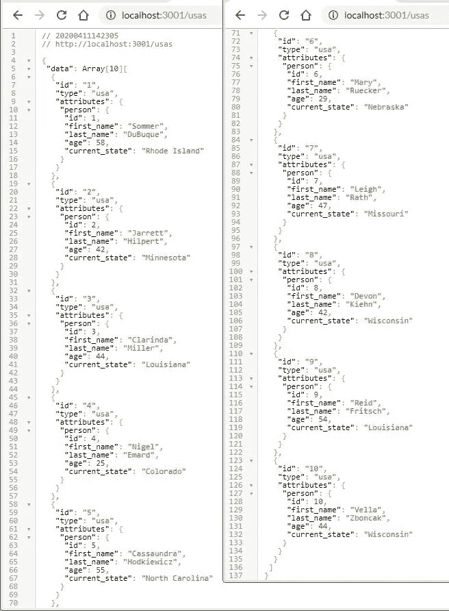
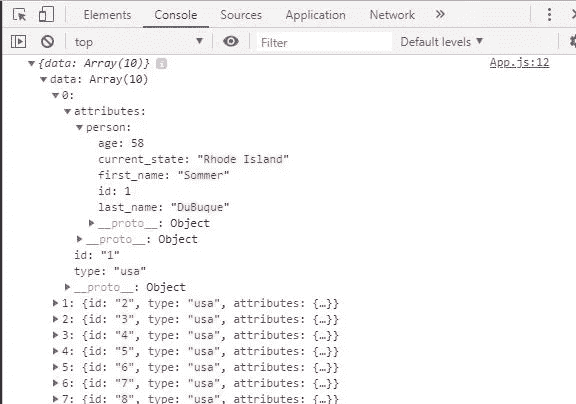

# JavaScript 函数构造(第 5 部分)

> 原文：<https://levelup.gitconnected.com/javascript-function-construction-part-5-90733a0e6369>

## 在与 IIFCs 的反应中提取请求

[第 1 部分](/function-construction-whats-your-function-5a282b81fc62) | [第 2 部分](/function-construction-part-2-f6a711075b11) | [第 3 部分](/javascript-function-construction-part-3-d673ff247541) | [第 4 部分](/javascript-function-construction-part-4-d532f0a5e4af) | **第 5 部分** | [第 6 部分](/javascript-function-construction-part-6-72cfd6b18a7c) | [第 7 部分](/javascript-function-construction-part-7-17c5661e6ea7)

今天是一个特殊的日子。

嗯，不完全是…但是今天基本上是一个月博客价值的顶点…有时候真的很特别。

今天我想介绍如何使用 JavaScript 函数构造器向 SQL 数据库发出获取请求。

我还想使用我写的关于 JavaScript 函数构造的前四篇博客中使用的同一个函数构造器框架来发出这些请求。

我还想通过 React 发出这些请求，在上一篇博客中，我们用`getTime.js` IIFC(立即调用函数构造函数)获得了一些经验。

随着服务器、数据库和后端框架的建立，会有很多移动的部分，我将尽可能快地对此进行介绍。我想把重点放在重构我们的 IIFC 来处理前端的获取请求上，所以后端的工作超出了这篇博客的范围。

也许我会在未来的博客中建立一个后台和数据库，但现在，我会小心谨慎，暂缓行动。

所以让我们开始吧。

## 基本后端

我将使用 Ruby On Rails 作为我们的后端服务器，PostgreSQL 作为我们的数据库，这两者都相对容易安装和运行。

我应该使用一个简单的 JSON 服务器来跳过所有的序言，但是我想证明我们的获取可以在任何为 HTTP 端点提供 JSON API 的后端上工作。

我还将使用`-- api`标志构建我们的 Rails 后端，这样我们就可以直接向位于 HTTP 端点的 JSON API 发出请求，我们可以通过端口 3001 访问它。

除此之外，我还将使用快速 JSON API 来序列化我们将提供给 HTTP 端点的数据，并使用 JSON viewer chrome 扩展来通过 chrome 清晰地查看数据。

这很大程度上意味着我将带着飘扬的旗帜去管理`rails new`:

`rails new blog_example --api --postgresql`

我们想要从我们的数据库是一些基本的表格，以便有一些数据工作。如果你读过我的 SQL JOINs 博客文章，我们将使用来自美国和欧洲的人的相同的表，所以这可能看起来很熟悉。

我还将使用 ruby gem Faker 为我们的数据库生成随机数据。

我们可以用几个`rails g resource`命令来设置我们的表。

我不会说得太详细，但是我们的迁移是这样的:

*create_usas.rb:*

*create_europes.rb:*

我们的模式应该是这样的:

*schema.rb*

我们的种子应该是这样的:

*seeds.rb:*

这样，我们就可以运行`rails db:migrate`和`rails db:seed`让我们的数据库启动并运行。

如果您遇到错误并想从头开始重建整个数据库，那么`rails db:reset`也非常有用。

但是在我们运行`rails s`之前，我们还需要做一些设置，让我们的 HTTP 端点将我们的数据库呈现为 JSON 对象，这就是快速 JSON API 发挥作用的地方。

出于演示的目的，我们不需要担心模型。我们没有在美国和欧洲表之间建立任何关系。我们只是想提供一个 URL 上的表。

要为一个表创建一个新的序列化器，我们可以`run rails g serializer <table_name>`，经过一些修改，最终应该是这样的:

*usa_serializer.rb:*

*欧洲 _serializer.rb:*

我们的控制器应该是这样的:

*usas_controller.rb:*

*europes_controller.rb:*

是的，我理解“美国”和“欧洲”奇怪的复数形式。这是一个活跃的记录。如果你不知道我在说什么，请注意这两个控制器是复数的。Ruby On Rail 就是有点怪怪的。

完成所有设置后，我们终于可以运行 `rails s`，但是使用`-p`标记在端口 3001 上设置我们的服务器。这样我们就可以在端口 3000 上设置我们的 React 前端，向端口 3001 发出请求，并且知道无论我们重启服务器多少次，它都将一直在端口 3001 上。

您想在哪个端口上设置 rails 服务器由您决定，但是要确保它与 React 前端不在同一个端口上。事情不是这样的。

因此，如果我们用`rails s -p 3001`启动我们的后端，我们可以在 chrome 中导航到`http://localhost:3001`，并看到 Rails 主页:


如果我们分别导航到`http://localhost:3001/usas`和`http://localhost:3001/europes`，我们现在应该看到 PostgreSQL 数据库中的两个表作为 JSON 对象提供给两个 HTTP 端点:

*美国表:*



*欧洲表:*


由于 Faker 随机生成我们插入数据库的数据，因此您的姓名、年龄和当前州/当前国家会有所不同。

同样，我在这里掩盖了 Rails 设置中的许多小细节，但这是我们希望我们的后端做的。

随着我们的后端设置和 SQL 表作为 JSON 对象被发送到我们的 HTTP 端点，我们可以将注意力转向我们的 React 前端，并开始发出获取请求。

## 从前到后

我们需要做三件事:

1.)让 React 启动并运行

2.)重构`getTime.js`

3.)通过 React 从重构的 IIFC 发送获取请求

让我们从第一个开始，用`create-react-app`构建一个最基本的 React 应用程序。

我将抄近路，使用我在上一篇博客中使用的 React 应用程序。

这意味着在运行`create-react-app`之后，您需要做的唯一更改是在您的`./src`目录中添加一个名为`utility`的文件夹，并在其中创建一个名为`fetchFunctions.js`的新 JavaScript 文件:


我们还需要对`App.js`做一些小的重构。我们需要`App.js`成为一个类组件，我还将删除默认 React 主页上`<p>`标签中的*‘编辑 src/App.js 并保存以重新加载’*文本:

有了这两个变化，我们应该能够`run npm start`和，如果我们导航到`http://localhost:3000`，就会看到一个稍有修改的 React 主页:


太棒了。

我们可以把清单上的第一件事划掉，然后继续下一件事:

重构`getTime.js`

为了简洁起见，我将把`getTime.js`中的所有内容复制到`fetchFunctions.js`中，并去掉所有与时间有关的内容。我还需要更改我们正在定义的变量的名称空间，让`fetchFunctions.js`的框架看起来像这样:

*在 fetchFunctions.js:*

我们将遵循与处理`getTime.js`相同的公式将参数传递给`fetchFunctions.js`。我们将调用`fetchFunctions.prototype`对象中的方法，并向`localhost:3001`发送获取请求，然后返回我们想要的数据。我们还将向`fetchFunctions.js`发送几个额外的参数，以便从`App.js`中提取尽可能多的代码。

让我们将注意力转回到`App.js`上，看看我们将向 IIFC 发送什么。

## 在两个脚本之间

我们可以像处理`getTime.js`一样，从将`fetchFunctions.js`导入`App.js`开始。

在`App.js`中:

```
import fetchFunctions from ‘./utility/fetchFunctions’
```

我们不能测试任何东西，看看目前是否一切正常。`fetchFunctions.js`原型对象没有任何方法供我们测试。所以让我们在`fetchFunctions.js`中添加一个简单的测试函数，在`App.js`中的`componentDidMount()`中添加`console.log()`它。

*在 fetchFunctions.js 中的原型:*

```
test: function() { return ‘This is only a test.’ }
```

*在 App.js:*

```
componentDidMount(){ console.log(fetchFunctions(‘test’)) }
```

我们现在应该看到*‘这只是一个测试。’在 chrome 的控制台窗口中:*


太好了。到目前为止一切顺利。

不过，对于我们的获取请求，我们想要向`fetchFunctions.js`发送 3 个参数:方法的名称空间、方法将向其发送请求的 URL，以及对于`POST`或`PATCH`方法，一个包含我们想要用来更新数据库的信息的对象。

例如，如果我们想发出一个`GET`请求，我们的调用应该是这样的:

```
fetchFunctions(‘get‘, ‘http://localhost:3001/usas’)
```

或者对一个人来说:

```
fetchFunctions(‘get‘, ‘http://localhost:3001/usas/1’)
```

如果我们想发出一个 POST 请求，我们还想发送一个更新数据的对象:

```
fetchFunctions(‘post‘, ‘http://localhost:3001/usas’, newPersonObj)
```

或者对于修补程序请求:

```
fetchFunctions(‘patch‘, ‘http://localhost:3001/usas/1’, updatedPersonObj)
```

但是对于删除请求，我们只需要方法和 URL:

```
fetchFunctions(‘delete‘, ‘http://localhost:3001/usas/1’)
```

如果我们想要这个公式工作，我们需要更新`fetchFunctions`变量和`fetchFuncions.init()`函数来接受一些新的参数。

*在 fetchFunctions.js:*

这里我们将两个新参数传递给`fetchFunctions.init()`。我们向其发送请求的 URL，以及(如果需要的话)一个包含我们希望用来更新数据库的新数据的对象。

这样，我们可以调用`fetchFunctions.prototype`对象中的一个方法，同时还可以访问我们传递的两个额外参数，这取决于我们调用的是哪个方法。

如果我们只是想要网址，我们有。如果我们需要一个对象发送到数据库，我们有。

我们还可以为需要发送到后端的特定头定义另一个参数，但是对于本演示来说，这是不必要的。

这样，我们现在可以向原型对象添加我们的第一个方法，简单的`GET`请求:

*在 fetchFunctions.js 中的原型:*

我们的函数定义`get`接收我们从`App.js`传入的 URL，并返回它从服务器得到的承诺。

这里的关键点是我们返回服务器对请求的响应。服务器正在返回一个承诺，而不是一个对象或数组。如果我们不从服务器返回这个承诺，我们将无法将承诺发送回`App.js`，在那里我们可以将它转换成 JSON 并在我们的应用程序中使用它。

但是，如果我们在`get`方法中确实回报了承诺，我们可以接受那个回应，并对它做我们想做的任何事情。现在，让我们确保事情正常运行，并`console.log()`响应。

*在 App.js 中:*

如果我们在 chrome 中查看控制台窗口:


嗯……好吧……确实有效。

如果我们继续挖掘嵌套对象，我们会看到我们从 USA 表中获得所有数据:



我们可以从控制台的第 2 个条目中看到，获取请求来自`fetchFunctions.js`，具体来说是来自`fetchFunctions.init()`:


这正是我们想要的。

唯一的问题是数据在响应中的嵌套有多深。这是一个来自 Fast JSON API 的问题，但这个问题很容易解决。

我们可以很好地访问`res_obj.data`，但这是在我们点击`res_obj.data.attributes`时`undefined`返回的地方。没关系。我们所要做的就是映射数据对象以获得 SQL 表中的每一行。

`in App.js:`

我们让我们所有的人:


太棒了。

我们也可以对一个人使用相同的 GET 方法。我们所要做的就是将我们想要找到的人的 ID 添加到 URL 中，以及我们如何处理响应。

*在 App.js 中:*

在控制台中:


太棒了。

当然，用户标识可以通过状态、表单或登录来动态设置。我只是静态地设置它来演示我们可以像对待普通的获取请求一样对待`fetchFunctions.js`。

例如，我们可以将得到的两个响应设置为 state 中的一个属性，并在`render()`函数中设置`console.log()` state 来测试它。

*在 App.js 中:*

在控制台中:


太好了。

但是发布请求呢？

难道我们没有设置`fetchFunctions.js`接受第三个参数吗？

我们在任何地方都不用它。我们从哪里得到这个东西的？

别害怕，我的朋友。

当向服务器发送一个`POST`或`PATCH`请求时，还需要在获取数据的同时发送想要更新数据库的数据。

对我来说，这更像是一个功能选择，但我已经习惯了用我想发送给服务器的所有数据创建一个新对象，然后在函数调用中将其发送给`fetchFunctions.js`。

我们可以发送单独的数据片段，比如`this.state.person.first_name`或`this.state.person.age`等等，但是我喜欢将我想要发送的所有数据与`POST`或`PATCH`请求打包在一起，然后作为参数传递给`fetchFunctions.js`的想法。它让所有东西保持紧凑，并在一块。它还在整个过程之上增加了一层，以防我遇到某种错误。

如果我在我们今天正在进行的演示中尝试这样做，它看起来会像这样:

*在 App.js:*

唯一的问题是，我们在`fetchFunctions.js`中没有处理`POST`请求的方法。

所以，我们写一个吧。它将以与我们的`GET`请求相同的方式开始，但是添加了所需的方法、头和主体。

*在 fetchFunctions.js 中的原型:*

注意，我们只需将 obj 传入`JSON.stringify()`。这是在将信息传递给函数构造函数之前，对要发送给服务器的信息进行打包的好处之一。我们不必明确列出我们想要更新的每一行。我们可以用新信息创建一个对象，并将其传递给`fetchFunctions.js`

从这里，我们可以返回到`App.js`并处理从服务器返回的承诺。

*在 App.js 中*

如果我们保存`App.js`，React 应该会在热加载后向数据库添加一个新的人员，我们应该会在控制台中看到记录的新信息:


为了确保它保存在我们的数据库中，让我们用`fetchFunctions(‘get’, ‘http://localhost:3001/usas’)`再次`GET`所有用户:


太棒了。

如果您曾经使用过 Axios 来处理您的获取请求，事情可能会变得非常熟悉。

不要介意用户 ID 从 10 跳到 14。在写这篇博客的时候，我不得不测试一些东西，这导致了用户 id 的跳过。

同样，`userObj`可以通过状态、表单或登录进行动态设置，就像您通常通过获取请求发送动态参数一样。出于演示的目的，我将它们设置为静态对象。

## 给我接通联合国

一个`PATCH`请求以完全相同的方式运行。从技术上讲，我们可以结合使用`POST`和`PATCH`两种方法。但我认为把它们分开是明智的。在一个更大规模的应用程序中，你肯定会有 4 个以上的基本获取请求，所以让我们保持我们各自的 RESTful 方法独立。

无论哪种方式，我们都可以像编写`POST` 请求一样编写`PATCH`请求:

*在 fetchFunctions.js 中的原型:*

唯一的区别是我们从 React 传递给它的 URL 和 obj:

*在 App.js 中:*

在控制台中:


让我们再次检查我们的`fetchFunctions(‘get’, ‘http://localhost:3001/usas’)` 方法，以确保它是持久的:


光荣。

最后，我们有`DELETE`方法，这是所有方法中最简单的，可以遵循相同的公式。

首先我们将新函数添加到`fetchFunctions.prototype`对象中

*在 fetchFunctions.js 中的原型:*

然后用我们想要的用户的 URL 和插入的 ID 调用函数`DELETE`

*在 App.js*

检查是否有效:


用我们的`fetchFunctions(‘get’, ‘[http://localhost:3001/usas'](http://localhost:3001/usas'))`方法再次检查，看看是否有效:


惊人的。那全是垃圾。

让我们最后看一下`fetchFunctions.js`和`App.js`，结束这篇博客:

*在 App.js 中*

*在 fetchFunctions.js 中:*

## 任务完成

从这里开始，世界就是你的了。

我们可以将我们的用户数据呈现给不同的组件，从尽可能多的不同组件中调用`fetchFunctions.js`,添加带有各种头的特定获取请求，完全重构`fetchFunctions.js`以将方法链接到我们的调用中，从`fetchFunctions.js`中取出所有东西，并将其框架用于完全不同的目的……甚至尝试将我们的旧学校 IIFC 转换成 ES6 类……几乎任何你想做的事情。

我们开发的方式`fetchFunctions.js`允许我们写取请求而不必写取请求。它只编写一次，我们可以通过编写一个单行函数调用和几个参数来引用整个 IIFC。我们所要做的就是传入不同的参数，然后`fetchFunctions.js`抽象出所有我们需要反复编写的代码。

不管怎样，我希望这篇博客能帮助你了解 JavaScript 在函数式编程中的动态性。我不确定我的下一篇博客会写些什么，但是我想我已经在这个关于 JavaScript 函数构造的系列博客中有所建树了。

我在写作和准备这些博客中学到了很多，我希望我也能教你一些新东西。

感谢您的阅读。保持强壮和健康。

[JSON 浏览器 Chrome 扩展](https://chrome.google.com/webstore/detail/json-viewer/gbmdgpbipfallnflgajpaliibnhdgobh?hl=en-US)

[快速 JSON API](https://github.com/Netflix/fast_jsonapi)

[骗子](https://github.com/faker-ruby/faker)

# JavaScript 函数构造

[第 1 部分](/function-construction-whats-your-function-5a282b81fc62) | [第 2 部分](/function-construction-part-2-f6a711075b11) | [第 3 部分](/javascript-function-construction-part-3-d673ff247541) | [第 4 部分](/javascript-function-construction-part-4-d532f0a5e4af) | **第 5 部分** | [第 6 部分](/javascript-function-construction-part-6-72cfd6b18a7c) | [第 7 部分](/javascript-function-construction-part-7-17c5661e6ea7)