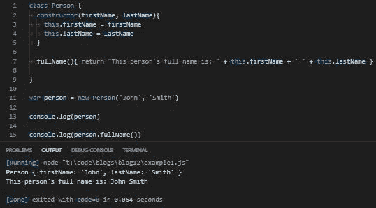

# JavaScript 函数构造(第 6 部分)

> 原文：<https://levelup.gitconnected.com/javascript-function-construction-part-6-72cfd6b18a7c>

## ES6 和立即调用的函数构造函数

[第 1 部分](/function-construction-whats-your-function-5a282b81fc62) | [第 2 部分](/function-construction-part-2-f6a711075b11) | [第 3 部分](/javascript-function-construction-part-3-d673ff247541) | [第 4 部分](/javascript-function-construction-part-4-d532f0a5e4af) | [第 5 部分](/javascript-function-construction-part-5-90733a0e6369) | **第 6 部分** | [第 7 部分](/javascript-function-construction-part-7-17c5661e6ea7)

在写完我上一篇关于 JavaScript 函数构造函数的博客后，我想我终于结束了这个话题。

但是当我在用 React 构建一个项目时，我注意到一些事情让我停下来，我意识到我还没有完成。

“哦，是啊…班级…ES6…我可能应该在 ES6 上写一篇博客…”

在接下来的一周里，这种意识变成了我脑海中的一个声音，每次我想睡觉的时候，这个声音都变得越来越大。

“ES6…类…构造函数…”一个声音一直在说。

所以我来了。你在这里。再来说一些`Class`的 ES6。

## ES101:课程简介

JavaScript 在技术上不是面向对象的编程语言。

`Class`关键字来自 JavaScript 的 ES6(或 EcmaScript2015)修订版，作为对这个“问题”的回答。从技术上来说，JavaScript 仍然不是面向对象的编程语言，但是关键字`Class`提供了一个选项，在技术上来说，它可以是面向对象的编程语言。

*技术上。*

`Class`关键字提供了用预定义的属性和方法创建对象的蓝图。类也是用`new`关键字创建的，这类似于我们如何创建`Object`，以及如何在`getTime.js`中调用 `init()`函数。

类也有一个叫做`constructor()`的东西。`constructor()`函数是一个特殊的函数，每当它所绑定的`Class`被实例化时就会被执行。这对我们非常重要，它将取代我们在`getTime.js`中创建和调用的`init()`函数。

如果你不知道`getTime.js`是什么，不用担心。您很快就会知道了(这是一个我们从本系列第 1 部分开始就一直在构建的小型库)。

我们可以为我们的类创建实例方法，这些方法与我们为`getTime.js`创建的原型方法非常相似。这也将取代我们在`getTime.js`中创建和操作`prototype`对象的需求。

如果需要，我们也可以通过使用`static`关键字来添加类方法。一个类方法提供了与`Class`相关的功能，比如一个实用程序或帮助器方法，但并不特定于`Class`的每个实例。

由于我们将在`getTime.js`中重构的每个方法都需要是可调用的，类方法现在对我们来说没什么用。很简单，足够小，我们不需要任何实用函数，所以我们今天不会写任何类方法。

那么一辆 ES6 `Class`长什么样呢？

这里有一个非常基本的例子:

我们有了一个新的`Person`类，它的`constructor()`函数用两个属性实例化:`firstName`和`lastName`。

我们还有一个实例方法，它返回两个属性的字符串连接。我们可以使用`new`关键字创建一个`Person` `Class`的新实例，并将其调用设置为一个变量:

```
var person = new Person(‘John’, ‘Smith’)
```

如果我们`console.log(person)`，我们将得到`Person` `Class`和我们传递给它的两个属性。如果我们`console.log(person.fullName())`，我们得到我们的字符串连接:



下面是我们在第 1 部分中使用的同一个例子的比较，没有使用`Class`关键字:


有一些小差异，但不多。所有的东西都以相似的方式编写，并且操作几乎相同。甚至语法都很相似。

而在这个小例子中，不会有太多的不同。当我们将关键字`Class`的应用扩展到`getTime.js`时，我们会看到这些微小的差异会产生更大的影响。

我们扩大项目规模越多，它们就越有用。

## 小队目标

今天我们要用 ES6 的糖衣来重构我们旧的笨重的库。`getTime.js`的执行不会有任何不同，但在引擎盖下有足够的变化来保证一些解释。我们仍然希望通过函数调用返回我们添加到`getTime.js`中的方法，并坚持传入一个字符串参数来指定我们想要执行的方法。我们的函数构造函数仍将接受我们传递的参数并返回正确的调用，但也会利用 ES6 和它提供的甜蜜语法。

之后，我们将把新重构的 IIFC 导入 React，以确保一切正常。

如果一切按计划进行，除了导入的文件名之外，我们不需要对 React 中编写的任何内容做任何修改。

这些变化都不是面向客户的。

最终，我们将拥有一个可读性更好的`getTime.js`版本，并节省大约 4 行代码。

哇哦！

## 给我看看你在做什么

和以前一样，我们的文件结构将会很简单。我们在根目录下有`index.html`，在子目录下有`main.js`和`getTime.js`(现在是`getTimeES6.js`):


`main.js`的目的是调用并执行`getTimeES6.js`。这是为了确保`getTimeES6.js`被正确地导出到任何其他需要它的 JavaScript 文件中，并且不管执行上下文如何都能正常工作。这使我们能够在需要的时候，在需要的地方使用它。`main.js`也将保持不变，除了重命名我们需要的文件。

*在 main.js:*

`index.html`也将保持不变，加载`main.js`和`getTimeES6.js`以便我们可以在 chrome 中查看。它有一个名为`time`的`div`，所以我们可以用从`getTimeES6.js`调用的任何方法的返回值替换它的`innerHTML`。

*在 index.html 中:*

有了我们的文件结构，我们就可以把`getTime.js`分解成我们的生命框架。我们将更换所有内部部件，但目前，让我们从一个相对干净的石板开始:

*在 getTimeES6.js:*

现在我们可以开始用一些美味的 ES6 甜味重建`getTimeES6.js`。

## 我们可以重建他…我们有技术

我们要做的第一件事是替换我们最初拥有的`getTime`变量。`getTime`变量是一个函数，它创建了一个新的`getTime.init()`对象，并返回与我们传递给它的关键字相匹配的方法调用。

它看起来像这样:

我们将用以下内容替换它:

有了`Class`关键字和我们接下来要写的内容的帮助，我们不需要创建一个单独的`getTime`函数构造器。我们仍然需要将`init`附加到全局执行上下文，然后返回我们正在调用的方法。多亏了 ES6，我们可以省去一个步骤，让`init`返回一个匿名函数来创建一个新的`Class`。

所以，让我们开始建造我们的`getTime` `Class`。这将是`init`将要返回并附加到全局执行上下文的内容。

*在 getTimeES6.js:*

正如我们在`Person`示例中看到的，我们可以使用`constructor()`方法实例化`Class`。在`getTimeES6.js`的例子中，`constructor()`方法取代了我们的`getTime.init()`函数。它们将以完全相同的方式运行，但是我们新的`constructor()`方法将有一些看起来更简洁的语法:

原来，`getTime.init()`长这样:

我们可以用`constructor()`方法将其重构为:

简单。

我们最初在`getTime.prototype`对象中写的东西呢？

事实证明，我们可以摆脱旧的原型对象:

并把我们所有的函数写成我们`getTime` `Class`的实例方法:

是的。它也是如此简单。这对我来说更难理解，但最终，它真的很简单。

我们需要做的最后一件事是将我们的`getTime` `Class`附加到全局执行上下文，对于 React，在一个模块中导出它。

之前，`getTime.init.prototype`不得不纯粹通过引用继承`getTime.prototype`来建立一个原型链:

*在 getTime.js:*

但是由于我们不需要处理原型对象，也不需要通过引用来重新赋值，我们可以只附加`init`函数的返回值，并用`init`变量替换`getTime`，因为`init`正在返回`getTime`T5 本身:

*在 getTimeES6.js 中:*

我们结束了。

是的，真的很简单。

为了确保一切仍然正常工作，让我们从`getTimeES6.js`内部`console.log()`我们所有的方法:


太好了。

让我们从`main.js`和`console.log()`开始做同样的事情，我们所有的方法都要确保所有东西都被正确导出:


太棒了。

让我们检查 chrome，以确保我们有限的跨平台兼容性仍然有效:


惊人的。

这意味着我们返回的所有内容都与之前在`getTime.js`中的内容相同，我们在 React 中需要重构的只是导入的名称:

*在 App.js 中:*

最后，让我们开始检查 chrome，看看我们的 React 时钟是否还像以前一样工作，然后称这个博客任务完成:


咻。

我以为那会比实际困难得多。

这是最后一次看`getTimeES6.js`:

## 任务完成

那么这一切的目的是什么呢？为什么我没有以 ES6 和`Class`这个关键词开始这个博客系列，并到此为止呢？既然有更简单的方法，为什么要花 5 篇博客来解释像原型继承或作用域链这样的概念呢？

让我告诉你为什么。

理解 JavaScript 如何运行比记忆语法更重要。对于 ES6 和类，你没有太多的机会去了解在那些语法规则下实际发生了什么。

就像学长除法一样。首先你要学习艰难的道路，然后你要学习捷径。这样做的好处是物有所值的。

当涉及到调试错误或找出解决问题的最有效算法时，你从先做困难的事情中获得的知识和理解将引导你找到解决方案。

也就是说，我计划写最后一篇关于 JavaScript 函数构造器的博客。我仍然想将我们在 React 中为获取请求编写的 IIFC 转换成一个`Class`。

然后，我保证，我会告别 JavaScript 的函数构造器，走向更绿的牧场(也许)。

在那之前:保持健康，继续为正义而战。

感谢您的阅读。

# JavaScript 函数构造

[第 1 部分](/function-construction-whats-your-function-5a282b81fc62) | [第 2 部分](/function-construction-part-2-f6a711075b11) | [第 3 部分](/javascript-function-construction-part-3-d673ff247541) | [第 4 部分](/javascript-function-construction-part-4-d532f0a5e4af) | [第 5 部分](/javascript-function-construction-part-5-90733a0e6369) | **第 6 部分** | [第 7 部分](/javascript-function-construction-part-7-17c5661e6ea7)