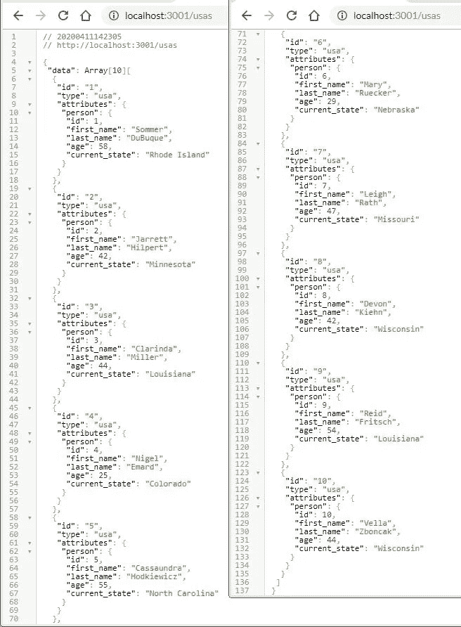
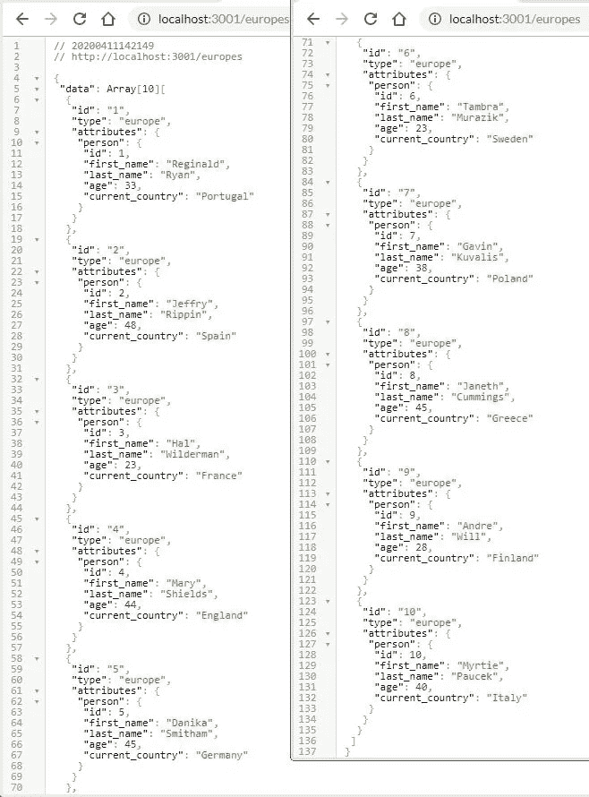
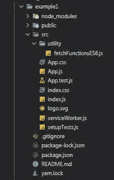
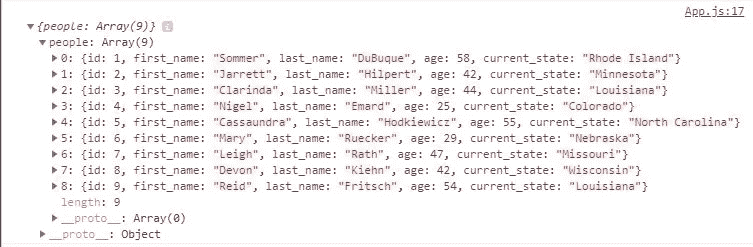
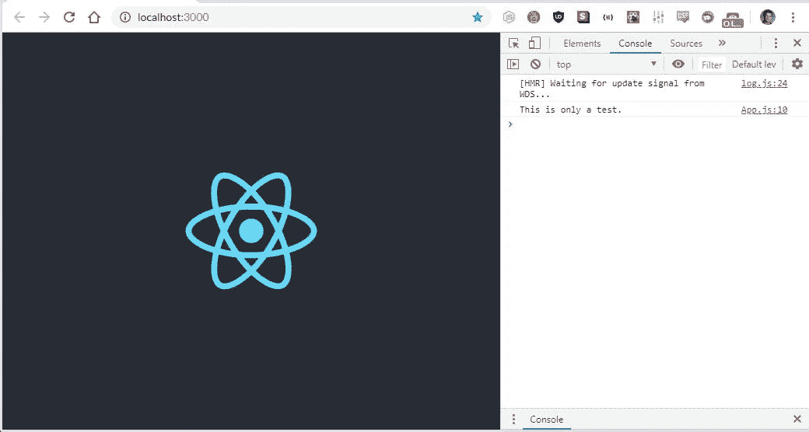
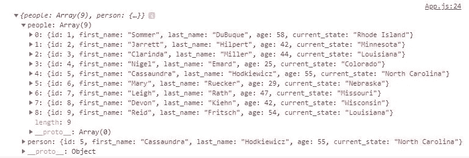
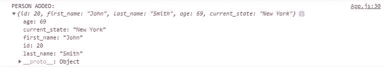
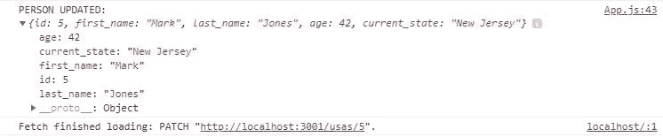

# JavaScript 函数构造(第 7 部分)

> 原文：<https://levelup.gitconnected.com/javascript-function-construction-part-7-17c5661e6ea7>

## ES6 IIFC 用 React 获取请求

[第 1 部分](/function-construction-whats-your-function-5a282b81fc62)|**|**[第 2 部分](/function-construction-part-2-f6a711075b11)||[第 3 部分](/javascript-function-construction-part-3-d673ff247541) | [第 4 部分](/javascript-function-construction-part-4-d532f0a5e4af) | [第 5 部分](/javascript-function-construction-part-5-90733a0e6369) | [第 6 部分](/javascript-function-construction-part-6-72cfd6b18a7c) | **第 7 部分**

在我们的 JavaScript 函数构造器之旅中，我想介绍的最后一件事(至少目前是这样)是编写一个 IIFC，它使用 ES6 `Class`处理获取请求。我还想将这些获取请求发送到 Ruby on Rails 后端，该后端为 HTTP 端点提供 JSON API。

另一个约束是，我想使用一个基本的 React 应用程序作为我们的前端，并将我们的 IIFC 导入到`App.js`中。这样我们就可以在使用 React 时测试 IIFC 的功能。

简单的东西。

我们在两个博客前首次写了一个非常相似的 IIFC，但是我们没有在 ES6 中写任何东西，也没有利用 ES6 为类提供的所有语法糖。

这一次，事情会有所不同。

## 德佳·VU。我以前写过这样的代码

我将快速跳过 Ruby On Rails 的设置，因为我们将使用与本系列第 5 部分**相同的后端来构建 JavaScript 函数，并且不会对它的工作方式做任何改变。**

**你只需要知道我们在`localhost:3001`有一个 JSON API 设置。这个 API 是使用 Fast JSON API 构建的，由两个 PostgreSQL 表组成:一个是来自美国的人的表，另一个是来自欧洲的人的表。**

**这些表需要作为 JSON 对象在`localhost:3001/usas`和`localhost:3001/europes`可用，如下所示:**

***在*处`*localhost:3001/usas*`**

****

***在*在`*localhost:3001/europes*`**

****

**如果你想更详细地了解我们是如何设置的，我建议你通读一下本系列关于 JavaScript 函数构造的第 5 部分**

**通过我们设置 Rails 的方式，我们可以轻而易举地向`localhost:3001`发出获取请求，让我们可以随心所欲地使用我们的 IIFC。**

**我们的 React 前端也将是我们在第 5 部分 中构建的相同设置，并没有什么不同寻常。我们需要做的就是在终端中运行最基本的`create-react-app`命令，我们应该准备好了。**

**我们需要做的就是移动(或删除)我们当前在`./src/utility`文件夹中的`fetchFunctions.js`文件，并将其重命名(或替换)为`fetchFunctionsES6.js`。**

**这与我们在将`getTime.js`转换为`getTimeES6.js`时开始上一篇博客的方式相同。下面是我们前端的文件结构应该是什么样子:**

****

**没什么我们以前没见过的，但我只是想确保我们都在同一页上。或者在同一个文件夹中。你明白我的意思。**

**我们今天要做的所有工作都在`fetchFunctionsES6.js`内，之前是`fetchFunctions.js`。**

**作为参考，下面是最初的`fetchFunctions.js` IIFC 的样子:**

**`fetchFunctions.js`允许我们做的是抽象出许多枯燥的代码，我们每次想要向`localhost:3001`发出请求时都需要编写这些代码。不用写出整个请求，我们可以将`fetchFunctions.js`导入到`App.js`中，然后用几个参数调用`fetchFunctions.js`中的一个方法。**

**第一个是我们要发送的 RESTful 方法，第二个是我们要向其发送请求的 URL，根据方法的不同，第三个是包含我们要用来更新数据库的数据的对象。**

**例如，如果我们从`App.js`的`componentDidMount()`中调用`fetchFunctions('get', [http://localhost:3001/usas)](http://localhost:3001/usas))`，我们将获得`usas`表中的所有行:**

***在 App.js:***

**如果我们在 chrome 中查看控制台，我们应该会看到我们的`usas`表:**

****

**那里只有 9 个人，因为在写这篇博客之前，我删除了一个用于测试。**

**无论哪种方式，这些都是我们正在处理的主要事情，对于任何关注这个系列的人来说都不应该是什么新东西。**

**希望如此。**

## **完全（或彻底）地**

**随着 React 和 Rails 分别在`localhost:3000`和`localhost:3001`正确设置，我们可以将注意力转向更新`fetchFunctionsES6.js`。**

**我们要重构的很多东西与我们重构`getTime.js`的方式是并行的，但是有一些变化，这样我们的方法可以接受多个参数。**

**我们要做的第一件事是把`fetchFunctions.js`剥离到它的生命骨架。`fetchFunctionsES6.js`将会使用和`getTimeES6.js`一样的框架，所以我们将会遵循一些熟悉的步骤。**

***在 fetchFunctionsES6.js:***

**从这里开始，我们想给一个匿名函数添加一个非常熟悉的`init`变量集。这个函数将返回我们传递给`fetchFunctions` `Class`(我们还没有写)的方法名的调用。被调用的方法`init`从我们发送到后端的获取请求中返回承诺。**

**没有我们以前没做过的，也没有我们以前博客里没见过的。主要增加的是`fetchFunctionsES6.js`如何处理我们传递给即将编写的`fetchFunctions` `Class`的两个额外参数:**

***在 fetchFunctionsES6.js:***

**如果你想对这里发生的事情有更详细的解释，请查看本系列的 [**第 4 部分**](/javascript-function-construction-part-4-d532f0a5e4af) 、 [**第 5 部分**](/javascript-function-construction-part-5-90733a0e6369) 和 [**第 6 部分**](/javascript-function-construction-part-6-72cfd6b18a7c) 。**

**一旦我们将`init`作为`fetchFunctions`附加到全局执行上下文，并在`module`中导出它，我们将能够在任何其他需要它的 JavaScript 文件中使用`fetchFunctionsES6.js`，以及在 React 的内部和外部:**

**`in fetchFunctionsES6.js:`**

**我们也可以把`fetchFunctions` `Class`加到`fetchFunctionsES6.js`上。这里的技巧是确保我们的`constructor()`方法正确地接受和传递参数给方法:**

***在 fetchFunctionsES6.js:***

**如果您遵循本博客系列的 [**第 5 部分**](/javascript-function-construction-part-5-90733a0e6369) ，唯一的主要区别是我去掉了检查方法是否被传入`fetchFunctionsES6.js`的`error`方法。**

**这是因为有了添加的参数，它不能像使用`getTime.js`那样工作，并且需要大量的重构，这超出了本文的范围。**

**另外，我觉得移除`error`方法有助于将博客的重点放在设置获取请求上。**

**无论如何，让我们确保一切都设置正确，并向`fetchFunctions` `Class`添加一个测试方法，并尝试从`App.js`中的`componentDidMount()`调用它。**

***在 fetchFunctionsES6.js 中:***

***在 App.js:***

***在 Chrome:***

****

**很好。**

**从这里我们可以开始从`fetchFunctions` `Class`内部构建我们的 RESTful 方法。**

## **安于现状**

**我们添加到我们的`fetchFunctions`类中的方法与我们之前在 [**第 5 部分**](/javascript-function-construction-part-5-90733a0e6369) 中写的方法相同。**

**我们最初编写`fetchFunctions.js`和`getTime.js`的美妙之处在于，我们不需要用后端重构任何东西，也不需要重构`App.js`中的任何东西。所有的重构都将与`fetchFunctionsES6.js`一起进行，因为我们的计划是返回与`fetchFunctions.js`完全相同的承诺。**

**让我们从一个`GET`请求开始:**

***in*T7*in fetchfunctionses 6 . js:***

**我们可以通过将`get`作为`fetchFunctions`调用中的第一个参数，将 URL 作为第二个参数，从`App.js`调用这个方法。我们还可以使用相同的方法来获取表中的所有行，或者表中的单个行:**

***在 App.js:***

***在 Chrome 中:***

****

**当用户登录或点击按钮时，您更有可能得到`userID`,就像您通常在反应中一样。出于演示目的，我们对变量`userID`使用静态值，而`fetchFunctions`将像没有区别一样工作。**

**现在让我们来设置我们的`POST`方法:**

***在* `*class*` `*fetchFunctions*` *在 fetchFunctionsES6.js:***

**我们现在应该能够像以前一样通过将`post`方法和 URL 从`App.js`传递到`fetchFunctions`来创建一个新的人员表，而且还可以使用一个包含我们想要创建该人员的信息的对象:**

***在 App.js:***

***在 Chrome:***

****

**太好了。**

**我们可以继续使用`PATCH`方法，至少在这个例子中，它与我们的`POST`方法是相同的。我认为将这两种方法分开是很好的做法，但是我并没有忽视将这两种方法结合起来的可能性。**

***in*`*class*`*`*fetchFunctions*`*in fetchfunctionses 6 . js:****

***如果我们从`App.js`调用`PATCH`方法，并传入一个有效的`userID`以及一个包含我们想要更新的数据的对象，我们应该能够在 Chrome 中看到结果。***

***我注释掉了`POST`请求，这样我们就不会不断地在`usas`表中创建新行:***

****在 App.js:****

****在 Chrome 中:****

******

***太棒了。***

***最后，我们有`DELETE`方法，它和`GET` 方法一样简单:***

****在* `*class*` `*fetchFunctions*` *在 fetchFunctionsES6.js:****

***我们所要做的就是像我们的`PATCH`或`GET`方法一样传递一个单一的 URL，具有相应 ID 的人将从表中删除:***

****在 App.js:****

****在 Chrome 中:****

******

***太棒了。***

***我们所有的 RESTful 方法在尽可能少的重构(减去额外的错误处理)下再次正常工作，同时使用一些新的 ES6 语法。***

***让我们最后看一下`App.js`和`fetchFunctionsES6.js`，称这个博客任务完成:***

****在 fetchFunctionsES6.js 中:****

****在 App.js:****

## ***任务完成***

***自从关于 JavaScript 函数构造的本系列文章的第 1 部分以来，我们已经走过了很长的路，涵盖了很多内容。我们已经构建了一些很酷的库，想出了如何抽象出我们正在处理的代码 JavaScript 文件，减少了我们的枯燥程度，深入了 JavaScript 的一些更深层次的部分，讨论了关于学习新编程语言的具体细节的概念和想法，甚至用 React 和 Ruby On Rails 之类的东西进行了一些创新。***

***因此，在可预见的将来，我关于 JavaScript 函数构造器的博客系列到此结束。我觉得我已经尽我所能地谈论这个话题，而没有陷入全新的话题或开始全新的项目，所以我觉得这是“正式”这个系列的一个很好的结束点。***

***我要再次感谢您踏上这漫长的 2 个月 JavaScript 之旅，并希望本系列能帮助您理解 JavaScript 的强大。不只是作为 HTML 和 CSS 的伴侣，而是作为一种编程语言，它能做的不仅仅是操纵 DOM 上的元素。***

***即使没有，嗯…我试过了。***

***保持安全…保持健康…继续为正义而战。***

# ***JavaScript 函数构造***

***[第 1 部分](/function-construction-whats-your-function-5a282b81fc62) | [第 2 部分](/function-construction-part-2-f6a711075b11) | [第 3 部分](/javascript-function-construction-part-3-d673ff247541) | [第 4 部分](/javascript-function-construction-part-4-d532f0a5e4af) | [第 5 部分](/javascript-function-construction-part-5-90733a0e6369) | [第 6 部分](/javascript-function-construction-part-6-72cfd6b18a7c) | **第 7 部分*****