# JavaScript 函数必备知识

> 原文：<https://levelup.gitconnected.com/javascript-functions-essential-knowledge-56bcfa44df3d>


由[泰勒·尼克斯](https://unsplash.com/@jtylernix?utm_source=unsplash&utm_medium=referral&utm_content=creditCopyText)在 [Unsplash](https://unsplash.com/@transonhoang?utm_source=unsplash&utm_medium=referral&utm_content=creditCopyText) 上拍摄的照片

本文将讨论每个前端或节点工程师都应该知道的必备 JavaScript 函数知识。

1.  函数表达式
2.  功能提升
3.  箭头功能
4.  方法定义
5.  默认参数
6.  休息参数
7.  `arguments`对象
8.  Setter 和 Getter
9.  发电机功能

*更多类似内容，请查看*[*https://betterfullstack.com*](https://betterfullstack.com/stories/)

# 函数表达式

JavaScript 函数是设计用来执行特定任务的代码块，当某个东西使用括号`()`调用它时，它就会被执行。

默认情况下，函数返回`undefined`。要返回任何其他值，函数必须有一个指定要返回的值的`[return](https://developer.mozilla.org/en-US/docs/Web/JavaScript/Reference/Statements/return)`语句。

**注意:**JavaScript 中的函数其实是一个对象，但这个对象也是可执行的。这意味着 JS 函数可以附加属性和方法。由于它是可执行的，这意味着只要函数末尾有括号，它就可以运行一段代码。我们可以看到函数也是一个访问其`constructor`的对象，如下所示:

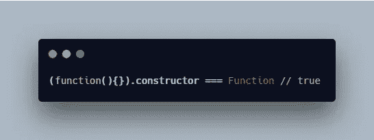

您可以用两种方式定义函数:

1.  `Function`建造师(很少使用)
2.  函数表达式

## `Function`建造师

语法:

```
new Function ([arg1[, arg2[, ...argN]],] functionBody)
```

示例:

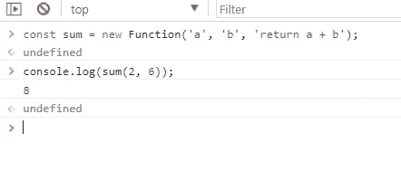

函数构造函数示例

创建的函数是一个`Function`对象，拥有`Function`对象的所有属性、方法和行为。

## 函数表达式

这是在 JavaScript 中创建函数的最常见方式。

语法:

```
function *name*([*param*[, *param*,[..., *param*]]]) {
   [*statements*]
}
```

示例:

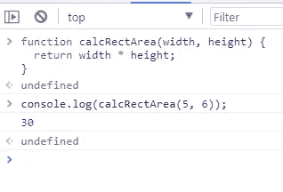

函数表达式示例

## 变量和函数提升

[提升](https://www.w3schools.com/js/js_hoisting.asp)是 JavaScript 的一个有趣的怪癖，我想在本文的前面讨论一下。

> 提升是 JavaScript 将声明移动到顶部的默认行为。

当 JavaScript 编译所有代码时，所有使用`var`的变量声明都被提升到其作用域的顶部(如果变量或函数是在函数内部声明的)或其全局作用域的顶部(如果是在函数外部声明的)，而不管实际声明是在哪里进行的。这就是我们所说的*吊装*。

```
// Hoisting with a simple variable declaration// Hoisting makes "var x;" actually appear here after compilationx = 5; // Assign 5 to x

console.log(x) // 5

var x; // Declare x
```

函数声明也被挂起。

对于 Edge，提升不会像我们预期的那样发生。

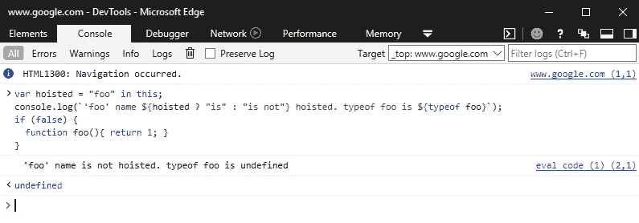

吊装不能在边缘进行

没有承载函数表达式。

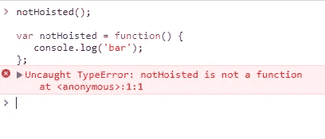

函数表达式未被提升

技术上`var notHoisted;`会被提升，但是函数赋值本身没有被提升，和变量一样。

# 箭头功能

箭头函数(也称为胖箭头)是在 ES6 中引入的，它使人们能够编写更短的函数语法。

Arrow 函数是匿名的，与以前创建函数的方式相比，它有一个不同的`this`绑定。

语法:

```
(param1, param2, …, paramN) => { statements } 
(param1, param2, …, paramN) => expression
// equivalent to: => { return expression; 
```

示例:

注意:

1.  箭头功能没有自己的`this`。使用封闭词法范围的`this`值。
2.  箭头函数没有`prototype`属性。
3.  `[yield](https://developer.mozilla.org/en-US/docs/Web/JavaScript/Reference/Operators/yield)`关键字不能在箭头函数体中使用(除非在进一步嵌套的函数中允许)。因此，箭头函数不能用作生成器。
4.  箭头函数不能用作构造函数，与`new`一起使用时会抛出错误。
5.  由于箭头函数没有自己的`this`，方法`call()`和`apply()`只能传入参数。任何`this`参数都会被忽略。

你可以在 [MDN](https://developer.mozilla.org/en-US/docs/Web/JavaScript/Reference/Functions/Arrow_functions) 上查看一个例子。

# 方法定义

方法是属于 ***对象的**函数**。***

语法:

```
const obj = {
  property( parameters… ) {},
  *generator( parameters… ) {},
  async property( parameters… ) {},
  async* generator( parameters… ) {},

  // with computed keys:
  [property]( parameters… ) {},
  *[generator]( parameters… ) {},
  async [property]( parameters… ) {},

  // compare getter/setter syntax:
  get property() {},
  set property(value) {}
};
```

示例:

方法示例

# 默认参数

**默认函数参数**如果没有值或`undefined`被传递，允许命名参数用默认值初始化。

语法:

```
function doSomething(a = 1, b = 2, /* etc */) {
  // Here, a will be 1 and b will be 2 if no arguments are passed // *statements*
}
```

示例:

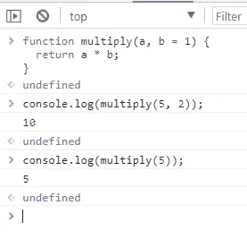

默认参数示例

注意:

1.  功能参数默认为`[undefined](https://developer.mozilla.org/en-US/docs/Web/JavaScript/Reference/Global_Objects/undefined)`

2.默认参数在 Internet Explorer 上不可用

# 休息参数

rest 参数语法允许我们将不定数量的参数表示为一个数组。

语法:

```
function f(a, b, ...theArgs) {
  // ...
}
```

示例:

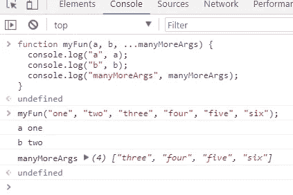

剩余参数样本

# 参数对象

`**arguments**`是一个类似于`Array`的对象，可以在任何非箭头[函数](https://developer.mozilla.org/en-US/docs/Web/JavaScript/Guide/Functions)中访问，该函数包含传递给该函数的参数值。

语法:

```
arguments
```

示例:

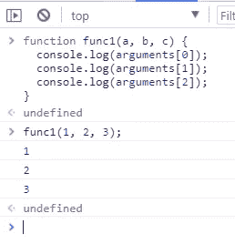

参数对象示例

注意:

1.  `arguments`对象是所有非[箭头](https://developer.mozilla.org/en-US/docs/Web/JavaScript/Reference/Functions/Arrow_functions)函数中可用的局部变量。
2.  `arguments`对象不是真正的`[Array](https://developer.mozilla.org/en-US/docs/Web/JavaScript/Reference/Global_Objects/Array)`，它只是一个类似数组的东西。

**其余参数**和**参数对象**的不同

1.  Rest 参数只是那些没有被单独命名的参数。
2.  `arguments`对象不是一个真正的数组，而 rest 参数是`[Array](https://developer.mozilla.org/en-US/docs/Web/JavaScript/Reference/Global_Objects/Array)`实例，这意味着像`[sort](https://developer.mozilla.org/en-US/docs/Web/JavaScript/Reference/Global_Objects/Array/sort)`、`[map](https://developer.mozilla.org/en-US/docs/Web/JavaScript/Reference/Global_Objects/Array/map)`、`[forEach](https://developer.mozilla.org/en-US/docs/Web/JavaScript/Reference/Global_Objects/Array/forEach)`或`[pop](https://developer.mozilla.org/en-US/docs/Web/JavaScript/Reference/Global_Objects/Array/pop)`这样的方法可以直接应用于它。
3.  由于`arguments`对象是一个特殊的对象，因此它具有特定于自身的附加功能。

# Setter 和 Getter

`**set**`语法将一个对象属性绑定到一个函数，当试图设置该属性时，该函数将被调用。

语法:

```
{set *prop*(*val*) { . . . }}
{set [expression](*val*) { . . . }}
```

示例:

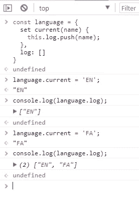

setter 属性示例

`**get**`语法将一个对象属性绑定到一个函数，当查找该属性时将调用该函数。

语法:

```
{get *prop*() { ... } }
{get [*expression*]() { ... } }
```

示例:

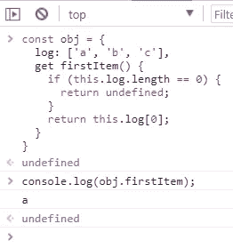

getter 属性示例

# 发电机功能

据 [Mozilla](https://developer.mozilla.org/en-US/docs/Web/JavaScript/Reference/Statements/function*)

> `***function****`声明(`*function*`关键字后跟一个星号)定义了一个*生成器函数*，它返回一个`[*Generator*](https://developer.mozilla.org/en-US/docs/Web/JavaScript/Reference/Global_Objects/Generator)`对象。

语法:

```
function* *name*([*param*[, *param*[, ... *param*]]]) {
   *statements*
}
```

示例:

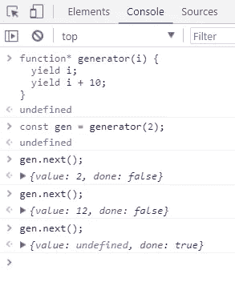

发电机示例

注意:

1.  调用生成器函数不会立即执行它的主体。
2.  调用`next()`执行函数，直到`yield`表达式。
3.  当一个生成器完成时，它们将返回一个对象`{value: undefined, done: true}`。

你可以在这里阅读更多它是如何工作的[。](https://developer.mozilla.org/en-US/docs/Web/JavaScript/Reference/Statements/function*#Description)

注意:这在 Internet Explorer 上不受支持。

# 摘要

在本文中，我试图将所有基本信息分组，以便用 JavaScript 处理函数。我希望这能帮助初学者和那些想再次复习 JavaScript 知识的人。

我希望这篇文章对你有用！可以跟着我上[媒](https://medium.com/@transonhoang?source=post_page---------------------------)。我也在推特上。欢迎在下面的评论中留下任何问题。我很乐意帮忙！

# 资源/参考资料

[1]:函数构造器[https://developer . Mozilla . org/en-US/docs/Web/JavaScript/Reference/Global _ Objects/Function](https://developer.mozilla.org/en-US/docs/Web/JavaScript/Reference/Global_Objects/Function)

[2]:JavaScript 中的提升是什么？[https://medium . com/JavaScript-in-plain-English/https-medium-com-JavaScript-in-plain-English-what-raising-in-JavaScript-a 63 C1 b 2267 a 1](https://medium.com/javascript-in-plain-english/https-medium-com-javascript-in-plain-english-what-is-hoisting-in-javascript-a63c1b2267a1)

[3]:函数表达式[https://developer . Mozilla . org/en-US/docs/Web/JavaScript/Reference/Statements/function](https://developer.mozilla.org/en-US/docs/Web/JavaScript/Reference/Statements/function)

[4]:箭头函数[https://developer . Mozilla . org/en-US/docs/Web/JavaScript/Reference/Functions/Arrow _ Functions](https://developer.mozilla.org/en-US/docs/Web/JavaScript/Reference/Functions/Arrow_functions)

[5]:生成器函数[https://developer . Mozilla . org/en-US/docs/Web/JavaScript/Reference/Statements/function *](https://developer.mozilla.org/en-US/docs/Web/JavaScript/Reference/Statements/function*)

[6]:默认参数[https://developer . Mozilla . org/en-US/docs/Web/JavaScript/Reference/Functions/Default _ parameters](https://developer.mozilla.org/en-US/docs/Web/JavaScript/Reference/Functions/Default_parameters)

[7]:参数对象[https://developer . Mozilla . org/en-US/docs/Web/JavaScript/Reference/Functions/arguments](https://developer.mozilla.org/en-US/docs/Web/JavaScript/Reference/Functions/arguments)

[8]: Rest 参数[https://developer . Mozilla . org/en-US/docs/Web/JavaScript/Reference/Functions/Rest _ parameters](https://developer.mozilla.org/en-US/docs/Web/JavaScript/Reference/Functions/rest_parameters)

[9]:Setter[https://developer . Mozilla . org/en-US/docs/Web/JavaScript/Reference/Functions/set](https://developer.mozilla.org/en-US/docs/Web/JavaScript/Reference/Functions/set)

[10]:方法定义[https://developer . Mozilla . org/en-US/docs/Web/JavaScript/Reference/Functions/Method _ definitions](https://developer.mozilla.org/en-US/docs/Web/JavaScript/Reference/Functions/Method_definitions)

[](https://gitconnected.com/learn/javascript) [## 学习 JavaScript -最佳 JavaScript 教程(2019) | gitconnected

### JavaScript 是世界上最流行的编程语言之一——它随处可见。JavaScript 是一种…

gitconnected.com](https://gitconnected.com/learn/javascript) [](https://betterfullstack.com/stories/) [## 故事-更好的全栈

### 关于 JavaScript、Python 和 Wordpress 的有用文章，有助于开发人员减少开发时间并提高…

betterfullstack.com](https://betterfullstack.com/stories/)