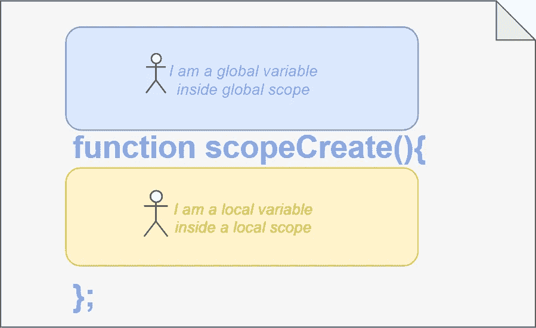
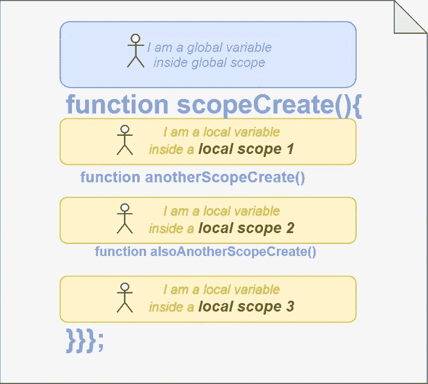
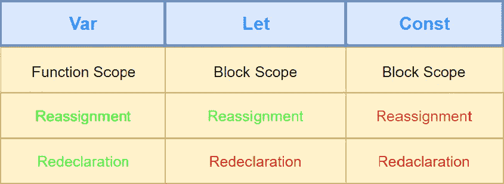

# 理解 JavaScript 中的局部范围

> 原文：<https://levelup.gitconnected.com/javascript-fundamentals-local-scope-5841690ea6aa>

*JavaScript 基础知识*系列作用域、提升、闭包


照片由[普里西拉·杜·普里兹](https://unsplash.com/@priscilladupreez?utm_source=medium&utm_medium=referral)在 [Unsplash](https://unsplash.com?utm_source=medium&utm_medium=referral) 上拍摄

[***在我之前的文章***](https://medium.com/@smeyradvrn/javascript-fundamentals-global-scope-71ba5e48dbae) 中，我们深入探讨了全球范围。如果您感到不安全，或者想快速浏览一下，我鼓励您先阅读它，因为在本文中我们将提到全局范围。

如果您曾经编写过 JavaScript 代码，您可能已经通过使用函数创建了局部作用域。通过在函数中创建一个变量，你创建了一个局部范围，而不是全局范围。

> 在函数内部创建变量时会出现局部作用域。通过这样做，变量的可见性和可访问性只允许在该函数中使用。



在黄色框中创建的任何变量都是局部变量，就像蓝色框中的任何变量都是全局变量一样。为了超级容易理解，蓝框代表全局范围，而黄框代表局部范围。

当然，要理解一个局部变量/范围是不可能通过一个图像和一个描述来实现的。让我们看看另一张图片。



局部变量不同于全局变量，理解起来更复杂。这个演示展示了本地作用域的基本行为/概念。如果你创建不同的函数，你基本上为每个函数创建了不同的作用域。为了理解基本行为，我们可以使用控制台，查看不同范围内变量的错误和可访问性。

```
var **globalOne**=16;function testingScope(){
  var **localOne**=12;
  console.log(**localOne**); // 12
  console.log(**globalOne**); // 16
}testingScope() // 12 and 16console.log(**localOne**); // Uncaught ReferenceError: localOne is not definedconsole.log(**globalOne**); // 16
```

因为我们的变量`globalOne` 是一个全局变量，我们可以在任何地方访问它。但是`localOne` 变量只能在其作用域内访问。这就是为什么如果我们调用`testingScope`函数，我们可以在控制台中看到这两个变量。

在全局范围内，我们只能访问全局变量，这些变量存储在`window`对象中。与全局变量不同，局部变量是不可访问的，一旦其作用域结束就会被销毁。当函数被调用时，它们留在内存中，一旦函数完成，它们就消失了。这就是为什么只有在执行它们的功能时才能访问它们。这是全局变量和局部变量的主要区别之一。

# **功能范围和块范围的区别**

到目前为止，我们已经看到了局部范围，但实际上，我不是很清楚。在现实中，局部作用域可以分为两个作用域:函数作用域和块作用域。在 ES6 之前，JavaScript 只有函数作用域，这是我到目前为止一直在解释的。

*当变量在函数内部定义时，函数作用域出现。*

就这么简单。另一方面，块范围是 ES6 引入的，略有不同。您可以使用块作用域创建函数作用域的子集。

如果在 `***{}***`之间使用 blocks *任何东西，那么`if`、`switch`、`for`、`while`只有用`***let***` ***和*** `***const***`定义一个变量才能使用 block 作用域。这是一个很长的描述，我认为如果我在控制台中显示它，我可以解释得更好。*

```
if(‘anything returning true’){
  let **localVariable**=12;
  var **otherLocalVariable**=10;
  console.log(**localVariable**); // 12
  console.log(**otherLocalVariable**); // 10
}console.log(**localVariable**) // Uncaught ReferenceError: localVariable is not definedconsole.log(**otherLocalVariable**) // 10
```

你看到他们的行为了吗？用`**let**`定义的`localVariable`，仅在块内可见。用`**var**`定义的`otherLocalVariable`，在程序块外可见。不同的行为是因为`var`、`let`、`const`的不同。因此，了解它们之间的差异对于理解块范围非常重要。



# **可变阴影**

如果你要在一个函数中重新赋值一个变量，有一个概念你应该知道:变量隐藏。

在 JavaScript 中，当您先在全局范围内定义变量，然后在局部范围内定义变量时，局部变量优先。只有当它们共享相同的名称时，才会出现阴影。在全局范围内，变量保留它的初始值，但是在局部范围内，它的值会临时更改为您重新分配的值。让我们看一个例子:

```
let **simpleVariable**=’global scope’function testingVariableShadowing(){
  **simpleVariable**=’local scope’; // reassignment
  console.log(simpleVariable);
}testingVariableShadowing(); // local scopeconsole.log(simpleVariable); // global scope
```

在全局作用域中，`**simpleVariable**` **的**值仍然是全局作用域，而在函数作用域中被调用时，它变成了局部作用域。

如果你想阅读更多关于 JavaScript 基础的内容，请阅读学习 JavaScript 基础系列。

1.  [全局范围](https://medium.com/swlh/javascript-fundamentals-global-scope-71ba5e48dbae?source=post_page---------------------------)
2.  [局部范围](https://medium.com/@smeyradvrn/javascript-fundamentals-local-scope-5841690ea6aa?source=post_page---------------------------)
3.  [范围、上下文、执行上下文](https://medium.com/@smeyradvrn/learn-javascript-fundamentals-scope-context-execution-context-9fe8673b3164?source=post_page---------------------------)

编码快乐！！！