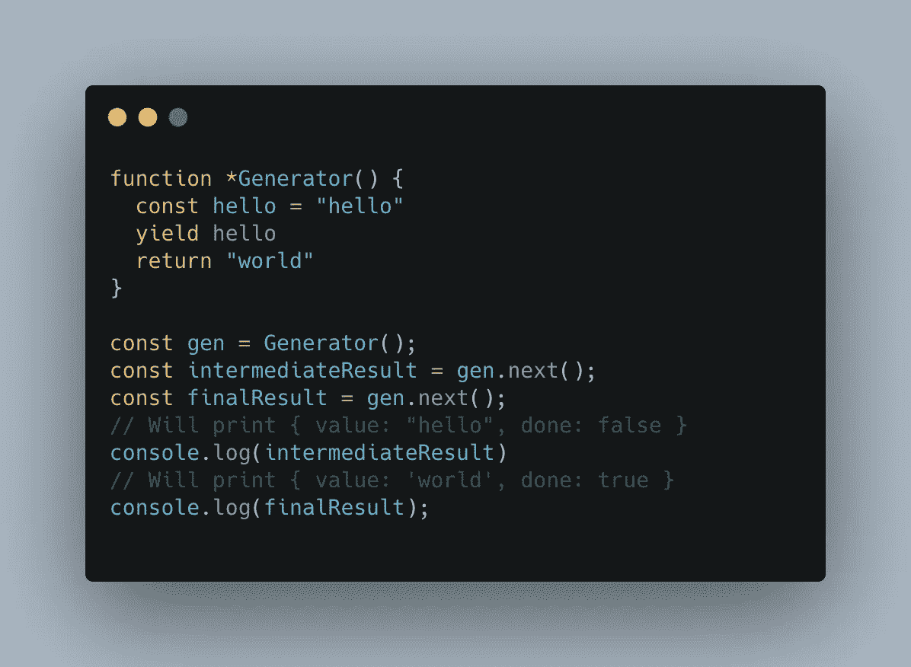

# 带有具体示例的 Javascript 生成器

> 原文：<https://levelup.gitconnected.com/javascript-generators-with-a-concrete-example-d91324706090>

## 让我们通过一个简化的真实例子来深入了解发电机是如何工作的


照片由 [Pexels](https://www.pexels.com/photo/boy-in-white-t-shirt-sitting-on-chair-in-front-of-computer-4709285/?utm_content=attributionCopyText&utm_medium=referral&utm_source=pexels) 的 [cottonbro](https://www.pexels.com/@cottonbro?utm_content=attributionCopyText&utm_medium=referral&utm_source=pexels) 拍摄

从我的经验来看，**生成器**并不是 **Javascript** 中最常用的工具。它们看起来很复杂，吓到了一些开发人员。但是它们实际上对你的代码是一个巨大的改进！

如果你真的了解发电机，那要么是因为你在用 **Redux Saga** 使用它们，要么是因为你的公司做出了使用它们的(伟大)选择，要么是因为你很好奇！对我来说，这是第三种选择。

# 但是什么是真正的发电机呢

与普通函数相比，生成器是一个声明稍有不同的函数。发电机的原型如下:

```
function* myGenerator(){}
```

这颗小星星让一切变得不同。那还有一个特定的关键词: **yield。**

Yield 在您的生成器中被用作一个**断点**，并允许您将值返回到生成器执行的位置。这样做的最大好处是，你可以在函数的工作完成之前从函数**中获取数据，并且你可以通过在你想要的任何地方添加一个 yield 来轻松完成。**



发电机如何工作的完整示例

让我们在这里分析这个例子。首先，我选择使用 **PascalCase** 作为生成器的名称。原因是调用这个函数实际上是要**实例化**它而不是执行它。

> 如果您将 console.log 放在生成器的第一行，那么在调用`gen.next()`之前不会打印。

现在，在实例化您的生成器之后。要开始运行它，您将在实例中调用方法`next`。Next 将执行您的生成器**，直到它找到另一个 yield，或者直到函数返回**。Yield 的工作方式与 return 完全相同，但它是一个过早的 return。在我们的例子中，我们生成两个值。中间(来自于收益)和最终(来自于回报)。每次返回值的时候，对象的格式都会是`{ value: any, done: boolean }`

*   **值**:yield/return 返回的值。它可以是你选择的任何东西。
*   **done** :一个布尔值，如果 yield 返回该值，则为 **false，如果 return 关键字**返回该值，则为 **true。它显示发电机是否完成了它的工作。**

# 一个具体的例子:从两个不同的 API 加载数据

## 语境

我们的应用程序显示了联系人列表。每个联系人由一个**名**、一个**姓**、一个**用户 Id** 以及一个**电子邮件**和一个**电话号码**组成。

因为我们的后端使用微服务架构(假设)，所以我们决定使用两个不同的数据库，一个存储用户基本信息(名、姓、密码、登录)，另一个存储**附加信息**，如电话号码或电子邮件地址。

由于这一决定，对第二个数据库的访问比第一个慢，因为每个信息需要逐个用户地挑选。

因此，为了使我们的前端更流畅，我们希望尽快显示名字和姓氏的列表，并第二次加载其余部分。然而，我们希望在同一个函数上实现所有这些，因为我们将使用用户 id 来获取额外的信息。

> 请记住，这种背景纯粹是为了文章。后端可以以更好的方式实现，前端不必自己从两个不同的服务获取数据。

## 设置

为了尽可能地说明这一点，我们将使用 React 和 ES6 Javascript 创建一个小型 web 应用程序。通过运行以下命令创建一个新的应用程序(如果需要的话):

```
npx create-react-app myApp
```

一个提示可能会问你是否想安装 create-react-app，只需键入 Y 并回车即可。一旦完成，跳转到您的 React 项目并使用`npm start`启动它

您的应用程序现在运行在 **localhost:3000** 上！现在我们开始编码吧！

## 创建两个假端点

对于我们的示例，我们将创建两个假端点来模拟对 API 的调用。这两个函数将返回一个承诺，第二个函数将比另一个函数花费更多的时间来执行(在我们需要更多数据之前)

让我们在`src`文件夹中创建一个名为`API.js`的文件，并在其中添加两个端点。

```
// API.js
export function getUsers() {
  return new ***Promise***(resolve => {
    resolve([
      {userId: 1, firstName: "John", lastName: "Doe"},
      {userId: 2, firstName: "Jane", lastName: "Foster"}
    ])
  })
}

// This function is taking more time to resolve as the backend is doing some complex queries
export function getUsersAdditionalDetails(ids) {
  return new ***Promise***(resolve => {
    setTimeout(() => {
      resolve([
        {userId: 1, phoneNumber: "06456785343", emailAddress: "john.doe@gmail.com"},
        {userId: 2, phoneNumber: "04576549698", emailAddress: "jane.foster@gmail.com"}
      ])
    }, 3000)
  })
}
```

第一个函数将只获取用户的基本信息，这是一个快速执行的函数，并立即返回。

第二个在后端执行一些“复杂”的查询，需要 3 秒钟来执行。它将 id 作为参数，因为后端需要处理一个 id 列表

## 使用经典函数显示数据

在您的`App.js`文件中，我们将创建一个名为`**getFullUsersInfo**`的新函数，该函数将调用两个端点并将数据合并在一起。我们还将创建一个新组件来显示每个用户，并删除由 create-react-app cli 创建的样板内容。

```
import {getUsersAdditionalDetails, getUsers} from "./API";
import {useEffect, useState} from "react";

async function getFullUsersInfo() {
  const basicUsers = await getUsers();
  const ids = basicUsers.map(basicUser => basicUser.userId);
  const advancedUsers = await getUsersAdditionalDetails(ids);
  return advancedUsers.map(advancedUser => ({...advancedUser, ...basicUsers.find((basicUser) => basicUser.userId === advancedUser.userId)}))
}

const User = ({firstName, lastName, phoneNumber, emailAddress}) => {
  return <div style={{display: "flex", flexDirection: "column", marginTop: "20px"}}>
    <div style={{display: "flex", flexDirection: "row"}}>
      {`${firstName} ${lastName}`}
    </div>
    <span>{phoneNumber}</span>
    <span>{emailAddress}</span>
  </div>
}

function App() {
  const [users, setUsers] = useState([]);

  useEffect(() => {
    getFullUsersInfo().then(res => {
      setUsers(res);
    })
  }, [])

  return (
    <div style={{display: "flex", flexDirection: "column"}}>
      {users.map(user => <User key={user.userId} phoneNumber={user.phoneNumber} emailAddress={user.emailAddress} firstName={user.firstName} lastName={user.lastName}/>)}
    </div>
  );
}

export default App;
```

这是我们新的 App.js 文件。从上到下，我们首先实现函数 **getFullUsersInfo** ，它获取我们所有用户的信息。它调用两个端点(包括一个耗时 3 秒的端点)，处理一些数据(提取 id 以发送给第二个请求)，最后合并所有内容以返回具有更完整对象的相同数组。

然后我们有了**用户**组件。它将我们想要显示的信息作为参数，这些信息是**名**、**姓**、**电话号码**和**电子邮件地址**。为了更好地阅读，我们在组件中添加了一些样式。

最后，主**应用程序组件**在挂载时获取数据(useEffect 使用空括号)并将它们存储在一个状态中。
然后，我们使用 map 函数提取值，并使用用户组件显示。

> 出于本文的目的，我选择将所有内容放在一个文件中。根据不同文件的目的，总是尽量将你的代码分离在不同的文件中，以保持你的项目尽可能的干净和集中
> 
> 请注意，当调用用户对象时，我使用用户 Id 作为键，而不是其他东西，甚至不是索引。这是因为 react 团队不建议使用索引，而且，使用 userId，我们可以确保每个条目都有一个唯一的值。

现在，如果您保存并刷新您的页面，您将看到两个用户出现。然而，在显示某些东西之前需要 3 秒钟。对用户体验非常不好！

> 请记住，如果加载时间超过 3 秒，超过 50%的用户会离开你的应用程序

## 重构以使用生成器

生成器的伟大之处在于，从一个经典函数创建它们非常容易。首先，我们需要知道在哪里放置我们的产量，然后我们必须执行函数。

```
async function* GetFullUsersInfo() {
  const basicUsers = await getUsers();
  yield basicUsers
  const ids = basicUsers.map(basicUser => basicUser.userId);
  const advancedUsers = await getUsersAdditionalDetails(ids);
  return advancedUsers.map(advancedUser => ({...advancedUser, ...basicUsers.find((basicUser) => basicUser.userId === advancedUser.userId)}))
}
```

这是我们的新功能。唯一的区别是关键字 function 后面的星号(*)，yield 和我选择将函数重命名为 PascalCase，因为我们现在实例化了它(这是可选的)。就是这样！您的函数现在可以使用了！我们现在必须编辑我们的 useEffect 来处理生成器。

```
useEffect(() => {
  (async () => {
    const gen = GetFullUsersInfo();
    const basicInfo = await gen.next();
    setUsers(basicInfo.value);
    const completeInfo = await gen.next();
    setUsers(completeInfo.value);
  })()
}, [])
```

> 注意我是如何选择在这里使用一个**自执行箭头函数**的。这是因为**你不能在 useEffect** 中直接使用 async/await。这样做允许您在 useEffect 中执行异步代码，而不必声明新函数。

在这个 useEffect 中，我们首先通过执行它来实例化生成器。然后我们让我们的基本用户使用 gen **。接下来()，因为生成器是异步的，所以我们使用 await** 。我们设置用户状态，之后，我们再次调用 next 来继续我们的生成器。一旦完成，我们可以删除状态，因为对象是兼容的。

现在刷新您的页面，看看名字和姓氏是如何立即出现的，三秒钟后，您可以注意到附加信息！如果需要，您甚至可以选择放置一个微调器来向用户显示正在加载更多的数据！

通过这样做，你的用户会有一种快速加载的感觉，因为部分数据已经可以直接看到了。没有人喜欢一个空屏幕，拥有部分数据会让更多用户留在你的网站上。当然，如果加载如此简单的数据需要三秒钟，那么下一步可能是在后端进行一些重构:)

# 结论

在 Javascript 中，生成器可以用于很多目的，但两次加载是其中之一。它使用户体验更加流畅，而没有给代码增加太多的复杂性。

当然，像每个工具一样，您应该对它进行基准测试，并确保它是正确的选择，因为您正在为代码增加一层复杂性！即使这一层很薄。

你可以在我的 github 上找到最终代码[如果你想有一个整体的看法！](https://github.com/psyycker-medium/generators-article)

我希望你喜欢读这篇文章，就像我喜欢写它一样！

下次见！

雷米