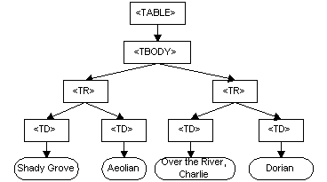

# JavaScript 面试问题—基本 DOM 和事件

> 原文：<https://levelup.gitconnected.com/javascript-interview-questions-basic-dom-and-events-7925ce8602ef>


照片由[普里西拉·杜·普里兹](https://unsplash.com/@priscilladupreez?utm_source=medium&utm_medium=referral)在 [Unsplash](https://unsplash.com?utm_source=medium&utm_medium=referral) 上拍摄

为了得到一份前端开发人员的工作，我们需要搞定编码面试。

在本文中，我们将研究 DOM 操作和事件问题。如果你不知道 DOM 是什么，那么这是一本必读的书。

# 什么是 DOM？

DOM 代表文档对象模型。它是 HTML 和 XML 文档的 API。当我们看到浏览器如何渲染屏幕时，我们关心的是 HTML。

页面中的 HTML 元素放在一个大对象中，浏览器可以使用这个大对象在页面上显示元素。

我们操纵 DOM API，通过改变对象中的特定元素或节点来操纵 DOM 结构。这些更改会反映在浏览器屏幕上。

DOM 树如下所示:



JavaScript `document`对象表示浏览器中的 DOM。

我们可以通过查找 DOM 树中的元素来操作 DOM 树，然后通过调用方法或设置找到的对象的属性来操作它们。

我们可以通过使用各种方法，如`document.querySelector`、`document.getElementById`来分别通过 CSS 选择器或 ID 找到一个元素，以返回一个元素或节点，我们可以在其上调用方法或设置属性。

同样，我们可以通过`document.querySelectorAll`操作一组对象，通过 CSS 选择器选择一组元素。它返回一个类似数组的对象，我们可以通过改变迭代。

# 什么是事件传播？

当在 DOM 元素上激发事件时，发生事件传播。该事件也由父元素触发。

有一个冒泡阶段，事件从起始节点冒泡到父元素、祖父元素，一直到`window`。

然后是捕获阶段，事件从`window`开始，一直到触发事件的原始元素。

总共有三个阶段:

1.  捕获阶段——事件从`window`开始，然后一直到子元素，直到到达目标元素。
2.  目标阶段—事件已到达目标元素。
3.  冒泡——事件从目标元素冒泡，一直上升到`window`。

# 什么是事件冒泡？

在这种情况下，事件从事件起源的元素开始，然后事件向上冒泡到父元素、祖父元素等。，直到它到达`window`对象。

例如，如果我们有以下 HTML 代码:

```
<div id='grandparent'>
  <div id='parent'>
    <div id='start'>
      Start
    </div>
  </div>
</div>
```

和下面的 JavaScript 代码:

```
const start = document.querySelector('#start');
const parent = document.querySelector('#parent');
const grandparent = document.querySelector('#grandparent');start.addEventListener('click', () => {
   alert('start clicked');
 })parent.addEventListener('click', () => {
   alert('parent clicked');
 })grandparent.addEventListener('click', () => {
   alert('grandparent clicked');
 })document.addEventListener('click', () => {
   alert('document clicked');
 })window.addEventListener('click', () => {
   alert('window clicked');
 })
```

当我们单击“Start”时，我们应该会看到所有警报按以下顺序显示:

1.  开始点击
2.  单击了父项
3.  祖父点击
4.  点击的文档
5.  点击的窗口

这是因为来自 ID 为 start 的 div 的 click 事件源自该 div，然后它冒泡到 ID 为 parent 的 div，然后到 ID 为 grande 的 div。

然后，该事件转到文档和窗口。

`addEventListener`接受第三个参数，这是为了设置`useCapture`选项。设置为`true`，那么事件将发生在捕获阶段，而不是默认的冒泡阶段。

例如，如果我们有以下代码:

```
const start = document.querySelector('#start');
const parent = document.querySelector('#parent');
const grandparent = document.querySelector('#grandparent');start.addEventListener('click', () => {
   alert('start clicked');
 }, true)parent.addEventListener('click', () => {
   alert('parent clicked');
 }, true)grandparent.addEventListener('click', () => {
   alert('grandparent clicked');
 }, true)document.addEventListener('click', () => {
   alert('document clicked');
 }, true)window.addEventListener('click', () => {
   alert('window clicked');
 }, true)
```

警报将以与之前相反的顺序显示。我们可以看到捕获是冒泡的逆过程。


照片由 [niko photos](https://unsplash.com/@niko_photos?utm_source=medium&utm_medium=referral) 在 [Unsplash](https://unsplash.com?utm_source=medium&utm_medium=referral) 上拍摄

# 什么是事件捕获？

事件捕获与事件冒泡相反。这意味着事件从`window`开始，一直到触发事件的元素。

例如，如果我们有以下 HTML 代码:

```
<div id='grandparent'>
  <div id='parent'>
    <div id='start'>
      Start
    </div>
  </div>
</div>
```

和下面的 JavaScript 代码:

```
const start = document.querySelector('#start');
const parent = document.querySelector('#parent');
const grandparent = document.querySelector('#grandparent');start.addEventListener('click', () => {
   alert('start clicked');
 }, true)parent.addEventListener('click', () => {
   alert('parent clicked');
 }, true)grandparent.addEventListener('click', () => {
   alert('grandparent clicked');
 }, true)document.addEventListener('click', () => {
   alert('document clicked');
 }, true)window.addEventListener('click', () => {
   alert('window clicked');
 }, true)
```

然后，当我们单击“开始”时，我们会得到按以下顺序显示的警报:

1.  点击的窗口
2.  点击的文档
3.  祖父点击
4.  单击了父项
5.  开始点击

这是因为我们将`true`传递给了`addEventListener`的第三个参数，该参数用于设置`useCapture`是否启用。

第三个参数的默认值是`false`，它让事件冒泡而不是被捕获。

将其设置为`true`会将事件更改为在捕获阶段发生，而不是让它冒泡。

# 结论

DOM 是 API 和对象，所有元素都以树的形式表示 HTML 和 XML 节点。在浏览器中，我们主要关心的是操纵它在浏览器屏幕上显示内容。

我们通过操纵 HTML DOM 树来做到这一点。

事件冒泡是指事件从触发事件的元素开始，然后事件到达父元素、祖父元素等。，一直到`window`。

事件捕获是指事件从窗口开始，然后到达触发事件的元素，事件到达父元素、祖父元素等。，一直到`window`。