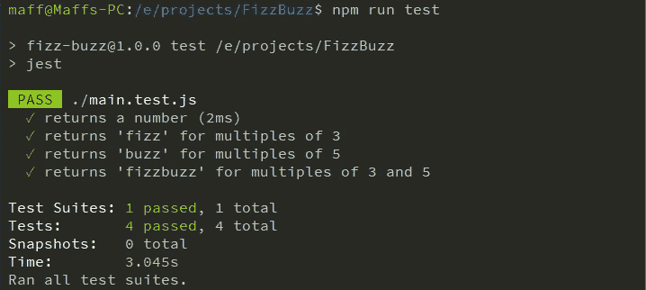
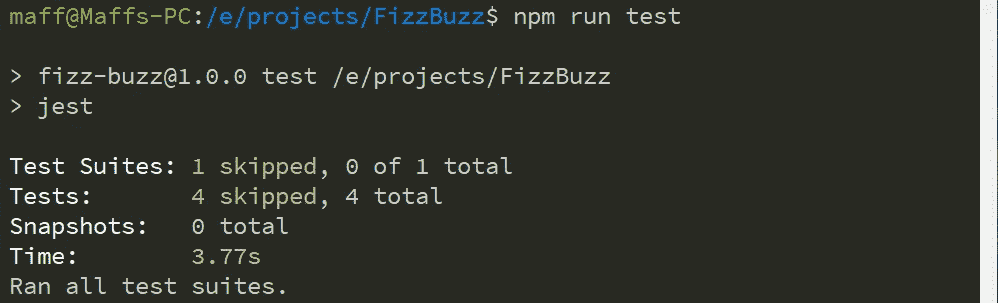
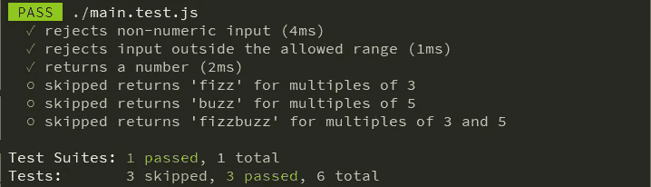
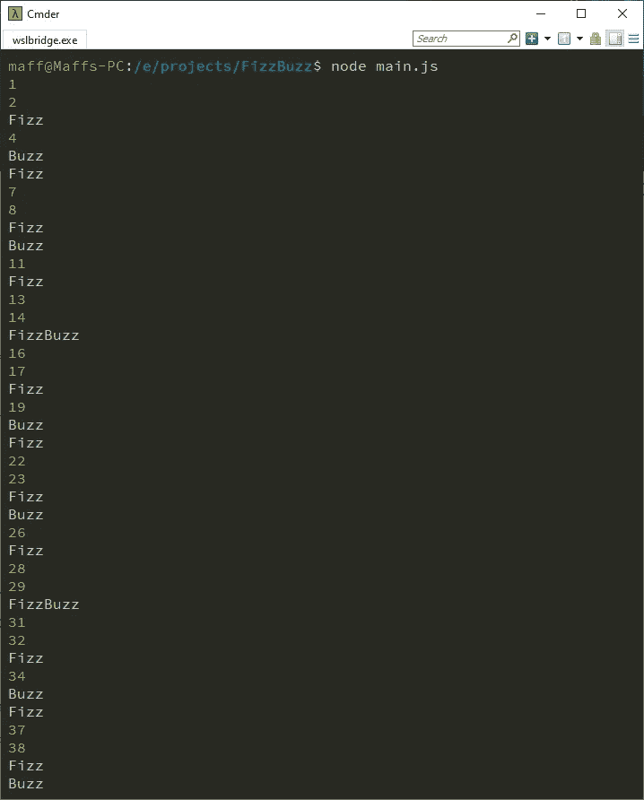

# 通过编写面向领域的单元测试赢得 JavaScript 面试

> 原文：<https://levelup.gitconnected.com/javascript-interview-unit-tests-390f6c96e86>


在数百名候选人中，这是你的王牌。播放它！[图片:[威尔·波拉达](https://unsplash.com/@will0629?utm_source=medium&utm_medium=referral)

面对即将到来的程序员面试？几乎可以肯定的是，你会被要求完成一项编码任务。这可能是你提前准备的“家庭作业”,或者是在面试过程中完成的现场编程任务。

不管怎样，这都是你大放异彩的机会——我会告诉你怎么做。

> 我将要描述的方法是测试驱动开发和面向领域测试的混合。

你潜在的新雇主会寻找一些品质，比如对细节的关注、速度、代码的整洁、你的设计的适合性，以及你是否清楚地理解了这些要求。

通常需求是故意模糊的，以衡量你如何处理模糊性。或者可能只是他们没有把需求写得特别好🤷‍♀……但不管怎样，你都可以证明你能应付。

如果没有人可以问或者他们故意“不能”提供答案，完美的方法是采用一种假设或另一种假设…然后

> 在测试中捕捉这个假设。

您渴望在编写代码的同时编写单元测试，这通常是一个隐藏的基准。面试官可能不会*告诉*你他们想看测试，但他们肯定会在之后讨论这个问题……甚至是你是否在实施任何逻辑之前主动开始编写测试。

让我们用经典的 [FizzBuzz](https://blog.codinghorror.com/why-cant-programmers-program/) 编码问题来看一个例子。FizzBuzz 是典型的面试任务。它提出的问题真的很简单；它被用作快速检查，以确保候选人至少可以从湿纸袋中编码出来。

所以…让我们开始吧:

> 写一个程序打印从 1 到 100 的数字。但是对于三的倍数，打印`Fizz`而不是数字，对于五的倍数，打印`Buzz`。对于同时是三和五的倍数的数字，打印`FizzBuzz`。

我知道，FizzBuzz 非常简单，几乎不需要测试驱动的方法。但是在你真正的面试中，你会遇到一个更复杂的问题…所以我们只用 FizzBuzz 来保持例子的简单性，并举例说明一些好的做法。

大多数候选人会卷起袖子，编写一个解决方案。他们甚至可能编写几个单元测试。但这才是你真正能脱颖而出的地方。

## 是时候进行快速设置了

让我们用 [Jest](https://jestjs.io/) 作为测试库。你对库的选择并不重要，只要选择你最熟悉的就行了。

假设面试电脑已经安装了节点/NPM:

```
$ mkdir FizzBuzz
$ cd FizzBuzz
$ npm install --save-dev jest
```

接下来创建`main.js`来包含被测试的代码，创建`main.test.js`来包含测试。

在`main.js`中添加一个占位符函数——你的测试可以调用它，这样你就知道一切都设置正确了:

别忘了`package.json`:

## 列出测试场景

现在您可以开始定义一些测试场景了。简单地将业务规则转化为单元测试用例:

这是让你从其他候选人中脱颖而出的地方(除非他们也读过这篇文章！).每种情况下的描述都描述了所需的结果——而不是代码应该如何*达到*结果或者应该如何实现。

但是要注意，如果你用`npm run test`运行这些空测试，你会得到一个令人惊讶的结果:



所有的测试都通过了…那就从周一开始吧..？🙀

为了使这个过程更加系统化，在每个测试中添加`.skip`—`test.skip(…)`——这样 Jest 就不会将未实现的测试算作通过:



唷，灾难避免了，你仍然有希望…

然后，当您依次进行每个测试时，只需移除`.skip`。

所以让我们开始编码测试场景，一次一个。这是第一个:

可能不是你期待的那个？原谅曲线球…但是当你写测试时，总是试图成为一个邪恶的天才。深入思考什么会出错…并添加“不愉快的路径”测试场景来保持代码的诚实。

通常的测试驱动方法是从一个简单的“快乐路径”输入开始，比如 1，然后期望得到 1。相反，你会脱颖而出(以一种好的方式！)如果你从错误条件(不愉快的路径)开始，并且只有*然后*朝着愉快的路径前进。

> 通过这种方式，你最终会得到更加健壮的代码，这意味着在生产中遇到错误的可能性比你遵循“普通的”TDD 要小。

顺便说一下，这种方法是面向领域测试(DOT)的核心原则。

在添加新的“邪恶”测试的过程中，我想到我们还需要确保输入在 1 到 100 之间，给定原始规范。永远不会太晚，所以说:

嘿，我还在“拒绝非数字”场景中添加了一些输入。根据您自己的偏好或单元测试风格，您可能更喜欢在每个测试函数中只有一个`expect`子句。但是我对上面的内容很满意，因为每个测试功能都在验证一个需求驱动的场景。

快速运行测试以显示失败的新场景，然后添加以下代码以使最新的场景通过:

所以仍然有“未实现”的代码分支，但是函数现在检查输入，如果无效就抛出。

> 👉注意，我用上面的代码稍微向前跳了一下，并且一次实现了两个测试。如果你坚持纯 TDD，你可以首先添加代码以通过第一次测试，然后添加代码以通过第二次测试……但是这完全取决于你。
> 
> DOT 在实践中往往没有那么严格。因为您已经确定了一整套测试场景，并且您正在通过它们进行工作，所以您可以更快地执行测试和代码。

因此，继续下一个测试用例，以及使其通过的代码:

快速运行测试，您将看到新的测试通过。之前的测试仍然通过，所以很可能我们没有破坏任何东西。

但是坚持住…

您可能会觉得测试匹配器相当不精确。它看起来也有点笨重。结果是一个数字的事实是我们真正关心的吗？为什么不简单地期望结果和传入的数一样，我们已经知道它是一个数？

其实为什么只检查一个值呢？作为一个真正检查“任何允许的不是 3 或 5 的倍数的数字”的测试，它的范围相当有限。

因此，在快速“升级”测试代码之后，我们现在有了这样的优势:

🐶如果你真的想让这只小狗通过测试，[基于属性的测试](https://codeburst.io/maximise-your-test-coverage-by-combining-property-based-testing-with-scenarios-e0d1bd3d6a7f)可以生成大量合适的输入值。这对 FizzBuzz 来说有点过了，但不管怎样，还是值得了解一下。

运行到目前为止我们所拥有的，我们现在得到:



在我看来这是进步

现在，您可以完成剩余的测试场景，实现每一个场景，并在进行过程中编写代码。

以下是完整的测试套件:

我已经改进了“返回一个数字”的场景名称，并把它移到了最后…让我们面对现实吧，它应该一直在那里！

> 尽管编程是一个流动的过程；当我们发现问题时，我们会在过程中纠正或改进。

测试中的超级安全功能看起来像:

不过，还有一件事。我们必须记住满足最初的要求:

> 从 1 到 100 循环，并为每个数字打印一些内容。

到目前为止，我们还没有这样做。**面试失败！**😬

让我们现在补救一下。

当然，打印到控制台是一个副作用；很难测试。我们*可以*提供一个定制的打印函数，然后从测试中提供一个模拟/伪造的版本，验证它每次都被调用。但是，天哪，这听起来太可怕了。我们不要那样做。

相反，您可以简单地将以下代码添加到`main.js`:

现在，要成功通过面试，请运行以下程序:

```
node main.js
```

结果如下:



完成了他们微薄的编码任务后，现在最重要的是你要把双拳砸在桌子上，大喊“我*统治！*

对不起，我的意思是你不要这么做是非常重要的。但是考虑到这些令人敬畏的测试，你有权利这么做；)

## 奖励积分

鉴于问题的简单性，你真的只能做到这一步了。任何额外的测试都是多余的，可能会给你打负分。然而，准备好讨论点总是很有用的，同时还要有足够的知识让讨论深入到面试官决定的程度。

例如，如果任务有更复杂的需求，你可以从一些 BDD 风格的测试开始。Jest 有一个很好的插件，[jest-cumber](https://www.npmjs.com/package/jest-cucumber)，它允许你执行[小黄瓜](https://cucumber.io/docs/gherkin/reference/)场景(给定/何时/然后)进行这种类型的测试。

DOT 也在 BDD 或验收测试级别运行。(事实上，它[以 3 个级别](/write-tests-at-three-levels-909561a9544b)运行)。

## 还有一件事

函数的最终版本是*防御编码*的一个很好的例子(在对所有输入做任何事情之前检查它们的有效性)。但这并不总是你想要的。如果最外层的函数已经检查了相同的数据，甚至可能不需要检查。这就是为什么在 DOT 中，我们重视大范围的[组件测试](https://codeburst.io/component-tests-vs-unit-tests-tdd-71b921d48907)胜过单元测试。所以防守检查都发生在正确的地方。

但是，嘿，对于一个简单的面试练习，我们所做的是正确的。

如果你遵循以上所有步骤，你在下一次面试中胜出的机会将会大大提高。当谈到编码练习时，面试官最感兴趣的是你采用的方法——以及你是否能明智地讨论你采用这种方法的原因。

如果你有兴趣更深入地探索单元测试、领域驱动设计、BDD 和 DOT，一定要加入 LinkedIn 上的[面向领域测试讨论组](https://www.linkedin.com/groups/13804489/)。