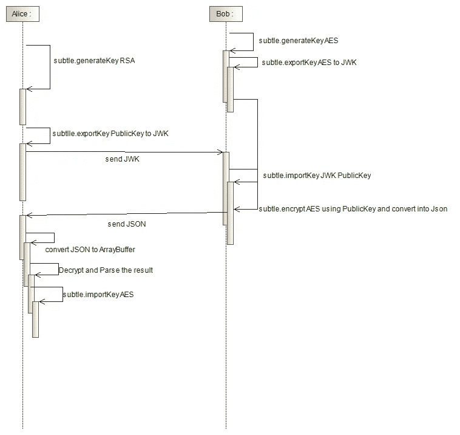

# Javascript 中的密钥包装

> 原文：<https://levelup.gitconnected.com/javascript-key-wrapping-188da1d6e9d0>

当我研究 Javascript 中的键包装时，我没有找到任何实现的具体例子。这就是为什么我写这篇文章来展示一个使用 Javascript 的键包装的例子。

密钥包装本身是用一个密钥加密另一个密钥的活动。这方面的一个例子是 https 中的 SSL/TLS 握手。

**问题陈述**

1.  使用纯 Javascript 代码的密钥包装
2.  包装密钥是 AES，包装密钥使用 RSA 公钥

**解决方案**

该解决方案是利用网络加密 API 创建的。大多数现代浏览器中都有这个 API。该解决方案的示例流程如图 1 所示。



图一。关键包装流程

如图 1 所示，发生了以下事件:

1.  Alice 为包装密钥生成 RSA 密钥对
2.  Bob 为包装密钥生成 AES 密钥，
3.  Alice 将 RSA 公钥导出为 JWK 格式，
4.  Bob 将 AES 密钥导出为 JWK 格式，
5.  Alice 将 RSA 公钥 JWK 发送给 Bob，
6.  Bob 接收 JWK 并导入 RSA 公钥，
7.  Bob 用 RSA 公钥加密 AES 密钥并转换成 JSON，
8.  鲍勃把 JSON 发送给爱丽丝，
9.  Alice 将 JSON 数据转换成 ArrayBuffer，
10.  Alice 解密 ArrayBuffer 并将结果解析为 object，
11.  Alice 使用 no.10 中的对象导入 AES 密钥，
12.  现在 Alice 有了 AES 密钥，可以开始加密/解密她和 Bob 之间的数据

**代码片段**

1.  生成 RSA 密钥对

```
window.crypto.subtle.generateKey({name: "RSA-OAEP",modulusLength: 4096,publicExponent: new Uint8Array([1, 0, 1]),hash: "SHA-256"},true,["encrypt", "decrypt"]).then(a => {console.log("Public Key:", JSON.stringify(a.publicKey));});
```

2.生成 AES 密钥

```
window.crypto.subtle.generateKey({name: "AES-GCM",length: 256},true,["encrypt", "decrypt"]).then(result => {}
```

3.将密钥导出到 JWK

```
window.crypto.subtle.generateKey({name: "AES-GCM",length: 256},true,["encrypt", "decrypt"]).then(a => {window.crypto.subtle.exportKey("jwk", a).then(b => {console.log(b);})});
```

4.导入 JWK 密钥

```
window.crypto.subtle.importKey("jwk", CryptoKey, "AES-GCM", true,["encrypt", "decrypt"]).then(result => { });
```

5.用 RSA 密钥加密 AES 密钥并转换成 JSON(检查 finalResult 变量)

```
window.crypto.subtle.encrypt({name: "RSA-OAEP"}, publicKey, new TextEncoder().encode(JSON.stringify(symKey))).then(result => {finalResult= JSON.stringify(Array.from(new Uint8Array(a)));})
```

6.将 JSON 转换成 ArrayBuffer

```
new Uint8Array(JSON.parse(JSONData)).buffer
```

7.解密并导入密钥

```
window.crypto.subtle.decrypt({name: "RSA-OAEP"},privateKey,new Uint8Array(JSON.parse(encrypted2)).buffer).then(a => {
 window.crypto.subtle.importKey("jwk", JSON.parse( new TextDecoder().decode(a)), "AES-GCM", true,["encrypt", "decrypt"]).then(a => {console.log("Extractable" + a.algorithm.name + " " + a.extractable);})});
```

**代码示例**

我在这个 [github](https://github.com/rsatrio/Key-Wrapping-Encryption-Javascript/) 里做了个例子(别忘了给个星)。在该示例中，我们将尝试创建 AES 密钥 RSA Keypair，使用 RSA 公钥加密 AES 密钥，并使用 RSA 私钥解密它。你也可以在[这里](https://adorable-capybara-1fa6ff.netlify.app/)试试 live 应用。

**参考文献**

1.  [https://developer . Mozilla . org/en-US/docs/Web/API/Web _ Crypto _ API](https://developer.mozilla.org/en-US/docs/Web/API/Web_Crypto_API)