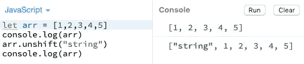

# JavaScript 方法 Push、Pop、Shift 和 Unshift

> 原文：<https://levelup.gitconnected.com/javascript-methods-push-pop-shift-unshift-455702d8c362>

开始编写 JavaScript 代码可能会令人生畏，当你深入研究时会变得困难，但是使用正确的方法，它会变得非常有趣和有益。作为最重要和最流行的编程语言之一，它成为了一个强大的学习工具，并且对于前端和后端开发非常有效。

需要理解的一个重要主题是数组，这是我们今天要学习的数据类型和方法。官方[文档](https://developer.mozilla.org/en-US/docs/Web/JavaScript/Reference/Global_Objects/Array)这样定义数组:*“数组是类似列表的对象，其原型有执行遍历和变异操作的方法。JavaScript 数组的长度和元素的类型都不是固定的。*这就是我说*“JavaScript 代码可能令人生畏”、*的原因，但如果用不同的词来描述，就不是这样了。

我喜欢把数组想象成一个可以被操作的**列表或元素集合**。例如:

数组将被方括号`[ ]`包围，元素之间用逗号分隔。它将从索引(位置)0 开始，所以如果我们有 3 个元素，那么元素 1 在位置 0，元素 2 在位置 1，元素 3 在位置 2。这个数组的长度将是 3，因为它从 1 开始，一直到最后一个元素。

当使用数组时，我们希望能够操作它，这可以通过在数组中添加或删除元素来实现。JavaScript 有一些方法可以让我们以非常高效和简单的方式做到这一点，主要的方法有`**push()**` **、** `**pop()**` **、** `**shift()**` 和`**unshift()**` **。**

## **1。推送方法**

Push 用于向数组中添加新元素。使用这种方法，您可以向任何给定数组的 **end** 添加一个新项目。这种方法不仅存在于 JavaScript 中，也存在于其他编程语言中。在 Python 中，我们发现同样的方法叫做 **append()。让我们看看它是如何工作的:**

如果我们开始将元素放入一个数组，我们会将它们添加到末尾。理解这一点很重要，你可以根据需要添加任意多的项，但是使用 push，所有的项都将被添加到数组的最后一个元素之后。

在这里，我声明了一个包含 **3** 个元素的数组并获取结果。一旦我使用了 push 方法，一个新的项就包含在数组的末尾。也可以是其他数据类型，比如字符串、布尔值、对象，它们仍然会被添加到末尾。使用这个方法可以确保我们不会覆盖数组中的现有元素，或者在元素之间留下空白(未定义的)空间。

我们看到推的方法每天都在使用，甚至没有注意到。当我们在网络浏览器中导航时，它会被创建为历史记录，每次我们转到不同的网页时，特定的 URL 会被添加到已访问页面列表的末尾。

## 2.**弹出方法**

`pop()`方法与推送相反。它允许我们从数组中移除最后一项。说**最后推的是最先弹出的**会很准确。例如:

在左边，我们有弹出的推送项目。从数组中删除或添加元素必然会改变其长度。

关于 pop 的一个重要事实是，它返回弹出的项。让我们看看它在代码中的样子:

在上图中，我们声明了一个包含 5 个条目的数组，后跟该数组的 console.log。对于第三行，我们使用日志来显示`arr.pop()` 的值，即 **5。**如果我们不使用控制台，唯一的区别就是我们看不到被移除的项目。最后一行`console.log(arr)`只是打印使用`pop()`后的最终结果。

返回值可以存储在变量中，也可以以任何方式使用。

这里，pop 返回的值被加到 10。当我们记录`arr`时，通过记录`test`，我们意识到 5 不再在数组中。这个变量保存弹出项的值+ 10，结果我们得到 **15** 。

## **3。解换挡方法**

通过遵循与 push 方法相同的路径，我们能够向数组中添加新元素，但是使用`**unshift()**`我们将在开始时添加它们。

保持和以前一样的数组，在使用 **console.log(arr)，**之后我们可以看到控制台上的项目。使用`**arr.unshift(“string”)**`、**、**我们成功地向数组中添加了一个新项，现在在最开始。如前所述，在处理数组时，可以使用不同的数据类型。这就是这些方法在 Javascript 中如此重要的原因。

## **4。移位方法**

最后但同样重要的是`shift`方法，它的结果类似于`pop`，但是在数组的最开始，减少了它的长度。

通过保持前面的例子，我们可以更准确地使用`shift`的效果。在最后两行中，我们使用了`console.log(arr.shift( ))`，因此我们可以看到从数组中移除的值`“string”` ，最后在最后一行中`console.log(arr)`给出了`arr`保存的当前值。

感谢您阅读我希望是愉快的和澄清。更多文章请访问 https://medium.com/@jhcxavier。

*原载于*[https://www.linkedin.com/in/joao-henrique-xavier/](https://www.linkedin.com/pulse/javascript-methods-push-pop-shift-unshift-jo%C3%A3o-henrique-xavier/.)*。*