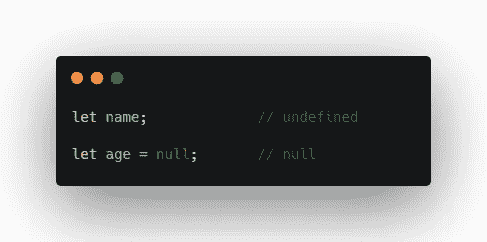
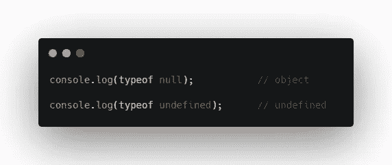
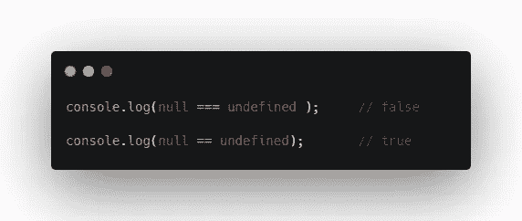
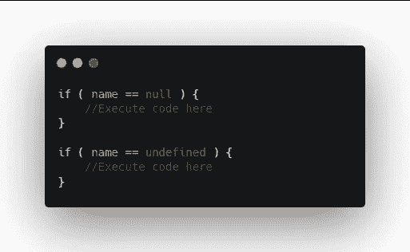

# JavaScript 空 vs 未定义

> 原文：<https://levelup.gitconnected.com/javascript-null-vs-undefined-2acda986f79f>

理解`null`和`undefined`的区别

杰里米·珀金斯在 [Unsplash](https://unsplash.com?utm_source=medium&utm_medium=referral) 上拍摄的照片

# 介绍

Null 和 Undefined 都是 JavaScript 中的数据类型。

**未定义**是一个已经声明但没有赋值的变量。

**Null** 作为赋值。所以你可以把值`null`赋给任何变量，这基本上意味着它是空的。

因此，通过不向变量声明值，JavaScript 会自动将值赋给`undefined`。然而，当你将`null`赋值给一个变量时，你声明这个值是*显式空*。

空且未定义

JavaScript 永远不会自动给`null`赋值。这必须由您在代码中完成。

让我们得到更多关于这些的信息。

# 类型为空且未定义

类型为空且未定义

我们在这里看到`null`的类型是一个**对象**，但是`undefined`的类型是**未定义的**。

# 使用抽象等式和严格等式进行比较

由于这些是不同的数据类型，如果我们用严格等式`===`来比较它们，我们得到`false`。

null 和 undefined 之间的比较

但是如果我们将它们与抽象等式`==`进行比较，我们得到`true`。

所以 JavaScript 认为它们是相对相等的，因为它们都代表一个空值。

因此，如果您需要检查一个值是`null`还是`undefined`，您可以检查抽象等式并将其与 null 或 undefined 进行比较。两者将返回相同的结果。