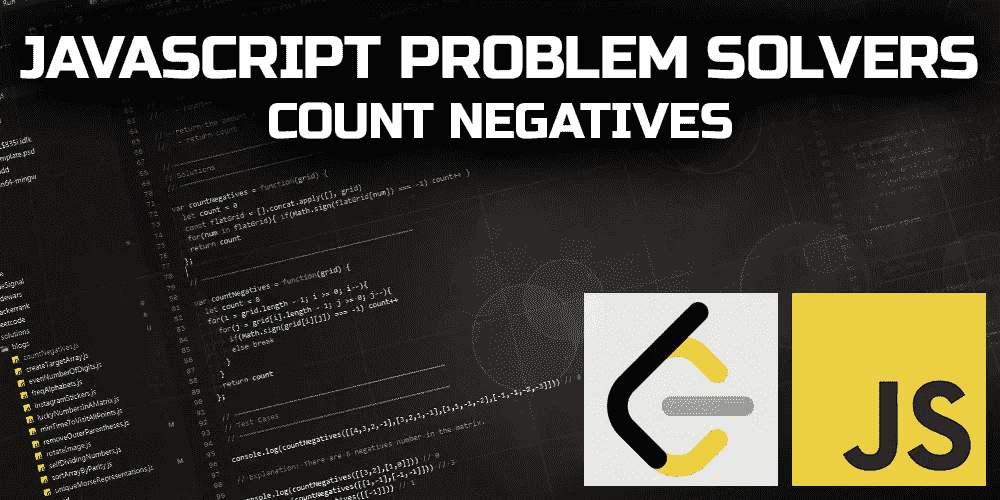
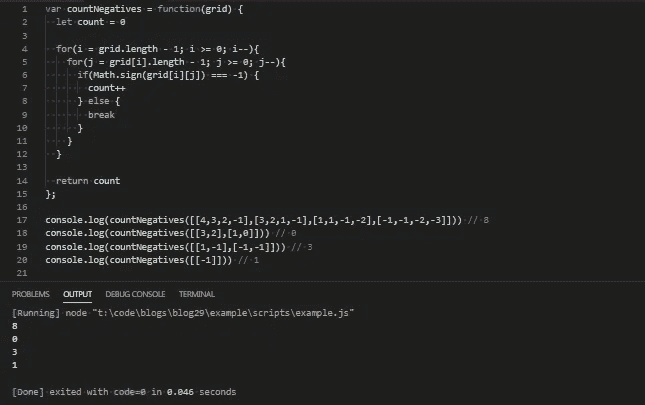
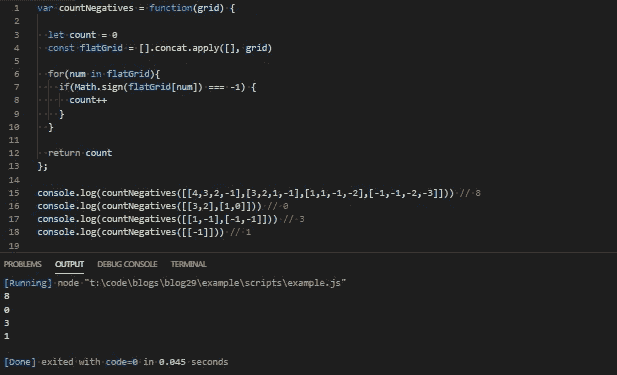

# JavaScript 问题解决者:计算负数

> 原文：<https://levelup.gitconnected.com/javascript-problem-solvers-count-negatives-bd182f609551>

## 案例 012:展平矩阵



本周，我们将回到矩阵，因为它们非常有趣。太有趣了。

手头的问题不像我们以前解决的问题那样困难，比如`Rotate Image Matrix`或`Minimum Time Visiting All Points`，但仍然提供了一个很好的练习，让你可以用不同的方法在 2D 矩阵中处理数据。

所以，让我们开始解决。

## 问题是

[**这里是 LeetCode**](https://leetcode.com/problems/count-negative-numbers-in-a-sorted-matrix/) 上问题的链接

```
Given a m * n matrix grid which is sorted in non-increasing order both row-wise and column-wise.Return the number of negative numbers in grid.
```

## 制约因素

我们得到的约束条件是处理 2D 矩阵问题的标准约束条件。在这一点上，他们是我们所期待的。但是，和往常一样，仔细检查每个约束以确保我们知道我们在处理什么是一个好主意:

```
m == grid.length
```

因为我们得到了一个`m * n`矩阵`grid`，所以给定矩阵中的行和列的数量是线性独立的。我们可以拥有比列更多的行，也可以拥有比行更多的列。`m`表示对于任何给定的矩阵，我们应该期望的行数。

```
n == grid[i].length
```

`n`代表我们应该期待的列数。这里也没什么异常。

```
1 <= m, n <= 100
```

在这里，我们得到了我们期望看到的行数或列数的上限和下限。有了下限`1 <=`，我们可以相信不必担心处理空行或空列的事实。上限并不重要，但是如果我们想提出一些定制的测试用例，`<= 100`的上限给了我们足够的信息。

```
-100 <= grid[i][j] <= 100
```

`grid[i][j]`表示矩阵中的每个元素，这个约束给了我们每个元素的上下限。由于这是一个严格处理每个元素的值以及一个元素是否是负数的问题，`-100 <=`的下限完全有意义，`<= 100`的上限也是如此。很高兴知道我们将不必处理任何真正大的数字。

## 测试

## 崩溃了

这个问题的解释和范围相当简单，尽管可能会有一些技巧。因此，像往常一样，让我们分解问题解释的每一行，寻找任何可能引导我们找到解决方案的线索，并确保我们理解我们的任务是解决什么:

```
Given a m * n matrix grid which is sorted in non-increasing order both row-wise and column-wise.
```

直截了当。正是我喜欢的方式。让我们进一步分解第一部分，因为我们已经在一句话中获得了大量信息:

```
Given a m * n matrix grid
```

`*Given a m * n matrix grid*`简单地说就是给定矩阵中的行和列的数量彼此独立。这暗中告诉我，即使我们的一些测试用例可能有相同数量的行和列，其他的可能没有，我们不能同时迭代行和列。如果我们想这样做，我们就必须找到不同的解决办法。

```
sorted in non-increasing order
```

`*sorted in non-increasing order*`是`*sorted in a decreasing order*`的另一种说法，也是*的另一种说法，“数字一直在变小。”*这很有帮助，告诉我我们不必担心如何对`grid`或`grid[i]`中的元素进行排序。这项工作已经为我们做好了。

```
both row-wise and column-wise
```

这甚至比以非递增顺序排列元素更有帮助。不仅对每一行进行排序，而且对每一列也进行排序。这意味着矩阵中的第一个元素将始终是整个矩阵中最大的数字，而矩阵中的最后一个数字将始终是整个矩阵中最小(或最负)的数字。

如果我们看一下测试用例 1，我们可以自己看到这一点:

```
[ 4, 3, 2, -1]
[ 3, 2, 1, -1]
[ 1, 1,-1, -2]
[-1,-1,-2,-3]
```

~

```
Return the number of negative numbers in grid.
```

简单地说，我们的任务是这样的。我们需要找出一种有效的方法来遍历给定的矩阵，并确定一个元素是负的还是正的。

## 嫌疑人

我想到了两个不同但相似的解决方案:一个是嵌套循环，另一个是扁平矩阵。这两种方法都将以独特的方式迭代通过`grid`,但仍然产生我们想要的结果。

因为我们需要确定一个数字是否是负数，所以我们可以使用`Math.sign()`。`Math.sign()`将`return` 1 如果一个数是正数，0 如果一个数是零，和-1 如果一个数是负数。

我们还需要`return`矩阵中负数的数量，我们可以用一个计数器变量来跟踪它。

但是我们只关心一个数字是否是负数。0 和正数没关系。所以，如果`Math.sign(<a number>) === -1`，我们递增计数器。

这就是我们两种解决方案的相似之处。由于我们的任务相当简单，我们可以将注意力转向找出一种有效的方法来迭代给定的矩阵。

我们可以采取两种方法:

**解决方案#1:向后嵌套迭代**

如果我们不想变异`grid`，我们可以利用给定矩阵的顺序。由于`grid`在行和列上都是按非递增顺序排序的，我们可以从`grid`的最后一个元素开始遍历`grid`的每个子数组。这是我们最有可能找到一个包含负数的子数组的地方。我们也可以从每个子数组`grid[i][j]`的最后一个元素开始，因为在那里我们最有可能找到一个负数。

从`grid`的末尾开始，到`grid[i]`的末尾，我们可以迭代`grid[i]`并检查`Math.sign(grid[i][j]) === -1`是否存在，如果存在，则递增我们的计数器。

如果`Math.sign(grid[i][j]) !== -1`，那么`grid[i][j]`必须是一个正数(或 0)，并且由于`grid[i]`是按非递增顺序排序的，我们在`grid[i]`中找不到更多的负数，子数组的其余部分必须用正数填充。

一旦`Math.sign(grid[i][j]) !== -1`，我们就可以脱离迭代了。

这个解决方案的唯一问题是我们需要嵌套一个迭代来访问`grid[i][j]`，在最坏的情况下，它将在`O(n²)`时间内运行。

我认为我们可以做得更好。

**解决方案 2:扁平化的单一迭代**

所以`grid`的非递增顺序只在行和列的上下文中有关系。因为我们需要做的就是确定一个数是否是负数，所以顺序并不重要。如果我们去掉所有的行和列，只展平矩阵会怎么样？

如果我们展平`grid`并将展平后的矩阵设置为类似于`flatGrid`的变量，我们可以使用一次迭代遍历`flatGrid`并运行与第一个解决方案中相同的`if`语句。这确实意味着我们需要检查每个元素，而不能中断迭代。

我们可以对`flatGrid`进行排序，但是如果我们在`flatGrid`上调用`.sort()`来这样做，我们实际上会增加我们的时间复杂度，因为`.sort()`通常根据您的运行时环境使用合并和快速排序方法。这两种方法通常在`O(n log n)`时间内运行，尽管如果`flatGrid`开始变大，合并排序将在`O(n²)`时间内结束。

因此，给定我们的约束`1 <= m, n <= 100`，遍历未排序的展平数组实际上会更快。

我们也可以用`[].concat.apply([], grid)`代替`grid.flat()`，因为当我们事先不知道数组的长度时，这是一种更有效的展平数组的方法。

## 伪代码

现在，我们已经完成了几个解决方案，让我们在编写任何代码之前尝试编写一些伪代码:

**解决方案#1:向后嵌套迭代**

**解决方案#2:扁平化单次迭代**

很好。

## 代码

现在我们已经知道了我们的两种解决方案应该如何工作，让我们看看它们是否可行:

**解决方案#1:向后嵌套迭代**

首先，让我们定义我们的计数器变量，`count`:

接下来，让我们设置两个`for`循环。两者分别从`grid`和`grid[i]`的末端开始:

然后，我们需要做的就是添加一个逻辑来检查一个数字是否是负数，如果是，就增加`count`，如果不是，就停止迭代:

最后，让我们添加我们的`return`值:

让我们看看它是否有效:



很好。

**解决方案#2:扁平化单次迭代**

让我们再一次定义出`count`变量，以及我们展平的`grid`变量`flatGrid`:

接下来，让我们设置我们的`for in`循环来遍历`flatGrid`:

然后我们可以添加相同的逻辑来检查一个数字是否为负，并从第一个解开始增加`count`:

最后，我们可以添加我们的`return`值:

让我们看看这是否也有效:



很好。

## 最终解决方案

让我们最后看一下不带注释的解决方案，并清理一些语法:

**解决方案#1:向后嵌套迭代**

**解决方案 2:扁平化的单次迭代**

很好。

## 任务完成

虽然`countNegatives`并不是最困难或最复杂的问题，但我认为我们提出的两个解决方案都是不同的，也足够有趣，值得写一篇关于解决`countNegatives`问题的博客。

我很清楚我的解决方案不会是最好或最有效的，但我希望它们能帮助你或其他人找到一种方法来解决你在这个旅程中遇到的问题，我们称之为 JavaScript。

不管怎样，我希望你得到了一些有用的信息，希望你所有的函数都返回 true，所有的请求都用 200 来响应。

保持安全…保持健康…继续为正义而战。

# 分级编码

感谢您成为我们社区的一员！ [**订阅我们的 YouTube 频道**](https://www.youtube.com/channel/UC3v9kBR_ab4UHXXdknz8Fbg?sub_confirmation=1) 或者加入 [**Skilled.dev 编码面试课程**](https://skilled.dev/) 。

[](https://skilled.dev) [## 编写面试问题

### 掌握编码面试的过程

技术开发](https://skilled.dev)