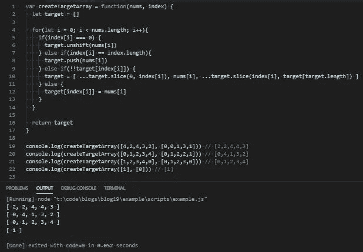

# JavaScript 问题解决程序:创建目标数组

> 原文：<https://levelup.gitconnected.com/javascript-problem-solvers-create-target-array-33cdb61c7a87>

## 案例 006:坚持目标

插入算法可能相当复杂。尤其是在处理极大的数据集时，这些数据集会成倍地增加执行解决方案所需的时间和空间复杂性。

今天的问题没有什么太复杂的，但仍然提供了一个适度的挑战来测试我们的问题解决技能，并让我们涉足插入算法。

所以，让我们开始解决。

## 问题是

[**这里是 LeetCode**](https://leetcode.com/problems/create-target-array-in-the-given-order/) 上问题的链接

```
Given two arrays of integers *nums* and *index*. Your task is to create *target* array under the following rules:- Initially *target* array is empty.
 - From left to right read *nums[i]* and *index[i]*, insert at index *index[i]* the value *nums[i]* in *target* array.
 - Repeat the previous step until there are no elements to read in *nums* and *index*.
 - Return the target array.
 - It is guaranteed that the insertion operations will be valid.Constraints:
  - 1 <= nums.length, index.length <= 100
  - nums.length == index.length
  - 0 <= nums[i] <= 100
  - 0 <= index[i] <= iTest Cases:
nums = [4,2,4,3,2], index = [0,0,1,3,1] => [2,2,4,4,3]Explanation:
nums index target
4    0     [4]
2    0     [2,4]
4    1     [2,4,4]
3    3     [2,4,4,3]
2    1     [2,2,4,4,3]-------------------------nums = [0,1,2,3,4], index = [0,1,2,2,1] => [0,4,1,3,2]Explanation:
nums index target
0    0     [0]
1    1     [0,1]
2    2     [0,1,2]
3    2     [0,1,3,2]
4    1     [0,4,1,3,2]-------------------------nums = [1,2,3,4,0], index = [0,1,2,3,0] => [0,1,2,3,4]Explanation:
nums index target
1    0     [1]
2    1     [1,2]
3    2     [1,2,3]
4    3     [1,2,3,4]
0    0     [0,1,2,3,4]nums = [1], index = [0] => [1]Explanation:
nums index target
1    0     [1]
```

## 崩溃了

与我们在本系列中试图解决的任何问题一样，让我们首先将问题的解释分解成更小的部分，以确保我们理解我们的任务是解决什么:

```
Given two arrays of integers *nums* and *index*. Your task is to create *target* array under the following rules…
```

看起来很简单，我们发现的第一件事是我们需要写的`function`必须接受两个`array`作为`argument`，我们还看到我们的`function`也需要`return`和`array`。

```
Initially *target* array is empty.
```

这再次确认了我们将返回一个`array`。再说一次，这看起来很简单，但是确保我们知道自己在做什么总是好的。这也告诉我，我们不想要`mutate``nums`或`index` `array`。

```
From left to right read *nums[i]* and *index[i*], insert at index *index[i]* the value *nums[i]* in target array.
```

在这里，事情可能开始变得有点混乱，所以让我们试着把事情分解得更细一些:

```
From left to right
```

这告诉我们应该从头到尾进行迭代。虽然我们在迭代一个`array`时总是有许多不同的选择，但是手头的任务明确指出我们需要从左向右迭代。虽然这可能会限制一些程序员，但我觉得它有助于给我们一个提示，告诉我们`function`应该如何操作，并且如果我们将来遇到问题，可以帮助消除对我们解决方案的怀疑。

```
read *nums[i]* and *index[i]*
```

这里我们得到了关于我们的迭代需要如何操作的另一个线索。我们将同时遍历我们传递给我们的`function`的两个`array`。我相信嵌套迭代是不可思议的，所以我们在这里得到的线索有点令人宽慰。

```
insert at index *index[i]* the value *nums[i]* in *target* array
```

这就是告诉我们需要在`nums` `array`中给`target` `array`加上一个数字。`nums` `array`中该数字的`index`对应`index` `array`中某数字的`index`。它所对应的`index` `array`中的数字就是我们要加到`target` `array`的地方。

例如，如果我们的`nums` `array`看起来像这样:

```
[1, 3, 2]
```

而我们的`index` `array`看起来是这样的:

```
[2, 0, 1]
```

然后我们要在第二个`index`处将数字 1 插入到`target`到`array`中，因为我们的`nums` `array`中数字 1 的`index`是 0，而`index` `array`中的数字在`index`处是 2。

```
Repeat the previous step until there are no elements to read in *nums* and *index*.
```

我们从中获得了更多的信息。这可能感觉有点不必要，而且表面上看起来好像只是说我们需要完整地迭代两个`array`。

但是我觉得这也告诉我们，我们所有的操作都需要在一个循环中执行。我们不应该在单次迭代的`scope`之外编写任何类型的额外迭代或 re 赋值，因为这可能会导致一些不想要的副作用。在这一点上，我可能是错的，但它成为我获得的一些东西，帮助我找到我想出的解决方案。

```
Return the target array.
```

这是相当直截了当的，证实了我之前的建议，我们确实需要`return`和`array`。

```
It is guaranteed that the insertion operations will be valid.
```

这给了我们一个暗示，我们正在处理一个集中在插入算法上的问题。由于这是我们解决方案的一个规则，而不是一个约束，这意味着我们必须确保无论`nums`或`index`或`array`中的数字是什么，我们的算法都需要无误地工作。

## 制约因素

我们的约束也为我们提供了一些关于如何排除潜在边缘情况的有用信息，理解手头问题的约束与理解上下文同样重要:

```
1 <= nums.length, index.length <= 100
```

这里我们得到了在`nums`和`index` `array`中有多少个数字的下限和上限。有了`1 <= nums.length`、`index.length`的下限总是有用的，因为它告诉我们永远不会遇到空的`array`。上限为 100 并不重要，但是它确实使我们能够创建一个测试用例来测试我们的长度为 100 的解决方案。

```
nums.length == index.length
```

这非常重要，因为它告诉我们`nums`和`index` `array`的长度彼此线性相关。这允许我们在同一个`for`循环中同时遍历两个数组。如果两个`array`都有基于不同约束的长度，这将导致一个问题。

```
0 <= nums[i] <= 100
```

我们应该可以在`nums`数组中看到从 0 到 100 的任何数字。这并不像我们的其他一些约束那样重要，因为我们需要做的就是将`nums`数组中的数字插入到`target` `array`中。

```
0 <= index[i] <= i
```

这是关于`nums`和`array`的`element`或范围的更重要的信息。我们看到`index[i]`的下限是 0，这是意料之中的，因为 0 是任何`array`的第一个指数。

有趣的是，我们的上限是`i`，而不是一个静态的数字。`i`永远不会大于`index`T3 的长度，因为如果它大于，我们的`for`循环就会结束。这意味着`index` `array`中的数字不会大于`index` `array`本身的长度，因此我们的`target` `array`的长度永远不会大于`index` `array`或`nums` `array`。当我们想要在我们的`target` `array`末尾添加一个数字时，这将变得非常有用。

## 边缘案例

这是我在 LeetCode 上遇到的第一个问题，我们可能需要考虑的每个边缘情况都包含在问题的解释或问题约束中。

由于为我们提供的约束，我们不必担心空的或真正大的数字。

`nums.length == index.length`和`0 <= index[i] <= i`的两个约束消除了如果`nums`或`index`具有不同长度时我们可能遇到的任何问题。

`0 <= nums[i] <= 100`还推断出我们在`nums` `array`中总会有数字，并且去掉了我可能必须为其他 primatives 编写的一些类型检查。

`0 <= index[i] <= i`还推断出，既然`i`是一个数字，那么`index` `array`中的任何元素也将是一个数字，并且去掉了一些我们需要简化的类型检查。

因此，在彻底检查了提供给我们的所有信息后，我们可以开始思考如何解决这个问题。

## 嫌疑犯

这个问题的解决方案的提示散布在问题的解释、约束和测试用例中。它们可能不是非常明显，但是在仔细查看了所提供的信息之后，我找到了一个远没有我最初认为的那么复杂的解决方案。

我们需要做的第一件事是定义一个空的`array`，我们将在其中插入数字，并在`function`的末尾插入`return`。姑且称之为`target`。

由于规则`Repeat the previous step until there are no elements to read in *nums* and *index*.`，我们将只编写一个`for`循环。这个`for`循环将同时遍历`nums`和`index` ，并使用相同的迭代器。这是因为我们想要从`nums`插入到`target`中的数字的索引直接对应于`index`中的相同索引和数字。

我们的单个`for`循环将有 4 个需要考虑的独立条件，因此我们的插入算法满足问题说明中概述的所有要求:

```
1.) A number in the index array is 02.) A number in the index array is equal to the length of the index array3.) There is a number in the target array that is at the index we want to insert a number at (a collision)4.) All other cases
```

让我们来分解一下我们将如何应对这些情况:

```
A number in the index array is 0
```

这意味着我们想在`target`的开头插入一个数字，这很容易理解。我们将使用`unshift` ( `target.unshift(nums[i])`)将从`nums`到`target`的数字相加。

```
A number in the index array is equal to the length of the index array
```

这意味着我们想要在`target`的末尾插入一个数字，类似于我们在`target`的开头添加一个数字，我们将简单地使用`push` ( `target.push(nums[i])`)将`nums`中的数字添加到`target`中。

```
There a number in the target array that is at the index we want to insert a number at (a collision)
```

这是所有情况中最棘手的。如果我们想在某个特定的`index`处给`target`添加一个号码，但是那个`index`处已经有一个号码，我们需要拆分`target`然后插入该号码。

我们需要解决的第一件事是如何检测一个数字是否在当前的`index`。我们可以通过在我们想要插入(`target[index[i]]`)的`index`处测试`element`的真实性来做到这一点。我们可以单击`!target[index[i]]`来检查`target`中的元素是否在我们想要插入的索引处。但是由于`!`操作符用于检查 falsey 语句，如果一个元素在索引处，我们的布尔表达式将`return` `false`，如果不在索引处，将`return` `true`。我们需要反过来，可以用另一个 bang ( `!!target[index[i]]`)来反转布尔表达式。

如果在我们想要插入的`index`处有一个`element`，这将`return` `true`，如果没有`return` `false`。

在我们得到布尔表达式的结果后，我们将不得不分割并重建`target`。我们可以通过使用`slice`和扩展操作符的组合来实现。我们可以`slice`我们想要在(`target.slice(0, index[i])`)处插入数字的`index`之前的所有内容，然后插入数字(`nums[i]`)，然后切片我们想要在(`target.slice(index[i], target[target.length])`)处插入数字的`index`之后的所有内容。

然后，由于`slice`将返回一个`array` ( `[ …target.slice(0, index[i]), nums[i], …target.slice(index[i], target[target.length]) ]`)，并且将`target`重新分配给重建的`array` ( `target = [ …target.slice(0, index[i]), nums[i], …target.slice(index[i], target[target.length]) ]`)，因此我们可以对两个`slice`操作使用扩展运算符来重建`target`。

```
All other cases
```

在所有其他情况下，我们只想在`index`中相应的`index`处插入一个来自`nums`的数字。我们可以通过将`target` ( `target[index[i]`)中`index` ( `index[i]`)处的`element`分配给我们想要从`nums` ( `target[index[i] = nums[i]`)插入的数字来实现。

最后，我们想要做的就是返回`target`。

## 伪代码

由于这个解决方案的工作方式可能很难想象，或者我没有很好地解释它，让我们从不同的角度来看看我们潜在的解决方案，并编写一些伪代码:

## 评论

太好了。现在，让我们开始一步一步地编写代码，并以伪代码为基础:

首先，让我们定义我们的`createTargetArray` `function`、我们的`target` `array`和我们的`return`值:

接下来，让我们为如何将数字插入`target`设置条件语句:

最后，让我们向条件语句中添加将数字插入到`target`中的逻辑:

如果一切按计划进行，我们应该通过所有的测试用例:



## 最终解决方案

让我们最后看一下不带注释的解决方案，并清理一些语法:

太棒了。

## 任务完成

我真的很喜欢这个问题，并选择写一篇关于它的博客，因为它不是一个通用的插入算法，并迫使我想出一个有点聪明的方法来正确地将元素插入目标数组。尽管这并不复杂，但我发现这是一个很好的练习。

再说一次，我写的关于解决 LeetCode 或 HackerRank 问题的博客并不是为了找到时间或空间复杂度最低的解决方案。他们关注的是解决问题的步骤。

我很清楚我的解决方案不会是最好的或最有效的，但不管怎样，我希望它们能帮助你或其他人找到一种方法来解决你在这个旅程中遇到的问题，我们称之为 JavaScript。

保持安全…保持健康…继续为正义而战。

[](https://skilled.dev) [## 编写面试问题

### 一个完整的平台，在这里我会教你找到下一份工作所需的一切，以及…

技术开发](https://skilled.dev)