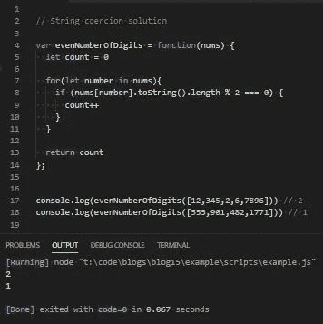
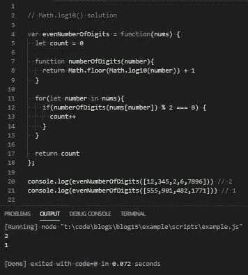

# JavaScript 问题解决者:偶数位数

> 原文：<https://levelup.gitconnected.com/javascript-problem-solvers-even-number-of-digits-39b4915b4b1>

## 案例 002:我有点基数排序

今天我们要解决一个关于字符串强制的问题。我总是发现字符串强制是一个有趣的话题，并且在不使用`.toString()`的情况下寻找解决方案总是一个有趣的挑战。

所以让我们开始解决。

## 问题是

[这里是 LeetCode](https://leetcode.com/problems/find-numbers-with-even-number-of-digits/) 上问题的链接

```
Description:
Given an array nums of integers, return how many of them contain an even number of digits.Constraints:
  1 <= nums.length <= 500
  1 <= nums[i] <= 10⁵Test Cases:
  [12, 345, 2, 6, 7896] returns 2 Explanation:
      12 contains 2 digits (even number of digits).
      345 contains 3 digits (odd number of digits).
      2 contains 1 digit (odd number of digits).
      6 contains 1 digit (odd number of digits).
      7896 contains 4 digits (even number of digits).
      Therefore only 12 and 7896 contain an even number of digits. [555, 901, 482, 1771] returns 1 Explanation:
      Only 1771 contains an even number of digits.
```

## 崩溃了

我们可以从把问题重新表述成有助于我们找到起点的语言开始:

```
Given an array of integers, write a function called *evenNumberOfDigits* that accepts the array of integers, and returns how many elements consists of an even number of digits
```

太好了。这听起来更容易理解。

我们还在约束中看到`1 <= nums.length <= 500`。

这意味着我们不必考虑长度为 0 或长度大于 501 的数组。这非常有用，因为它告诉我们不必考虑空数组。它还为我们提供了一个预期数组应该有多大的上限。虽然这不是非常重要，但至少告诉我们，我们不应该期望我们的解决方案会无限延伸。

`1 <= nums[i] <= 10⁵`的另一个约束也很有用，因为它告诉我们 0 永远不会出现在数组中，数组中的最大数至多是 10⁵，即 100，000。因为我们的任务是计算一个元素的位数，这比看起来更重要。它告诉我们，我们应该期望的最大位数是 6。虽然不是至关重要的，但知道我们也不必考虑无限多位数的数字还是有好处的。

我们的测试用例看起来正是我们所期望的，并且附带了一些很好的解释，以防我们误解了问题要求我们做的事情，并且节省了我解释测试用例本身的一些努力。

让我们继续前进。

## 边缘案例

在经历了为我们提供的约束后，我们可能必须考虑的许多正常边缘情况完全从等式中移除了，这很好。

约束条件涵盖了所有这些可能的边缘情况:

```
1.) The input array is empty
2.) An element in the array is 0
3.) The element in the array is a negative number
4.) There is a string in the array
5.) There is an extremely large number in the array
6.) The array is extremely large
```

不管我们采用什么方法，这都是一个更清洁的解决方案。

## 嫌疑人

我们可以编写的第一个解决方案涉及字符串强制。我们可以将数组中的每个元素强制转换成一个字符串，然后对每个字符串的长度取模 2，如果结果为 0，就增加一个计数器。

然后，我们可以将强制推入一个新的数组，并迭代该数组来运行我们的布尔表达式，但这似乎很麻烦。相反，我们可以内联编写强制和布尔表达式，而不会浪费任何额外的内存。

另一个可能的解决方案涉及到一些数学。我们可以编写一个助手函数，对数组中的每个元素执行一些操作，返回每个元素的位数。然后，我们可以获取辅助函数的返回值，以 2 为模，如果结果为 0，再一次递增计数器。

这个等式是我从我手头的基数排序解决方案中得到的，它提供了一种不用字符串强制就能找到整数位数的有趣方法。

等式看起来是这样的:

```
Math.floor(Math.log10(n)) + 1)
```

让我们把它分解一下。

最复杂的部分是`Math.log10(n)`以及我们为什么要使用它。会找到 10 的指数会给我们什么样的 T2。

例如:

我们将得到 0，因为任何指数为 0 的东西都等于 1。

`Math.log10(10)`是 1，因为 10 是 10。如果我们 `Math.log10()`任何小于 10 的数字，我们得到一个小于 1 的小数。

`Math.log10(5)`是 0.6989700043360189，10⁰ ⁶⁹⁸⁹⁷⁰⁰⁰⁴ ⁶⁰ ⁸⁹是 5.000000000000010961886791361(不用担心所有那些后面的小数)。

`Math.log10(100)`是 2，因为 10 是 100。

`Math.log10(50)`是 1.6989700043360187 因为 10 ⁶⁹⁸⁹⁷⁰⁰⁰⁴ ⁶⁰ ⁸⁷是……姑且说是有很多小数的 50 吧。

`Math.log10(1000)`是 3，因为 10 是 1000。

`Math.log10(500)`是 2.6989700043360187，因为 10 ⁶⁹⁸⁹⁷⁰⁰⁰⁴ ⁶⁰ ⁸⁷是带尾随小数的 500。

`Math.log10(10000)`是 4，因为 10⁴是 10000。

`Math.log10(5000)`是 3.6989700043360187 因为 10 ⁶⁹⁸⁹⁷⁰⁰⁰⁴ ⁶⁰ ⁸⁷基本上就是 5000。

`Math.log10(100000)`是 5，因为 10⁵是 100000。

`Math.log10(50000)`是 4.698970004336019 因为 10⁴ ⁶⁹⁸⁹⁷⁰⁰⁰⁴ ⁶⁰ ⁹基本上是 50000。

我想在这里展示一个模式。`Math.log10()`给出一个比该数的位数少 1 的数。如果我们给这个数字加 1，然后用`Math.round()`把它四舍五入到最接近的整数，我们就得到这个数字的位数。

我对对数和它们如何工作只有一个大概的了解，我对基数排序的介绍也是对对数的介绍，所以我对它的功能只有一个大概的了解。我希望我能对对数提供一个更好的解释，但是那一天还没有到来，我不想用一个我还不熟悉的解释把事情搞得太复杂。

如果我对`Math.log10()`的解释很糟糕，我道歉，但是你需要知道的是`Math.floor(Math.log10(n)) + 1)`给出了一个数的位数。

## 伪代码

所以我们有一个简单的解决方案，和一个更复杂的解决方案。让我们写一些伪代码来看看这两种解决方案是什么样子的。

由于为我们提供的约束，边缘案例的数量受到了严重限制，因此我们可以专注于解决问题本身:

字符串强制伪代码:

Math.log10()伪代码:

## 带有注释的代码

让我们开始写一些基于伪代码的代码:

首先让我们关注字符串强制解决方案。

让我们定义我们的函数，我们的计数变量，我们将要使用的 for 循环和我们的返回值:

接下来，添加带有强制、布尔表达式和计数器增量的 if 语句:

仅此而已。非常简单的字符串强制解决方案。

让我们研究一下 Math.log10()解决方案。

让我们再次定义我们的函数、计数变量、for 循环、帮助函数和返回值:

然后，让我们将逻辑添加到我们的助手函数中:

最后，让我们添加回调、布尔表达式和增量计数器:

最终，两个等式应该返回相同的值，尽管它们的运算方式不同:

字符串强制解决方案:



Math.log10()解决方案:



太棒了。

## 最终解决方案

让我们最后看一下不带注释的解决方案，并清理一些语法:

字符串强制解决方案:

Math.log10()解决方案:

## 任务完成

我选择这个问题主要是为了寻找`Math.log10()`的解决方案。通常，我不会觉得一个简单的字符串强制问题值得写一篇博客，但是通过添加的`Math.log10()`解决方案，我发现它足够值得一提。

基数排序是我一直从单个函数中提取出来的，用来解决与基数排序本身无关的各种问题，并提供了一种有趣的方法来避免将每个数字转换成一个字符串。

再说一次，我知道我对`log10`的解释很糟糕，但是希望这是值得的。我对对数的介绍来自一门关于算法和数据结构的课程，即使我做了大量的谷歌搜索，我知道我还有很多要学的。

我当然明白我的解决方案不会是最好的或最有效的，但不管怎样，我希望它们能帮助你或其他人找到一种方法来解决你在这个旅程中遇到的问题，我们称之为 JavaScript。

保持安全…保持健康…继续为正义而战。