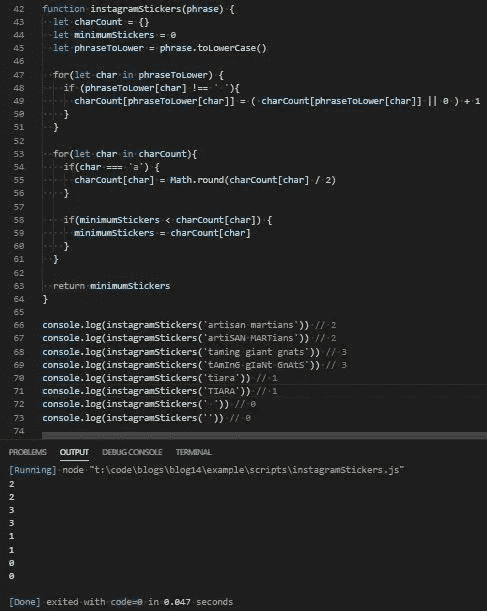

# JavaScript 问题解决者:Instagram 贴纸

> 原文：<https://levelup.gitconnected.com/javascript-problem-solvers-instagram-stickers-749df57ecba4>

## 案例 001:制作勒索信

我在申请脸书的发现生产工程项目时，遇到了这个问题，作为一个代码挑战。我真的很难在给定的时间内找到解决方案。后来，我很快意识到我需要提高我解决技术问题的技能，并开始研究 LeetCode。

我也有了写博客的想法，写一些我遇到并解决的更有趣的问题，Instagram 贴纸是开始的一个，使它成为一个好问题。

所以让我们开始解决。

## 问题是

```
I am at a carnival, and I found a stand that sells Instagram stickers. I want to see how many stickers I would need to buy in order to create a phrase or word. The phrase I want to create only contains letters from the stickers I can buy.For instance, I would need to buy 2 stickers in order to create the phrase ‘**artisan martians**,’ 3 stickers to create the phrase ‘**taming giant gnats**’ and 1 sticker to create the word ‘**tiara**’.
```

## 崩溃

首先，这个问题没有遵循通常的 HackerRank 或 LeetCode 公式，也没有给我们测试用例和解释的约束，所以我们不得不利用现有的东西。

首先，让我们将问题分解成一些更容易消化的语言，并确保我们理解它:

```
Return the minimum amount of times the string ‘instagram’ would need to be repeated to create a given string.
```

我认为这更容易理解，有助于我们找到起点。

我想到的第一个想法是遍历给定的字符串，并构建一个对象来记录字符串中的字符数。

然后，遍历字符频率对象，并对出现次数最多的字符进行连续计数。

我们希望找到出现次数最多的字符，因为出现次数最多的字符也是我们为了创造给我们的短语而必须购买的最少的贴纸。

这是因为除了出现两次的字母`*a*`之外，单词`*instagram*`由单数字符组成。例如，如果我们想创建短语`*nmmmmmns*`，我们需要购买 6 个 Instagram 贴纸，因为单词`*instagram*`只包含 1 个`*m*`，而短语包含 6 个`*m*`*s。*

*问题是如果我们有一个短语有两个以上的`*a*`，例如，短语`*mans*`只需要一个标签。短语`*maans*`仍然只需要一张贴纸，因为单词`*instagram*`中有两个`*a*`。*

*但是如果我们有短语`*maaans*`，我们现在需要 2 个标签，因为短语有 3 个`*a*`。短语`*maaaans*`仍然只需要 2 个标签，但是短语`*maaaaans*`需要 3 个标签，以此类推。*

*解决这个问题的方法是将`*a*`在给定字符串中出现的次数除以 2，并将被除数四舍五入到最接近的整数。由于我们将使用对象中的值来确定我们需要购买的`*instagram*`贴纸的最大数量，我们将在对象中获得不成比例的`*a*`数量。*

*当我们循环遍历字符的频率计数器时，我们可以对此进行调整，如果键是`*a*`，将其值除以 2，然后将其四舍五入为最接近的整数，并替换`*a*`的值。*

*这是最让我犯错误的部分。*

## *边缘案例*

*我们唯一知道的是，这个字符串是仅使用单词`*instagram*`中的字符构建的。因此，我们将不得不根据问题呈现给我们的方式做出一些假设:*

```
*1.) The given string is empty (‘ ’ or ‘’)*
```

*因为我们处理的是字符串中的字符，所以我们只需要考虑`‘ ’`或`‘’`，而不用担心像`undefined`或`null`这样的错误语句。如果需要的话，我们可以用一个 if 语句来解决这个问题，但是按照我们考虑频率计数器对象的方式，一个空字符串将产生一个空对象，我们的运行计数将保持为 0。*

```
*2.) The given string has lower and uppercase letters, or consists of only uppercase letters*
```

*在构建我们的字符频率计数器之前，我们可以用`.toLowerCase()`将任何给我们的字符串转换成小写字母。*

```
*3.) The given string consists of multiple words and contains blank characters or spaces*
```

*我们可以在构建字符计数对象的循环中编写另一个 if 语句，该对象不包含空格。*

*我们不用担心数字或特殊字符(！, ?，=，+，/，&，@，等等……)因为我们被告知我们想要创建的字符串只包含单词`*instagram*`中的字母，这很好。*

## *伪代码*

*既然我们已经分解了问题并理解了它，找出了潜在的解决方案并探索了一些边缘情况，那么让我们根据我们目前已经找到的内容编写一些伪代码:*

*我认为我们的伪代码看起来相当不错，所以让我们把它付诸实践，看看它是否可行。*

## *评论*

*首先让我们定义我们的函数，我们的变量:*

*很简单。不需要额外的评论。*

*接下来，我们可以编写构建频率计数器的`for in`循环:*

*然后，我们可以编写我们的`for in`循环，它遍历我们的频率计数器，归一化它的值，并设置我们的`minimumStickers`变量。我们还可以添加我们的`return`语句，变量`minimumStickers`:*

*如果我们用提供的三个测试案例以及一些边缘案例来测试我们的解决方案，我们应该会得到我们想要的结果:*

**

*太棒了。*

## *最终解决方案*

*让我们最后看一下不带注释的解决方案，并清理一些语法:*

## *任务完成*

*我写这些博客的方式将遵循一个循序渐进的公式。一旦我开始钻研 LeetCode，我做的最重要的事情就是改变我解决每个问题的方法。*

*我过去常常立即投入到编写代码中，尽我所能，并试图强行找到解决方案。*

*最终我意识到这是多么的低效，并且在我写任何代码之前，慢慢地开始在我的方法中增加步骤。*

*现在，我花同样多的时间来确保我理解我所面临的问题，找出边缘情况并编写伪代码，就像我写实际代码并查看它是否工作一样。*

*这对我来说是一个巨大的进步，我越是将这种方法付诸实践，我就越觉得自己在解决问题的能力上有所提高。*

*我很清楚我的解决方案不会是最好或最有效的。这篇和以后的博客的焦点更多的是关于解决问题的动力，以及如何将一个问题分解成更小的步骤来找出我们可以编写的代码，而不是寻找时间和空间复杂度最低的解决方案。*

*我希望它能帮助你或其他人找到解决他们遇到的问题的方法……在这个我们称之为 JavaScript 的漫长而精彩的旅程中。*

*注意安全。保持健康。继续为正义而战。*

*[](https://skilled.dev) [## 编写面试问题

### 一个完整的平台，在这里我会教你找到下一份工作所需的一切，以及…

技术开发](https://skilled.dev)*