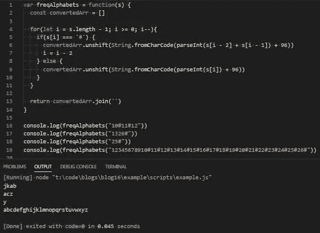

# JavaScript 问题解决程序:整数到字符串解密

> 原文：<https://levelup.gitconnected.com/javascript-problem-solvers-integer-to-string-decryption-bbb97a83122e>

## 案例 003:字母数字汤

我遇到的一个更普遍的问题是关于基本解密的。也许解密不是我们今天要解决的问题的最佳术语，但他们是这么称呼它的。所以我要坚持下去。

这不像是我们在解决我们在黑暗网络上发现的一些秘密信息，或者入侵这个星球什么的。无论哪种方式，在原始数据类型之间进行强制转换都是一个需要理解的重要概念，我们今天讨论的问题为我们提供了一个很好的介绍。

所以让我们开始解决。

## 问题是

[这里是 LeetCode 上问题的链接](https://leetcode.com/problems/decrypt-string-from-alphabet-to-integer-mapping/)

```
Given a string s formed by digits (‘0’ — ‘9’) and ‘#’.We want to map s to English lowercase characters as follows:Characters (‘a’ to ‘i’) are represented by (‘1’ to ‘9’) respectively.Characters (‘j’ to ‘z’) are represented by (‘10#’ to ‘26#’) respectively.Return the string formed after mapping.It’s guaranteed that a unique mapping will always exist.Constraints:
  1 <= s.length <= 1000
  s[i] only contains digits letters (‘0’-’9’) and ‘#’ letter
  s will be valid string such that mapping is always possibleTest Cases:
  freqAlphabets(“10#11#12”) => ‘jkab’
    Explanation:
      “10#” => “j” , “11#” => “k” , “1” => “a” , “2” => “b”. freqAlphabets(“1326#”) => ‘acz’
    Explanation:
      “1” => “a” , “3” => “c” , “26#” => “z” freqAlphabets(“25#”) => ‘y’
    Explanation:
      “25#” => “y” freqAlphabets(“12345678910#11#12#13#14#15#16#17#18#19#20#21#22#23#24#25#26#”)) => ‘abcdefghijklmnopqrstuvwxyz’
    Explanation:
      (self explanatory)
```

## 崩溃了

我认为这个问题解释得很好，很好地阐明了对我们的要求。但像往常一样，让我们调整一些措辞，以确保我们理解我们需要做什么:

```
Given a string s formed by digits (‘0’ — ‘9’) and ‘#’, write a function called freqAlphabets that accepts a string as an argument.This string consists of numbers where characters ‘a’ through ‘i’ are represented by numbers ‘1’ through ‘9’, and characters ‘j’ through ‘z’ are represented by numbers ‘10#’ through ‘26#’.Return a new string that converts each number into it’s proper alphabetic character.
```

有点啰嗦，但是我们得到了一些给我们指明正确方向的术语，并且我们揭示了一些我们将需要适应工作解决方案的技术部分。

我们的一个约束告诉我们，字符串的最大长度应该是 1000 `(s.length <= 1000)`，最小长度是 1 `(1 <= s.length)`。虽然上限不是相对重要的，但下限是重要的，并且告诉我们不必担心长度为 0('或' ')的字符串。

我们也看到了`s[i] only contains digits letters (‘0’-’9’) and ‘#’ letter`。知道这一点也很好，因为它消除了我们可能会遇到的一些边缘情况。我们也不必担心输入字符串中会混入任何字母，或者字母是大写还是小写。我们也不必担心除了英镑符号之外的任何其他特殊字符，或者标签，如果你不像我一样老的话。这个东西:`#`

`s will be valid string such that mapping is always possible`的最后一个约束更多的是重申前两个约束的一般陈述，但也给了我们一个提示，告诉我们如何将每个数字强制转换成它的字母计数器部分。至少对我来说，*‘映射’*这个词在我脑海中拉响了警报，尖叫着*“啊哈！你想让我们在某处使用数组！我终于把你带到了我想要你去的地方！”虽然问题陈述本身提供了同样的暗示，但这种约束只是巩固了我的预感。*

所提供的测试用例向我们展示了我们的预期结果，并像往常一样给出了一些易于理解的解释(这也是我喜欢 LeetCode 的原因之一)，并向我们展示了我们的解决方案需要接受后面带有`#`的数字，并返回正确的字母。

## 边缘案例

为我们提供的约束很好地消除了我们在处理字符串时可能会遇到的一些更常见的边缘情况，并准确地做了约束应该做的事情。但不管怎样，浏览潜在的边缘案例以确保我们知道可以排除它们仍然是一个好主意:

```
1.) The input string is empty or blank
```

我们不必担心空字符串，因为我们的约束之一声明`1 <= s.length`

```
2.) The input string contains letters
```

由于我们的另一个约束，我们可以排除另一个边缘情况:`s[i] only contains digits letters (‘0’-’9’) and ‘#’ letter`

```
3.) The input string contains special characters
```

同样，我们有一个约束，允许我们排除这种边缘情况，输入字符串中出现的唯一特殊字符是' # '

```
4.) The input string is not a string
```

这更像是一种一般的边缘情况，但是再一次使用约束`s will be valid string such that mapping is always possible`，我们知道我们接受的 freqAlphabets 参数将总是一个字符串。

现在，我们已经彻底检查了提供给我们的所有信息，我们可以开始考虑如何解决这个问题。

## 嫌疑犯

我最终想出的解决方案有 3 个主要部分:

1.)遍历`s`的`for`循环，将`s`中的每个数字转换成正确的字母

2.)一个名为`convertedArr`的数组，存储`for`循环转换的字母

3.)将`convertedArr`连接到我们想要返回的新字符串的返回值

我们使用数组来存储由`for`循环转换的字母的原因是，我们不能内联进行转换，也不能用转换后的字母替换输入字符串中的每个数字。在 JavaScript 中，字符串是不可变的，这消除了我们为了节省内存而改变输入字符串的选项。

这也是我们需要在最后加入阵列的原因。每个转换后的字母将成为`convertedArr`中的一个元素，我们可以返回`convertedArr.join(‘‘)`来返回新的字符串。

我认为我们的解决方案中最棘手或者最有趣的部分是`for`循环，这取决于你的观点。通常，我们可以使用一个`.forEach()`或`for in`循环，从头到尾遍历字符串。问题在于我们的输入字符串的格式化方式，我们必须更明确地说明我们想要如何迭代输入字符串。

字母“j”到“z”由数字表示，数字后面有一个“#”，数字前面没有。这意味着如果我们从头到尾迭代，我们将不得不在每次迭代中向前看两个索引，以尝试找到一个“#”。虽然这是可行的，但事情可能会变得混乱，从头到尾迭代不是解决这个问题的最有效的方法。

相反，我们可以从字符串的末尾开始 for 循环，然后反向操作。如果我们找到一个' # '，我们所要做的就是获取当前索引处字符之前的两个字符，转换它们，然后从`i`中减去 2，以越过' # '符号并进入下一个数字。

for 循环的另一个有趣的部分是我们如何将每个数字转换成一个字母。

几乎所有将数字转换成字母的问题都涉及到数字的 HTML ASCII 码，你可以在这里找到:[https://www.w3schools.com/charsets/ref_html_ascii.asp](https://www.w3schools.com/charsets/ref_html_ascii.asp)

所有小写字母都有一个介于 97 和 122 之间的 ASCII 码。所有大写字母的 ASCII 码都在 65 到 90 之间。所有数字都有一个介于 48 和 57 之间的 ASCII 码。

这正是我们所需要的，JavaScript 也为我们提供了将数字转换成字母的完美方法。

如果我们想把一个数字转换成一个字母，我们可以用`fromCharCode(number)`

如果我们想把一个字母转换成一个数字，我们可以使用`charCodeAt(letter)`

虽然我们想使用`fromCharCode()`将每个数字转换成一个字母，但问题是输入字符串中的数字不是从 97 开始的。他们从 1 点开始。每个数字代表一个字母在字母表中的位置，而不是它在 ASCII 图表中的位置。没关系。我们所要做的就是在字符串中的每个数字上加 96，得到正确的 ASCII 码。

例如，如果我们的输入字符串是`s = ‘1’`，我们想要返回`a`，我们所要做的就是返回`String.fromCharCode(s + 96)`，它将返回 ASCII 码为 97 的字符，也就是`a`。我们还需要调用 String 原语上的`fromCharCode()`来从它返回的 ASCII 码创建一个新的字符串，所以每次我们调用`fromCharCode()`时，我们都需要通过调用`String.fromCharCode()`来完成。

另一个问题是我们为`String.fromCharCode()`提供的参数需要是一个整数。否则，JavaScript 将试图自动强制我们转换的每个字符，将会有一些非常不可靠的结果。最重要的是，我们得不到我们要找的信。

为了解决这个问题，我们可以先用`parseInt()`将字符串中的每个数字转换成整数，然后再进行转换。在每个数字被转换后，我们可以给它加上 96，然后用`String.fromCharCode()`把这个数字转换成一个字母。

**TLDR:** 我们将从头到尾遍历输入字符串，并使用其 ASCII 代码将每个数字转换为正确的字母。我们需要首先将每个字符(这是一个数字字符串)转换成一个整数，然后在其上加上 96，以便返回正确的字母。

如果一个字符是一个' # '符号，我们需要接下来的两个字母，并转换它们。然后，向前移动两个位置，到达下一个数字。我们还需要将每个转换存储在一个数组中，因为字符串是不可变的。

最后，我们需要将存储所有转换后的字母的数组转换回字符串，以便返回它。

## 伪代码

因为我觉得事情可能会开始变得混乱，所以让我们先写一些伪代码，以确保我们可以逐步完成正在发生的一切:

## 评论

让我们开始一步一步地编写代码，并以我们的伪代码为基础。

首先，让我们先了解一下基础知识，定义我们的`function`、我们的空`array`、我们的`for`循环和我们的`return`值:

接下来，让我们添加我们的`if`语句，以及它的条件的一些基本逻辑:

现在，让我们添加两位数的转换逻辑的其余部分:

最后，让我们修改两位数的逻辑来处理一位数:

如果一切按计划进行，我们应该会成功地通过我们的测试用例:



超级棒。

## 最终解决方案

让我们最后看一下不带注释的解决方案，并清理一些语法:

## 任务完成

我想这是我遇到的第一个处理 HTML ASCII 代码的问题。也许这是安慰剂效应或某种有意识的欺骗，但我觉得自从我第一次发现处理 ASCII 字符代码的问题以来，我越是看到它们到处出现，我就越是发现自己在参考 w3 学校图表。

除了' # '符号的有趣实现之外，我遇到的涉及使用`fromCharCode()`和`CharCodeAt()`的解决方案的问题的频率持续增加。接下来，我写了一篇关于它的博客。

再说一次，我写的关于解决 LeetCode 或 HackerRank 问题的博客并不是为了找到时间或空间复杂度最低的解决方案。他们的重点是为达成一致的解决方案而采取的步骤。

我很清楚我的解决方案不会是最好或最有效的。我只是希望他们能帮助你或你认识的人找到更好的方法来解决他们正在努力解决的问题。在这个旅程中，我们可能会经常遇到一个问题，我们称之为 JavaScript。

保持安全…保持健康…继续为正义而战。