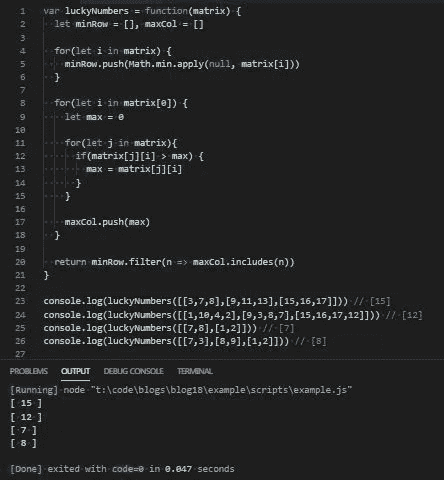

# JavaScript 问题解决者:矩阵中的幸运数字

> 原文：<https://levelup.gitconnected.com/javascript-problem-solvers-lucky-numbers-in-a-matrix-a2525986cdb4>

## 案例 005:服用红色药丸

如果你和我一样，听到这个词，你会想到这部电影。你会想到尼欧、特工史密斯、锡安和墨菲斯。你会想到黑色背景上一列列无法辨认的绿色文字。

`matrix`这个词通常会让人立即联想到极其复杂的事物，其错综复杂的本质已经到了难以理解的边缘。

但是当涉及到数学或编程时，`matrix`是一个相反的简单概念。我们不需要插上任何东西或者接听一个一直在响的电话来找出什么是`matrix`，但是今天的问题让我们很好地体验了 JavaScript 世界中的矩阵。

所以让我们开始解决。

## 问题是

[**这里是 LeetCode**](https://leetcode.com/problems/lucky-numbers-in-a-matrix/) 上问题的链接

```
Given a m * n matrix of distinct numbers, return all lucky numbers in the matrix in any order.A lucky number is an element of the matrix such that it is the minimum element in its row and maximum in its column.Constraints:
  m == mat.length
  n == mat[i].length
  1 <= n, m <= 50
  1 <= matrix[i][j] <= 10⁵.
  All elements in the matrix are distinct.Test Cases:
  luckyNumbers([[3,7,8],[9,11,13],[15,16,17]]) => [15]
   Explanation:
    15 is the only lucky number since it is the minimum in its row and the maximum in its column luckyNumbers([[1,10,4,2],[9,3,8,7],[15,16,17,12]]) => [12]
    Explanation:
      12 is the only lucky number since it is the minimum in its row and the maximum in its column luckyNumbers([[7,8],[1,2]]) => [7]
    Explanation:
      7 is the only lucky number since it is the minimum in its row and the maximum in its column***I added the next test case for a matrix that has more columns than rows luckyNumbers([[7,3],[8,9],[1,2]]) => [8]
    Explanation:
      8 is the only lucky number since it is the minimum in its row and the maximum in its column
```

## 崩溃了

首先让我们弄清楚什么是`matrix`的一些定义:

数学中的一个`matrix`是一组按行和列排列的矩形`array`数字、符号或表达式。数学中矩阵的概念可能会变得非常复杂，虽然很重要，但也超出了本博客的范围。如果你想更深入地了解数学中的矩阵， [**我建议查看我在谷歌上找到的第一个链接**](https://courses.lumenlearning.com/boundless-algebra/chapter/introduction-to-matrices/)

编程中的`matrix`是一个网格，用于以包含行和列的特定结构化格式存储一组数据。如果你有 HTML 的经验，一个`table`本质上就是一个`matrix`。有一些编程语言提供了对`matrix`数据类型的支持，使得对给定`matrix`的操作比使用类似`array`的东西更有效。编程中`matrix`更常见的用途之一是图形操作。CSS 带有一个`matrix3d`转换属性，您可以使用它在 3D 空间中操作 DOM 元素。

矩阵也用于在`graph`中存储关于`edge`和`vertice`的数据。我们也可以用一个`matrix`来表示存储在数据库中的信息。

JavaScript 没有任何对`matrix`的本地支持。作为一种变通方法，我们通常可以使用嵌套的`array`，父`array`中的每个元素都是包含一组整数的子`array`，根据`matrix`的用途，这些整数可以表示许多不同的东西。`matrix`的大小通常由`n * n`定义，第一个`n`定义嵌套在父`array`(或`matrix`中的列)中的`array`的数量，第二个`n`定义每个子`array`中有多少个元素(或`matrix`中的行数)。

例如，3x3 `matrix`看起来像这样:

```
[[1,2,3],[4,5,6],[7,8,9]]
```

在一个网格中，看起来像这样:

```
1 2 3
4 5 6
7 8 9
```

这意味着第一行由第一个嵌套的`array`表示，第二行由下一个嵌套的`array`表示，依此类推。`matrix`中的一行称为行向量，一列称为列向量。

我们在《黑客帝国》电影的介绍中所记得的那些黑色背景上的无法辨认的绿色文本列实际上只是矩阵中的列向量。在技术和理论意义上都是如此，因为它们应该代表矩阵中正在发生的事情。

一个`matrix`也不需要有等量的行和列。列数多于行数的`matrix`称为宽`matrix`。

这意味着我们可以有一个像这样的`matrix`:

```
[[1,2,3,4],[5,6,7,8],[9,10,11,12]]1  2  3  4
5  6  7  8
9 10 11 12
```

或者像这样的`matrix`:

```
[[1,2],[3,4],[5,6],[7,8]]1 2
3 4
5 6
7 8
```

这两个都是有效的。

所以，现在我们对什么是`matrix`有了一个清晰的定义，让我们把注意力重新集中到手头的问题上。

让我们首先将问题分解成更小的部分，这样我们就能确保理解对我们的期望:

```
Given a m * n matrix of distinct numbers, return all lucky numbers in the matrix in any order.
```

我们首先看到的东西之一是`m * n` `matrix`。基于上面的定义，我们知道`m * n`定义了传递给`function`的`matrix`的大小。这里的问题是，由于`matrix`的大小被定义为`m * n`而不是`n * n`，我们需要考虑行数或列数不相等的`matrix`。

我们得到的下一个重要的东西是`distinct numbers`，这意味着`matrix`中的所有元素都是唯一的。

我们也知道我们的预期输出应该是什么，这与 it 的要求相当宽松:`return all lucky numbers in the matrix in any order`

嗯，我们还不知道什么是幸运数字，但是不必按照特定的顺序排列`return`元素给了我们`function`如何操作的一些自由。

最后，我们得到一个幸运数字的定义:

```
A lucky number is an element of the matrix such that it is the minimum element in its row and maximum in its column.
```

这是不言自明的。

我唯一的问题是，如果`matrix`中的所有数字都是唯一的，我们不是总能得到 1 个幸运数字吗？

我不知道。

我们的约束给了我们一些更有用的信息，但似乎只是进一步概述了问题解释中已经解释的内容:

```
m == mat.length
```

这有助于我们理解，如果`m * n`定义了`matrix`的大小，那么`m`就等于嵌套`array`中 sub `array`的数量，这也代表了矩阵网格中的列数。

```
n == mat[i].length
```

类似于上面的约束，因为`m * n`定义了`matrix`的大小，那么`n`等于每个子`array`中的元素数量，这也表示矩阵网格中的行数。

```
1 <= n, m <= 50
```

这里我们得到了在给定的`matrix`中我们应该期望的行数和列数的范围。`1 <= n`告诉我们，我们期望的最小行数是 1，`m <= 50`告诉我们，我们期望的最大列数是 50。

这也意味着`matrix`中的行数和列数相互独立。我想说它们是线性无关的，但是看完线性无关，我承认我不确定。

```
1 <= matrix[i][j] <= 10⁵.
```

`matrix[i]`代表矩阵中的每个子`array`，或每个行向量。`matrix[i][j]`表示`matrix`中每个数字的计算成员访问表示。我们得到一个下限，这里的`1 <= matrix[i][j]`，意味着在给定的`matrix`中没有一个数会是 0。我们还得到一个上限，这里的`matrix[i][j] <= 10⁵`，意味着给定`matrix`中的最大数将是 100，000。

我们还从`matrix[i][j]`中得到一个小提示，这意味着我们需要在某个地方使用嵌套循环。

```
All elements in the matrix are distinct.
```

这很有帮助，允许我们排除相同数字的布尔比较。

我们的测试用例也相当简单，因为我们正在`return`处理一组数字，我们看到我们应该`return`处理`array`。但是我们的测试用例的所有预期结果都是只有一个元素的。这是我又一次觉得奇怪的事情，并且回避了这个问题“既然给定的`matrix`中的所有数字都是唯一的，难道不会只有一个幸运数字吗？”

我不知道，我们继续吧。

## 边缘案例

```
1.) A row or column vector contains a 0
```

这是我们不必担心的事情，因为我们有一个约束`1 <= matrix[i][j]`

```
2.) A sub array is empty
```

再一次，由于给定了两个约束，我们不必担心这个问题:`n == mat[i].length`和`1 <= n`

```
3.) Two numbers in the array are equal
```

同样，这是一个我们不必担心的边缘情况，因为它被我们的一个约束所覆盖:`All elements in the matrix are distinct.`

```
4.) There are more row vectors than column vectors or visa versa
```

这就是事情变得有点奇怪的地方。我们被特别给定了大小为`m * n`的矩阵，以及`m == mat.length`和`n == mat[i].length`。

如果不是这种情况，并且给我们一个大小为`n * n`而`n == mat.length`的矩阵，我们就能够将特定的操作(我将在下一节解释并指出)组合在一起。但是因为我们需要适应不同行和列长度的矩阵，我们将不得不把事情分开。

```
5.) An element in the parent array is not an array, or an element in a sub array is not a number
```

这个问题并不重要，但我想我会把它放在这里，因为这可能是一个在技术面试中问的好问题。

我们假设每个 sub `array`都是一个`array`，每个 sub `array`中的每个元素都是一个数字。这在问题的解释中没有具体说明。我们可以得到一个与`matrix`中 sub `array`的剩余部分长度相同的字符串，其中`m == mat.length`仍然为真，因为`mat.length`可能是一个字符串的长度。`mat[i]`将是字符串中的每个字符，这意味着`mat[i].length`将等于 1，因为每个字符的长度为 1。如果`mat`不是一个字符串，这仍然可以产生一个有效的`matrix`,如果 sub `array`被一个字符串替换，这可能会丢弃我们函数的结果。

为了简洁起见，我假设我们总是有子数组和数字。

现在，我们已经彻底检查了提供给我们的所有信息，我们可以开始考虑如何解决这个问题。

## 嫌疑犯

我提出了一些可能的解决方案，试图避免嵌套迭代，但最终我放弃了，提出了一个包含 3 个不同部分的解决方案。

```
1.) Find the smallest number in each row2.) Find the largest number in each column3.) Compare the smallest number in each row and the largest number in each column and when a match is found, it means it is a lucky number.
```

我最初想将前两部分结合在一起，同时在同一个嵌套循环中找到每行中的最小数字和每列中的最大数字。如果我们将`matrix[i][j]`的计算成员访问操作符切换到`matrix[j][i]`，我们可以同时遍历每一列及其对应的行。

如果每个矩阵的大小都是`n*n`的话，这是可行的。但事实并非如此。它们的尺寸是`m*n` 。这意味着如果`matrix`中的列向量的数量不等于行向量的数量，传统上我们不能将两种搜索算法结合到同一个函数中。

因此，让我们分别讨论每一部分:

```
1.) Find the smallest number in each row
```

这相当简单。我们需要找到每行中最小的数字，因为它是幸运数字的特征，并将它们存储在名为`minRow`的`array`中。我们需要将每个数字存储在`minRow`中，这样我们就可以将它的每个元素与我们为每一列找到的最大数字进行比较。我们可以用一个简单的`for`循环或者一个`for…in`循环来实现，这个循环遍历整个`matrix`并将每个数字与`Math.min()`进行比较。我们可以通过调用`Math.min.apply()`来避免在这里嵌套循环。`.apply()` `function`很有趣，因为它调用了`function`并重新分配了`this`变量，但是需要一个数组来传递参数。

在`Math.min()`上调用`.apply()`会自动找到我们传递给它的任何`array`中最小的数字。

如果我们在每次迭代中调用`Math.min.apply()`，并将当前正在迭代的 sub `array`传递给`Math.min.apply()`，那么我们可以将结果`push`传递给`minRow`。

这有效地避免了嵌套一个`for`循环来寻找每一行的最小数字，我们可以进入下一步:

```
2.) Find the largest number in each column
```

我们不能遵循寻找每一行中最小数字的相同方法，因为我们将遍历和比较不同子`array`中的元素

为了找到每一列中的最大数字，我们将(但不是必须)求助于嵌套一个`for`循环。

我知道，我也讨厌它。

首先，我们将想要定义另一个名为`maxCol`的空`array`。这个`array`将在每一列中存储最大值，这样我们以后可以使用它，并将它的元素与`minRow`中的元素进行比较。

然后我们可以设置一个`for`循环或者一个`for…in`循环，变量叫做`max`，并设置为 0。这将记录一列中最大的数字。然后，我们可以建立一个嵌套的`for`循环或`for..in`循环，将`max`与一列中的每个数字进行比较，或`matrix[j][i]`，如果一列中的数字较大，则替换`max`的值。

在每次迭代结束时，我们可以将`push` `max`转换成`maxCol`。由于我们将`max`的值硬编码为 0，并在嵌套的`for`循环的`scope`之外定义它，因此`max`将在每次迭代中自动重置为 0。

这使我们进入了函数的最后一部分:

```
3.) Compare the smallest number in each row and the largest number in each column and when we find a match, we find a lucky number
```

我们可以通过在`minRow`上调用`.filter()`，然后在`.filter()`调用中调用`maxCol`上的`.includes()`，从技术上避免另一个嵌套循环。我说技术上是因为`.includes()`在技术上仍在重复`maxCol`。无论哪种方式，这都应该从`minRow`中删除任何在`maxCol`中找不到的数字，这意味着我们可以返回对`minRow`的`.filter()`调用的结果，并得到我们想要的结果。

## 伪代码

因为要经历很多，可能很难想象，所以让我们从不同的角度来看我们潜在的解决方案，并编写一些伪代码:

## 评论

让我们开始一步一步地编写代码，并以伪代码为基础:

首先，让我们定义我们的函数`luckyNumbers`，以及我们的`minRow`和`maxCol` `array` s:

接下来，让我们定义两个`for..in`循环(您也可以使用普通的`for`循环),我们将使用这两个循环来查找每行中的最小数字和每列中的最大数字:

然后，让我们将逻辑添加到第一个`for…in`循环中，该循环将查找每行中的最小数字:

然后我们可以设置第二个`for..in`循环以及`max`变量和嵌套的`for…in`循环:

然后，我们可以将逻辑添加到嵌套的`for…in`循环中，查找每列中的最大数字，并将`push` `max`添加到`maxCol`:

最后，我们可以返回对`minRow`的`.filter()`调用，过滤掉没有同时出现在`minRow`和`maxCol`中的任何数字:

如果我们运行我们的解决方案，我们应该通过我们的测试用例:



## 最终解决方案

让我们最后看一下不带注释的解决方案，并清理一些语法:

超级骗子。

## 任务完成

如果您不熟悉矩阵，它可能会成为一个相当令人困惑或令人不知所措的话题。永远记住，它们远没有你想象的那么复杂，在 JavaScript 的世界里，矩阵只是一堆嵌套的数组。

再说一次，我写的关于解决 LeetCode 或 HackerRank 问题的博客并不是为了找到时间或空间复杂度最低的解决方案。他们关注的是解决问题的步骤。

我当然明白我的解决方案不会是最好的或最有效的，但不管怎样，我希望它们能帮助你或其他人找到一种方法来解决你在这个旅程中遇到的问题，我们称之为 JavaScript。

保持安全…保持健康…继续为正义而战。

[](https://skilled.dev) [## 编写面试问题

### 一个完整的平台，在这里我会教你找到下一份工作所需的一切，以及…

技术开发](https://skilled.dev)