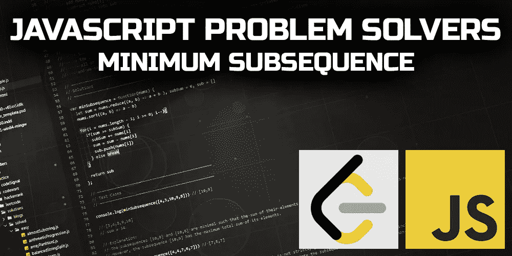
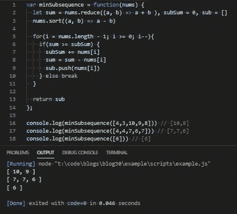

# JavaScript 问题解决程序:最小子序列

> 原文：<https://levelup.gitconnected.com/javascript-problem-solvers-minimum-subsequence-71216e07dd2f>

## 案例 013:你就这么整理？



子序列一直是一个让我有点困惑的概念。我不知道为什么。但是和任何事情一样，我花在后续工作上的时间越多，我就越能慢慢地学习和适应它们。

无论哪种方式，我们今天要解决的问题乍看起来可能很复杂，并将为我们的批判性思维技能提供一个很好的挑战(希望如此)。

所以，让我们开始解决。

## 问题是

[**这里是 LeetCode**](https://leetcode.com/problems/minimum-subsequence-in-non-increasing-order/) 上问题的链接

```
Given the array nums, obtain a subsequence of the array whose sum of elements is strictly greater than the sum of the non included elements in such subsequence.If there are multiple solutions, return the subsequence with minimum size and if there still exist multiple solutions, return the subsequence with the maximum total sum of all its elements. A subsequence of an array can be obtained by erasing some (possibly zero) elements from the array.Note that the solution with the given constraints is guaranteed to be unique. Also return the answer sorted in non-increasing order.
```

## 制约因素

所提供的约束并没有真正产生任何值得注意的信息，但是像往常一样，让我们仔细检查每个约束，看看我们是否能发现任何解决方案的线索:

```
1 <= nums.length <= 500
```

第一个约束给了我们在`nums`数组中应该期望的数字范围。有了`1 <= nums.length`的下限，我们就不用担心`nums`是空的或者没有任何元素了。除了我们需要迭代的最大元素数量之外，`nums.length <= 500`的上限也没有给我们任何特殊的信息。

```
1 <= nums[i] <= 100
```

第二个约束是`nums`中元素的范围。我们了解到我们不必处理任何负数，或者如果`nums`中的元素是 0，因为`nums`中元素的下限是`1 <= nums[i]`。有了`nums[i] <= 100`的上限，我们也不用担心什么真正大的数字了。相对来说，100 的上限是相当小的。

## 测试

## 崩溃了

这个问题有很多小部分，如前所述，可能会使`minSubsequences`看起来很复杂。但是，像往常一样，如果我们仔细阅读提供给我们的每一条信息，我认为我们可以简化和组织事情，使一切更容易理解:

```
Given the array nums
```

我们的参数`minSubsequences`总是一个数组，它的元素总是整数。很简单。

```
obtain a subsequence of the array whose sum of elements is strictly greater than the sum of the non included elements in such subsequence.
```

这就是事情开始变得有点棘手的地方。

这是我们的任务。我们需要在`nums`中找到一组数字，如果我们将该组中的所有数字加在一起，总和将大于`nums`中未包含在该组中的其余数字。

这告诉我的第一件事是，我们必须保存我们正在构建的子序列的运行总和，并从`nums`中的元素总和中减去该运行总和。

```
If there are multiple solutions, return the subsequence with minimum size
```

我们可能会有这样的场景，其中`nums`将有多个不同大小的子序列。这可能意味着我们必须跟踪我们找到的每个子序列，并将每个子序列放入一个数组中以便进行比较。也就是说，如果我们想跟踪每个子序列。

```
...if there still exist multiple solutions, return the subsequence with the maximum total sum of all its elements.
```

这给了我一个惊人的线索。如果我们按照非降序(或者从低到高)对`nums`进行排序，我们可以避免跟踪我们找到的每个子序列。然后我们可以从最后一个元素到第一个元素(或者向后)遍历排序后的`nums`。

这将允许我们找到 nums 中任何子序列的最小大小和最大总和的子序列。

例如，如果我们看一下测试用例 1:

```
[4,3,10,9,8]
```

并以非递减顺序对测试用例#1 进行排序:

```
[3,4,8,9,10]
```

我们可以从最后一个元素 10 开始遍历`nums`,并向后工作:

```
1st iteration:
subsequence : [10]
subsequence sum: 10
nums sum: 34
elements in nums not included in subsequence: [3,4,8,9]
nums sum excluding subsequence sum: 24
```

~

```
2nd iteration:
subsequence : [10, 9]
subsequence sum: 19
nums sum: 34
elements in nums not included in subsequence: [3,4,8]
nums sum excluding subsequence sum: 15
```

在第二次迭代中，我们已经找到了一个子序列，它的和大于`nums` : `[10, 9]`中其余元素的和

因为我们已经按非降序对`nums`进行了排序，`[10,9]`是这样一个子序列，当一个子序列的总和严格大于未包含元素的总和时，它的长度等于所有可能子序列的最小可能大小。我们知道这一点，因为任何其他子序列都需要至少 2 个元素。

并且由于排序后的`nums`数组是按非降序排序的，`[10,9]`也是最小的子序列，当一个子序列的和严格大于未包含元素的和时，其和是所有可能子序列的最大和。

所有其他可能的子序列必须至少有 2 个元素，即使它们有，它们的总和也不可能大于`[10,9]`，因为`[10,9]`是`nums`中最大的两个数字。

我想我们已经有所发现了。

```
A subsequence of an array can be obtained by erasing some (possibly zero) elements from the array.
```

我会忽略这条信息。这对于替代解决方案可能是有用的，但是对于我上面开始概述的潜在解决方案来说，它仍然是不相关的。请记住，这是我第一次传递提供给我们的信息。

```
Note that the solution with the given constraints is guaranteed to be unique.
```

这告诉我，我们将永远只返回一个子序列。`nums`的每个实例只会有 1 个答案。这有助于加强我之前解释的内容，因为上面的排序和向后遍历排序后的`nums`的解决方案只会构建 1 个子序列。

```
Also return the answer sorted in non-increasing order.
```

这就是问题所在。如果我们按非降序对`nums`进行排序，然后从最后一个元素到第一个元素(或向后)遍历排序后的`nums`，我们可以通过将每个数字推入一个空数组来构建最小大小、最大总和的子序列。这将自然地把它们按非递增顺序排序。

## 嫌疑犯

我们通过`nums`在每次迭代中执行各种操作的顺序将会很重要。可能使`minSubsequences`看起来更令人困惑的是，问题的解释给了我们很多信息，这些信息与我们需要如何执行每个部分有关，都是无序的。

正因为如此，我将按照我们必须做的顺序列出我们迭代`nums`时必须做的每一件事，并为每一部分提供一些解释。然后，我们可以通过一些伪代码来更好地了解我们的解决方案需要如何工作:

```
1.) Find the total sum of nums, store it as a variable named sum
```

首先，我们需要一个起点。在我们做任何事情之前，我们需要找到`nums`的总数`sum`。因为我们需要从总数`sum`中减去我们正在构建的子序列的总和，所以我们需要将`sum`存储为一个变量。

在我们做任何事情之前，有几种不同的方法可以找到`nums`的总和，但是我将使用`.reduce()`。

```
2.) Create 2 extra variables: sub (an empty array), and subSum (an integer)
```

我们需要一个空数组来构建我们的子序列，我们可以称它为`sub`。我们还将在解决方案的最后返回`sub`。

当我们遍历排序后的`nums`时，我们希望将`nums`中的元素推送到`sub`中，它将被初始化为一个空数组。

我们还需要另一个名为`subSum`的变量来跟踪我们构建到`sub`中的子序列的总和。在每一次迭代中，我们都希望将`nums[i]`(或每个元素)推入`sub`，并将`nums[i]`添加到`subSum`。

```
3.) Sort nums in non-decreasing order
```

我们需要将`nums`中的元素从最少到最多排序。我们不需要把它保存到一个变量中，因为`.sort()`会改变它所调用的数组。

```
4.) Iterate through nums (which is now sorted) backwards
```

为了找到最小的、最大总和的子序列，我们可以向后遍历排序的`nums`，从数组中的最后一个元素(现在是最大的数字)开始到第一个元素(现在是最小的数字)。

```
5.) On each iteration, check to see if sum is greater than or equal to subSum
```

在每次迭代中，我们将检查`sum >= subSum`是否。如果不是，那么我们必须继续寻找一个`nums`的子序列，它的和大于`nums`中未包含元素的和。

这意味着我们将不得不做很多事情:

```
5a.) Add nums[i] to subSum
```

这将基于排序后的`nums`中的每个元素增加`subSum`。在每次迭代中，如果`subSum`小于`sub`，我们希望将`nums[i]`推入`sub`，直到我们找到一个数字集合，其总和大于`nums`中未包含元素的总和。

```
5b.) Subract nums[i] from Sum
```

当`subSum`小于`sum`时，我们还想从`sum`中减去`nums[i]`。这将跟踪我们继续从构建的子序列中排除的数字的总和。

```
5c.) Push nums[i] into sub
```

这建立了我们的子序列。我们想在`subSum`小于`sum`的时候继续建造`sub`。一旦`subSum`大于`sum`，我们就发现一个子序列，它的元素之和大于未包含元素之和。

```
6.) Break out of the iteration once sum is less than subSum
```

一旦我们发现子序列的元素之和大于未包含元素之和，我们就不再需要继续遍历排序后的`nums`。这意味着我们可以打破`for`循环。

```
7.) Return sub
```

因为我们已经按非降序对`nums`进行了排序，并且因为我们正在对排序后的`nums`进行反向迭代，所以一旦我们找到了元素之和大于未包含元素之和的子序列，我们也就找到了最小/最大和子序列。

将代表子序列，所以我们可以返回它。

## 这个计划

在我们编写任何代码之前，让我们编写一些伪代码来更好地可视化我们的解决方案:

## 代码

好吧，让我们试着将我们的解决方案付诸实践，看看是否可行:

首先，让我们首先定义我们将需要的 3 个变量:`sum`、`sub`和`subSum`:

我们也来排序一下`nums`:

接下来，让我们设置将向后遍历`nums`的`for`循环:

然后我们可以添加`if`语句来检查`sum`是否大于或等于`subSum`。如果不是，则退出迭代:

然后，我们可以添加我们的三个操作:将`nums[i]`添加到`subSum`，从`sum`中减去`nums[i]`，并将 `nums[i]`推送到`sub`:

最后，我们可以添加我们的返回值`sub`:

让我们看看它是否有效:



很好。

## 最终解决方案

让我们最后看一下不带注释的解决方案，并清理一些语法:

[**LeetCode 提交明细**](https://leetcode.com/submissions/detail/382295671/)

## 任务完成

我真的很喜欢这个问题，因为它迫使我走出了我的舒适区。我觉得这个解决方案是我写过的最有效的解决方案之一，这无疑促使我在写解决方案之前先将它可视化。

我当然明白我的解决方案不会是最好的或最有效的，但不管怎样，我希望它们能帮助你或其他人找到一种方法来解决你在这个旅程中遇到的问题，我们称之为 JavaScript。

不管怎样，我希望你得到了一些有用的信息，希望你所有的函数都返回 true，所有的请求都用 200 来响应。

保持安全…保持健康…继续为正义而战。