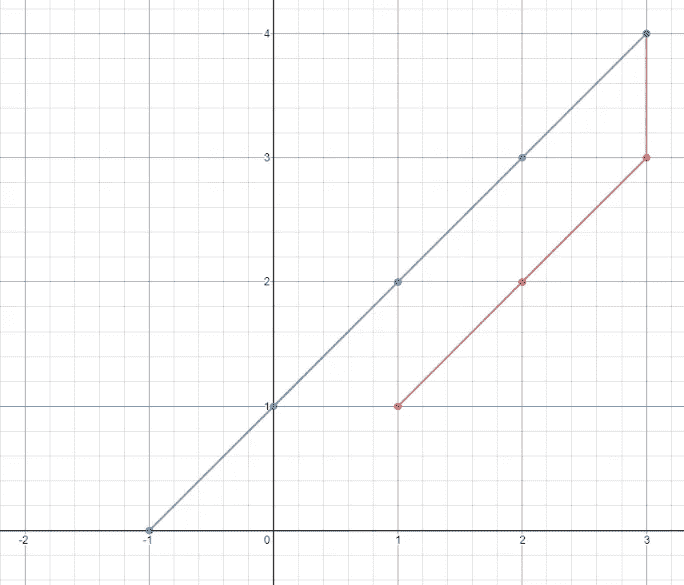
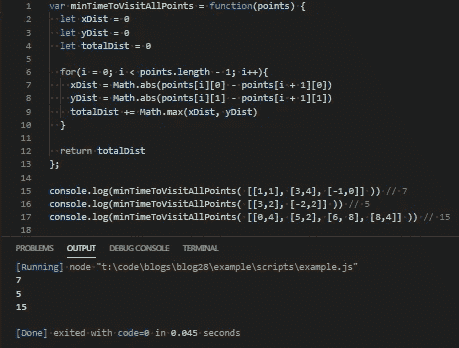
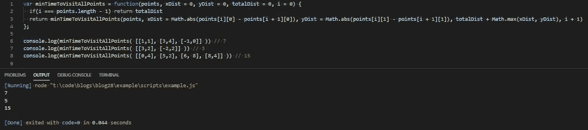

# JavaScript 问题解决者:访问所有点的最短时间

> 原文：<https://levelup.gitconnected.com/javascript-problem-solvers-minimum-time-visiting-all-points-bd9122929ce2>

## 案例 011:斜面上的蛇


我似乎陷入了一个嵌套数组、矩阵和模式匹配的网络。今天的问题不像上周的洋葱交换那样复杂，但从技术上讲，仍然涉及矩阵。从技术上来说，我们是在处理一个图表，但同时，我们不是。

我也一直在努力提高我的递归技能。我一直在练习的方法之一是回到我已经解决的问题，用递归重构它们。所以，在这篇博客的最后，我也将提供一个使用尾部调用递归的解决方案。

不管怎样，让我们开始解决。

## 问题是

[**这里是 LeetCode**](https://leetcode.com/problems/minimum-time-visiting-all-points/submissions/) 上问题的链接

```
On a plane there are n points with integer coordinates points[i] = [xi, yi]. Your task is to find the minimum time in seconds to visit all points.You can move according to the next rules:
- In one second always you can either move vertically, horizontally by one unit or diagonally (it means to move one unit vertically and one unit horizontally in one second).
- You have to visit the points in the same order as they appear in the array.
```



## 制约因素

```
points.length == n
```

这实际上不是一个必要的约束，但是为下一个约束提供了一个定义。`n`只在问题的解释中使用，其他地方不使用。

```
1 <= n <= 100
```

这里我们得到了一个我们应该期望多少组点的范围，下限为 1，上限为 100。这告诉我们不必担心给定的数组是空的。

```
points[i].length == 2
```

我们得到一个静态值，它表示每组点将有多少个元素。每组点，或者说`points[i]`，应该有一个`x`值和`y`值，或者说`[x, y]`或者`points[i][x, y]`。我们可以使用这些信息来避免在我们的解决方案中嵌套迭代。

```
-1000 <= points[i][0], points[i][1] <= 1000
```

这给了我们坐标平面的大小，以及我们期望看到任何点的范围。`points[i][0]`是每组点的`x`值，`points[i][1]`是`y`值，这意味着我们需要考虑出现在`[-1000, -1000]`到`[1000, 1000]`范围内的点。换句话说，整个飞机。

## 测试

## 崩溃了

剖析了我们的约束，观察了测试用例，让我们开始分解问题的解释，并弄清楚我们需要做什么:

```
On a plane there are n points with integer coordinates points[i] = [xi, yi].
```

这是问题的背景。`n`(或`points.length`)是二维图形(坐标平面)上的一组点，`points[i]`代表每组点。`points[i]`的元素是每个点的`x`和`y`位置，`points[i][0]`是`x`位置，`points[i][1]`是`y`位置。由于约束`points[i].length == 2`，我们可以为`x`和`y`使用静态值。

```
Your task is to find the minimum time in seconds to visit all points.
```

显然，这是我们的任务。我们只需找到每组点之间的最短距离，从`points[0]`开始，到`points[points.length - 1]`结束。我说距离是因为我们在坐标平面上每秒只能移动 1 个单位。在下面的规则中，我们得到了更多关于时间如何与这个问题相关的信息。

```
In one second always you can either move vertically, horizontally by one unit or diagonally (it means to move one unit vertically and one unit horizontally in one second).
```

这就是为什么时间和距离是相对可互换的。速度是固定值 1。我们一次只能遍历坐标平面的一个点。

在两点之间沿对角线移动相当于同时增加或减少`points[i][0]`和`points[i][1]`。水平移动等于只递增/递减`points[i][0]`，垂直移动等于`incrementing/decrementing points[i][1]`。

```
You have to visit the points in the same order as they appear in the array.
```

这是一个比其他任何东西都更大的限制。它告诉我们，当索引时，我们必须遍历`points`中的元素。我们必须从头开始，一直走到最后。

由于我们一次只能移动 1 点，我们需要比较`points[i]`和`points[i + 1]`。我们严格处理相邻对。

## 嫌疑犯

基于对问题的解释和我们通过分解每个部分获得的额外信息，我提出了我们需要做的 6 件事:

```
1.) Iterate from 0 until i < points.length — 1
```

这是基本设置。我们需要使用一个`for`循环并遍历整个点集，这样我们就可以访问相对于`i`的下一个点集。我们需要将上限设置为`points.length - 1`，因为我们将访问`i`的下一个相邻元素。

```
2.) Find the distance between points[i][0] and points[i + 1][0]
```

由于我们可以对角移动，我们需要找到两组相邻点之间的最大差异。对于 x 轴，这是`points[i][0]`和`points[i + 1][0]`之间的差值。

不过，我们可能会遇到一个问题。如果`points[i + 1][0]`的值大于`points[i][0]`，我们将得到一个负的差值。我们不想那样。但是，我们可以通过找到`points[i][0]`和`points[i + 1][0]`之差的绝对值来解决这个问题。

```
3.) Find the distance between points[i][1] and points[i + 1][1]
```

这与步骤 2 相同，但针对的是每组点的`y`值。我们在步骤 2 中所做的一切都可以重新应用到步骤 3 中。

```
4.) Find the maximum of each difference
```

我们可以将`points[i][0]`和`points[i + 1][0]`之差的绝对值设置为超出范围的变量`xDist`。我们可以对`points[i][1]`和`points[i + 1][1]`之差的绝对值做同样的处理，并将结果设置为另一个超出范围的变量`yDist`。

然后我们可以比较`xDist`和`yDist`的值，找出哪个更大。

既然我们可以对角移动，唯一重要的是我们需要纯粹水平或垂直走多少步。如果`points[i][0] === points[i][1]`，我们可以在两点之间旅行的整个时间内一直走对角线，差异并不重要。但是一旦`points[i][0] !== points[i][1]`开始，我们将需要至少水平或垂直移动一次，而不要对角移动。这就是为什么`x`和`y`值之间的最大差值也代表两点之间的最小距离。

```
5.) Add the maximum difference of each pair to the total
```

一旦我们比较了`xDist`和`yDist`并发现哪个更大，我们就可以把它加到总距离变量`totalDist`中。

```
6.) Return the total amount of distance between each set of points.
```

一旦我们迭代了整组点，找到了每组点的差值的绝对值，找到了最大差值并将最大差值加到总距离上，`totalDist`应该等于访问所有点的最小时间，我们可以`return` `totalDist`。

## 伪代码

让我们采取我们列出的 6 个步骤，并将其浓缩成一些更容易理解的伪代码:

## 代码

我们的伪代码看起来不错，让我们开始写一个解决方案。

首先，让我们定义三个变量`xDist`、`yDist`和`totalDist`。然后，设置`for`循环的基础:

接下来，我们可以添加逻辑来将`xDist`和`yDist`重新分配给每组点的`x`和`y`值的绝对差值:

然后，在每次迭代结束时，我们可以将`xDist`和`yDist`的最大值加到`totalDist`:

最后，添加我们的`totalDist`的`return`值:

如果我们针对 3 个测试用例运行我们的解决方案，我们应该可以毫无问题地通过所有测试:



很好。

## 递归

正如所承诺的，这里是我们使用尾部调用优化的解决方案的递归版本。我不会在这里讲太多细节，因为递归是另一个棘手的问题，但是我会概述一些我们必须要做的基本重构。

我们可以设置我们的基本情况等于我们的`for`循环的上限。当我们遇到基本情况时，我们希望:

然后，我们要使用 3 个变量来跟踪距离(`xDist`、`yDist`、`totalDist`)，将它们添加到函数的参数中，并将它们的默认值设置为 0。我们还想添加默认值为 0 的`i`:

最后，我们要`return`我们的递归`function`调用。因为我们想要使用尾部调用递归，所以我们需要确保我们没有在每次递归调用时创建新的本地执行上下文。我们可以通过更新递归调用参数中的每个变量来做到这一点:

如果我们对我们的 3 个测试用例运行我们的递归解决方案，我们应该再次通过它们:



很好。

## 最终解决方案

让我们最后看一下不带注释的解决方案，并清理一些语法:

非递归:

[**LeetCode 提交明细**](https://leetcode.com/submissions/detail/379052930/)

递归:

[**LeetCode 提交明细**](https://leetcode.com/submissions/detail/381828155/)

看起来递归解决方案要快一点。有意思。

## 任务完成

虽然`minTimeToVisitAllPoints`不是最复杂的问题，但我觉得我们提出的解决方案足够有趣，值得分享，用尾部调用递归重构它也足够有趣。

递归可能是一个很难解决的话题，对我来说仍然有点神秘，所以我认为在每个博客中加入一点递归(如果适用的话)对我来说是一个练习和提高的好方法。

我当然明白我的解决方案不会是最好的或最有效的，但不管怎样，我希望它们能帮助你或其他人找到一种方法来解决你在这个旅程中遇到的问题，我们称之为 JavaScript。

不管怎样，我希望你得到了一些有用的信息，希望你所有的函数都返回 true，所有的请求都用 200 来响应。

保持安全…保持健康…继续为正义而战。