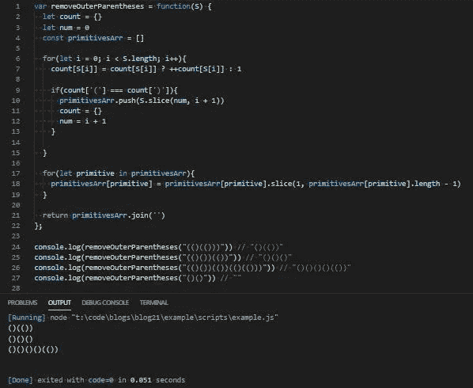

# JavaScript 问题解决程序:删除最外面的括号

> 原文：<https://levelup.gitconnected.com/javascript-problem-solvers-remove-outermost-parentheses-90381c24b2c6>

## 案例 008:亲子鉴定

与我们在本系列中解决的最后两个问题一样，我们今天试图解决的问题是一个相当简单的模式匹配练习，其中有一些巧妙的技巧。

这也是一个需要我动几下下巴才能弄清楚的问题，所以我觉得把它包含在这个系列中是个好主意。

所以，让我们开始解决。

## 问题是

[**这里是 LeetCode**](https://leetcode.com/problems/remove-outermost-parentheses/) 上问题的链接

```
A valid parentheses string is either empty (“”), “(” + A + “)”, or A + B, where A and B are valid parentheses strings, and + represents string concatenation. For example, “”, “()”, “(())()”, and “(()(()))” are all valid parentheses strings.A valid parentheses string S is primitive if it is nonempty, and there does not exist a way to split it into S = A+B, with A and B nonempty valid parentheses strings.Given a valid parentheses string S, consider its primitive decomposition: S = P_1 + P_2 + … + P_k, where P_i are primitive valid parentheses strings.Return S after removing the outermost parentheses of every primitive string in the primitive decomposition of S.Constraints:
  S.length <= 10000
  S[i] is “(“ or “)”
  S is a valid parentheses stringTest Cases: (()())(())” => “()()()”
  Explanation: The input string is “(()())(())”, with primitive decomposition “(()())” + “(())”. After removing outer parentheses of each part, this is “()()” + “()” = “()()()”. “(()())(())(()(()))” => “()()()()(())”
  Explanation: The input string is “(()())(())(()(()))”, with primitive decomposition “(()())” + “(())” + “(()(()))”. After removing outer parentheses of each part, this is “()()” + “()” + “()(())” = “()()()()(())”. “()()” => “”
  Explanation: The input string is “()()”, with primitive decomposition “()” + “()”. After removing outer parentheses of each part, this is “” + “” = “”.
```

## 崩溃了

好吧，这个问题的解释向我们抛出了很多信息，我觉得它把它试图解释的东西复杂化了。让我们像往常一样，尝试将问题的解释分成更小的部分，以确保我们理解这里发生了什么:

```
A valid parentheses string is either empty (“”), “(” + A + “)”, or A + B, where A and B are valid parentheses strings, and + represents string concatenation.
```

首先，给我们一个括号字符串的定义。根据所提供的信息，似乎有效括号字符串的最基本示例是将 1 个左括号和 1 个右括号组合成一个字符串，或者简称为“()”。

下一个`“(” + A + “)”`的例子告诉我们，我们也可以嵌套括号。如果`A`是一个有效的括号字符串，并且`“()”`也是一个有效的括号字符串，我们可以用`“()”`代替`A`，并将`“(“ + A + “)”`的例子简化为`“(())”`

`A + B`的最后一个例子展示了更多的嵌套。如果我们再次用`“()”`替换`A`，我们可以用第一个例子`“(” + A + “)”`或`“(())”`替换`B`。如果`A`是`“()”`而`B`是`“(())”`，我们可以假设`A + B`等于`“()(())”`，意味着`“()(())”`也是一个有效的括号字符串。

```
For example, “”, “()”, “(())()”, and “( () ( () ) )” are all valid parentheses strings.
```

这些例子有助于澄清定义。这里重要的补充是我们得到了另一个`“(()(()))”`的例子。但是，这只是嵌套在另一组括号中的`A + B`示例。所以，如果我们对它进行“逆向工程”:`“(()(()))”`也可以表示为`“(” + A + B + “)”`。

这里有一个模式需要注意:

有效的括号字符串总是有相等数量的左括号和右括号。

例如:

`“()” => 1 left parenthesis, 1 right parenthesis`

`“(())” => 2 left parentheses, 2 right parentheses`

`“()(())” => 3 left parentheses, 3 right parentheses`

`“(()(()))” => 4 left parentheses, 4 right parentheses`

这对我有意义。

```
A valid parentheses string S is primitive if it is nonempty, and there does not exist a way to split it into S = A+B, with A and B nonempty valid parentheses strings.
```

这似乎是问题解释中最令人困惑的部分。但它所解释的是，一个有效的括号字符串可以通过将其分成 2 部分`(A + B)`来缩减，并且`A`和`B`都必须包含至少 1 组括号。一旦它不能再被分割，就被认为是一个`primative`。

```
Given a valid parentheses string S, consider its primitive decomposition: S = P_1 + P_2 + … + P_k, where P_i are primitive valid parentheses strings.
```

这可能是问题解释中最不必要的部分，并且可能会陷入过度解释的境地，但是我不是一个对礼物吹毛求疵的人。

`S = P_1 + P_2 + … + P_k`的公式只是我们之前已经算出的公式的重新表示，如果这样更容易理解的话，可以重新定义为`S = A + B + … + Z`。`P_i`只是我们在一个有效的括号字符串中找到的每个分解的原语的一个表示。它所解释的是，如果需要的话，我们可以如何分解、拆分或分割一个深度嵌套的有效括号原语。

请记住我之前提到的模式，有效的括号字符串总是有相等数量的左右括号。我们可以使用这种模式将深度嵌套的有效括号字符串分解成它的原语。

```
Return S after removing the outermost parentheses of every primitive string in the primitive decomposition of S.
```

我们终于找到了我们所期望的`return`，这是一个字符串。我们还发现，对于在给定字符串中找到的每个分解后的原语，我们需要删除最外面的一组括号。

例如，如果我们回到我们的`“(” + A + B + “)”`或`“(()(()))”`示例。`“(()(()))”`已经被认为是一个分解的原语，因为我们不能将它分成两个独立的部分，并且仍然让这两个部分都是有效的括号字符串。a 将等于无效的`“(()” ,`，B 将等于同样无效的`“(()))”`。

因为它已经是一个`primitive`，我们可以去掉最外面的括号，返回`“()(())”`

因此，简而言之，我们需要将任何给定的输入字符串分解成其最原始的形式，并删除我们找到的每组括号中最外面的括号。

简单吧？嗯……算是吧。

## 制约因素

为我们提供的这三个约束稍微传统一点，但是将它们分解也总是好的，并且确保我们理解它们约束的是什么。我们还想寻找任何可能与潜在解决方案相关的暗示或线索:

```
S.length <= 10000
```

通常，我们期望在约束中得到一个下限和上限，无论是字符串，数组中的元素，还是其他。但是在这里，对于给定的输入字符串，我们只给出一个上限。这立即告诉我，我们将不得不容纳长度为 0 的空输入字符串。

```
S[i] is “(“ or “)”
```

这很有用，因为它告诉我们给定字符串中的任何字符都将是`“(”`或`“)”`，我们不必担心任何其他字母或特殊字符，也不必进行任何类型检查。在输入字符串为空的情况下，或者如果一个给定的字符串是`“”`，那么`S[i]`根本不存在，所以我们不能对空字符串应用这个约束。这意味着一个给定的字符串仍然可能是`“”`，仍然是我们必须考虑的。

```
S is a valid parentheses string
```

这个约束依赖于为我们提供的有效括号字符串的定义，并消除了我们可能遇到的任何错误处理，比如字符串是`“)(”`、`“()(())(”`还是简单的`“)”`。我们不必担心任何这样的突变，因为它们都不符合有效括号字符串的定义。

## 嫌疑犯

我认为我们已经花了足够的时间来检查我们所拥有的所有信息，我们最终可以开始找出一个解决方案。

让我们使用第一个测试用例来演示我们如何着手解决这个问题:

```
“(()())(())” => “()()()”Explanation: The input string is “(()())(())”, with primitive decomposition “(()())” + “(())”.After removing outer parentheses of each part, this is “()()” + “()” = “()()()”.
```

我们需要做的第一件事是把一个给定的字符串分割成它的分解原语。

我将从我学到的模式开始，其中有效的括号字符串总是有相等数量的括号。对于分解的原语来说，情况似乎也是如此。`“(()())”`和`“(())”`都有相同数量的左右括号。

这告诉我，我们可以遍历一个给定的字符串，并使用一个频率计数器来计算我们找到的左右括号的数量。一旦两个键的值相等，我们就可以把从字符串开头到迭代器所在的地方的所有东西都切片，并把它推到一个数组中。

例如，如果我们正在迭代`“(()())(())”`的第一个测试用例:

在第一次迭代中，我们找到`“(”`，将其添加到频率计数器，并将其值设置为 1:

```
i: 0
given string: “(()())(())”
characters iterated through: “(”
characters left: “()())(())”
count = { “(”: 1 }
```

在第二次迭代中，我们找到另一个`“(”`，并给它的值加 1:

```
i: 1
given string: “(()())(())”
characters iterated through: “((”
characters left: “)())(())”
count = { “(”: 2 }
```

在第三次迭代中，我们找到一个`“)”`，将其添加到频率计数器中，并将其值设置为 1:

```
i: 2
given string: “(()())(())”
characters iterated through: “(()”
characters left: “())(())”
count = { “(”: 2, “)”: 1 }
```

在第 4 次迭代中，我们找到另一个`“(”`，并给它的值加 1:

```
i: 3
given string: “(()())(())”
characters iterated through: “(()(”
characters left: “))(())”
count = { “(”: 3, “)”: 1 }
```

在第五次迭代中，我们找到了另一个`“)”`，并给它的值加 1:

```
i: 4
given string: “(()())(())”
characters iterated through: “(()()”
characters left: “)(())”
count = { “(”: 3, “)”: 2 }
```

最后，在第 6 次迭代中，我们找到了另一个`“)”`，并给它的值加 1:

```
i: 5
given string: “(()())(())”
characters iterated through: “(()())”
characters left: “(())”
count = { “(”: 3, “)”: 3 }
```

频率计数器中的两个值现在相等。这意味着我们已经找到了一个有效括号字符串的原语。

现在我们想把从字符串开头到迭代器所在的地方的所有东西都切片，并把它推到一个数组中:

```
primativesArr = [“(()())”]
```

接下来，我们需要重新开始，寻找另一个有效的括号字符串原语。这意味着我们将不得不重置我们的频率计数器，这样我们就可以正确地计算字符串剩余部分中字符的括号数。

我们还需要在找到第一个或前一个有效的括号原语后，跟踪迭代器的位置。这样我们就有了一个参考点来开始下一个切片。

因此，回到第一个测试案例，如果我们添加一个整数来跟踪我们从哪里切片，并重置频率计数器:

```
i: 5
num: i + 1 or 6 (stored iterator to start the next slice of a primitive)
given string: “(()())(())”
characters iterated through: “(()())”
characters left: “(())”
count: {} (reset after finding a valid parentheses primitive)
```

在第 7 次迭代时:

```
i: 6
num: 6 (does not change)
given string: “(()())(())”
characters iterated through: “(()())(”
characters left: “())”
count: { “(”: 1 }
```

第 8 次迭代:

```
i: 7
num: 6
given string: “(()())(())”
characters iterated through: “(()())((”
characters left: “))”
count: { “(”: 2 }
```

第 9 次迭代:

```
i: 8
num: 6
given string: “(()())(())”
characters iterated through: “(()())(()”
characters left: “)”
count: { “(”: 2, “)”: 1 }
```

最后，第十次迭代:

```
i: 9
num: 6
given string: “(()())(())”
characters iterated through: “(()())(())”
characters left: “”
count: { “(”: 2, “)”: 2 }
```

频率计数器中的两个值现在再次相等，这意味着我们找到了另一个有效的括号原语，因此我们可以将从`num`到字符串末尾的所有字符推入`primativesArr`:

```
primativesArr = [“(()())”, “(())”]
```

我们有分解后的原语。

我们现在要做的就是遍历 primitivesArr，并使用`slice`方法删除最外面的括号:

```
primativesArr = [“()()”, “()”]
```

最后，我们可以将`primitivesArr`和`return`中的所有元素连接起来。

通过我们迭代并将元素推入`primitivesArr`的方式，我们不必担心空字符串。如果一个给定的输入字符串是空的，所有将被添加到`primitivesArray`的将是更多的空字符串。一旦它们被连接起来，它们也将被连接成一个空字符串。

咻。我想我可能把事情搞复杂了。

## 伪代码

因为要经历很多，我们可以在尝试将这个计划付诸实施之前写一些伪代码:

## 评论

好吧。让我们一步步来，开始写出我们潜在的解决方案:

首先，让我们定义我们的`removeOuterParentheses`函数、我们的频率计数器、我们的迭代器跟踪器和我们的原语数组:

接下来，让我们设置两个`for`循环:一个`for`循环遍历输入字符串，一个`for in`循环遍历原语数组:

现在，我们可以关注遍历给定输入字符串的逻辑。让我们添加频率计数器的逻辑:

接下来，让我们添加一个`if`语句，它将检查左右括号的数量是否相等:

然后，添加我们的操作，将有效的括号原语推送到`primitivesArr`，重置频率计数器，并跟踪我们希望在哪里分割我们找到的下一个有效的括号原语:

然后，我们可以将逻辑添加到`for in`循环中，该循环遍历`primitivesArr`并分割`element`的第一个和最后一个字符，然后重新分配它们。

最后，我们可以加入`primativesArr`和`return`它:

如果我们运行我们的解决方案，我们应该匹配为我们提供的测试用例:



## 最终解决方案

让我们最后看一下不带注释的解决方案，并清理一些语法:

耶。

## 任务完成

我发现这个问题非常有趣，我希望我没有把我的解决方案解释得过于复杂。我觉得最初定义问题的方式并不是最好的，我想确保在前进之前对问题有一个很好的理解。我还想更详细地了解我的解决方案实际上是如何工作的，所以我希望它值得我们两人的努力。

再说一次，我写的关于解决 LeetCode 或 HackerRank 问题的博客并不是为了找到时间或空间复杂度最低的解决方案。他们关注的是解决问题的步骤。

我当然明白我的解决方案不会是最好的或最有效的，但不管怎样，我希望它们能帮助你或其他人找到一种方法来解决你在这个旅程中遇到的问题，我们称之为 JavaScript。

保持安全…保持健康…继续为正义而战。

[](https://skilled.dev) [## 编写面试问题

### 掌握编码面试的过程

技术开发](https://skilled.dev)