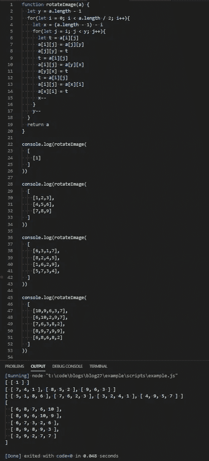
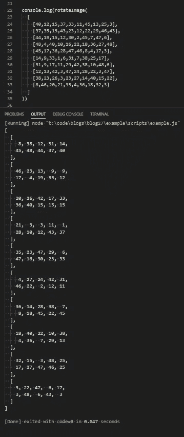

# JavaScript 问题解决程序:旋转图像矩阵

> 原文：<https://levelup.gitconnected.com/javascript-problem-solvers-rotate-image-matrix-c02323c1c2fb>

## 案例 010:及时排队


我已经有一段时间没有写关于我解决的一个技术问题的博客了。事实是，我已经不像以前那样在 HackerRank 或 LeetCode 上磨蹭了，我所有的时间都花在了项目上。

这种情况在本周发生了变化。今天的问题花了我很长时间来解决，比我愿意承认的时间要长，但提供了一个很好的机会来摆脱蜘蛛网，回到 LeetCode 的工作中。我想出的解决方案满足 O(1)空间复杂度要求，运行时间复杂度为 O(n * log n)(我认为)。

我还想提一下，我最近发现了 [**CodeSignal**](https://codesignal.com/) ，到目前为止我一直很喜欢它。我只是刚刚开始他们的面试实践轨道，但 UI 比 LeetCode/HackerRank 更上一层楼，他们的功能集和测试用例很扎实，每个问题的信息量都很好。如果你想换换环境，可以去看看。

所以，让我们开始解决。

## 问题是

[**这里有一个链接，关于问题码信号**](https://app.codesignal.com/interview-practice/task/5A8jwLGcEpTPyyjTB)

```
You are given an n x n 2D matrix that represents an image. Rotate the image by 90 degrees (clockwise).*Note: Try to solve this task in-place (with O(1) additional memory), since this is what you’ll be asked to do during an interview.*Constraints:
  1 ≤ a.length ≤ 100
  a[i].length = a.length
  1 ≤ a[i][j] ≤ 104Input/Output:
  [execution time limit] 4 seconds (js)
  [input] array.array.integer a
  [output] array.array.integer
```

## 测试

## 崩溃了

从表面上看，这似乎很简单。但是有一个扳手在工作。所以，像我们一直做的那样，在做其他事情之前，让我们分解给我们的信息:

```
You are given an n x n 2D matrix that represents an image.
```

我们在第一句话中得到一条非常重要的信息:`n x n 2D matrix`。`n x n`表示给定矩阵中我们应该期望的行数/列数，由于矩阵是`n x n`，行数将始终等于列数。这是巨大的，因为这意味着矩阵是线性相关的，如果我们愿意，我们可以在同一次迭代中对行和列执行操作。

```
Rotate the image by 90 degrees (clockwise)
```

这是我们的任务。在一个`n x n 2D matrix`的上下文中，我们基本上需要将每一行翻转成一列。但是我们需要反过来这样做。

所以，如果我们看看测试案例 2:

这花了我一段时间来想象，或者至少是想象如何用代码做到这一点，所以我想在这里回顾一下。

```
*Note: Try to solve this task in-place (with O(1) additional memory), since this is what you’ll be asked to do during an interview.*
```

这是让事情变得有趣的转折。

我把这解释为:

```
**This is a sorting algorithm**: Swap numbers and set variables ***only*****No extra data sets**: No objects to store indices. No empty arrays to push into. Nothing. Everything must be done inline.**No built in array methods**: Since I am not 100% sure on the space complexity for each individual method in JavaScript (maybe I should be), that means no built in methods. No *reverse()*, *map()*, *sort()*, *filter(),* *indexOf()*, *shift()*, *push()*, etc.
```

有空间复杂度为 O(1)的方法吗？当然了。

我想用它们吗？号码

## 制约因素

我不会担心我们可能遇到的大多数常见的边缘情况。我能想到的所有潜在的边缘情况都包含在约束条件中:

```
1 ≤ a.length ≤ 100
```

`a`代表整个矩阵，`a.length`代表行数和列数。因为我们有一个下限`1 ≤ a.length`，我们不必担心给定的矩阵是空的。不需要处理边缘情况的`if`语句。`a.length ≤ 100`的上限告诉我，我们必须小心解决方案的时间复杂度。100 行和 100 列是一个很大的循环。

```
a[i].length = a.length
```

这是对我们之前被告知的内容的重申:`n x n 2D matrix`。`a[i].length = a.length`是*的另一种说法，“给定矩阵中的行数将总是等于列数。”*

```
1 ≤ a[i][j] ≤ 104
```

`a[i][j]`代表矩阵中的每个数字。虽然这不是我们得到的最基本的约束(我们所做的只是交换数字)，但对我们应该期望的元素有下限和上限总是好的。

话虽如此，让我们着手解决这个问题。

## 嫌疑犯

我为这个问题编写的伪代码比我解决过的任何其他问题都多，而且花在编写伪代码上的时间比编写/测试实际代码要多得多。所以我会用不同的方式来组织这个博客。

首先，我想更详细地介绍每一次迭代。我的解决方案遵循类似洋葱的交换模式，或者我称之为洋葱交换。

为了演示，让我们以文本案例 3 为例:

从`row[0][0]`开始，我们希望所有的数字都以顺时针方向移动。在第一次迭代结束时，无论我们做什么，我们都希望`row[0][0]`是正确的数字。因此，对于测试用例#3，我们希望 6 是 5，它位于`row[3][0]`。我们不希望在剩下的代码执行过程中不得不返回到`row[0][0]`,所以为了工作，它必须以正确的数字结束。我们每次迭代都要访问一次，仅此而已。

每个角落都是如此。在第一次迭代结束时，每个角必须处于正确的最终值。

我们可以通过嵌套第二次迭代，并交换每个角的值，在第一次迭代中做到这一点:

执行这 3 次交换后，矩阵角上的每个值都处于正确的最终位置，我们再也不用担心它们了。

在我们迭代的第二次循环中，我们可以对`row[0][1]`处的数字重复相同的过程，并将其与层中的下一个数字交换:

我们现在在正确的位置上有了另一组数字。在嵌套循环的第三次迭代中，我们可以重复这种交换模式 1 次以上，并获得矩阵最外层中所有数字的正确和最终位置:

我们还希望我们的嵌套循环只运行 3 次，因为我们已经用`row[0][0]`交换了`row[0]`中的最后一个元素。我们可以通过将嵌套循环的上限设置为`a.length - 1`来做到这一点。

这种洋葱交换也适用于矩阵的任何内层。顺时针翻转数字的相同模式仍然成立。我们可以递增并使用`i`和`j`来访问每个后续层。

如果我们设置`j = i`，在`i = 1`处的整个循环的第二次迭代中，我们可以访问测试用例#3 的内层:

矩阵“内层”中的所有值现在也处于正确的最终位置。整个矩阵顺时针旋转了 90 度，仅用了 4 次迭代。我们可以从循环中退出`return a`。

## 变量

既然我们已经找到了一个可以将矩阵旋转 90 度的可重复模式，我们需要开始设置和分配变量，这样我们就可以让这个模式与给我们的任何`n x n`矩阵一起工作。

如果我们看一下每次迭代的操作，就会发现一个模式:

这告诉我，在嵌套迭代的每个循环中，我们需要额外的变量来递增和递减。我们可以使用`j`作为我们需要增加的变量，因为`j`在每次嵌套迭代中自然增加。

但是我们将需要添加另一个变量，我们可以减少…在某处。

如果我们设置`j = i`，我们可以用行`[i][j]`替换`row[0][0]`，因为`j`将自然地在每个内层的每次重新迭代中从正确的位置开始。有了洋葱互换，`j`开始向外，向内。

但是当我们查看整个迭代的第二个循环时，出现了一个问题:

第一部分看起来不错。但是第二部分的模式与第一次迭代不同。测试用例#3 的“内层”是`2 x 2`，代表我们需要交换数字的最小子矩阵。

没关系。这种模式对于矩阵中不是`2 x 2`的每一层仍然成立。我们可以通过用`(a.length - 1) - i`初始化我们在父`for`循环中递减的变量来解决这个问题，并将其作用于嵌套迭代之外，以防止它在每次嵌套循环迭代时重置。

让我们再来看看我们的迭代，但是添加我们想要减少的变量`x`，并用`x`、`i`和`j`替换适当的静态值:

这样我们就剩下 1 个静态值需要计算。

从表面上看，它也遵循一种模式。它在每个嵌套循环中保持不变，但在整个循环的每次迭代中需要减 1。因此，我们可以使用它并添加另一个用`a.length - 1`初始化的变量`y`。这是为了确保它对给定矩阵的大小保持动态。我们还可以在两个循环之外确定它的范围，这样它就不会在我们解决方案的整个执行过程中重置，并在每次整个`for`循环迭代时递减`y`:

这满足了将洋葱交换付诸实践所需的所有可变要求。

## 设置

所以，让我们把它写成代码。

两个`for`循环的工作方式如下:

父循环将遍历矩阵的每个“层”。矩阵的“层数”由它的一半长度或`a.length / 2`决定。因此，如果我们将父循环的上限设置为`i < a.length / 2`，它应该正确地遍历矩阵的每个“层”，而不会浪费任何迭代。如果是这样的话，整个纸牌屋都会倒塌。

嵌套循环是在每一行和每一列的元素中循环。每行/列中的元素数量总是相等的，但是对于每个内部“层”，我们需要迭代的行/列/元素的数量越来越少，直到我们到达中心。

对于给定的矩阵，如果`n x n`是偶数，那么矩阵的中心将是`2 x 2`，我们将需要执行 1 次最后的洋葱交换。如果`n x n`是奇数，矩阵的中心将是`1 x 1`，我们不需要交换任何东西，我们可以退出迭代。

如果我们回头看看需要使用`y`变量的模式，这是有意义的。它基本上是我们想要在每个内层迭代的元素位置的上限。所以我们可以在嵌套循环中使用`y`作为上限，并设置`j < y`来防止循环通过不存在的层。

也就是说，我们可以设置我们的两个`for`循环，我们的变量，以及我们希望如何减少`x`和`y`变量:

在那个`for`循环夹层中间，我们可以添加所有的洋葱交换逻辑。我们只需要去掉伪代码，用`a`替换`row`:

## 最终解决方案

我们所写代码的唯一问题(也是最后一个问题)是，从技术上讲，我们没有交换任何东西。我们只是替换了`a[i][j]`当前的值。

我们还需要 1 个变量`t`来存储我们当前交换的数字，这样我们就可以用我们要替换的数字来交换它:

`let t = a[i][j]`

然后我们需要用刚刚交换了`a[i][j]`的位置的值来交换临时变量:

`a[j][y] = t`或`a[y][x] = t`或`a[x][i] = t`

然后，我们需要用`a[i][j]`的新值更新`t`的值，这样我们就可以对迭代的第二次和第三次交换重复这个过程:

`t = a[i][j]`

最后，如果我们对我们拥有的 5 个测试用例运行我们的解决方案，我们应该通过每个测试:



很好。

## 任务完成

因此，这是一个吃饱了，但一个月不磨回来的好问题。我也很喜欢我想出的解决方案(通常我不太满意)，洋葱交换真的提高了我解决问题的能力。在某些时候，我真的很想让它工作，这可能是我花了这么多时间在它上面的原因。

我是不是把事情搞得太复杂了？也许吧。但这是值得努力的，而且效率惊人。

再说一次，我写的关于解决 LeetCode/HackerRank/CodeSignal 问题的博客并不是为了找到时间或空间复杂度最低的解决方案。他们关注的是解决问题的步骤。我当然明白我的解决方案不会是最好或最有效的，但这一次我对结果相当满意。

不管怎样，我希望你得到了一些有用的信息，希望你所有的函数都返回 true，所有的请求都用 200 来响应。

保持安全…保持健康…继续为正义而战。