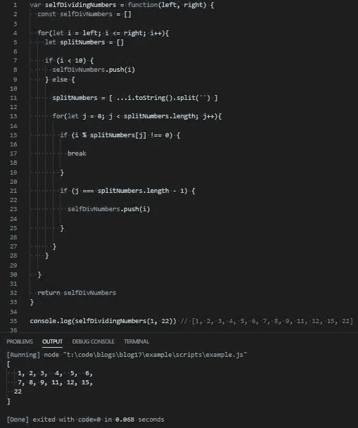

# JavaScript 问题解决程序:自除数字

> 原文：<https://levelup.gitconnected.com/javascript-problem-solvers-self-dividing-number-6f3d77499df8>

## 案例 004:抽刹车

今天的问题与我们两周前解决的问题相似，我们将使用一个数字的单个数字来寻找解决方案。

所以让我们开始解决。

## 问题是

[这里是 LeetCode](https://leetcode.com/problems/self-dividing-numbers/) 上问题的链接

```
A self-dividing number is a number that is divisible by every digit it contains.For example, 128 is a self-dividing number because 128 % 1 == 0, 128 % 2 == 0, and 128 % 8 == 0.Also, a self-dividing number is not allowed to contain the digit zero.Given a lower and upper number bound, output a list of every possible self dividing number, including the bounds if possible.Constraints:
  The boundaries of each input argument are 1 <= left <= right <= 10000Test Cases:
  selfDividingNumbers(1, 22) => [1, 2, 3, 4, 5, 6, 7, 8, 9, 11, 12, 15, 22]Explanation:
  1 divided by 1 is 1
  2 divided by 2 is 1
  3 divided by 3 is 1
  4 divided by 4 is 1
  5 divided by 5 is 1
  6 divided by 6 is 1
  7 divided by 7 is 1
  8 divided by 8 is 1
  9 divided by 9 is 1
  11 divided by 1 is 11, and 11 divided by 1 is 11
  12 divided by 1 is 12, and 12 divided by 2 is 6
  15 divided by 1 is 15, and 15 divided by 5 is 3
  22 divided by 2 is 11, and 22 divided by 2 is 11 10 divided by 1 is 10, but 10 divided by 0 is not possible, so it is not a self dividing number 13 divided by 1 is 13, but 13 divided by 3 is 4.3 repeating, so it is not a self dividing number 14 divided by 1 is 14, but 14 divided by 4 is 3.5, so it is not a self dividing number 16 divided by 1 is 16, but 16 divided by 6 is 2.6 repeating, so it is not a self dividing number 17 divided by 1 is 17, but 17 divided by 7 is 2.428571 repeating, so it is not a self dividing number etc...
```

## 崩溃了

解释这个问题的方式给我们提供了大量的信息。尽管我们只得到 1 个测试用例，但我们确实得到了大量自除数字的例子，以及一些我们以后可能遇到的边缘情况的提示。

像往常一样，让我们尝试重新表述这个问题，以确保我们理解它:

```
Write a function called selfDividingNumbers that accepts 2 integers, a minimum number and a maximum number.Return an array containing numbers greater than or equal to the minimum number and less than or equal to the maximum number, who’s digits divide into it evenly.
```

即使我们删除了许多提供给我们的更好的细节，我们得到了一个简化的问题的重新表述，否则可能会感到困惑或不知所措。

我们的约束还表明，我们不应该期望一个小于 1 的数，这一点很重要，因为任何数都不能被零除。上限并不重要，但它告诉我们不应该期待一个超过 5 位数的数字。

我们还会得到一个约束，它没有被明确地列为约束，但是包含在问题的解释中。例如，`…a self-dividing number is not allowed to contain the digit zero`告诉我们可以排除 10、20、30、40 等数字。

我们还得到了一个直接的测试用例，它清楚地表明了我们期望返回什么。更多的测试用例会很好，我们总是可以创建自己的测试用例，但是我们必须利用现有的测试用例。

## 边缘案例

我们有一些分散在为我们提供的信息周围的边缘情况，以及一个可能不那么明显的边缘情况。

`1.) A number is 0`

我们不必担心数字为 0，因为我们有一个约束条件，规定了`1 <= left`。

`2.) *Left* is greater than *right*`

这是另一个我们不必担心的边缘情况，因为同样的约束条件表明`left <= right`

`3.) Left is equal to right`

由于我们的产品系列包罗万象，这也是我们通常不必担心的事情。比如`left = 15`和`right = 15`，我们仍然需要通过范围对每个数字进行相同的操作，如果我们的上下限之间有更多的数字，我们的返回值不受影响。如果我们的产品系列是独家的，这将是不同的。

`4.) A number contains a zero`

这是在问题解释中给我们的一个边缘案例。任何能被 10 整除的数都可以被排除在外，因为第二个数字总是 0，因此它不是一个自除数，因为我们不能将一个数除以 0。

`5.) A number is less than 10`

这是一个边缘案例，不是我们提供的。任何小于 10 的数都是一位数，并且能被自身整除。这意味着如果我们的下限小于 10，我们可以自动添加任何小于 10 的数，因为任何数除以自身都是 1。由于给出了测试案例，我们可以在实践中看到这一点。

现在，我们已经彻底检查了提供给我们的所有信息，我们可以开始考虑如何解决这个问题。

## 嫌疑犯

我发现我提出的解决方案很有趣，原因有几个。我总是尽可能避免嵌套迭代，但有时这是无法避免的。

首先，我们需要一个空数组来存储我们找到的任何自除数。这也是我们希望在函数结束时返回的数组。

我们还想建立一个`for`循环，包含地遍历我们的下限和上限之间的每个数字(`left`和`right`)。然后，我们希望将我们迭代的每个数字拆分成数组元素。这是因为我们希望将每个数字除以它的单个数字。

一旦每个数字的数字被分割成数组的元素，我们就可以使用嵌套的`for`循环来遍历数字数组，并将当前迭代的数字除以每个数字(或元素)。如果我们将当前正在迭代的数字除以它的一个数字，被除数不是一个整数，这意味着我们当前正在迭代的数字不是一个自除的数字，我们可以中断运算，继续下一个数字。但是如果被除数是一个整数，我们可以移动到数字中的下一位(数组中的下一个元素)。

有趣的部分是我们如何设置它背后的逻辑。如果我们的嵌套 for 循环在到达一个数的最后一位数字后没有中断它的操作，那么这个数的所有数字必须被均匀地分成这个数。这意味着我们当前迭代的数是一个自除数，我们可以在函数结束时将它添加到返回的空数组中。

否则，for 循环将会中断其操作，并移动到下一个数字。

## 伪代码

因为这听起来有点令人困惑，所以让我们从不同的角度来看它，并编写一些伪代码:

## 带有注释的代码

让我们尝试将这个解决方案付诸实践，并编写一些代码:

首先，让我们编写我们的`function`，添加我们的空`array`，我们的`for`循环，嵌套的`for`循环，以及`return`值:

接下来，让我们编写第一个`for`循环的逻辑，该循环将所有小于 10 的数字相加，并且`split`将我们迭代的每个数字添加到`splitNumbers`数组中的各个元素中:

最后但同样重要的是，我们可以将逻辑添加到嵌套的`for`循环中，以检查一个数是否能被它的位数整除，以及嵌套的`for`循环是否已经遍历了`splitNumbers`中的最后一个元素:

如果我们运行我们的解决方案，我们应该匹配为我们提供的测试用例:



## 最终解决方案

让我们最后看一下不带注释的解决方案，并清理一些语法:

太棒了。

## 任务完成

虽然这个问题并不复杂，也不具有挑战性，但我发现它为处理字符串强制提供了一个有趣的转折。我还发现`break`的用法也很有趣，这绝对不是我经常看到的。

再说一次，我写的关于解决 LeetCode 或 HackerRank 问题的博客并不是为了找到时间或空间复杂度最低的解决方案。他们关注的是解决问题的步骤。

我很清楚我的解决方案不会是最好的或最有效的，但不管怎样，我希望它们能帮助你或其他人找到一种方法来解决你在这个旅程中遇到的问题，我们称之为 JavaScript。

保持安全…保持健康…继续为正义而战。

[](https://skilled.dev) [## 编写面试问题

### 一个完整的平台，在这里我会教你找到下一份工作所需的一切，以及…

技术开发](https://skilled.dev)