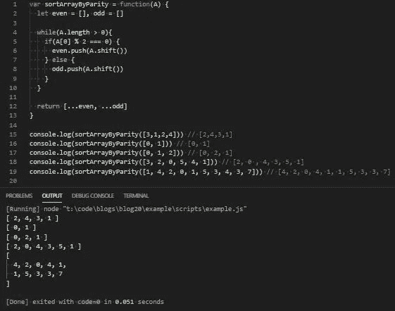

# JavaScript 问题解决程序:按奇偶校验对数组排序

> 原文：<https://levelup.gitconnected.com/javascript-problem-solvers-sort-array-by-parity-b9c2debc14f>

## 案例 007:洗牌

今天的问题很简单。这是一个相当简单的排序问题，伴随着我们上周编写的插入算法，我觉得用一个基本的排序算法来尝试一下也是一个好主意。

所以让我们开始解决。

## 问题是

[**这里是 LeetCode**](https://leetcode.com/problems/sort-array-by-parity/) 上问题的链接

```
Given an array A of non-negative integers, return an array consisting of all the even elements of A, followed by all the odd elements of A.You may return any answer array that satisfies this condition.Constraints:
  1 <= A.length <= 5000
  0 <= A[i] <= 5000Test Cases
  [3,1,2,4] => [2,4,3,1]The outputs [4,2,3,1], [2,4,1,3], and [4,2,1,3] would also be accepted.***Since we are only given a single test case, I decided to add a couple more to make sure our solution works as advertised: [0, 1] => [0, 1]
  [0, 1, 2] => [0, 2, 1]
  [3, 2, 0, 5, 4, 1] => [0, 2, 4, 3, 5, 1]
  [1, 4, 2, 0, 1, 5, 3, 4, 3, 7] => [0, 2, 4, 4, 1, 1, 5, 3, 3, 7]
```

## 崩溃了

我发现这个问题有一个直截了当的解释，不试图混淆它的任何目标。但是，和往常一样，让我们对提供给我们的所有信息进行分类，以确保我们了解我们的任务是解决什么:

```
Given an array A of non-negative integers
```

这给了我们三条独立的重要信息，以及从哪里开始的想法。我们编写的函数将接受一个名为`**A**`的`array`。`array`将只包含整数，所以我们不需要考虑其他原语，我们只需要处理整数。我们得到的最后一条信息是，所有的整数都将是非负的，这由我们给出的两个约束中的第二个来加强。

```
return an array consisting of all the even elements of A followed by all the odd elements of A
```

这里我们了解到我们的`function`需要返回一个`array`，并揭示了`return` `array`中的元素应该如何组织。我们要做的就是确保`A`中所有的偶数元素出现在`A`中所有的奇数元素之前。简单明了。

```
You may return any answer array that satisfies this condition.
```

这是我最感兴趣的部分。因为我们的`return` `array`除了让`A`中的所有偶数元素出现在`A`中的所有奇数元素之前之外不受任何限制，所以我们不需要担心我们返回的内容的任何排序或组织。

老实说，起初我被这个问题搞糊涂了，发现我已经习惯于让我写的解决方案有特定的输出，我不知道如何正确地测试或接近一个解决方案。

我们可以编写额外的逻辑来确保我们的`return` `array`中的奇数和偶数都从最小到最大排序，并使用我们上周为插入算法提出的部分解决方案，但这是不必要的。

我们还可以在这个解决方案中添加一些其他的东西，让它变得更加复杂，但是现在，让我们不要贪多嚼不烂，按照解释来解决问题。

## 制约因素

我们只给出了两个基本的约束，并没有提供太多的额外信息。但是，让我们再一次检查一下这两个约束，以确保我们理解了它们:

```
1 <= A.length <= 5000
```

`1 <= A.length <= 5000`的第一个约束给了我们输入`array`有多大的下限和上限。有了`1 <= A.length`的下限，我们发现不必担心输入`array`为空，或者长度为 0。`A.length <= 5000`的上限并不重要，但是和往常一样，如果我们想计算函数的最大运算量，有一个上限是很好的。

```
0 <= A[i] <= 5000
```

第二个约束`0 <= A[i] <= 5000`也给了我们一个下限和上限，但是对于我们应该在输入数组中预期的数字(`A`)。

虽然这不像上面提到的`A.length`的下限那么重要，因为我们要做的只是检测输入数组(`A`)中的元素是奇数还是偶数，但它确实强调了输入数组(`A`)中没有数字是负数的事实，并允许我们排除潜在的边缘情况。

## 边缘案例

虽然大多数潜在的边缘情况都包含在问题的解释或两个约束中，但有一个可能的边缘情况我觉得很有趣，可能会迫使我们提出一个更复杂的解决方案:

```
The input array (A) is an empty array
```

考虑到`1 <= A.length`的约束，我们不必为空数组编写异常

```
The input array (A) contains negative numbers
```

由于另一个约束，我们可以忘记另一个边缘情况:`0 <= A[i]`

```
The input array (A) contains a 0
```

这可能不被认为是一个边缘情况，但我决定把它包括在内，因为这是我们将要考虑的事情。0 是一个偶数，所以我们必须确保当我们检查一个数字是奇数还是偶数时，0 将与其他偶数分组。

```
The input array (A) contains an element that is a string
```

另一种我们不必担心的边缘情况，因为它在问题的解释`Given an array A of non-negative integers`中有明确说明，并且受到约束`0 <= A[i] <= 5000`的支持。

```
The input array (A) contains two of the same integers
```

这是在这个问题解释、约束或测试用例中没有明确陈述或回避的事情，并且成为我们可能遇到的一个可能的边缘情况。如果我们对`return` `array`中元素的顺序有严格的要求，这可能会成为一个问题。但是我们需要做的是确保我们的`return` `array`中的所有偶数元素出现在所有奇数元素之前，这可能会成为一个问题，取决于我们如何编写我们的解决方案。

现在，我们已经彻底检查了提供给我们的所有信息，我们可以开始考虑如何解决这个问题。

## 嫌疑犯

如前所述，我发现这个问题相当简单，主要是因为我们不需要以任何特定的方式组织我们的`return` `array`。我们需要做的就是让`A`中的所有偶数元素出现在`A`中的所有奇数元素之前。

我发现的最简单的解决方案是将`A`分成两个独立的`array`，一个包含所有的偶数，另一个包含所有的奇数，然后用一个扩展操作符将这两个组合起来。

但是我决定迭代`A`的方式和平常有点不同。我们可以使用一个`while`循环遍历`A`，并在遍历`A`时慢慢清空`while(A.length > 0)`。

我们可以通过检查`A` ( `A[0]`)的第一个元素对 2 ( `A[0] % 2 == 0`)取模时是否返回余数来检查每个元素是奇数还是偶数。如果没有，我们可以将`push`的第一个元素`A`转化为偶数`array` ( `even.push(A.shift())`)。如果是，`push`的第一个元素`A`变成奇数`array` ( `odd.push(A.shift())`)。

通过以这种方式迭代`A`，我们可以基于布尔表达式将`A`中的`push` `shift`元素放入偶数`array`或奇数`array`，并且一旦`A`为空就结束`while`循环。

那么在最后，我们可以`return` `[ …even, …odd ]`

简单、容易、直接。

## 伪代码

现在我们有了简单的解决方案，让我们在实施我们的计划之前写一些伪代码:

## 评论

我们的伪代码看起来似乎合理，让我们开始写一个解决方案:

首先，让我们定义函数`sortArrayByParity`，我们的空奇偶`array`，以及奇偶组合`array`作为我们的`return`值:

然后，让我们写出我们的`while`循环:

接下来，我们可以编写我们的`if`语句来检查一个整数是奇数还是偶数:

最后但同样重要的是，我们可以编写将`push`的第一个元素“是”到偶数或奇数`array`的逻辑:

如果我们运行我们的解决方案，我们应该匹配为我们提供的测试用例，以及我添加的额外测试用例:



## 最终解决方案

让我们最后看一下不带注释的解决方案，并清理一些语法:

很好。

任务完成

这可能是我写过的博客中最基本的问题。不幸的是，我这个星期非常忙，没有时间找到比我们今天解决的问题更有趣或更复杂的问题。

我仍然觉得今天的问题很有趣，即使它远比我过去写过的问题简单。至少，我想在本周写一篇博客，即使这篇博客本身不如之前的那篇有深度。

再说一次，我写的关于解决 LeetCode 或 HackerRank 问题的博客并不是为了找到时间或空间复杂度最低的解决方案。他们关注的是解决问题的步骤。

我当然明白我的解决方案不会是最好的或最有效的，但不管怎样，我希望它们能帮助你或其他人找到一种方法来解决你在这个旅程中遇到的问题，我们称之为 JavaScript。

保持安全…保持健康…继续为正义而战。

[](https://skilled.dev) [## 编写面试问题

### 一个完整的平台，在这里我会教你找到下一份工作所需的一切，以及…

技术开发](https://skilled.dev)