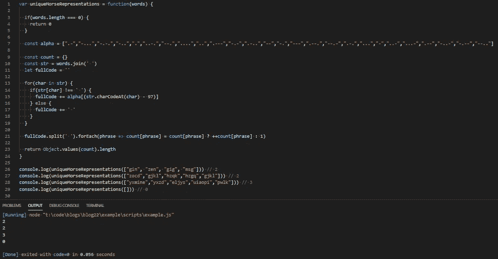

# JavaScript 问题解决程序:独特的莫尔斯电码单词

> 原文：<https://levelup.gitconnected.com/javascript-problem-solvers-unique-morse-code-words-22368f0f640c>

## 案例 009: SOS 拼写干净

今天，我们遇到了一个相对简单的声音问题，处理字符串强制和莫尔斯电码。从表面上看，这听起来并不棘手，但是和 LeetCode 上的许多问题一样，它有一些陷阱，可能会让你陷入寻找解决方案的困境。

所以，让我们开始解决。

## 问题是

[**这里是 LeetCode**](https://leetcode.com/problems/unique-morse-code-words/) 上问题的链接

```
International Morse Code defines a standard encoding where each letter is mapped to a series of dots and dashes, as follows: “a” maps to “.-”, “b” maps to “-…”, “c” maps to “-.-.”, and so on.For convenience, the full table for the 26 letters of the English alphabet is given below:[ “.-”, “-…”, “-.-.”, “-..”, “.”, “..-.”, “ — .”, “….”, “..”, “. — -”, “-.-”, “.-..”, “ — ”, “-.”, “ — -”, “. — .”, “ — .-”, “.-.”, “…”, “-”, “..-”, “…-”, “. — ”, “-..-”, “-. — ”, “ — ..” ]Now, given a list of words, each word can be written as a concatenation of the Morse code of each letter. For example, “cab” can be written as “-.-.. — …”, (which is the concatenation “-.-.” + “.-” + “-…”). We’ll call such a concatenation, the transformation of a word.Return the number of different transformations among all words we have.Constraints:
  The length of words will be at most 100.
  Each words[i] will have length in range [1, 12].
  words[i] will only consist of lowercase letters.Test Cases:
  [“gin”, “zen”, “gig”, “msg”] => 2
  Explanation:
    The transformation of each word is:
      “gin” -> “ — …-.”
      “zen” -> “ — …-.”
      “gig” -> “ — … — .”
      “msg” -> “ — … — .” There are 2 different transformations, “ — …-.” and “ — … — .”.[“zocd”, “gjkl”, “hzqk”, “hzgq”, “gjkl”] => 2[“yxmine”, “yxzd”, “eljys”, “uiaopi”, “pwlk”] => 3[] => 0
```

## 崩溃了

问题的解释给了我们大量的信息，并且很好地解释了任务，这总是一件好事。尽管我们只有一个测试用例，我还是添加了一些其他的测试用例来确保我们的解决方案能够正常运行，以及一个包含我们可能会遇到的潜在边缘情况的测试用例。

但是，和往常一样，让我们对提供给我们的所有信息进行分类，以确保我们了解我们的任务是解决什么:

```
International Morse Code defines a standard encoding where each letter is mapped to a series of dots and dashes, as follows: “a” maps to “.-”, “b” maps to “-…”, “c” maps to “-.-.”, and so on.
```

在问题解释的第一句话中，我们得到了莫尔斯电码的简要描述，在手头问题的上下文中，我们发现英语字母表中的每个字母都有一个莫尔斯电码表示。这告诉我，很有可能我们将不得不进行某种字符到莫尔斯电码计数器部分的转换。

```
For convenience, the full table for the 26 letters of the English alphabet is given below:[ “.-”, “-…”, “-.-.”, “-..”, “.”, “..-.”, “ — .”, “….”, “..”, “. — -”, “-.-”, “.-..”, “ — ”, “-.”, “ — -”, “. — .”, “ — .-”, “.-.”, “…”, “-”, “..-”, “…-”, “. — ”, “-..-”, “-. — ”, “ — ..” ]
```

这非常方便，因为我们得到了英语字母表中每个字符的所有莫尔斯电码表示，我们可以直接将它插入到我们的解决方案中，可能作为一个名为`alpha`的数组:

```
alpha = [ “.-”, “-…”, “-.-.”, “-..”, “.”, “..-.”, “ — .”, “….”, “..”, “. — -”, “-.-”, “.-..”, “ — ”, “-.”, “ — -”, “. — .”, “ — .-”, “.-.”, “…”, “-”, “..-”, “…-”, “. — ”, “-..-”, “-. — ”, “ — ..” ] 
```

我们可以用它来交叉引用给定的`string`中的字符，并将其转换成一串莫尔斯电码。

```
Now, given a list of words, each word can be written as a concatenation of the Morse code of each letter. For example, “cab” can be written as “-.-.. — …”, (which is the concatenation “-.-.” + “.-” + “-…”). We’ll call such a concatenation, the transformation of a word.
```

这里的一个关键信息是，转换成莫尔斯电码计数器部分的串联`string`被定义为一个变换。我们可能有两个短语，当转换和连接时，产生相同的莫尔斯电码表示。

例如，在第一个测试案例中:

```
[“gin”, “zen”, “gig”, “msg”]The transformation of each word is:
  “gin” -> “ — …-.”
  “zen” -> “ — …-.”
  “gig” -> “ — … — .”
  “msg” -> “ — … — .”
```

`“gin”`和`“zen”`都有相同的莫尔斯电码表示(`“ — …-.”`)，而`“gig”`和`“msg”`也有不同但相等的莫尔斯电码表示(`“ — … — .”`)。

如果我们再次查看第一个测试用例，我们会看到它是一个`array`，每个元素代表一组单词或短语。因为我们的函数将接受一个`array`而不是一个`string`，所以在我们对它做任何事情之前，我们也必须将`array`转换成一个`string`。

```
Return the number of different transformations among all words we have.
```

最后，我们从`function`到`return`得到我们需要的信息。重要的部分是我们需要`return`一个`integer`来表示我们从原始`array`转换而来的不同莫尔斯电码“短语”(或连接字符串，或转换)的数量。

这给我们的解决方案增加了一个额外的步骤，最好用频率计数器来解决。我们可以构建一个包含给定的`array`中所有独特的莫尔斯电码转换的`object`。然后，我们可以使用`Object.keys()`或`Object.values()`在`object`中列出实体(或转换)。然后，我们可以在任一个上使用`.length`来找出有多少个转换。

在我看来，这相当简单，但如果我们不一步一步地完成事情，那么如何处理每一步可能会有点困难。

## 制约因素

我们只给出了 3 个约束，尽管它们并没有以我们习惯看到的传统格式出现。这并不意味着它们有任何不同，但也许我们应该将它们转换成更熟悉的格式，然后浏览它们，以确保我们理解它们所代表的含义:

```
The length of words will be at most 100.
```

或者

```
words.length <= 100
```

这里我们得到了给定输入中元素(或单词)数量的上限`array`。因为`words`是一个`array`，这告诉我们没有一个元素或单词会超过 100 个字符。我们得不到的是下限。这告诉我，我们有一个边缘情况，其中`words.length === 0`，或者在给定的输入`array`中没有单词。我们必须在解决方案中考虑这一点。

```
Each words[i] will have length in range [1, 12].
```

或者

```
1 <= words[i].length <= 12
```

我不确定“范围内”是包含性的还是排他性的，但我假设它是包含性的。这意味着我们将要转换的任何单词或短语至少有 1 个字符，最多 12 个字符。因此，我们可以移除潜在的边缘情况，其中`words[i].length === 0`或`words[i] === “”`。

```
words[i] will only consist of lowercase letters.
```

我们得到的最后一个约束涵盖了我们可能遇到的另一个潜在的边缘情况。由于`words[i]`将只由小写字母组成，我们可以相信这样一个事实，即我们不必为特殊字符如*或@或编写任何错误处理。或者任何种类的数字或整数。

这很好。

边缘案例

对于这个问题，我只提出了 1 个主要的边缘案例，主要部分是关于所提供的约束如何覆盖我通常会考虑的许多基础:

```
words.length === 0
```

如果我们要使用一个频率计数器来跟踪给定输入`array`的元素中的转换量，并且给定的输入数组是[]，我们仍然会得到一个包含实体的频率计数器。反过来，我们的频率计数器上的`Object.keys().length`或`Object.values().length`将`return`的值设为 1。我们不想这样。

为了适应这种情况，我们可以在函数的开头添加一个简单的`if`语句，如果`words.length`为 0，该语句将为`return` 0:

```
if(words.length === 0) return 0
```

## 嫌疑犯

正如我在上一节中简要概述的那样，我提出的解决方案将有几个移动部件来处理问题的每一步。

所以，让我们先概述一下这些步骤是什么，然后讨论我们如何一点一点地解决它们:

1.)定义一个空的`object`作为`count`，它将记录我们在给定输入`array` `words`的元素中找到的转换数量

2.)定义一个名为`str`的变量，它连接给定输入`array` `word`中的所有元素，并在它们之间添加一个空格

3.)定义一个空的`string`作为`fullCode`，我们可以为给定输入`array` `words`的每个元素中的每个字符添加莫尔斯码表示

4.)遍历`str`并将每个字符转换成它的莫尔斯电码表示(或转换)，然后将其添加到变量`fullCode`

5.)遍历`fullCode`，并将其`key`添加到`count`，其值设置为每个转换在`fullCode`中出现的次数。

6.)调用频率计`count`上的`Object.values().length`或`Object.keys().length`，并`return`它的值

这差不多就是它的要点。因此，让我们仔细检查每个步骤，并找出如何完成每项任务:

```
1.) Define an empty object as count that will keep track of the amount of transformations we find in the elements of a given input array words
```

这个挺基础的:`const count = {}`。我们可以使用`const`，因为我们不会改变`count`的数据类型。

```
2.) Define a variable called str that joins all of the elements in a given input array words, and adds a space between them.
```

同样，非常简单:`const str = words.join(‘ ’)`。我们可以再次使用`const`，因为`words`的值在`function`的执行过程中不会改变。

```
3.) Define an empty string as fullCode that we can add Morse Code representations for each character in each element for the given input array words
```

再次非常简单:`let fullCode = ‘’`。我们可以在这里使用`let`，因为`fullCode`的值将在`function`的整个执行过程中被修改。

```
4.) Iterate through str and convert each character into it’s Morse Code representation (or transformation), then add it to the variable fullCode
```

这就是事情不那么简单的地方。我们可以将我们的迭代设置为一个`for in`循环，在每次迭代中，通过使用`str.charCodeAt() - 97`交叉引用包含所有莫尔斯电码序列的`array` `alpha`。

`charCodeAt()`给出了特定 a 字符的 HTML ASCII 码，你可以在这里找到每个字符的参考:[https://www.w3schools.com/charsets/ref_html_ascii.asp](https://www.w3schools.com/charsets/ref_html_ascii.asp)

所有小写字母都有一个介于 97 和 122 之间的 ASCII 码。所有大写字母的 ASCII 码都在 65 到 90 之间。所有数字都有一个介于 48 和 57 之间的 ASCII 码。

这正是我们所需要的，如果我们从`str.charCodeAt()`的每个`return`值中减去 97，我们得到一个`integer`，它直接对应于`alpha` `array`的指数。我们可以通过使用`str.charCodeAt() - 97`的`return`值作为`alpha` : `alpha[str.charCodeAt(char) - 97]`的计算访问成员来访问`alpha` `array`的每个元素。然后我们可以将它添加到`fullCode` `string` : `fullCode += alpha[str.charCodeAt(char) - 97]`中，我们得到`array` `words`中的每个单词或短语，因为它是莫尔斯电码转换。

唯一的问题是每个短语都被一个空格隔开，而空格没有对应的 ASCII 码。这很好。我们可以在我们的`for in`循环中添加一个简单的`if`语句来检查一个字符是否是一个空格:`if(str[char] !== ‘ ’)`。如果布尔表达式返回`true`，我们可以给`fullCode` : `fullCode += alpha[str.charCodeAt(char) - 97]`加上莫尔斯码变换，如果没有，就加一个空格:`fullCode += ‘ ’`

```
5.) Iterate through fullCode, and add its keys to count, with it’s value set to how many times each transformation appears in fullCode.
```

我们首先可以做的是将`split` `fullCode`转化为`array` : `fullCode.split(‘ ’)`的元素。这样我们就可以将`fullCode`字符串中的每个单词作为单独的元素进行迭代，因为我们想要计算每个单词的转换数量，而不是每个字符的转换数量。

通过将`fullCode`分割成一个`array`的元素，我们可以在`array`上调用`forEach`it`return`s:`fullCode.split(‘ ’).forEach()`，并将每个元素赋给一个变量:f `ullCode.split(‘ ’).forEach(phrase => )`。

然后，我们可以添加逻辑，通过将`count` 中的每个`key`设置为一个短语:`count[phrase]`，来计算每个短语在`array`中出现的次数，并且它的值为一个三元语句，如果该短语已经出现在`count`中，则该语句的值加 1，如果该短语没有出现在`count` : `count[phrase] ? ++count[phrase] : 1`中，则该语句的值设置为 1

总之，我们可以用一行代码完成第 5 步:

`fullCode.split(‘ ‘).forEach(phrase => count[phrase] = count[phrase] ? ++count[phrase] : 1)`

```
6.) Call Object.values().length or Object.keys().length on the frequency counter count, and return it’s value
```

最后，我们可以在`count`上调用`Object.values().length`或`Object.keys().length`(我选了`Object.values().length`但其实并不重要，`return`它的值:`return Object.values(count).length`

## 伪代码

现在，我们已经概括并逐步完成了潜在解决方案的每个部分，让我们编写一些伪代码来了解我们的解决方案将会是什么样子:

## 评论

这开始变得很好，我们的解决方案看起来也很合理。让我们开始一步一步地编写代码，看看是否可行:

首先，让我们从定义我们的`function` `uniqueMorseRepresentations`开始:

接下来，让我们添加所有的常量和变量:

然后，我们可以定义`for in`循环来迭代`str`到`variable`:

从这里，我们可以添加`if`语句来确保我们不会试图用`alpha` `array`来交叉引用空字符串:

现在，我们可以添加构建`fullCode` `string`的逻辑:

继续，我们可以开始`function`的下一部分，它将构建`count` `object`:

然后我们可以调用`fullCode.split(‘ ’)`上的`.forEach`并将`array`中的每个元素设置为一个变量:

然后，我们可以添加构建频率计数器`object` `count`的逻辑:

最后，我们可以在`count`上调用`Object.values().length`，在`return`上调用它:

哎呀，差点忘了我们的边缘情况 if `words.length === 0`，所以让我们把它添加到我们的`function`的开头，这样如果我们遇到这个边缘情况，我们的其余代码就不会运行:

如果我们运行我们的解决方案，我们应该匹配为我们提供的测试用例，以及我添加的测试用例:



## 最终解决方案

让我们最后看一下不带注释的解决方案，并清理一些语法:

惊人的。

## 任务完成

本周的问题是另一个不太复杂的问题，但我喜欢这种直截了当的感觉，它提供了一些有趣的问题解决方法组合来解决它。

本周，我终于能够部署我在 Flatiron 学校完成的一个项目，解决任何部署都会出现的一些错误占用了我的大部分时间，所以我能够花在 LeetCode 研究上的时间是有限的。

如果你想了解一下，你可以在这里找到这个项目:[http://trunkslamchest.com/spacebarsmasher/](http://trunkslamchest.com/spacebarsmasher/)

再说一次，我写的关于解决 LeetCode 或 HackerRank 问题的博客并不是为了找到时间或空间复杂度最低的解决方案。他们关注的是解决问题的步骤。

我很清楚我的解决方案不会是最好的或最有效的，但不管怎样，我希望它们能帮助你或其他人找到一种方法来解决你在这个旅程中遇到的问题，我们称之为 JavaScript。

保持安全…保持健康…继续为正义而战。

[](https://skilled.dev) [## 编写面试问题

### 掌握编码面试的过程

技术开发](https://skilled.dev)