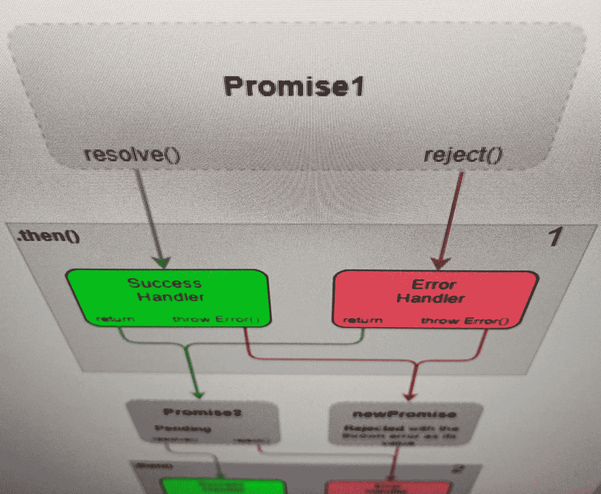
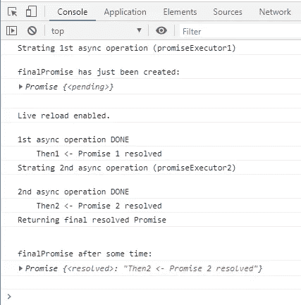
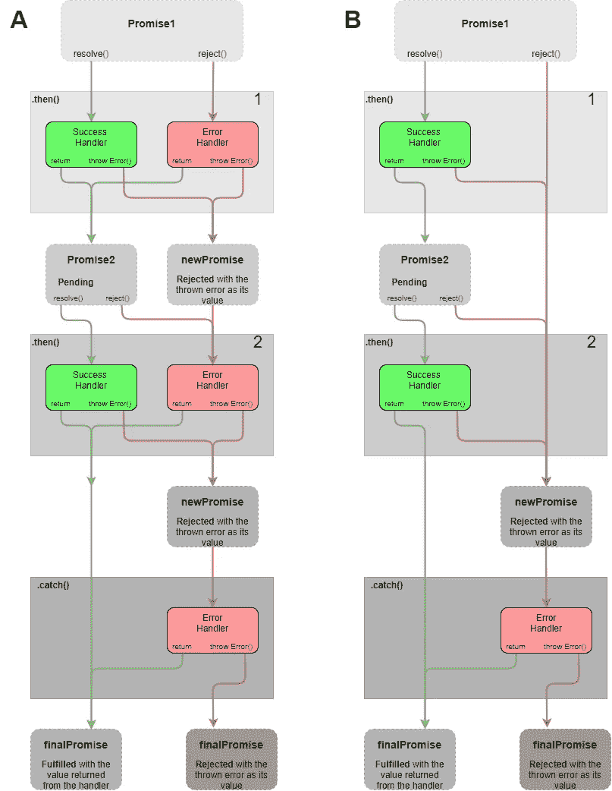

# JavaScript 承诺链—基础知识

> 原文：<https://levelup.gitconnected.com/javascript-promise-chaining-basics-e2618c5e74a9>

## 没有看起来那么难。代码、图表和截图。



这篇文章解释了什么是承诺链以及它是如何工作的。你可以在我之前的一篇简单易懂的文章中找到关于承诺的基本解释。如果你是这个话题的新手，那么我建议你[先读一下](https://medium.com/swlh/javascript-promise-basics-d8465d70a54f)。

虽然承诺和承诺链可能看起来复杂和难以理解，但它们可以让我们的生活更轻松。正如 Marijn Haverbeke 在他的书《雄辩的 JavaScript》中所写的那样——编程的艺术是控制复杂性的技巧。JavaScript 语言中加入了帮助管理代码复杂性的承诺。

在我看来，让承诺变得具有挑战性的是所有在后台发生的事情，这些事情在阅读代码后并不明显。这就是理解基本概念如此重要的原因。

> “编程的艺术是控制复杂性的技巧”——马林·哈弗贝克

# 一点点承诺理论

承诺是一个具有许多属性和方法的对象。它可能处于以下三种状态之一:

*   ***待定*** :初始状态，既不履行也不拒绝
    [[承诺状态]]:*待定*”
*   ***已完成*** :操作成功完成
    [[PromiseStatus]]: " *已解决*"
*   ***被拒绝*** :操作失败
    [[PromiseStatus]]::*被拒绝*

我们使用构造函数 *Promise()* 创建了一个 Promise 的实例。首次创建承诺对象时，它处于“待定”状态。构造函数有一个参数——执行函数(解析器)。executor 函数启动一个异步任务，并定义实现和拒绝承诺的条件。

我们可以使用 *then()* 方法将成功和错误处理程序附加到承诺上。我们可以在承诺达成(即履行或拒绝)之前或之后这样做。如果一个处理程序被附加到一个已解决的承诺，那么它会被尽快调用。

成功和错误处理程序总是返回承诺。如果我们从处理程序返回一个值，那么处理程序将返回自动生成的已解决的承诺，该值就是它的值。这些自动生成的已解决承诺可以由开发人员定义的新的待定承诺来替换。为此，您只需从处理程序返回一个新的承诺。

# 承诺链—演示代码

虽然下面的演示代码对于这样的文章来说可能有点太长，但是它非常简单。它包含大量重复的代码。它创建了一个承诺，第一个承诺的成功处理程序创建了另一个待定的承诺。有一系列的 2 个 *then()* 方法加上最后的一个 *catch()* 方法。延迟函数用于模拟异步任务。

我设计了这个简短的程序来探索承诺的基本概念，所以请随意复制和使用它。图 2 中的图表 A 应该使逻辑非常清晰。

通常，我们从第一个 Promise executor 函数开始第一个异步任务，并执行程序的其余部分。这开始了承诺链。所有同步代码都在第一个异步任务完成之前完成。当第一个异步任务完成时，我们开始第二个异步任务。这两个任务都有各自的成功和错误处理程序。然后，我们从链中返回最终解决的承诺。

承诺链—演示代码



图一。安慰



图二。承诺链图。a:演示代码——独立的错误处理程序，B:备选方案——一个通用的错误处理程序。

演示代码的主干是这一部分(第 61–64 行)…

```
**let finalPromise = new Promise( promiseExecutor1 )**  // EXECUTOR
**.then( then1success, then1failure ) **                // THEN 1
**.then( then2success, then2failure )**                 // THEN 2
**.catch( commonErrorHandler )**                        // CATCH
```

首先，让我们先看看这里发生了什么，而不要深入细节。我们用承诺构造函数 *Promise()* 创建了一个新的承诺对象 finalPromise。我这样命名 Promise 对象是有原因的。它从承诺链的末端得到什么。finalPromise 要么获取由最后一个 *then()* 方法返回的承诺，要么获取由 *catch()* 方法返回的承诺。在此之前，它处于挂起状态。

所以我们调用 Promise 构造函数 *Promise()* ，用一个 executor 函数作为参数。执行者函数 *promiseExecutor1()* 被马上调用(执行者 1)。这是我们开始异步任务并定义成功和失败条件的地方。

接下来，我们用一个 *then()* 方法(THEN 1)为第一个异步任务附加成功和错误处理程序。 *Then()* 采用两个参数—函数:

*   如果异步任务成功完成，则调用第一个函数(从 executor 函数调用 *resolve()* )
*   第二个在异步任务失败时调用(从 executor 函数调用 *reject()* )。

方法会自动创建并返回新的已解析的承诺，这样我们就可以为这些新的承诺附加更多的成功和错误处理程序。这些自动生成的承诺可以替换为我们定义的承诺。这就是我们开始第二个异步任务的方式。我们可以从第一个 *then()* 方法(THEN 1)返回一个新的待定承诺，并使用下一个 *then()* 方法(THEN 2)为该待定承诺附加成功和错误处理程序。

最后是 *catch()* 方法。它非常类似于 *then()* 方法，除了它只定义了在失败或错误的情况下做什么。一个 *then()* 方法的第二个参数是可选的。这意味着我们可以定义在承诺兑现的情况下做什么，并跳过错误处理。错误将通过链传播，直到被某个东西捕获。这就是通常位于链末端的 *catch()* 方法。见图 2 B。

如果我们抛出一个错误并且没有错误处理程序，我们将从承诺链中返回一个被拒绝的承诺。

## 承诺 1

正如我已经提到的，一切都从第 61 行开始。这里，我们创建了一个新的承诺对象— finalPromise。我们使用 Promise 构造函数 *Promise()* 来实现。构造函数接受一个参数，这个参数是执行函数— *promiseExecutor1()* 。

```
**let finalPromise = new Promise( promiseExecutor1 )**  // EXECUTOR
```

*第 6 行定义的 promiseExecutor1()* 马上调用。这个函数在控制台中打印一条消息，让我们知道第一个异步任务刚刚开始(或者即将开始)，然后它调用 *setTimeout()* —我们的异步任务，然后它终止。

```
Starting 1st async operation (promiseExecutor1)
```

在执行了这个 executor 函数之后，我们刚刚用 *Promise()* 创建的承诺被挂起，因为 *promiseExecutor1()* 没有立即调用 *resolve()* ，并且因为我们将成功和错误处理程序附加到了该承诺上。

传递给 *setTimeout()* (第 8 行)的回调函数在延迟后运行，打印另一条消息。这一次它让我们知道任务已经完成了(图 1)。我们的异步任务是在延迟后解析承诺。因此，它通过调用*resolve()—*executor 函数的第一个参数来解析承诺。

```
1st async operation DONE
```

该承诺以值“承诺 1 已解决”解决。如果我们没有附加一个 *than()* 方法，那么 finalPromise 将得到它，而没有任何成功或错误处理。这很容易通过注释掉链中所有的 *then()* 和 *catch()* 方法来测试(第 62-64 行)。

然而，我们有一个 *then()* 方法。完成承诺会触发其成功或错误处理程序。第一个解析的承诺由 first *then()* 方法(THEN 1)处理。使用 *resolve()* 解析承诺，因此调用第 27 行定义的成功处理程序 *then1success()* 。

## 然后 1

第一个 *then()* 方法在控制台(图 1)中打印出它的名字“Then1”和一个箭头，以及它从上面的 executor 函数接收到的任何内容。

```
Then1 <- **Promise 1 resolved**
```

这种先*后*的方法值得我们注意一下。在我学习承诺的时候，有一段时间让我止步不前的是我对基本概念的不理解。

*Then()* 方法总是返回承诺。如果你做了…

```
**return 7**   // returns a new promise resolved with 7 as its value
```

…然后，您返回一个用该价值解决的新承诺，而不是价值本身。失败处理程序 *then1failure()* 返回一个自动生成的解析承诺，其值为 message1。

我们可以用自己的承诺替换自动生成的已解决的承诺。这正是我们在成功处理程序中所做的事情— *then1success()* (第 30 行)。

## 承诺 2

在第 30 行，我们创建了一个新的承诺，它运行第 15 行中定义的 executor 函数— *promiseExecutor2()* 。这个 executor 函数几乎与第一个相同。唯一的区别是字符串。

```
**return new Promise(promiseExecutor2)** // returns our new promise
```

同样，当我们创建承诺时，executor 函数会立即运行。它打印一条消息并启动一个异步任务，即第二个任务，然后终止，让承诺处于未决状态。这个消息让我们知道第二个任务刚刚开始(或者在我们开始阅读它之前就开始了)

```
Starting 2nd async operation (promiseExecutor2)
```

这里的好处是，我们为第二个承诺定义的成功或错误处理程序只有在承诺完成后才会被调用。在此之前，如果有必要，我们可以处理来自第一个异步任务的响应，处理一些事件，等待，或者做任何我们想做的事情。

在 *promiseExecutor2()* 中实现的 1 秒延迟之后，我们的第二个承诺得到解决。同样，我们打印一条消息，让我们知道第二个任务现在已经完成。

```
2nd async operation DONE
```

第二个 *then()* 方法的成功处理程序被调用—第 40 行。第二个异步任务已经完成，我们已经准备好处理从它那里收到的值。

## 然后 2

第二个成功处理程序 *then2success()* 也与第一个非常相似。这里的两个主要区别是信息，更重要的是我们从中返回了什么。同样，其中一条消息(message2)告诉我们处理程序的名称以及它从第二个异步任务收到了什么。

```
Then2 <- **Promise 2 resolved**
```

另一个通知这是链条的终点。

```
Returning final resolved Promise
```

接下来，我们返回一个字符串——message 2，而不是像以前那样返回一个新的待定承诺。然而，正如我已经提到的，这个字符串将被自动创建的 resolved Promise 所包装。换句话说，我们从第二个成功处理程序返回的是一个新的解析承诺，其值为该字符串。

链中没有更多的 *then()* 方法，最后一个成功处理程序返回了一个已解析的承诺。我们在第 61 行创建的 finalPromise 将获得这个解析的承诺，其值为 message2。

如果我一路上跟不上你，请看图 A(图 2)。

总结这一部分:

*   首先，创建一个新的承诺(finalPromise)。它将一直处于未决状态，直到我们在承诺链的末端返回已解决的承诺。
*   executor 函数( *promiseExecutor1()* )使用 *setTimeout()* 将第一个承诺(Promise1)的解析延迟 1 秒。
*   我们使用 *then()* 方法将成功和错误回调附加到第一个承诺。
*   我们使用第二个 *then()* 方法将成功和错误回调附加到从第一个 *then()* 方法返回的第二个承诺(Promise2)。
*   暂时什么也没发生
*   1 秒钟的延迟到期，第一个承诺得到解决。第一个承诺的成功处理程序称为。这个成功处理程序返回一个新的待定承诺，该承诺将在另一个 1 秒钟的延迟后得到解决。
*   暂时什么也没发生
*   第二个 1 秒延迟到期，第二个承诺(Promise2)得到解决。第二个承诺的成功处理程序返回一个自动生成的承诺，以我们的消息作为其值。
*   最终诺言终于解决了。

## 如果…会怎样

最好是编写自己的代码来探索一个新概念，但我认为本文中展示的演示代码是一个很好的起点。可以使用' *if'* 语句轻松地重定向承诺流，并且可以使用图表作为地图来帮助您浏览链的逻辑。

尝试从一个 *then()* 方法中抛出一个错误，并移除所有错误处理程序。让 *catch()* 方法处理错误。如果用 *setTimeout()* 包装成功/错误处理程序的全部代码，会发生什么？尝试从成功/错误处理程序返回您自己的承诺。尝试将第三个 *then()* 方法添加到链中。看多简单。

# 结束了

显然，还有更多。然而，我相信这是学习如何使用承诺链的一个很好的起点。我认为学习更复杂概念的最好方法是一次一小步。

我希望这篇文章是有用的。如果你有任何问题或意见，请告诉我。