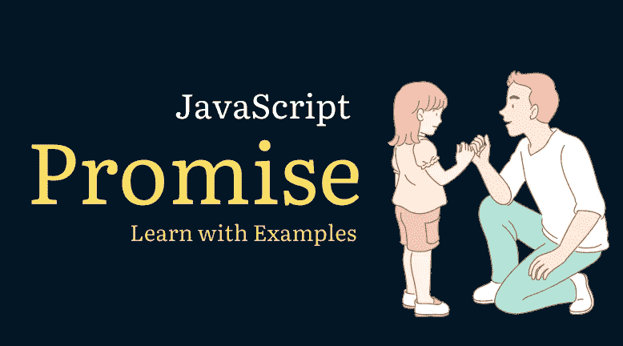
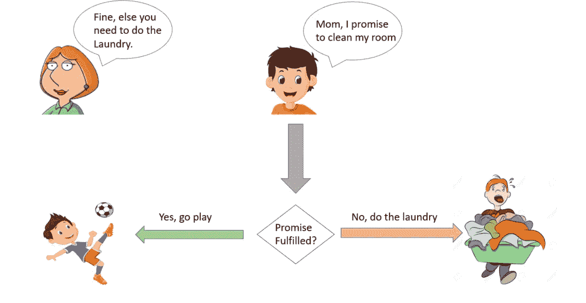

# JavaScript 承诺

> 原文：<https://levelup.gitconnected.com/javascript-promises-5d798693a2da>

虽然同步代码更容易跟踪和排除故障，但异步代码在执行和适应性方面总的来说更好。当你可以毫不迟疑地触发各种需求，然后在每一个都准备好了之后再处理它们的时候，为什么还要“拖延时间”呢？Promises 正在变成 JavaScript 世界的主要部分，许多新的 API 都是通过 promise 推理实现的。我们应该调查承诺，API，它是如何被利用的！



# 野外的承诺

XMLHttpRequest API 是异步的，但是*不*使用 Promises API 吗？但是，现在有一些本机 API 使用了承诺:

*   [电池 API](https://davidwalsh.name/javascript-battery-api)
*   [取 API](https://davidwalsh.name/fetch) (XHR 的替换)
*   ServiceWorker API

承诺只会变得越来越普遍，所以所有前端开发人员都要习惯它们，这一点很重要。同样值得注意的是 Node.js 是另一个承诺平台(显然，因为承诺是一个核心语言特性)。

测试承诺可能比你想象的要容易，因为 `*setTimeout*` *可以作为你的异步“任务”！*



# 基本承诺用法

构造函数`new Promise()`应该只用于遗留的异步任务，比如使用`setTimeout`或`XMLHttpRequest`。用`new`关键字创建一个新的 promise，Promise 向所提供的回调函数提供`resolve`和`reject`函数:

```
var p = new Promise(function(resolve, reject) {

	// Do an async task async task and then... if(/* good condition */) {
		resolve('Success!');
	}
	else {
		reject('Failure!');
	}
});p.then(function(result) { 
	/* do something with the result */
}).catch(function() {
	/* error :( */
}).finally(function() {
   /* executes regardless or success for failure */ 
});
```

开发人员可以根据给定任务的结果，在回调函数体中手动调用`resolve`或`reject`。一个现实的例子是将 XMLHttpRequest 转换为基于承诺的任务:

```
function get(url) {
  // Return a new promise.
  return new Promise(function(resolve, reject) {
    // Do the usual XHR stuff
    var req = new XMLHttpRequest();
    req.open('GET', url);

    req.onload = function() {
      // This is called even on 404 etc
      // so check the status
      if (req.status == 200) {
        // Resolve the promise with the response text
        resolve(req.response);
      }
      else {
        // Otherwise reject with the status text
        // which will hopefully be a meaningful error
        reject(Error(req.statusText));
      }
    };

    // Handle network errors
    req.onerror = function() {
      reject(Error("Network Error"));
    };

    // Make the request
    req.send();
  });
}

// Use it!
get('story.json').then(function(response) {
  console.log("Success!", response);
}, function(error) {
  console.error("Failed!", error);
});
```

有时候你不需要*在承诺内完成一个异步任务——如果*有可能*采取一个异步动作，然而，返回一个承诺将是最好的，这样你就可以总是依靠一个来自给定函数的承诺。在这种情况下，您可以简单地调用`Promise.resolve()`或`Promise.reject()`而不使用`new`关键字。例如:*

```
var userCache = {};function getUserDetail(username) {
  // In both cases, cached or not, a promise will be returned if (userCache[username]) {
  	// Return a promise without the "new" keyword
    return Promise.resolve(userCache[username]);
  } // Use the fetch API to get the information
  // fetch returns a promise
  return fetch('users/' + username + '.json')
    .then(function(result) {
      userCache[username] = result;
      return result;
    })
    .catch(function() {
      throw new Error('Could not find user: ' + username);
    });
}
```

因为承诺总是被返回，所以您总是可以对其返回值使用`then`和`catch`方法！

# 然后

所有 promise 实例都有一个`then`方法，允许您对 promise 做出反应。第一个`then`方法回调接收由`resolve()`调用给它的结果:

```
new Promise(function(resolve, reject) {
	// A mock async action using setTimeout
	setTimeout(function() { resolve(10); }, 3000);
})
.then(function(result) {
	console.log(result);
});// From the console:
// 10
```

`then`当承诺完成时，会触发回调。你也可以链接`then`方法回调:

```
new Promise(function(resolve, reject) { 
	// A mock async action using setTimeout
	setTimeout(function() { resolve(10); }, 3000);
})
.then(function(num) { console.log('first then: ', num); return num * 2; })
.then(function(num) { console.log('second then: ', num); return num * 2; })
.then(function(num) { console.log('last then: ', num);});// From the console:
// first then:  10
// second then:  20
// last then:  40
```

每个`then`接收前一个`then`返回值的结果。

如果一个承诺已经解决了，但是再次调用了`then`，回调将立即触发。如果承诺被拒绝了，而你在被拒绝后打电话`then`，那么回拨永远不会打。

# 捕捉

`catch`当承诺被拒绝时，执行回调:

```
new Promise(function(resolve, reject) {
	// A mock async action using setTimeout
	setTimeout(function() { reject('Done!'); }, 3000);
})
.then(function(e) { console.log('done', e); })
.catch(function(e) { console.log('catch: ', e); });// From the console:
// 'catch: Done!'
```

向`reject`方法提供什么取决于你自己。一个常见的模式是向`catch`发送一个`Error`:

```
reject(Error('Data could not be found'));
```

# 最后

新引入的`finally`回调无论成功还是失败都会被调用:

```
(new Promise((resolve, reject) => { reject("Nope"); }))
    .then(() => { console.log("success") })
    .catch(() => { console.log("fail") })
    .finally(res => { console.log("finally") });// >> fail
// >> finally
```

# `Promise.all`

想想 JavaScript 加载器:有时您触发了多个异步交互，但只想在所有交互都完成后才响应——这就是`Promise.all`的用武之地。`Promise.all`方法接受一个承诺数组，并在所有承诺都解决后触发一次回调:

```
Promise.all([promise1, promise2]).then(function(results) {
	// Both promises resolved
})
.catch(function(error) {
	// One or more promises was rejected
});
```

思考`Promise.all`的一个完美方式是一次发出多个 AJAX(通过`fetch`)请求:

```
var request1 = fetch('/users.json');
var request2 = fetch('/articles.json');Promise.all([request1, request2]).then(function(results) {
	// Both promises done!
});
```

您可以组合像`fetch`这样的 API 和电池 API，因为它们都返回承诺:

```
Promise.all([fetch('/users.json'), navigator.getBattery()]).then(function(results) {
	// Both promises done!
});
```

当然，处理拒绝是困难的。如果任何承诺被拒绝，第一个拒绝将触发`catch`:

```
var req1 = new Promise(function(resolve, reject) { 
	// A mock async action using setTimeout
	setTimeout(function() { resolve('First!'); }, 4000);
});
var req2 = new Promise(function(resolve, reject) { 
	// A mock async action using setTimeout
	setTimeout(function() { reject('Second!'); }, 3000);
});
Promise.all([req1, req2]).then(function(results) {
	console.log('Then: ', results);
}).catch(function(err) {
	console.log('Catch: ', err);
});// From the console:
// Catch: Second!
```

随着越来越多的 API 走向承诺，T21 将会非常有用。

# `Promise.race`

`Promise.race`是一个有趣的函数——它不是等待所有承诺都被解决或拒绝，而是在数组中的任何承诺被解决或拒绝后立即触发:

```
var req1 = new Promise(function(resolve, reject) { 
	// A mock async action using setTimeout
	setTimeout(function() { resolve('First!'); }, 8000);
});
var req2 = new Promise(function(resolve, reject) { 
	// A mock async action using setTimeout
	setTimeout(function() { resolve('Second!'); }, 3000);
});
Promise.race([req1, req2]).then(function(one) {
	console.log('Then: ', one);
}).catch(function(one, two) {
	console.log('Catch: ', one);
});// From the console:
// Then: Second!
```

一个用例可能是触发对一个主要源和一个次要源的请求(如果主要源或次要源不可用)。

# 习惯承诺

大多数新的 JavaScript APIs 都是用基于承诺的模式实现的，这是一件好事！开发人员能够避免回调地狱，异步交互可以像任何其他变量一样传递。承诺需要一些时间来适应工具的存在，现在是学习它们的时候了！