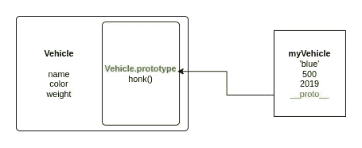
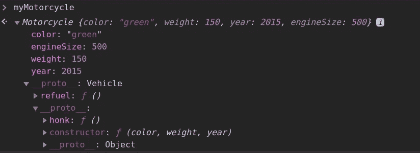

# JavaScript 原型链和继承从头开始解释。

> 原文：<https://levelup.gitconnected.com/javascript-prototype-chain-and-inheritance-explained-from-scratch-5f9d23f54f9>

本教程的代码笔[在这里](https://codepen.io/r0ss26/pen/RwrpYjP?editors=1112)。

本文讨论了如何在 JavaScript 中实现面向对象的编程模式。特别是，本文涵盖:

*   目标
*   原型遗传
*   函数构造函数
*   原型链
*   子类继承

# (几乎)一切都是物体

JavaScript 中最基本的概念之一是“一切都是对象”。实际上，这并不完全正确，因为 JavaScript 也包含不是对象的原始值。这些原始值是:

*   数字
*   用线串
*   布尔运算
*   不明确的
*   空

然而，除了这些原始值，JavaScript 中的所有其他东西都是对象。这包括:

*   数组
*   功能
*   目标
*   日期
*   数字、字符串和布尔值的包装器

在我们继续深入之前，让我们弄清楚对象和原语之间的区别。简单地说，原语没有方法——它们只是内存中表示的一个值。另一方面，对象是数据的集合，可以存储对其他实体的引用。这些实体(属性)可以是诸如字符串或数字之类的原语，也可以是其他对象(包括函数)。

# 原型遗传

编程中的继承意味着一个对象基于另一个对象，并且可以访问其他对象的属性和方法。

JavaScript 实现了原型继承，这与 C 或 Java 中的经典继承相反。这是一个重要的区别，因为在经典继承模型中，当一个*对象实例*从一个*类*继承，并且一个子类可以从一个父类继承时，就会发生继承。

另一方面，原型继承支持对象从任何其他对象继承，而不是从类继承。

原型继承的定义特性是对象实例可以通过原型链访问继承的属性和方法。这是通过 JavaScript 中的每个对象都被自动赋予一个`prototype`属性来实现的。当创建一个继承自父对象的子对象时，子对象可以访问 parents `prototype`属性。`proptotype`属性本身是一个对象，因为子对象可以访问它们的父对象原型属性，所以子对象可以访问存储在这里的任何属性和方法。

例如，假设我们有一个`Vehicle`对象，我们将使用`Vehicle`来创建`Vehicle`类型的*实例*。在许多其他语言中，`Vehicle`会被认为是一个类，因为它是创建`Vehicle`类型实例的蓝图。然而 JavaScript 没有类的概念，相反`Vehicle`是一个*构造器*——一个用作创建其他对象的蓝图的对象。

# 构造函数、实例和 new 关键字

让我们用一个例子来说明原型继承。

回到汽车制造商，这看起来如何？在 JavaScript 中，我们使用函数来实现构造函数——这些被恰当地称为函数构造函数。

这就是我们如何用函数构造器实现`Vehicle`类:

然后，我们可以使用这个函数构造函数来创建一个车辆实例，如下所示:

`myVehicle`变量现在保存一个使用`Vehicle`函数构造函数创建的`Vehicle`实例。

这可以通过使用`new`关键字来实现。

new 关键字与函数构造函数一起使用，以便创建实例。在幕后，新关键字通过以下步骤工作:

1.  创建一个新的空对象`{}`。
2.  将`this`变量设置为步骤 1 中创建的空对象。
3.  使用引用新创建对象的`this`关键字执行函数。

通过这些步骤，我们可以创建一个具有属性`color` `weight`和`year`以及方法`honk`的车辆。

但是原型呢？

我们目前实施`Vehicle`的方式并不理想。在这个实现中，我们没有利用原型的力量。因为我们已经在构造函数体中定义了 honk 方法，所以每个新的 vehicle 实例都将在内存中存储自己单独的`honk`副本。因为`honk`总是同一个函数，所以每个实例存储自己唯一的副本是没有意义的。

这就是原型的力量所在。

请记住，对象可以访问它们的父对象 prototype 属性，所以如果我们将`honk`方法存储在`Vehicle`的 prototype 属性中，所有实例都可以访问它，而不需要存储它们自己的副本。

我们可以这样实现:

# 原型链

正如我们在前面的例子中看到的，我们的`myVehicle`实例能够执行`honk`方法，该方法存储在用于创建它的函数构造器的 prototype 属性中。这是可能的，因为原型链。

本质上，当调用`honk`方法时，JavaScript 将查看调用对象的属性，在本例中是`myVehicle`，用于名为`honk`的方法(或属性)。如果在对象上没有找到这个属性，我们将原型链上移一级。

为了在对象和它的原型之间建立链接，使用了`myVehicle`的`__proto__`属性。这个`__proto__`属性本质上是一个到它的构造器原型的链接。

一般来说，instances `__proto__`属性是到它的原型的链接(它的构造器的原型属性)。

对象和它的构造函数之间关系的表示。

我们可以在控制台中演示这一点。

因此，通过`__proto__`我们可以访问`Vehicle.prototype`来寻找鸣喇叭方法。因为我们在原型上显式存储了鸣响方法，所以我们能够执行它。

这样，`Vehicle`的所有实例都可以访问 honk 方法，而不需要存储它们自己的副本。

# 子类继承

现在假设我们有一个不同的构造函数，它类似于`Vehicle`但更具体，比如一个`Motorcycle`构造函数。`Motorcycle`具有与`Vehicle`相同的属性和功能，但是它也有一个`engineSize`属性和一个`refuel`方法。

因为一个`motorcycle`和一个`Vehicle`共享相同的属性，我们可以使用继承来简化我们的代码。通过让摩托车从车辆继承，我们避免了两次指定共享的属性和方法。

让我们看看如何实现一个`Motorcycle`子类。

*注意:类和子类是经典继承而非原型继承的特征，这意味着* `*Motorcycle*` *实际上不是子类。在 JavaScript 中，我们使用原型链来模拟类和子类。*

为了一步一步地分解它，我们将从最后一行开始，在这里我们创建一个新的`Motorcycle`实例。正如我们前面讨论的，创建了一个新的空对象，然后我们调用`Motorcycle`函数构造函数，将`this`的值设置为新的空对象。

在`Motorcycle`函数构造函数体内，我们遇到了`call`方法。本质上，这一行做的是调用`Vehicle`构造函数，传入`color`、`weight`和`year`。`call`方法允许我们为`this`指定自己的值，该值在执行时将成为新的`myMotorycle`对象。

这允许我们在设置摩托车实例的属性时执行`Vehicle`构造函数。然后我们像平常一样设置`engineSize`属性。

我们只是少了一步。目前`motorcycle`实例不知道如何访问`Vehicles`原型属性，因此无法访问`honk`方法。

为了实现这一点，我们使用了`Object.create`方法。`Object.create`允许我们创建一个新对象，同时指定该对象的原型。我们传入的参数将是新创建的对象的原型。

至此，我们已经连接了原型链。

`Motorcycle.prototype`的`__proto__`属性将被设置为`Vehicle.prototype`，摩托车实例现在可以访问存储在摩托车原型和车辆原型上的所有属性和方法。

为了演示这一点，让我们将加油方法添加到摩托车原型中。

控制台中的摩托车原型链。

# 结论

JavaScript 实现面向对象编程的方式不同于许多其他使用基于类的系统的语言。通过很好地掌握原型继承、函数构造器和原型链，你可以充分利用语言的特性，理解 JavaScript 是如何工作的。