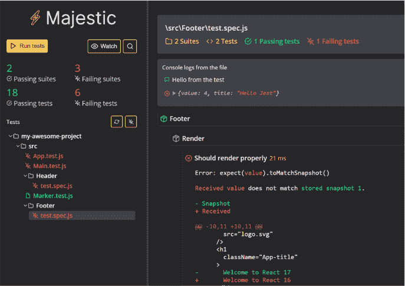

# JavaScript 单元测试。NET 开发人员—第 1 部分环境设置和工具

> 原文：<https://levelup.gitconnected.com/javascript-react-redux-unit-testing-for-net-developers-part-1-environment-setup-and-tooling-ad54411d9a28>

# 介绍

这是一个单元测试指南，面向已经熟悉单元测试并熟悉在. NET 环境中使用工具的开发人员。

Javascript 的行为有相当多的差异，这可能会在创建可测试代码的过程中出现许多“陷阱”。在本指南中，我想向您展示一系列相似之处，这些相似之处可以转化为您已经熟悉的内容。

我们将在本指南中介绍以下内容:

*   环境、工具和设置。
*   用玩笑来测试和嘲笑
*   测试反应组件
*   测试异步方法和 Sagas 以及 Redux 存储。

我在本指南中不涉及的是我假设你已经熟悉的东西。这些是三 A 模式，即安排、行动、断言。设计模式和坚实的原则。我也不会讨论如何设置 React 和 Redux，我假设您已经对这两者有所了解。我将在另一篇文章中介绍如何设置。

# 环境设置和工具

我们将使用的代码编辑器是 VSCode。这是一个很棒的编辑器，几乎提供了我们需要的所有功能。它有一些很棒的扩展，特别是最近对单元测试的一些非常优秀的扩展。

除了 VSCode，我们还将使用 Jest，它将作为我们的测试运行器、模拟和单元测试框架。Enzyme 将用于测试 React 组件，Majestic 用作测试 UI，让熟悉 Visual Studio 测试工具的人松了一口气。

# 设置笑话

Jest 在理想情况下应该是全局设置的，你可以在命令行输入`npm install -g jest`来实现。

# 设置酶

Enzyme 是一个重要的工具，它允许我们在内存中模拟 react 组件并查询 React 虚拟 dom 或将 React 虚拟 dom 转换为 HTML dom 并进行查询。

它能够做到这一点是因为在 Enzyme 的背后是另外两种强大的 Javascript 技术的结合。一个是 JSDOM([https://github.com/jsdom/jsdom](https://github.com/jsdom/jsdom))，它可以被认为是一个内存无头浏览器，另一个是 Cheerio([https://github.com/cheeriojs/cheerio](https://github.com/cheeriojs/cheerio))，它解析、选择和操作 DOM。Cheerio 使用 CSS 样式选择器选择 JSDOM 中的项目。

要安装 Enzyme，请转到您的应用程序目录并运行命令`npm i --save-dev enzyme`。除了 Enzyme，你还需要安装允许 Enzyme 使用 React 的适配器，在编写 React 时，它的版本是 16。运行命令`npm i --save-dev enzyme enzyme-adapter-react-16`

# 设置 Majestic

Jest 本身是一个很好的工具，但是目前你只能在命令行上运行测试，这对于一些人来说是可以的，但是如果你有很多测试失败，那么在命令窗口中看到这么多失败的单元测试并试图找出问题是很困难的。

Majestic([https://github.com/Raathigesh/majestic](https://github.com/Raathigesh/majestic))是一个给你类似于 Visual Studio 测试浏览器体验的伟大工具。

Majestic 允许您以连续的可视化方式查看您的测试，它可以运行您的解决方案中的所有测试，或者只运行选定的测试，并允许您导航到失败的测试。它还获取了单元测试失败原因的信息，并以一种更加人性化的方式呈现出来。我推荐它的使用。

要安装 Majestic，您需要全局安装它，请运行 npm install -g majestic。

# 设置 Chrome 调试

应该安装 VSCode 的 Chrome 扩展，该扩展可以将自己附加到 Chome dev tools 调试器，并允许您在 VSCode 中进行调试。如果你还没有这样做，安装这个扩展。

为了能够在运行时调试您的应用程序，您需要修改解决方案目录下“vscode”文件夹中包含的 launch.json 文件。也可以通过在 VSCode 中进入“Debug”(Ctrl+Shift+D)并选择将打开 launch.json 文件的设置 cog 来找到它。在这里，您必须确保在 configurations 属性中存在以下 json。

数组中的第一部分告诉 VSCode，在调试时，您将在本地主机上的端口 3000 上启动应用程序(根据需要进行更改)。第二部分是当你想调试你的单元测试时需要做的事情。

# 便捷的 VSCode 扩展

以及其他一些可能会派上用场的扩展:

*   括号对着色程序——在代码中使用许多括号的可视化辅助工具。
*   git Lens——为您提供类似于在 Visual Studio 中编写 lens 代码的体验，并在代码中显示谁是最后的作者。
*   代码拼写检查器—拼写检查
*   材料图标主题——美观，给你好看的图标。

# 摘要

到目前为止，我们已经为 VSCode 安装了一些工具和扩展。我们已经讨论了这些工具在类似于 Visual Studio 的单元测试和调试体验方面给你带来了什么。

在下一集里，我们将真正尝试用 Jest 开始单元测试和模仿(是的，我说的是模仿 JavaScript)。