# JavaScript 集合:它们是什么以及如何使用它们

> 原文：<https://levelup.gitconnected.com/javascript-sets-what-they-are-and-how-to-use-them-6d6c8bd6d940>

随着 ES6 (ECMAScript 6)的引入，引入了一种新的内置 JavaScript 对象类型:Set。集合对象是值的集合。集合的不同之处在于它只存储唯一的值。因此，使用集合可以用新的方式解决某些问题。

集合有一些内置的方法，如果您想开始在代码中使用它们，您一定要熟悉它们。我将给你一个快速的解释，并告诉你如何使用它们，这样你今天就可以开始了！

# 设置和复制值

以下是集合如何处理重复值的几个快速示例:

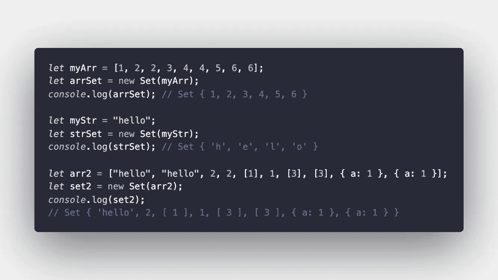

我们可以看到，在前两个例子中，重复的字符和整数没有传递到集合中。在第三个例子中，我们看到一些有趣的事情:

*   这一次，整个单词“hello”作为数组的一部分被传入，而“hello”在第二个示例中作为字符串被传入
*   我们可以看到，嵌套的数组和对象虽然是彼此的副本，但并没有被删除。

# 创建集合

要创建一个空集，您所要做的就是使用 Set()构造函数和单词“new”，如下所示。

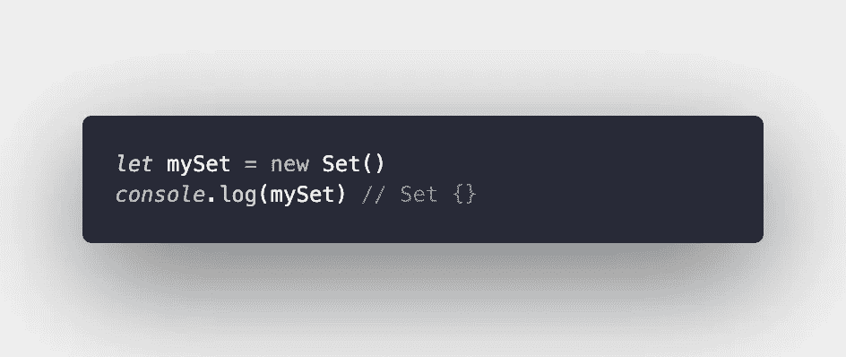

您也可以从现有阵列创建新的集合。

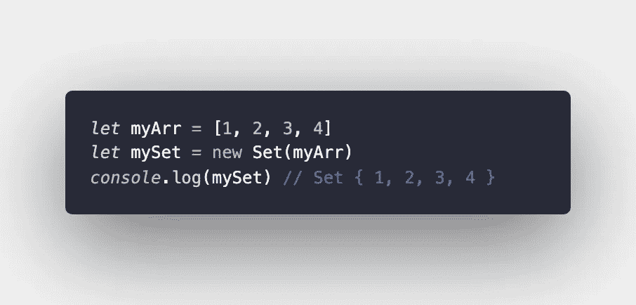

这也可以用现有的字符串来完成。正如您在下面的示例中看到的，重复的字符串不会传递到集合中。

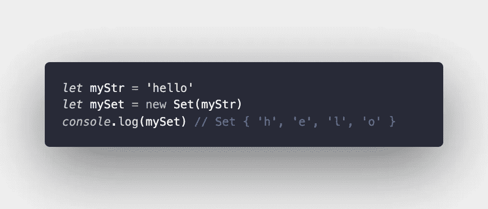

# 向集合中添加元素

让我们从一个空集开始:

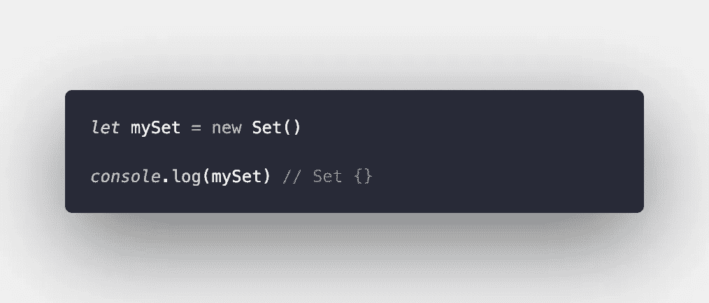

要添加到这个集合中，我们只需要使用 add()方法。

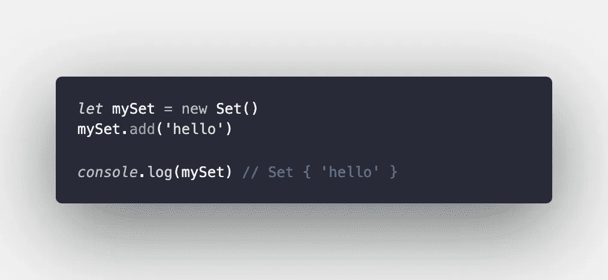

这一次，它没有删除字符串' hello '的重复字母，因为我们是将字符串作为一个整体而不是一个 iterable 传入的。如果我们试图再次传入同一个字符串，集合将不允许重复。

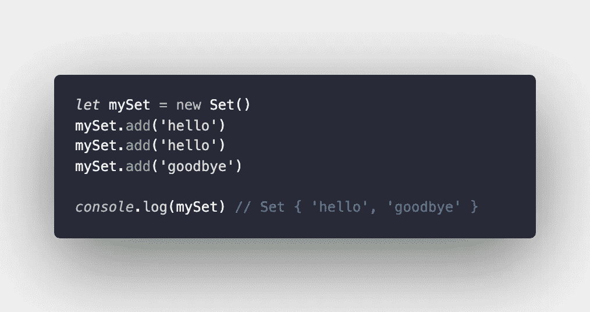

集合可以容纳的不仅仅是字符串，所以让我们传入一些其他的数据类型。集合中的值可以由字符串和整数等基本数据类型组成，也可以由对象和数组等更复杂的元素组成。

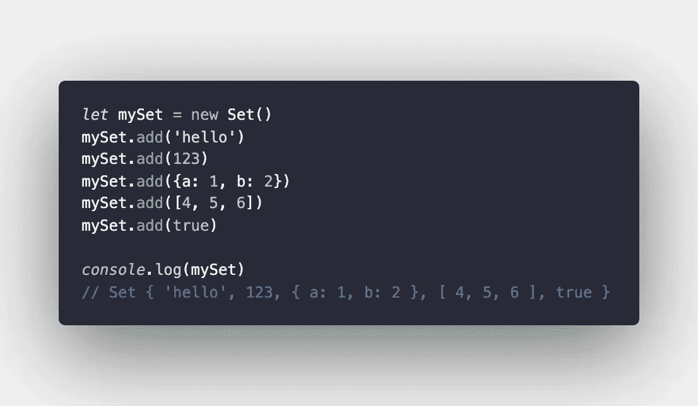

# 检查集合是否包含元素

集合提供了一种简单的方法来检查集合中特定元素的存在。调用。has()方法将完成这一任务，并将返回 true 或 false。

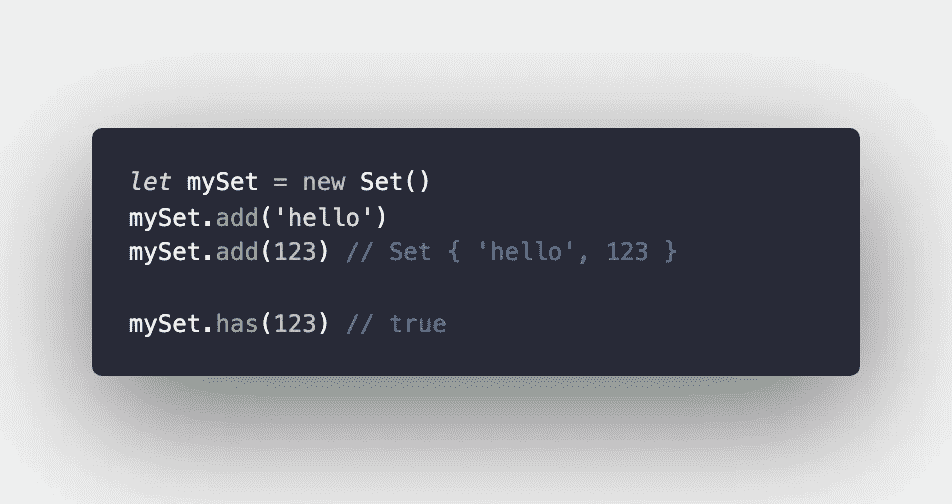

# 检查器械包的大小

如果需要知道一个集合包含多少个元素，可以调用。size()方法。以下集合包含三个元素:一个字符串、一个整数和一个数组。

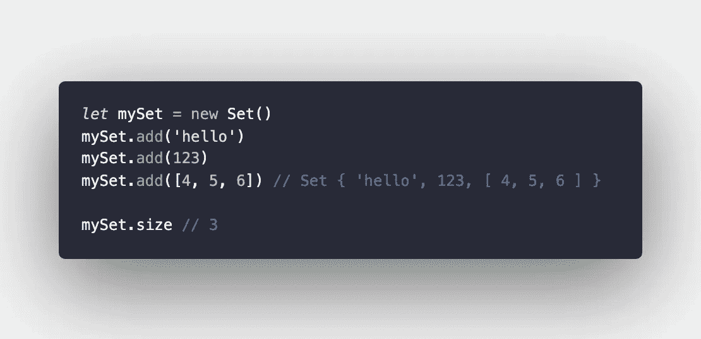

# 从集合中移除元素

若要从集合中移除元素，需要调用。delete()方法并传入要删除的元素，如下所示。

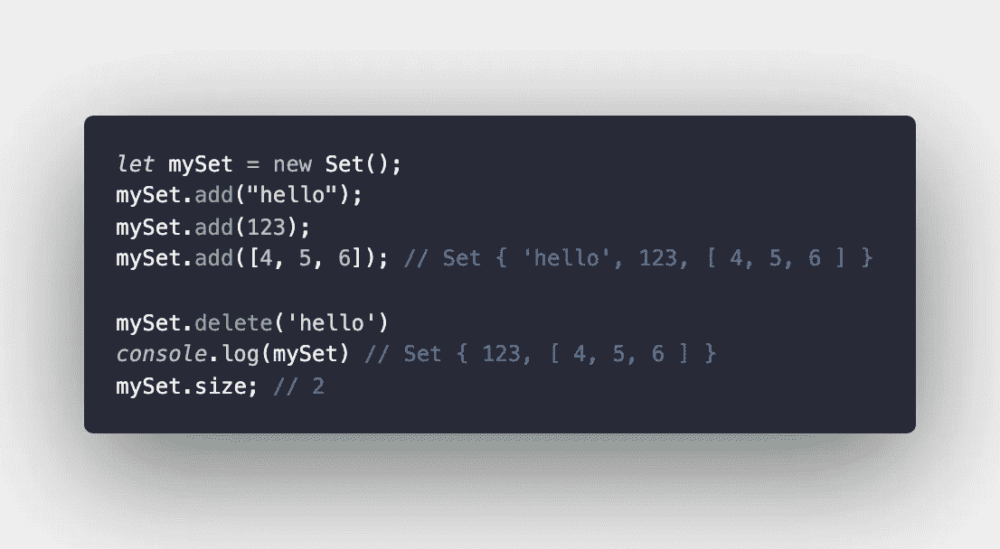

# 从集合中移除所有元素

如果希望从集合中移除所有元素，而不必逐个删除它们，可以调用。clear()方法。

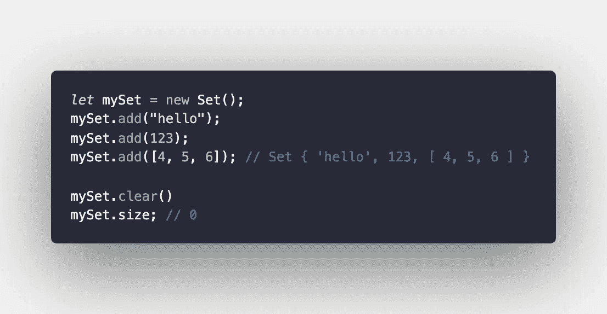

# 迭代集合中的元素

迭代集合中的每个元素可以通过几种不同的方式完成:

## 。为每一个

forEach 可以按以下方式用于循环访问集合:

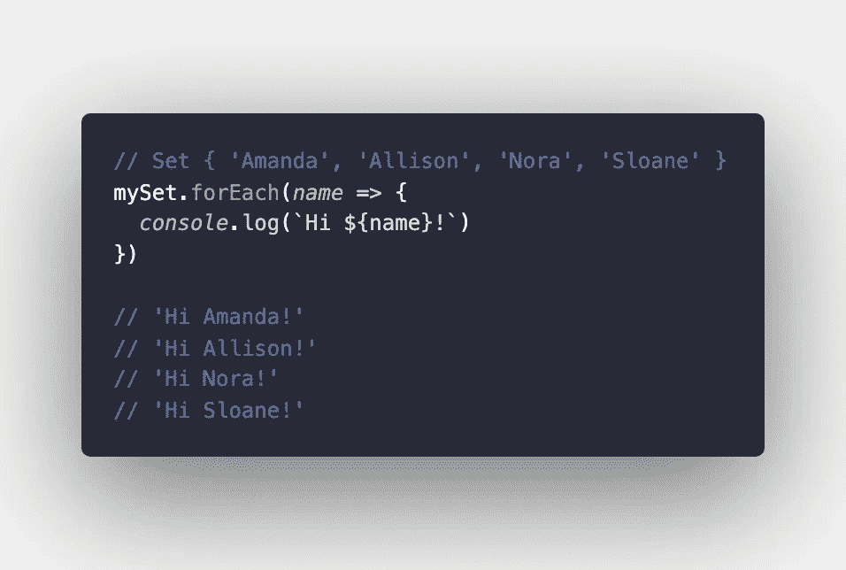

## 为了…的

使用 for…of 循环可以获得相同的结果:

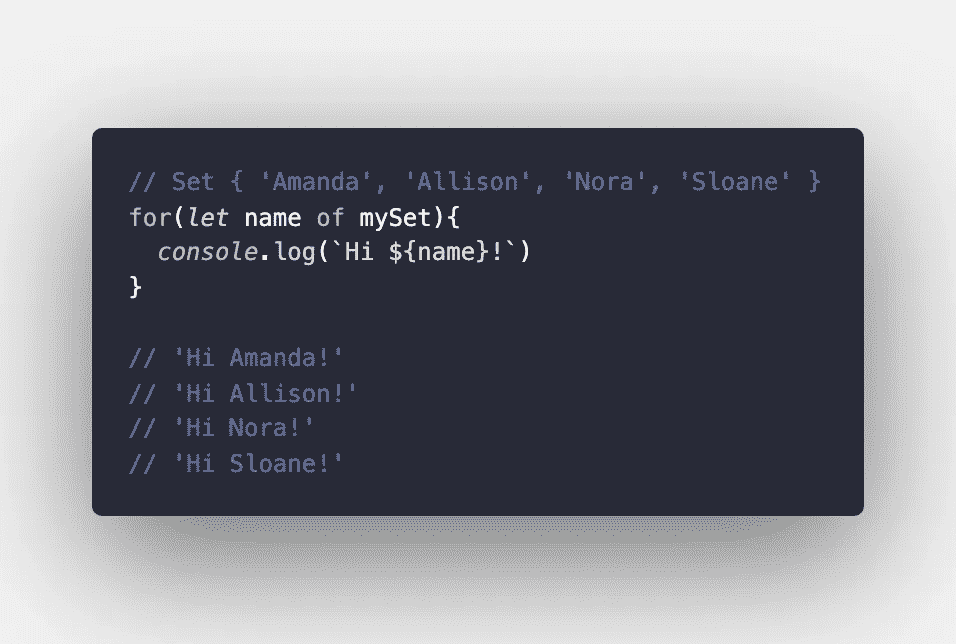

希望这能帮助您更好地理解如何在 JavaScript 项目中使用集合！如果你用一套做了我这里没有提到的有趣的事，请告诉我！

阿曼达·特劳特勒