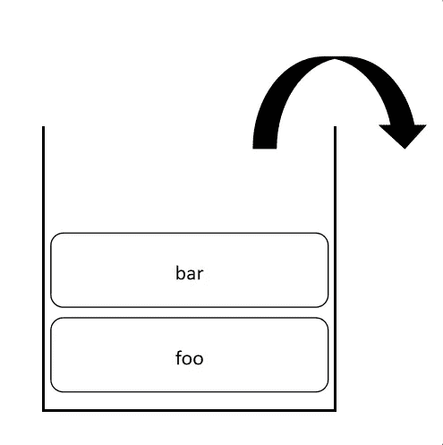
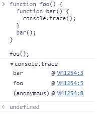
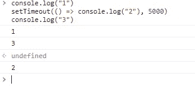
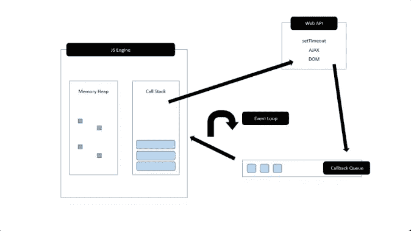

# JavaScript，单线程但非阻塞

> 原文：<https://levelup.gitconnected.com/javascript-single-threaded-but-non-blocking-45c26d4d5bcc>


照片由 [Fotis Fotopoulos](https://unsplash.com/@ffstop?utm_source=medium&utm_medium=referral) 在 [Unsplash](https://unsplash.com?utm_source=medium&utm_medium=referral) 上拍摄

当人们说 JavaScript 是单线程、非阻塞的编程语言时，那些刚刚接触 JavaScript 的人可能会感到困惑。你可能会想，怎么可能是单线程的，而不是阻塞的呢？

**单线程**

众所周知，JavaScript 是单线程的，因为它只有一个调用栈，而其他编程语言有多个调用栈。JavaScript 函数通过 LIFO(后进先出)在调用栈上执行。例如，我们有这样一段代码:

```
const foo = () => {
  const bar = () => {
    console.trace();
  }
  bar();
}foo();
```

调用栈将有 foo 进入调用栈，然后 bar。



bar()完成后，它将从调用堆栈中弹出，后面是 foo()。当打印出堆栈跟踪时，您将在下面看到一个匿名函数，它是主线程的全局执行上下文。



这似乎是合乎逻辑的，因为 JavaScript 是单线程语言，只有一个流程来执行所有这些功能。然而，如果我们在流程中有一些不可预测的或者繁重的任务(例如进行 API 调用)，我们不希望它们阻塞剩余代码的执行(否则用户可能会盯着一个冻结的屏幕)。这就是异步 JavaScript 的用武之地。

**无阻塞**

除了 JavaScript 引擎，我们还有 Web APIs、回调队列和事件循环来在浏览器中形成 JavaScript 运行时。假设我们有一段代码:

```
console.log("1")
setTimeout(() => console.log("2"), 5000)
console.log("3")
```

“setTimeout”是一个 Web API 函数，它将在一定时间后执行一个回调函数(以毫秒为单位，在本例中是 5000 毫秒)。当您执行这个脚本时，您将看到“1”和“3”被立即打印出来，而“2”大约在 5 秒钟后被打印出来。



这是幕后发生的事情:

第一个控制台日志被放入堆栈，并在控制台中打印出“1”后弹出。当 setTimeout 函数被放入堆栈时，回调函数被这个 Web API 函数设置为 await。然后，setTimeout 函数从堆栈中弹出，第三个控制台日志进入。执行完成后，从堆栈中弹出第三个控制台日志和当前全局执行上下文。

当 setTimeout 中的回调函数完成等待后，它将进入回调队列(或事件队列)等待执行。事件循环帮助并检查调用堆栈是否为空。如果为空，将创建一个新的全局执行上下文，然后这个回调函数(控制台注销“2”)将被放入堆栈，执行并弹出。



补充一下，即使您将 setTimeout 设置为延迟 0 秒，“2”仍将是最后一个被打印出来的，因为只要 Web API 被调用，它就会被放入回调队列，并且只有在堆栈为空时才会被放入堆栈。

我希望这能让你明白为什么 JavaScript 可以同时是单线程和非阻塞的。

哦，顺便说一句，如果你还需要视频解释，这里有一个很好的资源:

事件循环到底是什么？|菲利普·罗伯茨| JSConf 欧盟

如果你想看更多的网络开发或软件工程相关的内容，请关注我。干杯！