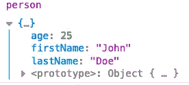

# JavaScript 扩展运算符解释(ES6)

> 原文：<https://levelup.gitconnected.com/javascript-spread-operator-explained-es6-9784095b0364>

## 学习对 JS 数组、对象和函数使用 spread 语法


JavaScript 中的 spread 运算符最早是在 2015 年的 ES6 中引入的，在我们的日常编程生活中使用它会很有帮助。在这篇文章中，你将学习 spread 操作符做什么，如何使用它，我们将在一些例子中与数组、对象和函数一起使用它。

## 扩展语法:三个点

spread 操作符由三个点(`…`)表示，用于从数组或对象中提取元素。通过使用 spread 语法，我们可以使一些复杂的操作变得容易得多。

# 带数组的扩展运算符

让我们以这个数组为例:

```
const numbers = [1,2,3,4,5];console.log(numbers);  // output: [1,2,3,4,5]
```

在这里，当我们想要将数组的元素记录到控制台时，我们得到的是数组对象本身。

但是，如果我们使用 spread 运算符，并将其放在数组的前面:

```
console.log(...numbers);  // output: 1,2,3,4,5
```

我们将再次看到元素，但这次没有数组。

这只是开始。在 spread 操作符的帮助下，我们可以使 JavaScript 中的一些操作变得容易得多。让我们一起来看一些例子…

您也可以观看以下示例的教程:

## 合并数组

合并数组时可以给出一个很好的例子。假设我们想要合并下面这两个数组:

```
const numbers = [1,2,3,4,5];
const moreNumbers = [6,7,8,9,10];
```

通常在 JavaScript 中，我们必须使用`concat()`方法来合并一个或多个数组:

```
numbers.concat(moreNumbers);
```

现在，我们可以通过使用 spread 运算符更容易地完成同样的工作:

```
const newArray = [...numbers, ...moreNumbers];
```

我们可以很容易地合并两个或更多的数组，方法是取出它们的元素，并将它们分配到一个新的数组中，而不需要借助`concat()`方法。

## 分割字符串

另一个例子是当我们需要把一个字符串分成字符时。

```
const word = 'spread';
```

一种方法是使用 split()方法，该方法将字符串分成字符，并在数组中返回它们:

```
let charArray = word.split("");console.log(charArray);  // ['s','p','r','e','a','d']
```

现在不使用 split 方法，我们基本上可以将字符串放入数组中，并使用 spread 语法来完成完全相同的工作:

```
charArray = [...word];console.log(charArray);  // ['s','p','r','e','a','d']
```

## 函数参数的扩展运算符

我们也可以对函数参数使用 spread 语法。

让我们回到我们的数字数组，假设我们想找到它的元素的最小值。JavaScript 提供了一个内置的方法，Math 函数，我们可以在这种情况下使用它。

```
const numbers = [1,2,3,4,5];Math.min(numbers); // NaN
```

但是，当我们直接将数组作为参数传递时，Math 函数不会返回正确的结果，因为它不能直接访问数组的元素。

我们在这里可以做的是使用 JavaScript apply 函数，并将其应用于数学函数:

```
Math.min.apply(Math, numbers);  // output: 1
```

但是这种用法很复杂，我们实际上可以通过使用 spread 运算符更容易地做到这一点:

```
Math.min(...numbers);  // output: 1
```

如我们所见，使用 spread 操作符以更简洁的方式完成了同样的工作。

# 带对象的扩展运算符

最后，我们还可以对对象使用 spread 运算符。

## 组合对象

就像我们对数组所做的那样，我们也可以通过使用 spread 语法轻松地合并两个对象。为此，将两个或更多对象分散到一个新对象中会将它们组合在一起:

```
const obj1 = {
  firstName: 'John',
  lastName: 'Doe'
};const obj2 = {
  age: 25
};const person = { ...obj1, ...obj2 };console.log(person);
```

如我们所见，我们的新对象是另外两个的组合:



我希望这篇文章能帮助你理解 JavaScript spread 操作符的用法。如果你想了解更多关于网络开发的知识，别忘了在 Youtube 上关注我

感谢您的阅读！