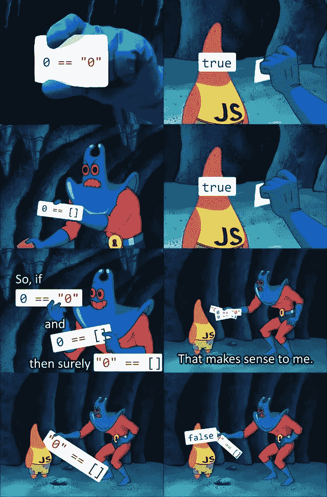
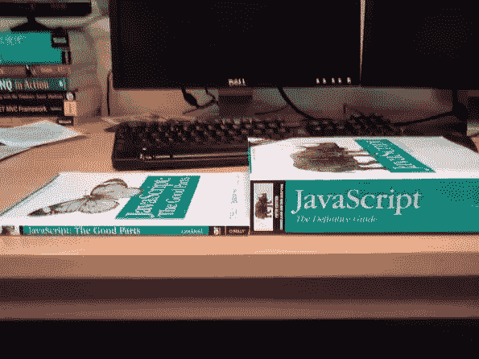
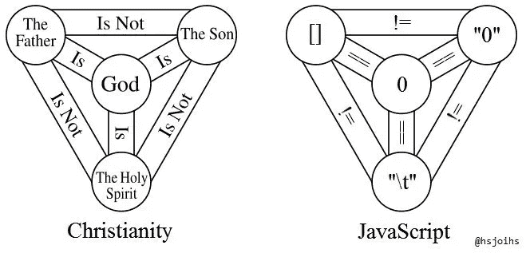

# JavaScript 奇怪的东西

> 原文：<https://levelup.gitconnected.com/javascript-stranger-things-764d22ddb7c3>


## JavaScript 古怪之处的集合

JavaScript，奇异而美丽，一直是开发人员社区批评的编程语言，他们有一些原因。

这种语言最初是由 Brendan Eich 于 1995 年在 10 天内完成的，然后 JavaScript 在过去的几年里被标准化和大量扩展，像大多数语言一样，它也有自己的古怪之处。

`null`显然是一个对象，一个空数组显然等于`false`，函数像网球一样四处传递。



如果你想要一个完整的概述，看下面的视频，但是如果你想要一个 **快速回顾最奇怪的部分，读我下面的列表**。

> 我跳过了更复杂的问题，这些问题需要对 JavaScript 及其语法有更深入的理解

## 1.香蕉

```
> ('b' + 'a' + + 'a' + 'a') "baNaNa"
```

在第二个“a”之后有两个加号**(+)，第一个像前面一样用于连接。**

**第二个加号是一元运算符，它将字符串转换为数字。**

**因为“a”不能转换成数字，所以它被转换成**“NaN”**。**

## **2.两个空数组之和**

```
> [] + [] ""
```

**添加两个空数组将返回一个空字符串。**

## **3.向空数组添加空对象**

```
> [] + {}
  [object Object] > {} + []
  0
```

**将空数组添加到空对象**会返回一个对象，**反之，将空对象添加到空数组，**会返回零**。**

## **4.评估空数组**

```
> alert(new Array() == false); //evaluates true
```

**为了理解这里发生的事情，理解 **truthy 和 falsy** 如何在 JavaScript 中工作是很重要的。**

**最简单的理解方式是这样的:**

> **在 JavaScript 中，**每个非布尔值都有一个内置的布尔标志**，当要求该值表现得像布尔值时，就会调用这个标志；比如说，当你把它比作一个布尔值。**

**`False`、`zero`、`null`、`undefined`、空弦、`NaN`最后都变成了`false`，不是永久的，只是为了给定的表达。**

```
> var someVar = 0; //evaluates true  
  alert(someVar == false);
```

**在这里，我们试图比较数字`0`和布尔值`false`。**

**因为这些数据类型是不兼容的， **JavaScript 秘密地将我们的变量强制转换成它的 truthy 或 falsy 等价物**，在`0`(如我上面所说)的情况下是 falsy。**

**空数组是奇怪的东西:它们实际上被评估为真的*，但是*，当与布尔值相比时，表现得像一个假的。**

```
//empty array
> var someVar = [];//evaluates true
> alert(someVar == false);//alert runs, so someVar evaluates to true
> if (someVar) alert('hello');
```

**为了避免强制，您可以使用**值和类型比较操作符**、`===`(与`==`相反，后者只通过值进行比较)。**

**所以:**

```
> var someVar = 0;//evaluates true – zero is a falsy
> alert(someVar == false);//evaluates false – zero is a number, not a boolean
> alert(someVar === false);
```

## **5.NULL 的类型**

***“null”的定义是完全没有有意义的值。***

**那么，JavaScript 为什么要把“null”当作对象呢？**

```
alert(typeof null) //alerts ‘object’
```

**这是 JS 系统中一个不加掩饰的 bug，“Null”其实就是一个原语值。**

**此 bug 无法删除，因为它会破坏现有代码。**

****

## **6.减去数组或对象**

```
> 1 - []
  1> 1 - {}
  NaN> 1 + []
  "1"
```

**从一个数中减去一个空数组会返回该数，而从一个数中减去一个空对象会返回 NaN 。**

**将空数组添加到数字**会返回数字**的字符串版本。**

## **7.REPLACE()可以接受回调函数**

```
//replace all numbers with *
alert('10 13 21 48 52'.replace(/d+/g, '*')); 
```

**这是一个简单的替换:**一个字符串，一个星号**。**

**但是，如果我们想要更多地控制替换的方式和时间呢？**

**如果我们只想替换 30 岁以下的数字呢？**

**仅靠正则表达式是无法实现这一点的(毕竟它们都是关于字符串的，而不是数学)。**

**我们需要**跳转到一个回调函数来评估每个匹配**。**

```
alert('10 13 21 48 52'.replace(/d+/g, function(match) {
    return parseInt(match) < 30 ? '*' : match;
}));
```

**JavaScript 为每个匹配调用我们的函数，将匹配传递给我们的匹配参数。**

**然后，我们要么返回星号(如果匹配的数字小于 30)，要么返回匹配本身(即不应该出现匹配)。**

## **8.数组比较**

```
> [] == [] 
  false> [] != []
  true> ![]
  false
```

**显然，空数组**与空数组**不同，但不是空数组**就是假的**。**

****

## **9.分类**

```
> [3, 2, 1].sort()
  [1, 2, 3]> [3, 2, 10].sort()
  [10, 2, 3]
```

**默认情况下，数组的排序使用词法比较器**将每一项转换为字符串**。**

## **10.奇怪的加法**

```
> 0.1 + 0.1
  0.2> 0.1 + 0.2
  0.30000000000000004
```

**这跟一个叫**机器精度的问题有关。****

**当从我们熟悉的基数 10 开始计算整数或浮点数时，我们的计算机必须将这些数字转换成基数 2 或二进制数。**

**所以像 0.3 和 0.2 这样的基数为 10 的数字并不完全符合基数为 2 的范式。**

**想想把一部文学作品从一种语言翻译成另一种语言，*有些东西肯定会在翻译中丢失*。**

## **11.意外的 TOSTRING()**

```
> (3).toString()
  "3"> 3.toString()
  Uncaught SyntaxError: Invalid or unexpected token> 3..toString()
  "3"> 3.0.toString()
  "3"> Number(3).toString()
  "3"
```

**这次的诀窍是说服 JS 先把数字 3 转换成对象，再转换成字符串。**

****这种行为充其量仍然是反直觉的**。**

## **12.未定义的可以定义**

**听起来可能很奇怪，`undefined`实际上并不是 JavaScript 中的保留词，尽管它有特殊的含义，并且是确定变量是否未定义的唯一方法。**

**所以:**

```
var someVar;alert(someVar == undefined); //evaluates true
```

***到目前为止，一切正常*。**

**但是:**

```
undefined = "I'm not undefined!";var someVar;alert(someVar == undefined); //evaluates false!
```

**你也可以查看 [Mozilla 的 JavaScript](https://developer.mozilla.org/en/JavaScript/Reference/Reserved_Words) 中所有保留字的列表，以备将来参考。**

## **13.NAN 是一个数字**

**你认为 null 作为一个对象是荒谬的？**

**尝试处理`NaN`(不是数字)是数字的想法！**

```
alert(typeof NaN); //alerts 'Number'alert(NaN === NaN); //evaluates false
```

**事实上`NaN`是**不等于**。**

## **14.有趣的比较**

```
1 < 2 < 3; // -> true3 > 2 > 1; // -> false
```

**上面的第一行是我们所期望的。1 小于 2，2 小于 3。*所以是真的*。**

***但是二线呢？***

**我们要了解的是 JS 如何读取代码:**

```
1 < 2 < 3; // 1 < 2 -> truetrue < 3; // true -> 11 < 3; // -> true3 > 2 > 1; // 3 > 2 -> truetrue > 1; // true -> 11 > 1; // -> false
```

**第一个例子:JS 说:“1 小于 2。*确实如此*。**

**因此，我的下一个任务是评估“真”< 3’.**

**Oops, I have to coerce the boolean ‘true’ to 1 and then evaluate 1 < 3\.
是的，现在我可以吐出“真”。**

**第二个例子:JS 接着说，“嗯。3 > 2.
是的，结果为“真”我在流泪！！！现在表达式的下一部分为真> 1。**

**我必须再次将 true 强制为 1，现在我看到的是 1>1。**

**不，这是假的！再给我一个！**

# **结论**

**我希望这篇文章能帮助你理解 JavaScript 的一些更古怪的方面，也希望它们不会再吓到你。**

*****感谢阅读，快乐编码！*****