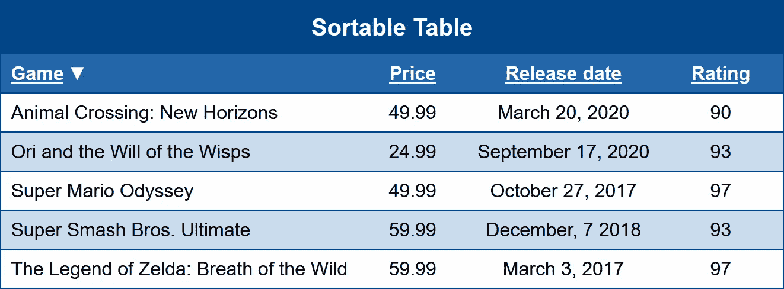

# JavaScript 表格排序(第 1 部分，共 2 部分)——从简单开始

> 原文：<https://levelup.gitconnected.com/javascript-table-sorting-part-1-of-2-start-out-simple-1df3e0be8d4e>



有很多关于这方面的不错的文章。特别是， [Bobby Jack 在 Medium](https://medium.com/javascript-in-plain-english/easy-table-sorting-with-javascript-370d8d97cad8) 上的文章有几个突出的原因:

1.  他们从 JavaScript 中钩出标记，留下适当的语义。**这是非常好的脚本**因为这是一种“渐进增强”的形式。这意味着对于没有 JavaScript 可用的用户，或者在一些情况下——比如屏幕/盲文阅读器——它是高度不相关的，我们得到了“优雅的降级”。当你写 JavaScript 的时候，你应该尽可能地让页面对那些关闭/屏蔽/不可用的用户仍然可用。如果做不到这一点，基本上就是告诉大量用户——尤其是那些有可访问性需求的用户——自己走开。这是 1985 年的 2020 年，无障碍侵犯可不是闹着玩的。
2.  这些标记并不完全是垃圾，因为它们实际上使用了`<thead>`、`<tbody>`和`<th>`。除了`<tr>`和`<td>`之外，表格中还应该包含更多内容！
3.  它利用了这样一个事实，即`appendChild`也删除了一个元素在 DOM 中的现有位置。重新排序一个表的最快方法之一就是将它们全部平铺`appendChild`。这意味着您不必先手动`parentNode.removeChild()` 它们！这是我经常使用的一个非常巧妙的技巧，很高兴看到有人接受了。

总的来说，这是一个不错的实现，但是就像我见过的人们这样做的许多其他方式一样，我认为它也有一些问题。

1.  示例标记可以更“完整”一点，比如应用范围，并对`<tbody>`行中的第一个单元格使用`<th>`。人们给出的太多例子的问题是有不完整的标记，这些标记只是一些粗人盲目的克隆。我知道这样做是为了“简化”那些刚刚学习的人，但从长远来看，这样做弊大于利。
2.  它使用 innerHTML，如果你的表格标题是用户生成的，这可能是一个风险。InnerHTML 也很慢，尽管在这种情况下这并不是一个大问题。尽管如此，innerHTML 已经过时了，你应该尽可能避免使用。它叫 DOM，用它。不，innerHTML 不是 DOM 操作，不管有多少无知的人声称不是。
3.  它在“循环内部”做了大量的 querySelectorAll，而不是遍历 DOM。如果没有 CSS 选择器查询或 getElement By(XXX)之类的东西，许多 nodeList 操作会更快完成。ParentNode、firstElementChild 和 nextElementSibling 是你的朋友！
4.  更糟糕的是，它使用了一些第 n 个子查询选择器来获取信息，而这些信息本可以从`<th>`的 *cellIndex* 属性中获取。
5.  各种各样的排序都是硬编码的，如果你试图扩展，它会变得有点“笨重”并且很难做到。如果使用引用适当动作的对象，就可以更简单、更快地完成。
6.  它没有范围隔离。我会使用 IIFE，因为它更通用，并在它应该在的地方声明变量作用域:在脚本中，而不是在标记中。
7.  排序的数据类型必须硬编码或测试，我建议使用数据属性来存储在`THEAD > TH`中使用的排序类型(日期、文本、数字等)。
8.  它使用`<a>` nchors 代替`<button>`。锚的问题是，如果它们没有 href，它们就不能用键盘/替代导航，如果它们有 href，你需要在它们上面`event.preventDefault();`。根据经验，如果元素只用于脚本行为。使用按钮标签！
9.  它们钩住表格，而不是点击事件的锚点。这意味着在表上的每一次点击都要经过排序函数，这可能是……低效的。它也不能在一些浏览器中提供正确的键盘导航。总的来说`Event.target` vs `Event.currentTarget`是一个不可靠的烂摊子，我个人倾向于避免。

没有什么是不可克服的，但是所有这些加在一起导致它几乎是完成这项工作所需 JavaScript 的两倍。

所以，让我们以他为榜样，跟着他跑吧。

# 加价

我要做的第一件事是在那里获得一些范围，在表头上获得一些数据属性，等等。

```
<table>
  <caption>Sortable Table</caption>
  <thead>
    <tr>
      <th scope="col" data-tablesort="text">Game</th>
      <th scope="col" data-tablesort="number">Price</th>
      <th scope="col" data-tablesort="date">Release date</th>
      <th scope="col" data-tablesort="number">Rating</th>
    </tr>
  </thead><tbody>
    <tr>
      <th scope="row">Super Mario Odyssey</th>
      <td>49.99</td>
      <td>October 27, 2017</td>
      <td>97</td>
    </tr><tr>
      <th scope="row">The Legend of Zelda: Breath of the Wild</th>
      <td>59.99</td>
      <td>March 3, 2017</td>
      <td>97</td>
    </tr><tr>
      <th scope="row">Super Smash Bros. Ultimate</th>
      <td>59.99</td>
      <td>December, 7 2018</td>
      <td>93</td>
    </tr><tr>
      <th scope="row">Ori and the Will of the Wisps</th>
      <td>24.99</td>
      <td>September 17, 2020</td>
      <td>93</td>
    </tr><tr>
      <th scope="row">Animal Crossing: New Horizons</th>
      <td>49.99</td>
      <td>March 20, 2020</td>
      <td>90</td>
    </tr>
  </tbody>
</table>
```

为此我们不需要父类或其他钩子，因为我们可以使用 query selectorall(" th[data-table sort]")来获取 TH。其他所有的元素访问都可以通过 DOM 遍历来完成。

对于那些不熟悉它的人来说，scope= " "属性说明了在哪个轴上应用一个`<th>`。“行”或“列”(列)。如果您关心可访问性的话，这是构建表的重要部分。同样的道理也适用于在两个轴上正确设置`<th>`，以便正确描述和属性表格数据。

# 脚本

我想做的第一件事是设置一个 life 并“使用严格的”,这样我们就可以确保不扩大范围，并使用更快/更现代的 JS 实现。

```
(function(d) { "use strict";})(document);
```

我把 document 作为“d”传递，这样我就不会在该死的地方到处键入“document”。如果它足够好让谷歌使用，它也足够好让我使用。

下一步是创建几个包含排序函数的对象。一个用于一般比较，一个用于数据提取。

## 比较

这两种比较类型非常简单:

```
var
    comps = {
      number : function(a, b) { return a - b; },
      text : function(a, b) { return a > b ? 1 : a < b ? -1 : 0; }
    },
```

任何精通 JS 的人都应该知道这些是干什么用的。遗憾的是，与 Firefox 或传统 IE 不同的是，one Chrome-likes 的“text”—*—*对于“大于”比较本身返回的“真/假”来说太愚蠢了，所以我们需要这种三元混乱来确保所有“blink”和“webkit”浏览器的行为符合预期。谢天谢地，对于数字，所有的浏览器实际上只测试符号和零。如果你对机器语言有所了解的话，这确实很有意义！

## 数据/内容提取

```
 sortTypes = {
      date : {
        get : function(cell) {
          return Date.parse(cell.textContent);
        },
        sort : comps.number
      },
      number : {
        get : function(cell) {
          return +cell.textContent;
        },
        sort: comps.number
      },
      text : {
        get : function(cell) {
          return cell.textContent;
        },
        sort : comps.text
      }
    },
```

只需提取适当的值并将其解析成所需的格式。

通过以这种方式使用对象，我们可以很容易地在以后向流程中添加更多的数据类型或其他操作。

# 向我们的 TH 添加按钮

首先，正如在标记中提到的，让我们使用属性选择器来获取它们。

```
 tablesortTh = d.querySelectorAll("th[data-tablesort]");
```

不完全是火箭科学。

对于这些标题，我们希望用一个`<button>`标签来替换它们的内容。

```
for (var i = 0, th; th = tablesortTh[i]; i++) {
  if (!sortTypes[th.dataset.tablesort]) continue;
  var button = d.createElement("button");
  button.className = "sortButton";
  button.onclick = tablesort;
  button.textContent = th.textContent;
  button.type = "button"; // remember, default is SUBMIT!
  th.textContent = "";
  th.appendChild(button);
}
```

现在，首先你可能会怀疑地盯着那个“for”循环。信不信由你，当你有一个最快的循环方式的节点列表。我是一个非常规元素循环方式的粉丝，这种方式的效率令人惊讶。它甚至绕着 for/of 打转，而且比带有回调开销的 dumbass Array.forEach 优越得多。*当彻底的垃圾隐晦的“箭头功能”垃圾介入时更是如此。*

我们从我们的`<th>`中取出*数据表排序*，并查看它是否存在于我们的*排序类型*中。如果没找到我们就跳过这个`<th>`。

接下来，按钮被创建为一个`HTMLElement`对象，并设置了它的属性。通常情况下，人们不会**而**使用有利于`addEventListener`的`Element.onclick`属性，而是允许其他事件挂钩，但是因为我们自己在动态 DOM 中创建了这个元素，所以没有必要编写额外的代码。

也不要忘记`<button>`的缺省值是`type=”submit”`。将它设置为“按钮”,这样点击它就不会意外地提交一个表单，如果它最终…在一个表单中。同样，使用按钮比在事件处理程序中使用`Event.preventDefault();`要容易得多。

`Element.textContent`用于清空元素，因为它比 innerHTML 开销小(在现代浏览器中)。如果我写这篇文章是为了支持传统浏览器，我会考虑做一个`while (e = th.firstChild) th.removeChild(e);`,因为在 IE 中这样更快……但是这些天我真的跳过了那个噪音。

*事实上，我建议将 X-UA-Compatible 设置为 IE=9，这样你就可以取回 IE CC，然后使用条件注释来阻止向 IE 的所有版本发送 CSS 和 JS！只要给他们你的普通语义标记…如果有的话。* [*是的，即使 W3C 对 IE=edge 之外的任何值都已经满甘了。*](https://deathshadow.medium.com/html-5-and-the-w3c-going-to-hell-in-a-handbasket-6a9f9fda7226) *在与 web 技术打交道的二十年中，我* ***从未想过我会说这个*** *，但是如果他们要像那样愚蠢的话，我会说“验证”！*

最后，一旦元素完成，追加它。

## 排序事件处理程序

像任何事件处理程序一样，它被传递给“事件”,所以让我们为它创建一个函数。

```
function tablesort(event) {
} // tablesort
```

在其中，我们将通过`parentNode`、`nextElementSibling`和其他 DOM 遍历函数来挂钩对元素的大量引用。

一般来说，我喜欢把作用域中使用的所有变量放在函数块的开头。这可能源于我先学习了汇编语言，我的第一门“真正的”高级语言是 Pascal，并且在 ADA 工作了十年。我发誓，如果有更多的人这样做，他们就会很少遇到他们试图用 let/const“解决”的问题。

```
var
   button = event.currentTarget,
   th = button.parentNode,
   thead_tr = th.parentNode,
   tbody = thead_tr.parentNode.nextElementSibling,
```

我们需要这个按钮，并且经常使用它，因为它把我们送到了这里。`<th>`我们需要拉“cellIndex”来说明我们正在排序的列。令人惊讶的是,`<thead><tr>`也提到了很多，当然我们需要`<tbody>` ,因为那是我们实际上正在做的。

然后我们想知道我们在使用哪种排序方法。在任何循环或回调之前将它们存储在变量中可以加快速度。

```
 type = sortTypes[th.dataset.tablesort],
  callback = (
    (button.value = button.value == 1 ? 0 : 1) ?
    function(a, b) { return type.sort(a.value, b.value); } :
    function(a, b) { return type.sort(b.value, a.value); }
  ),
```

这就是事情变得“可爱”的地方。因为按钮是一个表单元素，所以它可以有一个值。我们可以使用这个值来存储我们的排序顺序状态！

```
// value == ""     unsorted column
// value == "1"    sort ascending
// value == "0"    sort descending
```

在这种情况下，我们测试它是否== 1(是的，松散，它可以是字符串或数字)，如果它被设置为降序。如果不是——未排序或降序——将其设置为升序。然后我们可以把它赋给 button.value. *是的，那个 single =不是错误。抱歉，JavaScript“粉丝们”，但当谈到赋值求值时，PHP 开发人员在嘲笑你！*

然后，三元运算可以通过生成适当的匿名函数来确定传递排序参数的方式。因为“类型”在我们当前的范围内，匿名用户可以选择它。可笑的是，如果你有不止一个表，“let”或“const”可能会破坏这个代码。只是我认为那些新“功能”是毫无意义的垃圾的部分原因。

最后，我们需要我们的“工人变量”

```
 sortList = [],
  e = th;
```

`sortList`是我们将`TBODY > TR`值/引用复制到的地方。在我的代码中,“e”变量通常被用作遍历 DOM 的“可重用工人”。我们开始将它设置为 TH，这样我们就可以将当前 TH 的兄弟上的 value= " "设置为空。

```
while (e = e.previousElementSibling) e.firstElementChild.value = "";
e = th;
while (e = e.nextElementSibling) e.firstElementChild.value = "";
```

如果您从未进行过 DOM 遍历，这可能看起来很奇怪，但这比尝试执行 querySelectorAll 或 GetElementsByTagName、使用 for 循环并测试我们没有更改实际正在处理的 DOM 要快得多。

请注意，对于第二个循环，我们必须将“e”重置为 th，这样我们就可以走另一个方向。

> 在苏联，大教堂会带你去…

说真的，我不明白为什么人们这么害怕与 DOM 打交道。她又没有鞭子。

然后，我们可以使用类似的 DOM 遍历来填充排序列表。我们只是测试 tbody 的 firstElementChild 并赋值，然后 do/while。

```
if (e = tbody.firstElementChild) do {
  sortList.push({
    tr : e,
    value : type.get(e.cells[th.cellIndex])
  });
} while (e = e.nextElementSibling);
```

是的，**做/WHILE！**正如我在[上一篇文章](/php-array-functions-and-c-syntax-loop-methods-few-people-even-know-33c198782a55)中所说的，大多数关于它有多“坏”或“错”的说法似乎都可以归结为某个**所谓的该领域的**专家说*“我太笨了，无法理解它，所以其他人不应该被允许使用它！”*

我们有一个非常好的“如果”来执行我们的安全检查，但是迭代器需要一个不同的值。同样，“Pascal”思想完全符合 DOM 的结构和工作方式……同样比这里的“querySelectorAll”或“getElementsByTagName”快很多倍。

我们推送的值包含对我们正在处理的 TR 的引用，并从 TR 中相应的单元格获取数据。

这才是真正有趣的地方，我们可以使用`HTMLTableCellElement.cellIndex` 来寻址 TR (e)中的单元格。因为我们使用的是`HTMLTableRowElement.cells`，所以小区是 TH 还是 TD 也无关紧要！

接下来我们做我们的排序。

```
sortList.sort(callback);
```

然后使用与 Bobby Jack 的原始文章相同的`Node.appendChild`方法插入我们排序的单元格，但是使用我在遍历数组和其他迭代时使用的“赋值求值”技术，我知道没有有效值是 loose false。

```
for (var i = 0; e = sortList[i]; i++) tbody.appendChild(e.tr);
```

嘣，干活的那种。

# 一些 CSS 来显示排序控件

当我们给`<button>`标签赋值时，我们可以通过属性选择器在 CSS 中使用该值来显示我们的排序状态。

```
th[data-tablesort] button[value="1"]:after {
 content:"\25BC";
}th[data-tablesort] button[value="0"]:after {
 content:"\25B2";
}
```

添加这些内容可以改变标题的宽度，这会使布局“跳跃”一点。我对此的解决方案是固定生成内容的宽度，然后填充相同宽度的另一边。

```
th[data-tablesort] button {
  padding:0 0 0 1.2em;
  font-weight:bold;
  font-family:inherit;
  font-size:1em;
  text-decoration:underline;
  border:none;
  background:transparent;
  color:inherit;
  cursor:pointer;
}th[data-tablesort] button:after {
 display:inline-block;
 width:1.2em;
 text-align:right;
 content:"";
}
```

在非价值目标上使用内容确保了这个“空间”被显示。请注意，我去掉了大部分样式，使它看起来更像一个锚而不是一个按钮。

这在左对齐的列上看起来“不合适”,一个简单的方法是简单地从按钮上移除左填充。对于右对齐，删除填充，然后使用:before 而不是:after。

# 现场演示

 [## 用 JavaScript 实现简单的表格排序

cutcodedown.com](https://cutcodedown.com/for_others/medium_articles/tableSort/simple/tableSort.html) 

如同我所有的例子目录:
[https://cutcodedown . com/for _ others/medium _ articles/table sort/simple/](https://cutcodedown.com/for_others/medium_articles/tableSort/simple/)

是敞开的，可以很容易地接触到黏糊糊的东西，我还把整本书的一部分扔了进去。

对于那些喜欢钢笔的人来说:

# 结论

遍历 DOM，利用现有的结构，如“cells”array-like 和“cellIndex”属性，并将操作组织为对象方法，可以在减少完成某项工作所需的代码量、加快执行时间以及创建整体更好的代码库方面创造奇迹。

# 更进一步

[请务必查看本文的第 2 部分](https://deathshadow.medium.com/javascript-table-sorting-part-2-of-2-enhancement-18fe607842b6)，在那里我实现了:

1.  检测“日期”字段是否使用了`<time>`标签，如果它有一个`datetime`属性，就用它来代替`textContent`。如果`<time>`存在而没有`datetime`，则使用`<time>`的`textcontent`，而不是整个表格单元。
2.  支持从单元格内的`<input>`、`<select>`和`<textarea>`获取数值或字符串值。
3.  为 TH 添加一个`data-tablesort-rxmatch`参数，这将让我们声明在排序之前对每个表格单元格的内容执行的正则表达式。
4.  检测一个`<caption data-tablesort-reset>`是否存在，如果存在，给它添加一个`<button>`来恢复原来的排序顺序。

这应该使它成为一个非常健壮和强大的普通 JavaScript 表排序。