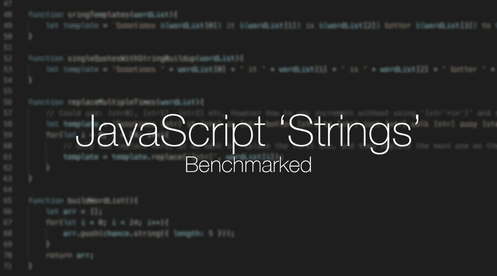
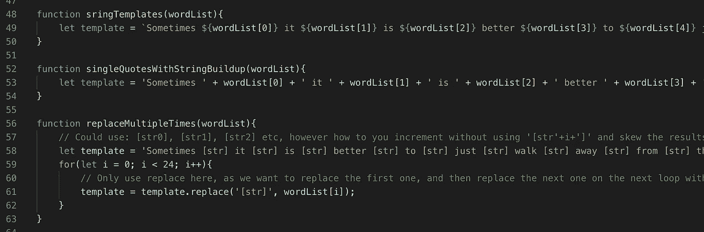
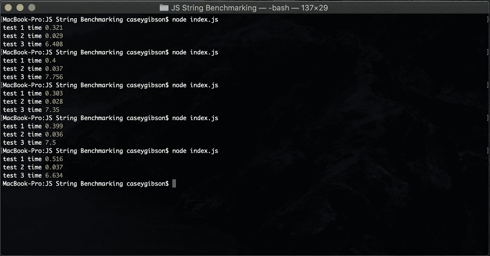

# JavaScript:构造字符串的最快方法

> 原文：<https://levelup.gitconnected.com/javascript-the-fastest-way-to-replace-strings-b304a511ec>



我使用 JavaScript 已经将近十年了，这意味着我的大部分编码风格都是基于早期的习惯。在过去的几年里，JavaScript 不仅提高了性能，还改进了编写代码的方式。

问题是，用这些新的写作风格写更干净的代码，我们是在牺牲性能吗？

为了检验这个理论，我将向你展示如何使用这个句子:

“有时候，最好是离开这些事情，等你心情更好的时候再去做。”——典型的程序员思维。

下面是我过去如何操作字符串的一个例子:

```
'Sometimes ' + wordList[0] + ' it ' + wordList[1] + ' is ' + wordList[2] + ' better ';
```

它看起来并不干净，但自从我开始学习以来，这是我选择构建字符串的典型方式。

这是我个人尽量避免的另一种方式:

```
'Sometimes [str] it [str] is [str] better'.replace('[str]', 'Some Word');
```

上面的方法用的是**。替换('[str]'，'某个单词')；**将第一次出现的**【str】**与**【某词】**互换。重复它，它会找到下一个出现的位置并将其换出。对我来说有点太笨重了。

目前，我最喜欢的方法是[模板文字](https://developer.mozilla.org/en-US/docs/Web/JavaScript/Reference/Template_literals)，这种方法在过去几年里获得了更广泛的支持:

```
`Sometimes ${wordList[0]} it ${wordList[1]} is ${wordList[2]} better`;
```

基于操作琴弦的三种风格，我想出了一个测试，看看哪一种最快。我遵循这些原则:

1.  测试应该尽可能相同
2.  他们应该运行足够长的时间，以建立一个很大的差距，这是更快的
3.  每次运行应该产生相同的结果

因此，我想到了下面的脚本，它可以在 NodeJS 的当前 LTS 版本(v12.13.1)上运行。下面是 GitHub 的链接，你可以自己运行它:[https://GitHub . com/cyber cyclone/js-string-benchmark/blob/master/index . js](https://github.com/CyberCyclone/js-string-benchmark/blob/master/index.js)

本质上，它由以下三个功能组成:



每个函数被传递一个 24 个字的字符串数组，每个测试都将它放在完全相同的位置。每一个函数在这一轮中都得到相同的单词表。

上面的循环超过 100 万次，我已经运行了 5 次。结果如下:



以下是从最快到最慢的结果:

1.  单引号字符串长度:0.028 秒
2.  模板字符串:0.303 秒
3.  字符串替换:7.35 秒

虽然我对**并不感到意外。替换**方法耗时最长，没想到**串模板**方法比**串补**方法慢了近 10 倍。

给你。因此，虽然使用**字符串模板**方法有助于保持代码的整洁，但是如果你想尽可能地挤出所有的性能，你就要使用**字符串构建**方法。