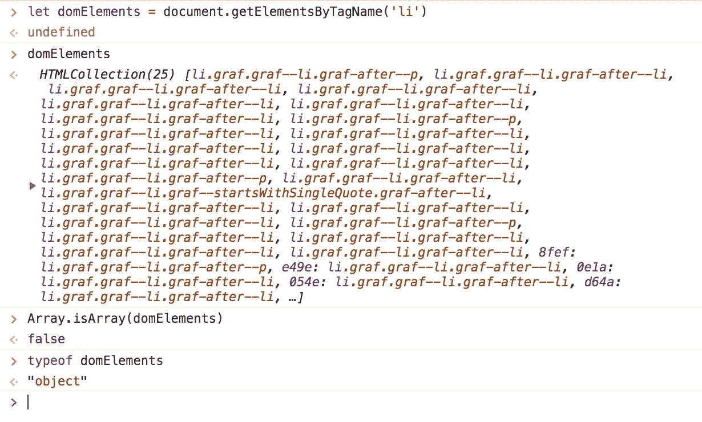
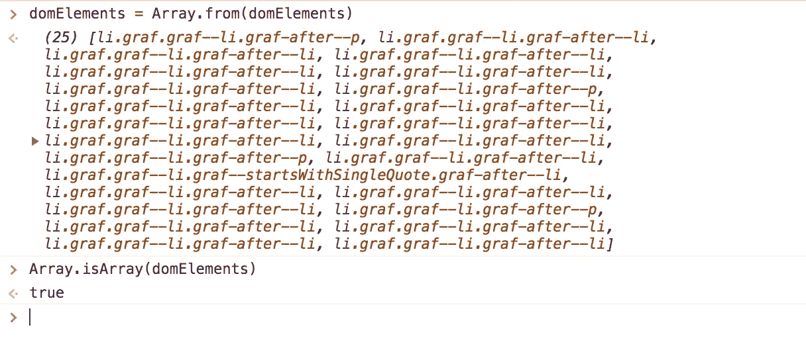

# JavaScript:奇怪的部分(第一部分:数据类型、类型强制、PBR)

> 原文：<https://levelup.gitconnected.com/javascript-the-weird-parts-part-i-data-types-type-coercion-pbr-3ecc751ad62>

在今天的博客中，我们将讨论 JavaScript 与 Ruby 有何不同，它的用途是什么，并通过介绍该语言最基本但也是最重要的方面之一:数据类型，轻松了解 JavaScript 的怪异之处。我们将涵盖关于数据类型的一切，从类型强制到真值和假值，从原始数据类型到复杂数据类型，从传递我的值到传递我的引用。让我们开始吧！


在熨斗学校，从 Ruby 到 JavaScript 的过渡是这个项目中最残酷的部分之一。在为期三周的 JavaScript 模块培训中，我们的学生:

1.  从能够用 Ruby on Rails 构建全功能的 web 应用程序到突然不得不重新学习 JavaScript 的基础知识
2.  几乎立即投入到操纵 DOM，这是一个完全不同的宇宙
3.  学习如何使用 fetch api 在 JavaScript 中获取 JSON 数据，这会给 JavaScript 语言带来一些令人讨厌的惊喜，比如它的异步特性
4.  为了处理上述问题，我必须迅速对 JavaScript 的奇怪部分有一个深刻的理解，许多经验丰富的开发人员仍然没有完全理解这些部分(比如承诺、范围、闭包和 this 关键字)
5.  必须学习两种不同语法的 JavaScript(旧的 ES5 和新的 ES6)
6.  在仅仅两个星期后，接受一个代码挑战，在上面的所有测试中测试它们
7.  使用纯 JavaScript 和 DOM 操作，仅用两周时间就构建了一个项目

听起来绝对不可能。在去熨斗学校之前，我从来不会相信有人能熬过这种只有三周的紧张的过山车。但是，我在这里让你知道，你*可以*做到。我看到学生们在 JavaScript 模块中不仅生存下来，而且*茁壮成长*。只有当你被推到极限时，你才知道你能真正完成多少，深度学习才真正发生，你才开始真正茁壮成长。

JavaScript 是一头野兽，这是不可否认的。JavaScript 只用了 10 天就完成了，没有人预见到对它的需求会有多大，所以现在开发人员被迫在它的基础上进行开发。这里或那里有一些奇怪的部分是很自然的(比如 typeof null = 'object '，类似数组的对象，以及不可预测的类型强制)。在我看来，Javascript 只是有点被误解，一旦你驯服了这头美丽的野兽，你就离不开它了。


事不宜迟，让我们进入 JavaScript 的一些奇怪但重要的部分，其中大部分我已经在过去的“JS 简介”讲座中介绍过，以便尽可能平稳地过渡。

# JavaScript 和浏览器

JavaScript 如此强大的原因之一是它实际上是在浏览器中运行的。当我们构建 Rails 应用程序时，我们的代码实际上是在接触浏览器之前编译的——我们知道这一点，因为当我们打开 chrome 控制台时，我们看不到任何 ERB，即使我们在 ERB 编写视图。相反，我们看到 HTML 是因为所有的东西在接触浏览器之前都被预编译成 HTML。

JavaScript 不再是这种情况了！当您访问任何 web 应用程序并在 chrome 控制台中打开“网络”选项卡时，您将实际看到 JavaScript 资源正被加载到浏览器中，以使该 web 应用程序与图像、css 等资源一起工作。花点时间在任何 web 应用程序上尝试一下吧！在你的网络标签中任何标有“脚本”类型的东西实际上都是 JavaScript！


Netflix.com 上 chrome 控制台的网络标签显示了加载的 JavaScript

我们可以在浏览器中运行 JavaScript 的事实实际上非常强大！这意味着我们可以通过将 JavaScript 文件连接到 HTML 来编写程序中的交互行为。这也意味着我们可以做一些很酷的事情，比如“黑”任何网站:

这里我在 chrome 控制台中添加了一个 document . body . content editable = true 语句，现在我可以编辑网飞的主页了！

# **JS 数据类型**

JavaScript 有七种不同的数据类型，其中一些是原始数据类型，其他的被认为是复杂数据类型。除了符号，我们将每天使用所有的数据类型。七种数据类型如下:

1.  线
2.  数字
3.  布尔代数学体系的
4.  空
5.  不明确的
6.  标志
7.  目标

# **原始数据类型**

在 JavaScript 中，我们可以使用`typeof`来检查一段数据的类型(有一些例外)。上面定义的所有数据类型都被认为是原始的，除了对象(被认为是复杂的)。原始数据类型*不能*变异。这意味着一旦一个变量被赋予一个原始数据，它就不能被变异，只能被重新分配。除了字符串之外，我们不会注意到 Ruby 和 JavaScript 之间有太大的区别。

## 用线串

在 JavaScript 中，字符串是不可变的，但在 Ruby 中肯定不是这样！让我们看一个例子:

```
#Ruby
test_string = "ruby"
test_string[0] = "x"
#test_string -> "xuby"//JavaScript
let testString = "javascript"
testString[0] = "x"
testString -> "javascript"
```

在 Ruby 和 JavaScript 中，我们通过提供索引来读取字符串中的字符。然而，正如你在上面的例子中看到的，Ruby 也给了我们写访问权——它允许我们通过提供索引和重新分配它来覆盖字符串中的字符。JavaScript 不允许这样做，因为字符串被认为是不可变的。

另一方面，在 JavaScript 中实际上有三种不同的方法来声明字符串:使用双引号、单引号和反勾号。虽然双引号和单引号可以互换，但是使用反勾号可以进行字符串插值。

```
const string1 = "Hello"
const string2 = 'World'
const string3 = `JavaScript is cool!`const stringConcatenation = string1 + " " + string2
//-> "Hello World"const stringInterpolation = `${string1} ${string2}`
//-> "Hello World"
```

在上面的例子中，我们用三种不同的方式声明了三个字符串。stringConcatenation 示例显示如何使用串联生成“Hello World ”, string interpolation 示例显示如何使用反勾号和字符串插值生成“Hello World”。

## 数字

JavaScript 中的数字相当简单。与 Ruby 不同，JavaScript 没有将数字分成 FixNum、BigNum、Float 等类别。事实上，`'number'`是各种数字的伞式数据类型，包括`Infinity`。甚至代表“不是一个数”的值`NaN`也是被赋予类型`'number'`，这个值可以通过怪异的数学运算产生，比如除以零。

```
typeof 5 -> 'number'
typeof 5.567 -> 'number'
typeof Infinity -> 'number'
typeof NaN -> 'number'
```

这是我在野外遇到的最喜欢的一段 JavaScript:


L 号列车默特尔-怀科夫站-下一趟开往曼哈顿的列车将在 10 分钟内到达！努夫说。

# 类型强制

既然我们已经知道了 JavaScript 中几种不同的数据类型，那么注意到类型强制会发生是很重要的。信不信由你，JavaScript 是一种友好的语言。在 JavaScript 中，当用户试图强制两种不同的数据类型进行交互时，JavaScript 会对用户的意图做出假设，并将其中一种数据类型强制转换为另一种。这是需要注意并尽量避免的事情，因为有时会出现意想不到的结果。让我们看一些类型强制的例子:

```
1 + "hello world"
//-> "1hello world""hello world" + 1
//-> "hello world1"1 + true
//-> 2"hello" + true
//-> "hellotrue
```

在上面的例子中，发生的大多数类型强制是可预测的。当字符串和数字组合在一起时，数字被强制转换成字符串，字符串被连接起来。当数字加到布尔值上时，这些布尔值被强制转换成数字(`true`变成 1，`false`变成 0)。当字符串被添加到布尔值时，布尔值被强制为 intro 字符串。

## 严格相等与宽松相等(===与==)

然而，有时类型强制的结果可能是完全出乎意料的，甚至是滑稽的，例如下面的结果。因此，尽可能避免类型强制非常重要。

```
{} + {}
//-> '[object Object][object Object]'[] + []
//-> ''
```

避免类型强制的一种方法是在 JavaScript 中进行比较时使用严格相等(===)。在 JavaScript 中，检查相等性实际上有两种不同的方法:严格相等(===)和松散相等(==)。严格相等将检查两个数据是否相同*和*是否具有相同的类型。松散相等只检查一部分数据是否可以被强制转换成另一部分。

```
1 == true 
//-> true1 === true
//-> false1 == '1'
//-> true1 ==='1'
//-> false
```

在上面的例子中，双等号只检查宽松的等式。它为`1 == true`返回`true`，因为 1 可以被类型强制转换为`true`，它为`1 == '1'`返回`true`，因为数字 1 可以被强制转换为字符串`"1"`。但是，对于任何数据类型不同的情况，不管类型强制与否，它都返回 false。使用 triple equals 来检查相等性是最好的方法，对于来自 Ruby 的人来说，这绝对是值得注意的！

## 当类型强制有用时

有一种类型强制实际上非常有用 not(！)算符，又称“霹雳”。使用一个 bang 操作符允许我们将任何值强制转换为布尔值，并返回它的相反值；使用两个 bang 运算符，我们可以将它强制转换成相反的布尔值。例如，如果我们想知道 0 是真值还是假值，我们可以运行`!!0`。如果我们想在某个数字为假时运行一些逻辑，我们可以运行`if (!number)`。省略 bang 操作符并依赖隐式类型强制在条件中也很有用，比如仅当某个变量为真时才运行一些逻辑。

```
let number = 0;
let string = "hello"!!number
//-> falseif (!number) return `The number ${number} is falsy.`
if (string) return `The string ${string} is truthy.`
```

编写这种隐式条件在 JavaScript 中是常见的做法，但是它确实需要理解 JavaScript 中哪些值是真的哪些值是假的。让我们跳进来吧！

# 虚伪的价值观

JavaScript 中的 falsy 值是可以强制为 false 的值。有六种虚假的价值观，其他的都是真实的。falsy 值为:

1.  错误的
2.  0(零)
3.  ''或" "(空字符串)
4.  空
5.  不明确的
6.  圆盘烤饼

在 Ruby 中，只有两个 falsy 值(nil 和 false ),所以要记住的更多。当有疑问时，记住在任何值前运行`!!`将帮助您确定它是真还是假。

## 空且未定义

您可能想知道为什么 JavaScript 既有 null 又有 undefined，这两者之间有什么区别。通常，未定义是指用户尚未定义某个值。当访问一个数组中的索引或者一个不存在的对象中的键时，你可能会得到`undefined`。类似地，如果您定义了一个变量或函数，但是在尝试使用它时拼写错误，您可能会得到一个错误，比如`variable is not defined`。然而，Null 并不意味着一个值被忘记声明或者不存在。通常，一个人已经*有意*给`null`赋值，暗示该值应该从`null`开始，但可能会改变。

# 复杂数据类型

如前所述，JavaScript 中的复杂数据类型是对象。事实上，使用`typeof`会显示很多值可能被归类为对象。事实上——有趣的事实——即使运行`typeof null`也会导致`'object'`，但是`null`实际上是*而不是*一个`'object'`。这实际上是一个不幸的错误，无法修复，因为它会破坏互联网！以下是一些在 JavaScript 中被归类为对象的东西:

*   数组
*   POJOS(普通旧 JavaScript 对象)
*   类似数组的对象
*   承诺
*   功能

## 数组

因为数组是对象，所以需要注意的是`typeof []`不会帮助我们确定一个特定的变量是否是数组。确定这一点的更好方法是尝试`Array.isArray([])`。

## 波霍斯

POJOS 只是普通的旧 JavaScript 对象，类似于 Ruby 哈希。它们有逗号分隔的键值对，可以用括号符号或点符号来访问这些键。但是，请注意，我们不能对 Javascript 对象使用 rocket 语法。

```
let pojo = {"hello": "world", "javascriptIsFun": true}
```

## 类似数组的对象

在 JavaScript 中，类似数组的对象是一个欺骗性的集合，*看起来*像一个数组，并且通常会有方括号，但*不是*一个数组。偶尔，我们在操作 DOM 和抓取诸如`<li>`元素之类的元素组时会遇到这样的害虫。



在上面的例子中，我从这篇博文中获取了`li`元素，我看到了一个看起来像数组的东西。通过`typeof`测试它的类型是没有帮助的，但是当我尝试`Array.isArray`时，我看到了真相——这个对象是*而不是*一个数组。类似数组的对象可能很难处理，因为它们允许对它们执行某些数组方法，但不允许对其他方法执行。*提示*:一个好的技巧是在一个类似数组的对象上尝试`.__proto__`，看看有什么方法可以在上面执行。

然而，如果你遇到这样的害虫，不要害怕。只要你知道你在处理什么，把一个类似数组的对象变成一个真正的数组是相当简单的！尤其是使用 ES6 的新`Array.from`方法，我们能够将这样一个对象强制放入一个数组。请看下面，我将这个`domElements`数组转换成一个真正的数组，并用`Array.isArray`测试它。现在它是一个真正的数组，我也可以在这个对象上执行所有普通的数组方法。



虽然承诺和功能也被归类为对象，但我们将改天再讨论这些主题！

# 按引用传递，按值传递

既然我们已经介绍了一些复杂的数据类型，那么理解它们与原始数据类型的不同行为是很重要的。如前所述，原始数据类型不能变异。然而，复杂的数据类型是可以变异的。这意味着我们可以拼接一个数组，将新元素放入其中，删除元素，或者进行任何数量的其他破坏性操作。类似地，我们可以给一个对象分配新的键和值，或者重新分配旧的键和值。

```
const obj = {
    name: "Jane", 
    hobby: "Languages", 
    isHungry: true
  }obj.isHungry = false
//-> obj = {name: "Jane", hobby: "Languages", isHungry: false}
```

这就是我们可以使用`const`关键字给一个对象或数组赋值的原因。只要我们不是真正地*重新分配*变量，而仅仅是*改变*变量，使用`const`对对象和数组来说是完全没问题的！

然而，对于对象和数组来说，有一件事非常棘手。让我们观察下面的代码片段，在这里我将一个对象实例化为`obj1`，然后创建了一个变量`obj2`，并将这个相同的对象保存在那里。

```
let obj1 = {name: "Jane", hobby: "Languages"}
let obj2 = obj1
obj1.name = "JaneyWaney"
```

当我改变`obj1`的一个属性时会发生什么？大多数人正确地认为`obj1`会改变。但是`obj2`会怎么样呢？大多数人认为`obj2`会保持不变。然而，这是错误的。让我们观察一下`obj1`和`obj2`会发生什么。

```
//obj1 -> {name: "JaneyWaney", hobby: "Languages"}
//obj2 -> {name: "JaneyWaney", hobby: "Languages"}
```

原来*`obj1`和`obj2`都变了。这是因为当我们设置`obj2 = obj1`时，我们实际上是保存一个*引用*到`obj1`，而不是制作一个新的不相关的副本！因此，当我们对`obj1`进行更改时，`obj2`也会受到影响。与原始数据类型不同，JavaScript 不会将对象的实际值保存到变量中。相反，JavaScript 将*引用*保存到对象，或者它在内存中的位置。这称为按引用传递(与按值传递相对)。*

*JavaScript 中的复杂数据类型是通过引用传递的，而基本数据类型是通过值传递的。这意味着数组也是通过引用传递的！*

```
*let array1 = [1,2,3,4,5]
let array2 = array
array.push(6)//array1 -> [1,2,3,4,5,6]
//array2 -> [1,2,3,4,5,6]*
```

*在上面的代码片段中，当我们试图将某些东西推入`array1`时，我们也在对`array2`进行变异，因为`array2`实际上持有对`array1`本身的引用，而不是副本。*

## *复制数组和对象*

*但是我们如何解决这个问题呢？如果我们真的想保存一个副本而不是一个对象的引用呢？有几种不同的方法可以做到这一点:*

1.  *对于数组，我们可以使用`.slice()`来复制数组。当没有给定参数时，`.slice()`方法将复制一个数组，当给定参数时，将根据传入的索引复制该数组的特定部分。*
2.  *对于对象，我们可以使用`Object.assign`来复制一个对象。`Object.assign`方法需要几个参数。第一个参数是我们要将另一个对象复制到其中的对象。通常，我们传递一个空的对象(`{}`)作为空白的石板。第二个参数代表我们试图复制的对象。以下任何参数都是可选的，它们是我们试图在该对象中写入或覆盖的附加属性。*

```
*let jane = {name: "Jane", cat: "Poseidon", dog: "Atlas"}
let janeCopy = Object.assign({}, jane)
//jane === janeCopy -> false*
```

*在上面的例子中，我们使用`Object.assign`成功地复制了`jane`对象，并可以通过运行`jane === janeCopy`来测试它。当存在真实副本时，对象彼此不相等并返回 false。然而，当对象指向同一个引用时，`===`返回 true。*

*3.我最喜欢的复制方式是使用 ES6 扩展运算符(…)。这种方式超级简单方便，而且对数组和对象都有效！spread 操作符允许我们将数组和对象中的所有值展开，就好像它们不再包含在括号中一样。然后，我们将这些元素放回括号中，将它们聚集回一个全新的数组或对象中。*

```
*let array1 = ["hello", "world"]
let copy = [...array1]let obj = {name: "Jane", cat: "Poseidon", dog: "Atlas"}
let objCopy = {...obj}*
```

*现在我们知道了通过引用传递和通过值传递，让我们总是小心我们的数组和对象！如果我们想将一个数组或对象保存到另一个变量中，我们需要创建一个新的副本，这样我们就不会改变原来的数组或对象。让我们记住我们今天讨论的所有数据类型，真值和假值，以及如何避免不必要的类型强制。在下一部分中，我们将介绍诸如提升、函数表达式与声明、范围等概念！敬请期待！*

> *你应该把变量想象成触手，而不是盒子。它们不包含值；他们掌握它们——两个变量可以指同一个值。*
> 
> *— Marijn Haverbeke，[雄辩的 JavaScript:编程的现代介绍](https://www.goodreads.com/work/quotes/13787033)*

*[](https://levelup.gitconnected.com)**[](https://gitconnected.com/learn/javascript) [## 学习 JavaScript -最佳 JavaScript 教程(2019) | gitconnected

### 前 65 名 JavaScript 教程-免费学习 JavaScript。课程由开发人员提交并投票，从而实现…

gitconnected.com](https://gitconnected.com/learn/javascript)*