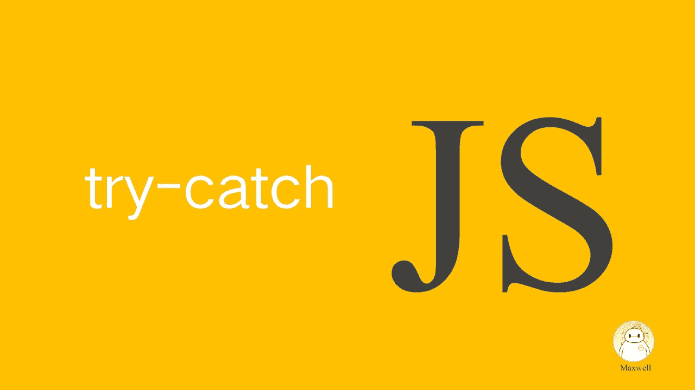

# JavaScript Try-Catch 错误和异常处理指南

> 原文：<https://levelup.gitconnected.com/javascript-try-catch-error-and-exception-handling-guide-352526468245>



在任何软件开发项目中，处理错误和异常对于应用程序的成功至关重要。无论您是新手还是专家，您的代码都可能因为各种原因而失败，比如一个简单的输入错误或外部服务的意外行为。

因为您的代码总是有可能失败，所以您需要通过使您的代码更加健壮来为这种情况做准备。您可以通过多种方式做到这一点，但是一个常见的解决方案是使用`try-catch`语句。此语句允许您包装代码块来尝试和执行。如果在执行过程中出现任何错误，该语句将“捕捉”它们，您可以在应用程序崩溃之前快速修复它们。

本文将作为对`try-catch`语句的实用介绍，并向您展示如何使用它们来处理 JavaScript 中的错误。

# 1.**为什么需要试捕**

当你不遵循特定编程语言的规则时，就会出现语法错误。这些错误可以通过配置 linter 来检测，linter 是一种用于分析代码和标记风格或编程错误的工具。例如，您可以使用 ESLint 来查找并修复代码问题中的 bug。

下面是一个语法错误的例子:

```
console.log(;)
```

在这种情况下，发生错误是因为代码的语法不正确。应该是这样的:

```
console.log('Maxwell');
```

当应用程序运行有问题时，就会出现运行时错误。例如，您的代码可能试图调用一个不存在的方法。要捕捉这些错误并应用一些处理，可以使用`try-catch`语句。

# 2.**什么是异常**

异常是一个对象，表示在程序执行过程中出现了问题。当访问无效的数组索引时，当试图访问空引用的某个成员时，当试图调用不存在的函数时，会出现这些问题。

例如，考虑一个应用程序依赖于第三方 API 的场景。您的代码可能会处理来自此 API 的响应，期望它们包含某些属性。如果这个 API 由于某种原因返回了一个意外的响应，它可能会触发一个运行时错误。在这种情况下，您可以将受影响的逻辑封装在一个`try-catch`语句中，并向用户提供一条错误消息，甚至调用一些回退逻辑，而不是让错误导致应用程序崩溃。

# 3.**试捕的工作原理**

简单地说，`try-catch`语句由两个代码块组成——一个以`try`关键字为前缀，另一个以`catch`关键字为前缀——以及一个存储错误对象变量名的代码块。如果`try`块中的代码抛出错误，该错误将被传递给`catch`块进行处理。如果它不抛出错误，就永远不会调用`catch`块。考虑下面的例子:

在此示例中，当调用该函数时，运行时将看到没有这样的函数，并引发错误。多亏了围绕它的`try-catch`语句，这个错误不是致命的，可以按照您喜欢的方式处理。在这种情况下，它被传递给`console.log`，告诉您错误是什么。

还有另一个可选语句叫做`finally`语句，当存在时，总是在`try`和`catch`之后执行，不管`catch`是否执行。它通常用于包含释放在`try`语句中分配的资源的命令，这些资源在发生错误时可能没有机会正常清理。考虑下面的例子:

在这个虚构的例子中，假设在`try-catch-finally`语句之前打开了一个文件。如果在`try`程序块中出现错误，确保关闭文件以避免内存泄漏或死锁。在本例中，`finally`语句确保无论`try-catch`如何执行，文件都将在继续之前关闭。

当然，用 try-catch 语句包装可能容易出错的代码只是容错难题的一部分。另一部分是知道当抛出错误时该做什么。

有时向用户显示它们可能是有意义的(通常以更易读的格式)，有时您可能想简单地记录它们以供将来参考。无论哪种方式，熟悉错误对象本身都会有所帮助，这样您就知道必须处理什么数据。

# 4.**错误对象**

每当在`try`语句中抛出异常时，JavaScript 就会创建一个`Error`对象，并将其作为参数发送给`catch`语句。通常，该对象有两个主要的实例属性:

*   `name`:描述错误类型的字符串
*   `message`:更详细的错误描述

如前所述，`name`属性的值指的是发生的错误类型。以下是一些更常见的错误类型的非详尽列表:

*   `ReferenceError`:当检测到对不存在或无效的变量或函数的引用时，抛出`ReferenceError`。
*   `TypeError`:当一个值被以与其类型不兼容的方式使用时，比如试图调用一个数字字符串函数(`(1).split(',');`)，就会抛出一个`TypeError`。
*   `SyntaxError` : `SyntaxError`在解释代码时出现语法错误时抛出；比如解析 JSON 的时候用一个尾随逗号(`JSON.parse('[1,2,3,4,]');`)。
*   `SyntaxError` : `URIError`在 URI 处理中出现错误时抛出；例如，在`decodeURI()`或`encodeURI()`中传递了无效参数。
*   `RangeError` : `RangeError`当值不在允许值的集合或范围内时抛出；例如，数字数组中的字符串值。

所有本地 JavaScript 错误都是通用`Error`对象的扩展。遵循这一原则，您也可以创建自己的错误类型。

# 5.自定义错误

JavaScript 中另一个与错误和错误处理密切相关的关键字是`throw`。使用该关键字时，可以“抛出”用户定义的异常。当您这样做时，当前函数的执行将停止，任何与`throw`关键字一起使用的值将被传递给调用堆栈中的第一个`catch`语句。如果没有一个`catch`语句来处理它，行为将类似于一个典型的未处理的错误，程序将终止。

抛出**自定义错误**在更复杂的应用程序中很有用，因为它给了你另一种控制代码流的方法。考虑一个场景，您需要验证一些用户输入。如果根据业务规则，输入被认为是无效的，您不想继续处理请求。这是`throw`语句的一个完美用例。考虑下面的例子:

这里定义了一个自定义错误类，它可以扩展通用错误类。这种技术可以用来抛出与业务逻辑相关的错误，而不仅仅是 JavaScript 引擎使用的默认错误。

# 6.**何时使用 Try-Catch**

因为错误会沿着调用堆栈向上爬，直到找到一个`try-catch`语句或应用程序终止，所以很容易将整个应用程序包装在一个大的`try-catch`语句或许多更小的`try-catch`语句中，这样您就可以享受应用程序在技术上不会再次崩溃的事实。然而，这不是一个好主意。

说到编程，bug 是一个事实，它们在应用程序的生命周期中扮演着重要的角色。他们会告诉你哪里出了问题。因此，如果您想为您的用户提供良好的体验，您必须尊重并小心地使用 try-catch 语句。

`try-catch`通常应在合理预期会发生错误的情况下使用语句。然而，一旦你发现一个错误，你通常不想直接删除它。如前所述，当抛出错误时，意味着发生了错误。您应该利用这个机会适当地处理错误，要么在 UI 中向用户显示更好的错误消息，要么将错误发送到应用程序监视工具(如果有)进行汇总和以后的分析。

一般来说，当在`try-catch`语句中包装代码时，您应该只包装概念上与预期错误相关的代码。如果函数的大小相当小，这可能意味着要包装整个函数体。或者，您可能有一个更大的函数，其中主体中的所有代码都被包装，但是分布在多个`try-catch`语句中。这实际上可以作为一种指示，表明所讨论的特性太复杂和/或处理太多的责任。这样的代码可以被分解成更小、更集中的函数。

对于不太可能发生错误的代码区域，通常最好放弃过多的 try-catch 语句，允许错误发生。这听起来可能违反直觉，但是允许您的代码快速失败实际上是将您自己置于一个更好的位置。压缩错误可能会产生稳定的外观，但仍然存在潜在的问题。

允许错误发生而不进行显式处理意味着，当与应用程序监控工具(如 *BugSnag* 或 *Sentry* )交互时，您可以全局拦截并记录错误，以供以后分析。这些工具允许您看到应用程序中的错误实际在哪里，以便您可以修复它们，而不是盲目地忽略它们。

# 7.异步功能

要理解 JavaScript 中的异步函数是什么，你必须理解 [Promise](https://developer.mozilla.org/en-US/docs/Web/JavaScript/Reference/Global_Objects/Promise)

一个`promise`本质上是一个表示异步操作最终完成的对象。它们定义了将来要执行的动作，这些动作最终会是`resolve`(成功)或`reject`(错误)。

例如，下面的代码显示了一个简单的`Promise`，它可以快速解析一个值。然后将该值传递给`then`回调函数:

下一个例子展示了`Promise`中抛出的错误如何被`Promise` `catch`回调处理:

您可以使用`reject`函数，而不是手动在`promise`中抛出错误。该函数作为`Promise`回调函数的第二个参数提供:

您可能会注意到上一个示例中的一些奇怪之处。**抛出错误**和`reject`是有区别的。抛出错误将停止代码的执行，并将错误传递给最近的`catch`语句或终止程序。`reject`一个`Promise`将调用`catch`回调函数，但如果有更多代码要运行，它不会停止`Promise`的执行，除非对`reject`函数的调用以 return 关键字为前缀。这就是为什么`console.log(a + b);`语句即使在`reject`之后依然被炒。为了避免这种行为，只需使用`return reject(…)`提前结束执行。

# 8.总结

`try-catch`语句是一个有用的工具，在程序员的职业生涯中肯定会用到。但是，随便用什么方法都不一定是最好的解决方案。请记住，您需要使用正确的工具和概念来解决特定的问题。例如，当您不希望出现任何异常时，通常不使用`try-catch`语句。如果在这些情况下确实发生了错误，您可以在它们发生时识别并修复它们。