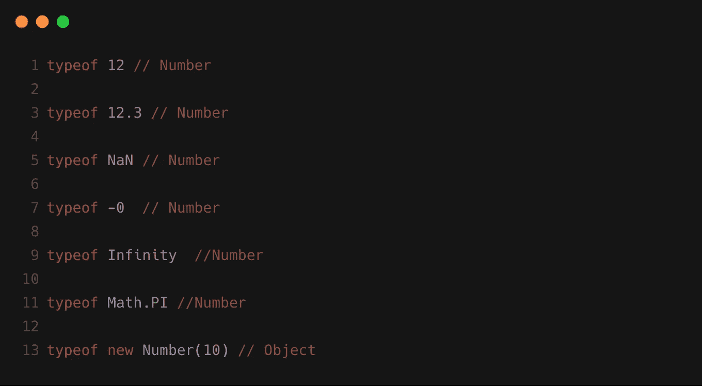
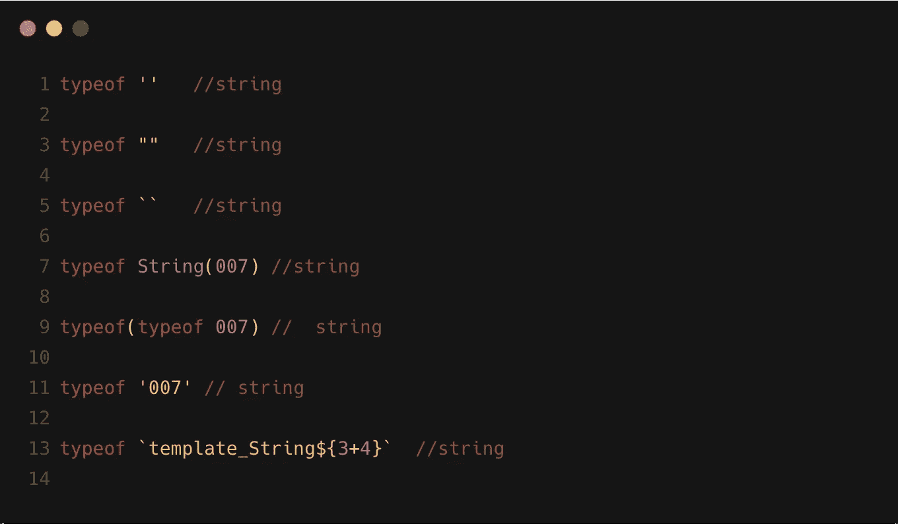
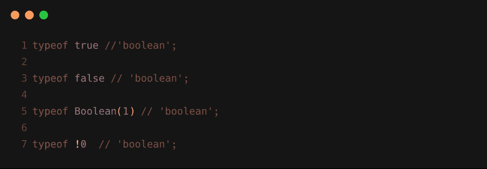
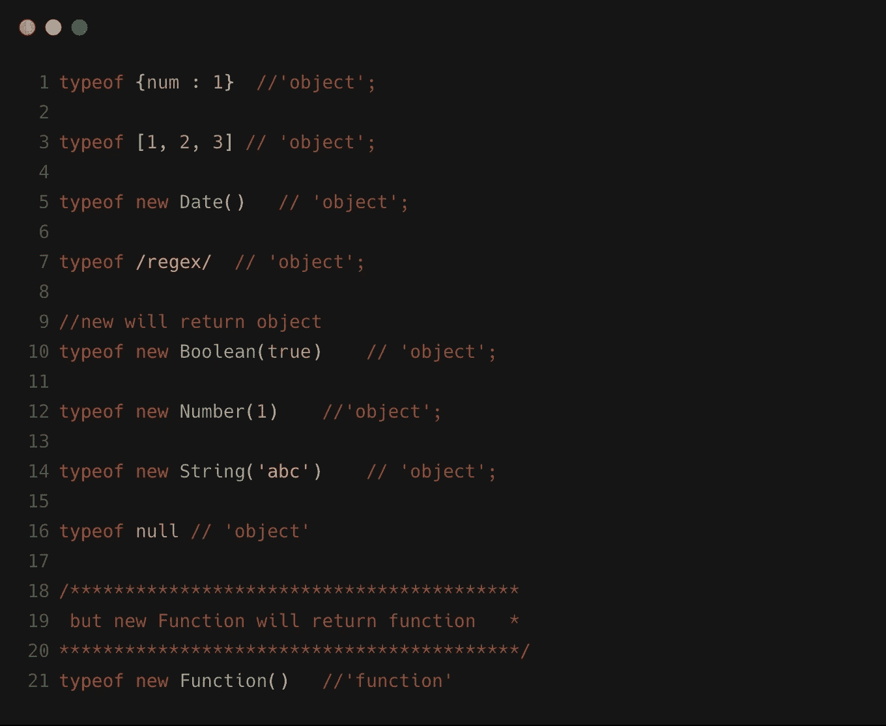
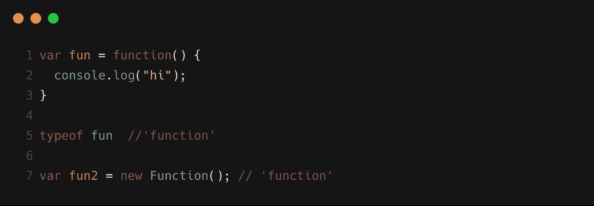
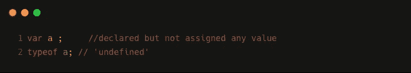
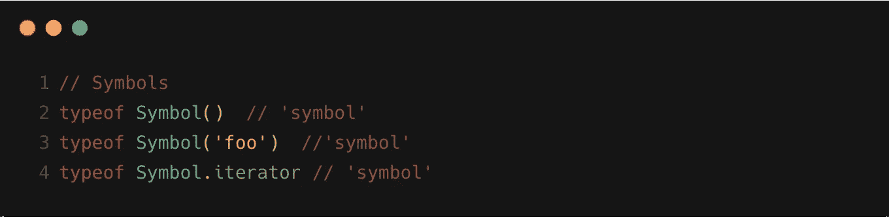
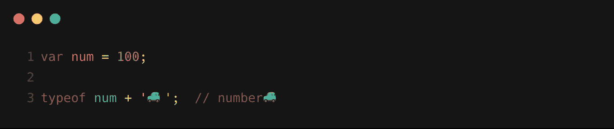

# Javascript 运算符类型

> 原文：<https://levelup.gitconnected.com/javascript-typeof-operator-20a3896b3ce9>

`**typeof**`运算符返回一个表示未赋值操作数类型的字符串。(资料来源:MDN)

1.  数字

2.线

3.布尔运算

4.目标

5.功能

6 .未定义

7.标志

纪念

为了写这篇文章，我在这里提到了。

跟随 [Javascript Jeep🚙](https://medium.com/u/f9ffc26e7e69?source=post_page-----20a3896b3ce9--------------------------------)了解更多有趣的 Javascript 技巧。

 [## 学习 JavaScript -最佳 JavaScript 教程(2019) | gitconnected

### JavaScript 是世界上最流行的编程语言之一——它随处可见。JavaScript 是一种…

gitconnected.com](https://gitconnected.com/learn/javascript)