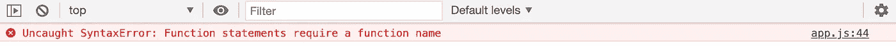

# 引擎盖下的 JavaScript。7:生活

> 原文：<https://levelup.gitconnected.com/javascript-under-the-hood-pt-7-iifes-23b70358db73>


**欢迎回到小型高级 JavaScript 系列，**在这里，我们以简单易懂的方式讨论高级 Javascript 概念。

第一次听到立即调用函数表达式(IIFE)的语句，你可能会有点被吓到。但是，像许多 JavaScript 概念一样，它相当简单，不像听起来那么可怕。

在我们深入了解生命是什么以及它们的用途之前，复习一些词汇是很重要的。

理解**函数语句**与**函数表达式**的概念对于全面理解和领会 IIFEs 的概念至关重要。

让我们直接开始吧。

# 函数语句

简单地说，一个函数语句在定义时将以单词`function`开始。示例:

```
//Function statementfunction greet(name) {
   console.log(‘Hello ‘ + name)
}greet(“Colton”)
//Hello Colton
```

函数语句在内存中是完整的，所以即使在词法环境中定义它们之前，使用它们也是安全的:

```
greet()
//hi
​
function greet() {
  console.log("hi");
}
```

(如果您需要回顾提升的概念，请在此处查看我的主题文章

# 函数表达式

相反，函数表达式是赋给变量的匿名函数。

```
//Function expression
var greet = function(name) {
  console.log('Hello ' + name)
}
​
greet("Colton")
//Hello Colton
```

让我们详细说明一下为什么这很重要。

**表达式是返回值的代码单元。**表达式不需要保存到变量中才能使用。这里有一个例子。

`2 + 2`和`a === 3`是**表达式**的例子，因为它们会立即返回值。它们不需要保存到变量中才能使用。我们可以把我们的`if`语句看作是一个**语句**的例子(提示在名字里)。这是因为`if`语句 ***本身*** (不是其中的代码)，本身并不返回任何东西。

> *表达式立即返回值。它们经常在没有保存到变量中的情况下使用。*

所以，知道了我们现在对表达式的了解，让我们把它和我们对 JavaScript 中函数的了解结合起来。

JavaScript 是一种特殊的语言。正如本系列其他文章所讨论的，它如此特别的一个主要原因是，在 JavaScript 中，一切都是对象，**包括函数**。这是非常独特的，也是 JavaScript 如此灵活、易读和简洁的原因。(如果没有完全理解，这也是有时令人困惑并容易出现错误的原因之一，但我们不会在这里深入讨论)。

因为函数是对象，所以我们可以将它们存储在变量中，就像任何其他对象一样。因为在 JavaScript 中一切都是对象，如果我们愿意，我们可以用函数做一些奇怪的事情。我们甚至可以将函数作为参数传递给其他函数！(你是不是意乱情迷了？):

这里有一个关于函数表达式的关键点。由于函数表达式是作为变量存储的，**它们不像函数语句**那样被提升。像常规变量一样，它们被设置为等于`undefined`，直到变量被赋值。因此，如果您尝试以下内容，可能会遇到麻烦:

理解这个概念是为你自己和你的团队防止难以发现的错误的关键部分。

> *函数表达式不吊。只有变量被提升(到未定义)。*

有了这些知识，以及我们知道表达式不需要被调用就可以立即返回值的事实，让我们开始研究立即调用函数表达式(IIFEs)。

# 立即调用函数表达式(IIFEs)

函数是对象，但它们不是普通的对象。它们是一种特殊类型的对象，因为它们有一个可以被调用的“code”属性`()`。

关键在于:我们可以在创建时调用一个函数。换句话说，我们可以创建一个函数对象并立即调用它:

```
//Using an Immediately Invoked Function Expression (IIFE)var greeting = function(name) {
  return 'Hello ' + name
}()//Can immediately invoke a function at the point of creation.
//Creates a function object and immediately invokes it.console.log(greeting)//Works like greeting()
//Logs "Hello undefined"
```

我们刚刚定义了一个函数表达式，它在被调用时不需要被调用，因为它在创建时就已经被调用了。写`greeting()`现在会导致错误。

我们也可以向函数传递参数，就像普通的函数调用一样！

```
var greeting = function(name) {
  return 'Hello ' + name
}('Colton')console.log(greeting)//Works like greeting('Colton')
//Logs "Hello Colton"
```

在这里写`greeting("Colton")`同样会导致错误。

到目前为止似乎很简单，对吗？这就是事情变得有点棘手的地方。

在 JavaScript 中，我们可以编写未定义的代码行，而不会收到任何错误。

```
3;"I'm a string";{ name: 'Colton' };//This is all valid Javascript and doesn't cause an error upon running even though none were assigned a variable.
```

让我们试着用一个函数表达式来做这件事:

```
function(name) {
  return 'Hello ' + name
}//Uncaught SyntaxError: Function statements require a function name
```



这里发生了什么？

语法分析器在新的一行代码中发现单词`function`前面没有变量，所以它期望一个函数**语句**。当它看不到函数名时，它抛出一个错误，要求输入函数名。

我们需要找到一种方法来“欺骗”语法分析器。换句话说，我们需要让`function`不是它看到的第一样东西。只要这不是它看到的第一件事，它就不会再认为我们试图创建一个函数语句，因为函数表达式在单词`function`前面有**某物**。

有几种方法可以做到这一点，但最常见/公认的方法是**将函数放在括号**中。

```
(function(name) {
  return "Hello " + name)
})//No errors!
```

这是最被接受的方法，因为它最容易阅读和理解。现在，我们可以调用一个函数表达式，而不需要给它命名。

JavaScript 中的括号是运算符，运算符只和**表达式**一起使用。因此 JavaScript 引擎可以安全地假设括号内的内容一定是表达式。

> *没有被赋予变量名的函数表达式需要用括号括起来。*

让我们用这些知识来创造生活:

```
//IIFE(function(name) { console.log("Hello " + name)}('Colton'))//Hello Colton
```

现在，我们已经同时创建并运行了一个函数。

当我们谈论生活时，这是我们经常谈论的话题。

# 什么时候/为什么使用生命？

作为一名软件开发人员，对生命的了解可能是一个强有力的工具。它们被用于几乎每一个主要的框架或库中，能够深入并理解它们是非常重要的。

不仅如此，它们还能让你的代码更加安全。

我们知道一个函数拥有自己的执行上下文，并且在函数内部声明的**变量是特定于那个执行上下文**的(关于全局环境和执行上下文的回顾，请在这里查看我关于主题[的文章)。不能在其他地方访问这些变量。](https://codeburst.io/javascript-under-the-hood-pt-1-the-global-environment-332c8494413c)

**函数内部声明的变量不接触全局环境。这是使 IIFEs 在框架和其他地方如此普遍使用的核心。**

例如，假设我们有一个调用多个脚本文件的 index.html 文件。如果这些脚本文件在全局环境中都有一个同名但不同值的变量，会发生什么情况？会有冲突，其中一个变量不会返回我们期望的结果(它会返回任何文件优先的返回值)。说说难抓虫子的食谱吧！

出于这个原因，框架和库通常会将它们的整个代码库包装在一个生命中。因为它们的所有变量都包装在一个函数中，所以在应用程序的其他文件中没有冲突的风险，因为在那个文件中声明的所有变量只存在于它们自己的执行上下文中。

这在你自己的代码中有很大的帮助，并且允许更多的可重用性。

**总之:**

*   **函数语句**以单词`function`开始，并且没有明确地分配变量。它们被整体提升到内存中，因此可以在词法环境中提前使用。
*   **函数表达式**是动态调用的匿名函数。它们可以被赋给一个变量或者用来创造一个生命。
*   函数表达式可以在创建后立即调用。这就是生活。
*   IIFEs 可以被赋予一个变量，但通常被保存为函数表达式，在创建时被立即调用。甚至可以给它们分配参数和传递参数。
*   圆括号需要括起来，因为语法分析器需要在单词`function`之前看到一些东西，这样它就可以判断出函数语句没有试图被创建。

理解函数语句、函数表达式和生命对你的编程有什么影响？欢迎在评论中分享！

要了解更多的高级 JavaScript 概念，请查看本系列的其余部分！