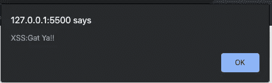
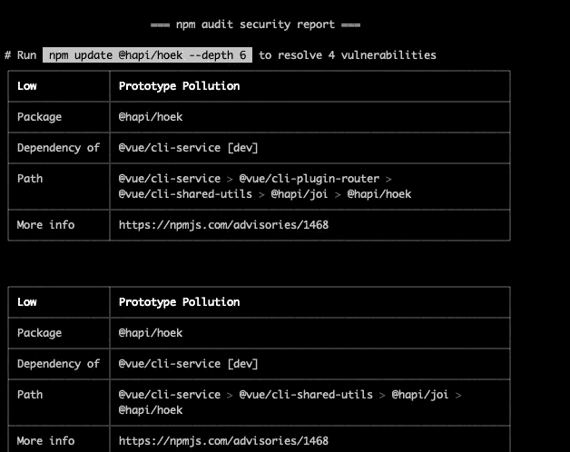
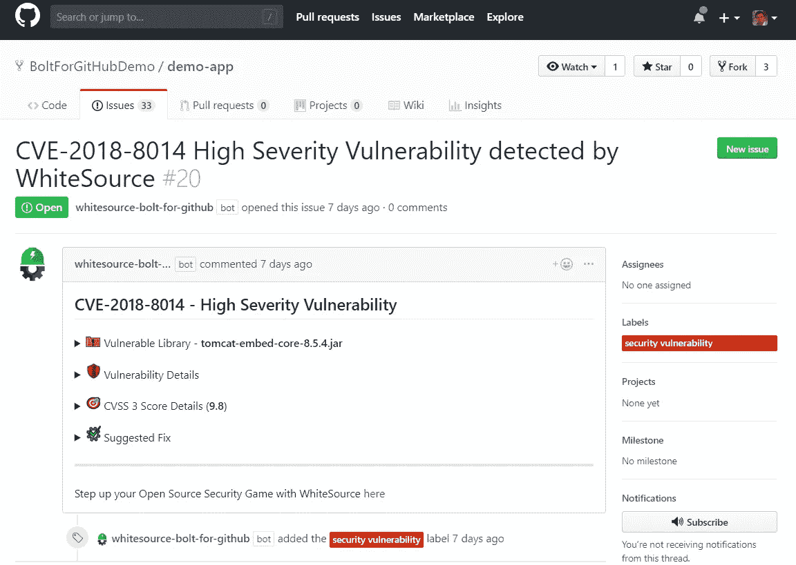

# 最常见的 JavaScript 漏洞及其修复方法

> 原文：<https://levelup.gitconnected.com/javascript-vulnerabilities-e5391a746c90>

JavaScript 是最流行的编程语言，用于构建从后端服务器到交互式前端 web 应用程序的所有东西，正如 w3tech 所言，这些应用程序占据了 web 的 95%。虽然 Javascript 因其在构建动态 web 应用程序中的有用性而非常受欢迎，但由于其受欢迎程度，出现了某些安全问题。领先于这些安全漏洞/弱点将有助于公司预先防范常见的安全故障，并为其用户提供安全的应用程序。

在这篇文章中，我们将看看一些最常见的 JavaScript 漏洞，并学习解决这些漏洞的必要步骤。

# 有哪些常见的漏洞？

javascript 中的大多数安全漏洞都是最终用户交互的结果。恶意用户可以在表单中输入查询字符串来访问或破坏受保护的数据。因此，在用户输入上添加验证中间件是工程团队的责任。

下面列出了最常见的 JavaScript 漏洞:

1.  跨站点脚本(XSS)
2.  SQL 注入(SQLi)
3.  开源漏洞

**跨站点脚本(XSS)**

涉及 web 应用程序和 JavaScript 的最常见攻击之一是跨站脚本漏洞，这些漏洞包含在 [OWASP 十大 web 应用程序安全风险](https://resources.whitesourcesoftware.com/blog-whitesource/owasp-top-10-vulnerabilities)中。

XSS 攻击是 web 应用程序中的一个缺陷，它允许恶意用户在网站上执行 JavaScript 代码，因此它很流行，因为几乎每个网站都需要在用户浏览器中打开 JavaScript。

跨站点脚本主要有两种类型，即:

*   客户 XSS
*   服务器 XSS

**客户 XSS**

当远程位置提供的不受信任的数据(主要是 API)被用来通过不安全的 JavaScript 调用更新 DOM 时，就会出现这种类型的漏洞。

例如，下面的代码片段从不可信的 API 获取天气信息，以显示当前的天气信息。

```
<!DOCTYPE html><html><head><meta charset="utf-8"><meta name="viewport" content="width=device-width"><title>DEMO XSS</title></head><body> <p>Today's weather information reads: </br> <div id="temp"></div> </p> <script type="text/javascript"> let untrusted_ajax_res = document.write(location.replace("https://www.w3schools.com")); document.getElementById("temp").innerHTML=untrusted_ajax_res; </script></body></html>
```

上面的代码片段展示了来自不受信任的 API 的恶意代码是如何被注入 DOM 的。

为了防止客户端 xss 攻击，开发人员可以安装[安全 xss 过滤器](https://www.npmjs.com/package/xss-filters)，该过滤器可用于净化来自不受信任的域/位置的输入。下面是一个 web 用例的片段:

```
<!DOCTYPE html>...<script **src**="dist/xss-filters.min.js"></script><script>let untrusted_ajax_res = document.write(location.replace("https://www.w3schools.com"));document.getElementById("temp").innerHTML=xssFilters.inHTMLData(untrusted_ajax_res);</script>
```

*   *XSS-filters 包只能应用于 UTF-8 编码的文档。还需要 HTML5 模式。*

**服务器 XSS**

当不可信的数据作为用户输入被包含并被发送到后端以存储在数据库中时，就会出现这种类型的漏洞。该数据用于计算发送回用户的响应，该响应在发送回用户时包含恶意 JavaScript 代码。

在下面的代码片段中可以看到一个服务器 XSS 攻击基于 [express](https://www.npmjs.com/package/express) 的[节点](https://nodejs.org/)服务器的例子:

```
...app.get('/search', (req, res) => {const results = db.search(req.query.product);if (results.length === 0) { return res.send('<p>No results found for "' + req.query.product + '"</p>');}...});
```

上面的代码片段显示了 http://www.domain.com[的产品搜索路线的定义。](http://www.domain.com.)XSS 攻击可以通过将 javascript 代码作为查询传递给服务器来执行，如下所示:

```
https://www.domain.com/search?product=<script>alert(XSS:Gat Ya!!)</script>
```

因为不会有任何记录像

```
<script>alert(XSS:Gat Ya!!)</script>
```

在数据库上，服务器的响应将是:

```
<p>No results found for "<script>alert(XSS:Gat Ya!!)</script> </p>
```

在接收到服务器的响应并且没有显示找到的结果之后，脚本被注入到 DOM 中，给出如下所示的输出:



尽管这看起来不是很严重，因为这个脚本不会造成任何严重的威胁。

然而，攻击者可以将恶意代码作为“评论”保存在博客/社交媒体网站中。这些所谓的注释在提供给其他用户时，会被注入 DOM 并执行攻击者的意愿。

要修复此漏洞，我们可以使用 npm 安装 xss-filter 包，如下所示:

```
$ npm i xss-filters --save
```

安装后，我们现在可以在服务器的响应中过滤用户的输入，如下所示:

```
...var xssFilters **=** require('xss-filters');app.get('/search', (req, res) => {var productParam **=** req.query.product;const results = db.search(req.query.product);if (results.length === 0) {res.send('<p>No result found for "' + xssFilters.inHTMLData(productParam) + '"</p>');}});...
```

*   *使用 xss-filters 软件包会带来一些警告，可以在它的* [*安装页面*](https://www.npmjs.com/package/xss-filters#api-documentations) 上找到

**SQL 注入**

SQL 注入是一种攻击，它可以执行 SQL 语句来控制 web 应用程序背后的数据库。

在下面的代码片段中可以看到 SQL 注入攻击:

```
...const db = require('./db');app.get('/products', (req, res) => {db.query('SELECT * FROM products WHERE id = ' + req.query.id);.then((product) => {...res.send(product);})});
```

上面的代码片段有两处错误:

1.  不可信的用户输入直接与查询字符串连接。
2.  数据库查询是通过字符串连接构建的。

如果用户传入 10；DROP TABLE Users —作为 req.query.id，将会传递一个 id 为 10 的值，但是是在执行 DROP TABLE Users 的 SQL 查询之后。这证明了用户输入应该总是被视为不安全的，因此，相应地进行验证。

*   *尽管处理用户输入验证超出了本文的范围，但是您可以阅读关于如何在节点* *中处理数据验证的* [*。*](https://blog.logrocket.com/how-to-handle-data-validation-in-node-using-validatorjs/)

要解决第二个问题，您可以通过编写准备好的 SQL 语句来保护数据库查询字符串。下面是一个在 [Postgres](https://node-postgres.com/features/queries#parameterized-query) 中准备好的/参数化的查询的例子:

```
db.query('SELECT * FROM products WHERE id = $1', req.query.id);
```

在上面的代码片段中，数据库客户机将 req.query.id 作为第一个参数传入。

尽管 node 的 MySQL 包不支持参数化查询，但您可以在用户输入与查询字符串连接之前对其进行转义(即删除所有特殊字符)，如下所示:

```
const query = 'SELECT * FROM products WHERE id = ' + connection.escape(req.query.id);
```

# 开源漏洞

JavaScript 生态系统充满了许多开源包，使得软件工程师的产品开发更加容易。开源软件包有助于加快开发时间，因为不同的软件包与一些专有代码一起可以帮助公司/软件工程师建立一个可行的 MVP。虽然上市时间缩短了，但这些软件包留下了大量的安全漏洞，攻击者可以将恶意代码放入这些漏洞中来窃取/危害用户数据。

软件包管理器(例如 [npm](https://www.npmjs.com/) )和专注于安全的公司已经开发了工具和产品，帮助软件工程师扫描和修复他们项目中的漏洞。

在本节中，我们将讨论如何使用 npm 和 bolt 来防范漏洞。

**使用 NPM**

软件包管理器(例如 [npm](https://www.npmjs.com/) )通过提供漏洞报告和提供补丁，在一定程度上帮助管理从 npm 安装的软件包的漏洞。

当我们在项目目录中运行$ npm audit 命令时，npm 会为所有已安装的依赖项提供一个审核报告，如下所示:



要修复这些漏洞，我们将运行$ npm audit fix 命令。不幸的是，这个命令不能修复所有的漏洞，大多数情况下需要开发人员手动安装和更新这些包。

**使用螺栓**

[Bolt](https://bolt.whitesourcesoftware.com/) 是一款免费的 [GitHub](https://github.com/apps/whitesource-bolt-for-github) 应用，可以帮助持续扫描开源包中的漏洞库(公共和私有)并推断修复方法。这是通过多次(每天限于 5 次)扫描库来完成的，每发现一个漏洞，就会有一个 GitHub 问题出现。还提供了参考链接、漏洞信息和修复建议。



# 结论

用 JavaScript 构建软件会带来很多安全威胁，这些威胁经常被开发人员不自觉地忽略，因为迫切需要不断推出新功能。

开源包在 JavaScript 生态系统中占了很大比例，并被向消费者提供专有产品的公司所使用。通过使用包管理器(如 npm)提供的安全措施和安全解决方案，公司可以在使用这些开源包时避免出现漏洞。

# 进一步阅读

*   [https://OWASP . org/www-project-Top-Ten/OWASP _ Top _ Ten _ 2017/Top _ 10-2017 _ A7-跨站点 _ 脚本 _(XSS](https://owasp.org/www-project-top-ten/OWASP_Top_Ten_2017/Top_10-2017_A7-Cross-Site_Scripting_(XSS) )
*   [https://www . net sparker . com/blog/we b-security/SQL-injection-cheat-sheet/# LineCommentAttacks](https://www.netsparker.com/blog/web-security/sql-injection-cheat-sheet/#LineCommentAttacks)
*   [https://www . csoonline . com/article/3157377/open-source-software-security-challenges-persist . html](https://www.csoonline.com/article/3157377/open-source-software-security-challenges-persist.html)