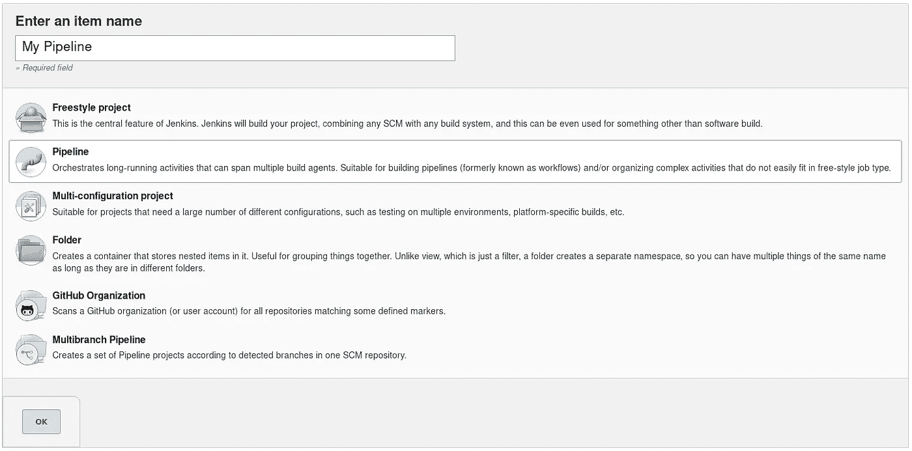
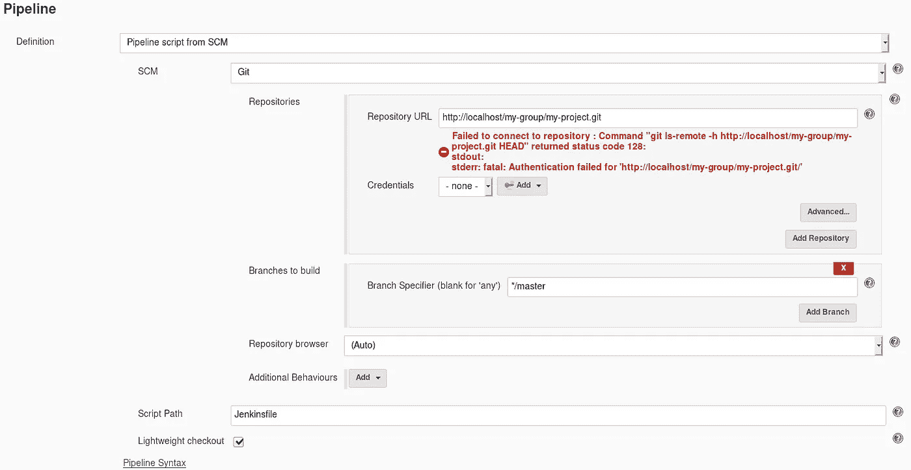

# 用 GitLab 为 Java 项目创建一个 Jenkins 管道

> 原文：<https://levelup.gitconnected.com/jenkins-pipeline-with-gitlab-for-java-projects-d2e10c08e255>


图片来源:https://qautomation.blog/2019/05/28/jenkins-pipeline/

这篇文章将向您展示如何配置一个 Jenkins 管道，当您将代码推送到 GitLab 库时，该管道将自动构建您的项目。我们将使用一个 **Jenkinsfile** 来定义我们的管道，这是最佳实践。

工作流程如下:

**推送至 GitLab → Jenkins 管道触发→运行构建(Maven) →运行 JUnit 测试(Maven) →从管道发送电子邮件结果**

如果你还没有安装 GitLab 和 Jenkins，你可以按照[这篇文章](https://medium.com/@gyfdev/install-gitlab-jenkins-on-centos-7-504df77fae4)中的说明，然后回到这里。

这篇文章还假设您已经安装了 Java、Git 和 Maven，以及一个至少有一个 JUnit 测试的简单 Maven 项目。在继续之前，确保您能够成功地在您的项目上运行`mvn clean install` 和`mvn test` 。

# 步骤 1:创建 GitLab 存储库

在 GitLab 中，点击**组**下拉菜单，然后点击**新建组**按钮，创建一个组。为您的群组命名，然后点击**创建群组**。


点击**新建项目**创建一个新项目。给它起个名字，然后点击**创建项目**。


初始化您的本地 Maven 项目，并将其推送到您的新存储库:

```
cd existing_folder
git init
git remote add origin [http://localhost/my-group/my-project.git](http://localhost/my-group/my-project.git)
git add .
git commit -m "Initial commit"
git push -u origin master
```

在 GitLab 中刷新您的项目，您应该会看到您的代码。如果你看到一个横幅写着“Auto DevOps pipeline 已启用…”进入设置并禁用它。

# 步骤 2:在 GitLab 中创建一个 Jenkins 用户

我们需要在 GitLab 中创建一个 Jenkins 用户，以便 Jenkins 可以通过我们将在步骤 4 中安装的插件与 GitLab 的 API 进行通信。

在 GitLab 中，点击顶部工具栏中的扳手图标进入管理区。


在左侧菜单中，点击**用户**，然后点击右上角的**新用户**。适当填写必填字段，并确保选择**访问级别**下的**管理**单选按钮:


返回到**用户**页面，编辑您刚刚创建的 Jenkins 用户。给用户一个密码，以便您可以作为该用户登录。完成后，退出当前会话，以 Jenkins 用户身份登录。

以 Jenkins 用户身份登录后，转到您的设置并点击左侧菜单栏中的**访问令牌**。确保给你的令牌起一个名字，并在**范围**下选择 **api** 。


一旦你创建了访问令牌，**将令牌复制并粘贴到临时的某个地方**——你将不能再从这里访问它。我们稍后将使用这个令牌。

注销并以 **root** 用户的身份重新登录。

# 步骤 3:在 Jenkins 中创建一个 GitLab 用户

现在，我们需要在 Jenkins 中创建一个 GitLab 用户，以便 GitLab 可以通过 webhooks 通知 Jenkins 资源库的更新。

从 Jenkins 主页进入**管理 Jenkins →管理用户→创建用户**并填写表格。


创建用户后，注销并作为“gitlab”用户重新登录。

进入**管理 Jenkins →管理用户**，点击 gitlab 用户旁边的齿轮图标进行配置。在 **API 令牌**下，点击**添加新令牌**并为其命名，然后点击**生成**。


生成令牌后，**将令牌复制并粘贴到某个临时位置** —您将无法再从这里访问它。我们稍后将使用这个令牌。

注销并作为**管理员**用户重新登录。

# 步骤 4:为 Jenkins 安装和配置 GitLab 插件

我们需要为 Jenkins 安装 GitLab 插件，这样他们就可以互相交流了。

在 Jenkins 主页上，点击**管理 Jenkins →管理插件**。点击**可用的**标签，搜索“gitlab”并安装 GitLab 插件。


选中“安装完成后重启 Jenkins…”复选框，如果您错过了，您也可以在下载完成后用`sudo systemctl restart jenkins`重启 Jenkins。


大约一分钟后，刷新页面并再次以管理员用户身份登录。

在 Jenkins 中，转到**管理 Jenkins** → **配置系统**并向下滚动到 **Gitlab** 部分。输入连接的名称、GitLab 实例的 URL，然后在**凭证**旁边，点击**添加→ Jenkins** 。这是您将在步骤 2 中添加 GitLab 令牌的地方。


在**种类**旁边，选择 **GitLab API 令牌**。粘贴您的 GitLab API 令牌并给它一个 ID 和描述，然后单击 **Add** 将令牌添加到 Jenkins:


点击**凭证**旁边的下拉菜单，选择令牌。然后点击**测试连接**——之后你应该会看到“成功”:


点击屏幕底部的**保存**保存您的更改。您可以在**管理詹金斯** → **凭证**查看您新创建的凭证。

现在 Jenkins 已经准备好与 GitLab API 进行通信了。

# 步骤 5:创建一个 Jenkins 管道

在 Jenkins 主页上，点击左侧菜单栏中的**新项目**。输入项目名称并选择**管道**。点击**确定**创建:



接下来，您将看到管道配置页面。选中**放弃旧构建**的复选框，并设置**最大构建数以保持**为一个合理的数字(在本教程中我选择了 3):


确保在 **GitLab 连接**旁边选择您在步骤 4 中创建的连接:


在 **Build Triggers** 部分下，当一个变更被推送到 GitLab 时，选中 **Build 的复选框，并复制它旁边的 GitLab webhook URL 以备后用。保持**启用 GitLab 触发器**部分不变:**


在**管道**部分，从**定义**下拉列表中选择**来自 SCM** 的管道脚本(这将是后面描述的 Jenkinsfile ),并从 **SCM** 下拉列表中选择 **Git** 。输入存储库 URL(与您在`git clone`中使用的相同)。您应该会看到一个验证错误，因为我们还没有提供可以访问您的 GitLab 存储库的用户名/密码:



在**凭证**旁边，点击**添加→ Jenkins** ，填写您的 GitLab 用户名/密码，点击**添加**:


从**凭证**下拉列表中选择您的凭证，认证错误应该会消失。如果没有，请确保您有正确的用户名/密码，并且该用户有访问存储库的权限。


点击屏幕底部的**保存**。

# 步骤 6:在 GitLab 中配置一个 Webhook

我们需要一种方法让 GitLab 告诉 Jenkins 什么时候代码已经被推送到一个存储库——这就是 webhooks 的用途。

*注意:如果您的 Jenkins 实例运行在 localhost 上，请按照以下步骤允许 GitLab 在本地发送请求:*

1.  *进入* ***管理区***
2.  *将鼠标悬停在* ***设置*** *上，点击* ***网络***
3.  *展开* ***出库请求***
4.  *勾选* ***复选框，允许来自网络钩子和服务*** 的本地网络请求
5.  *点击* ***保存修改***

在 GitLab 中，转到你的项目，然后悬停在左侧菜单栏底部的**设置**，然后点击 **Webhooks** 。

输入 Jenkins 管道(从上一步复制的管道)的 URL，并对其进行修改，使其遵循以下方案:

```
http://<gitlab-user-in-jenkins>:<token>@<host>/project/<project-name>
```

将**秘密令牌**字段留空，并确保勾选**推送事件**。


点击**添加 webhook** ，然后向下滚动到底部查看您的 webhook。点击**测试→推送事件**进行测试。您应该会看到 200 状态代码:


如果你回到 Jenkins，你应该看到一个失败的构建——这是一个好消息，因为这意味着 webhook 工作了，Jenkins 能够监听到你的 GitLab 库的推送。

如果您检查 Jenkins 构建控制台输出，您将看到类似于以下错误的内容:


下一步，我们将添加一个 Jenkinsfile 到我们的存储库中，告诉 Jenkins 如何构建我们的项目。

# 步骤 7:添加一个 Jenkinsfile

在 git 存储库中，在根级别创建一个名为“Jenkinsfile”的文件。

将以下内容粘贴到 Jenkinsfile 中，并将其推送到存储库:

```
pipeline {
    agent any

    stages {
        stage('Build') {
            steps {
                sh 'mvn clean install -DskipTests'
            }
        }
        stage('Test') {
            steps {
                sh 'mvn test'
            }
        }
    }   
}
```

这个 Jenkinsfile 告诉 Jenkins 将构建分成几个阶段——首先是构建 Maven 项目的“构建”阶段，然后是通过 Maven 运行 JUnit 测试的“测试”阶段。

假设您在 Jenkins 运行的同一台机器上安装并配置了 Maven，那么当您在 Jenkins 中查看您的管道项目时，您应该会看到如下内容:


如果您在构建或测试阶段看到红色矩形而不是绿色矩形，这意味着您的代码构建失败或者您的某个单元测试失败。您可以通过点击**构建历史**部分中的构建，然后点击**控制台输出**来检查整个过程。


# 步骤 8:电子邮件通知

通常的做法是让管道向推送代码的用户发送电子邮件，让他们知道他们的构建是通过了还是失败了。

如果您尚未安装“电子邮件扩展插件”,请先安装该插件，然后再继续。

*注意:确保您推送的 GitLab 帐户具有有效的电子邮件地址——这是您的管道将向其发送电子邮件的地址。*

通过转到**管理 Jenkins** → **配置系统**并向下滚动到**扩展电子邮件通知**来配置插件。

填写您的 SMTP 服务器，点击**高级…** 并勾选**使用 SMTP 认证**复选框。填写您的用户名(电子邮件地址)和密码，然后勾选**使用 SSL** 复选框。输入 465 作为 SMTP 端口:


向上滚动到顶部，在 **Jenkins Location** 下，将**系统管理员电子邮件地址**更改为“Jenkins<Jenkins @ Jenkins>”—这将作为发件人姓名出现在您将收到的电子邮件中。


点击底部的**保存**。

在您的 Jenkinsfile 中，在“stages”部分之后添加下面的“post”部分，并将其推送到您的存储库。

```
pipeline {
    agent any

    stages {
        stage('Build') {
            steps {
                sh 'mvn clean install -DskipTests'
            }
        }
        stage('Test') {
            steps {
                sh 'mvn test'
            }
        }
    }

    post {
        always {
            emailext subject: "Jenkins Build ${currentBuild.currentResult}: Job \"${env.JOB_NAME}\"",
                body: "${currentBuild.currentResult}: Job \"${env.JOB_NAME}\" build ${env.BUILD_NUMBER}.\nMore info at: ${env.BUILD_URL}",
                recipientProviders: [[$class: 'DevelopersRecipientProvider'], [$class: 'RequesterRecipientProvider']]
        }
    }
}
```

这里，我们告诉 Jenkins 在构建完成后总是给用户发送一封电子邮件，并给它一个如何显示信息的模板。

回到你的詹金斯管道去看它运行。如果一切顺利，您应该会看到类似下面的内容，还应该会收到一封电子邮件。


恭喜你！您已经成功地建立了一个 Jenkins 管道来从 GitLab 自动构建 Java 项目。