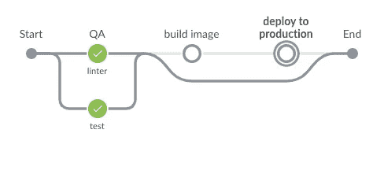
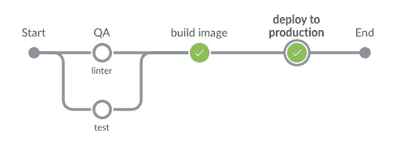

# Jenkinsfile 举例说明

> 原文：<https://levelup.gitconnected.com/jenkinsfile-explained-with-example-ba2d27850880>

# **代理人**

让我们从将要执行某个阶段的`agent`开始。可以是整个`pipeline`也可以是某个`stage`。在顶级代理中，我们将其设置为`none`，因此我们需要设置每个阶段要使用的代理。

让我们讨论下面的代理类型:

```
agent {
  docker {
    image 'alxibra/forstok-apigateway:0.0.1'
    label 'slave'
  }
}
```

这意味着我们使用基本映像`alxibra/forstok-apigateway:0.0.1`在 docker 环境中运行我们的阶段。`label`表示你要执行哪个带有某个标签的服务器。我们有 2 台服务器运行 Jenkins，我们用`master`和`slave`标记我们的服务器。

关于代理的更多信息，你可以阅读关于[代理](https://www.jenkins.io/doc/book/pipeline/syntax/#agent)的文档。

# **环境**

我们在这里没有什么可以解释的，因为它本身已经解释清楚了。但是如果您想知道凭证从何而来。我们可以去**管理詹金斯>安全>管理凭证**

```
AWS_KEY = credentials('AWS_KEY')
```

# **当**

`when`该指令用于阶段运行的条件。下面的`when`条件意味着除了在分支`master`中，该阶段总是运行

```
when {
  not {
    branch 'master'
  }
}
```

更多信息参见本[文档](https://www.jenkins.io/doc/book/pipeline/syntax/#when)。

# **步骤**

`steps`完成该阶段需要做些什么

```
steps('test') {
  sh 'bundle exec rspec'
}
```

上面的脚本我们需要运行命令`bundle exec rspec`。每个`steps`可以有多个命令。对于当前情况，我们只需要一个命令。

# **平行**

我们可以并行运行多个阶段。首先我们需要创建父`stage`，在`stage`中放置`parallel`指令。在`parallel`里面放上你想要的几个`stage`。

```
stage('QA'){
  paralle {
    stage('linter'){
      .......
    }
    stage('test') {
      ........
    }
  }
}
```

更多信息请参见本[文档](https://www.jenkins.io/doc/book/pipeline/syntax/#parallel)

# **发帖**

某一阶段完成或失败后的附加步骤。我们定义了两个条件`success`和`failure`。他们都向我们发送懈怠状态的通知。关于`post`中条件的更多信息，请参见[文档](https://www.jenkins.io/doc/book/pipeline/syntax/#post)。

现在我试着解释 Jenkinsfile 在上面的文件中做了什么



当分支不是主时

当分支不是`master`时，我们只运行`linter`并并行测试，而不执行`build image`和`deploy to production`。



当分支是主时

现在我们想要发布我们的应用程序，我们需要将它部署到生产环境中。首先，我们需要构建应用程序，构建完成后，我们可以将它部署到生产环境中。如果部署状态为成功或失败，jenkins 会将状态发送给 slack。