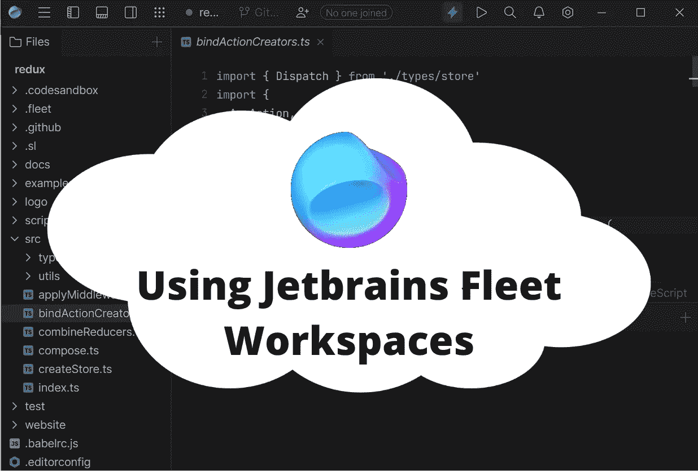
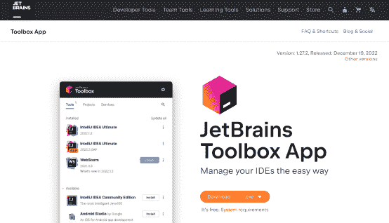
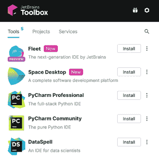
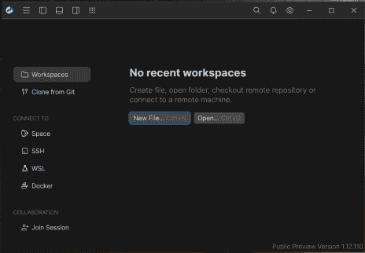
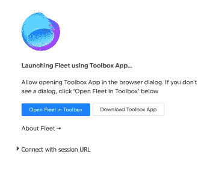
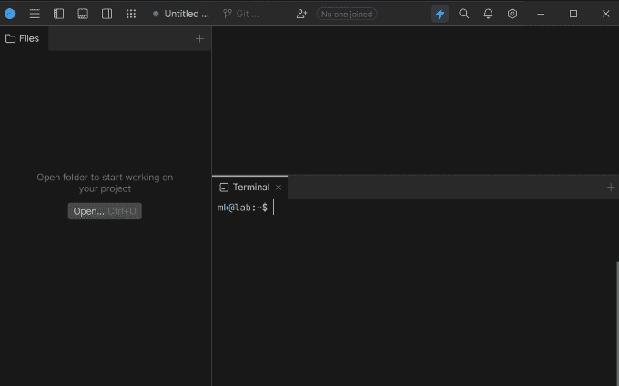
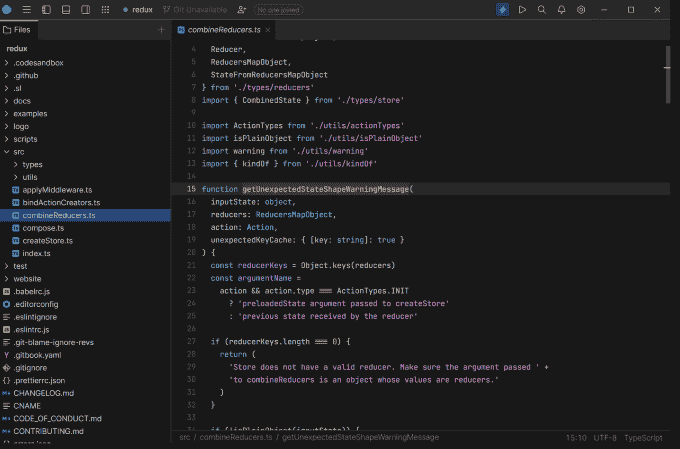

# Jetbrains Fleet:使用远程工作区进行高效开发

> 原文：<https://levelup.gitconnected.com/jetbrains-fleet-using-remote-workspaces-for-efficient-development-2d64bdaca974>

最后，VS 代码语言服务器的有力竞争者



在软件开发中，通常使用远程和预配的工作人员来执行代码和运行任务。这些工作人员可以位于远程数据中心或云环境中，他们可以通过本地集成开发环境(IDE)访问，该环境通过互联网连接到他们。使用远程和调配的工作人员可能是有益的，因为它允许开发人员访问强大的硬件和基础架构，而不必在本地进行设置。对于分布在不同地点并需要在一个项目上协作的团队来说，它也很有用。本地 ide 可用于编写、调试和部署代码给远程工作人员，使得从单一界面使用和管理代码库变得容易。在这篇文章中，我将讨论如何设置 Jetbrains 的新 IDE Fleet，以便在远程 Linux 机器上工作。

# 为什么要使用远程工作人员进行开发？

开发人员(以及他们的雇主)选择在一台机器上运行 ide，而在另一台机器上运行实际的开发工作负载(测试、编译、代码分析)有很多原因。这些是几个主要的:

1.  改进的性能:与本地开发环境相比，远程服务器端工作人员通常可以提供更好的性能。如果您正在开发一个笔记本电脑难以构建的大型项目，您可以将其卸载到远程服务器(例如，您的 PC 或 VPS ),并将笔记本电脑的计算能力仅用于文本编辑。
2.  集中式开发环境:通过使用相同的服务器端环境，您(和您的团队)可以节省设置新环境(特别是如果您使用多个设备进行开发)和修复它们之间差异的时间。
3.  简化供应:对于管理许多开发人员的团队来说，使用服务器端工作人员可以节省资金和资源。你不再需要为开发人员提供强大的硬件，而是分发连接到云的瘦客户端，只需按一下按钮就可以扩展和缩小。
4.  共享资源:服务器端工作人员可以安全地连接到您或您的团队使用的其他开发环境:数据库、消息队列和其他服务。这将简化操作，并使您的开发工作流更加安全，因为开发客户端只需要连接到一个服务器，而不是许多。

我希望这些理由能够说服你尝试在你的开发过程中使用远程工作者。接下来，我将指导您使用 Jetbrains Fleet 建立一个服务器/客户机开发环境。

# 为什么我使用远程工作人员进行开发？

在给出了为什么使用这样的模型进行开发很棒的大致想法之后，我想分享一下我个人在日常生活中是如何使用它的。我家里有一台运行 Windows 10 的功能强大的电脑。我喜欢使用 WIndows 10 进行常规活动，如编辑代码、记笔记、浏览互联网和玩游戏。但是，我绝对讨厌 Windows 主机和 PowerShell，只用 Linux 做开发工作。因此，在我的设置中，我在 VirtualBox 中运行了一个没有 GUI 的 Xubuntu 虚拟机，并且我在 WIndows 上运行的 Jetbrains 舰队连接到该虚拟机。当我外出使用我的慢速笔记本电脑时，它也连接到该虚拟机以使用相同的环境。我发现它非常适合我，我希望能够帮助您满足开发环境的期望。

# 步骤 0:设置您的机器

在我们开始之前，让我们首先确保您已经具备了设置远程工作者开发环境所必需的先决条件。在本教程中，我将假设您有一个作为客户机的系统，在那里您执行开发工作，另一个作为服务器，运行您的构建、测试和代码分析。你可以使用 Linux，Mac，Windows，或者两者都用。更重要的是，您可以使用同一台机器来运行车队和车队服务器。我自己在 Windows PC 上运行 Fleet 客户端，在同一台 PC 上 Linux 虚拟机上运行 Fleet 服务器。您还可以使用 WSL (Windows Subsystem for Linux)在上运行 Fleet server。只要确保您将使用的两个系统之间有网络连接，并且一切都应该正常工作。

# 步骤 1:设置车队服务器

我们将首先在您的服务器上安装 Jetbrains Fleet 来处理开发工作量。使用以下命令下载二进制文件:

*   **Linux x86 _ 64:**
*   **Linux ARM** : `curl -LSs "https://download.jetbrains.com/product?code=FLL&release.type=preview&release.type=eap&platform=linux_aarch64" --output fleet && chmod +x fleet`
*   **苹果电脑英特尔** : `curl -LSs "https://download.jetbrains.com/product?code=FLL&release.type=preview&release.type=eap&platform=macos_x64" --output fleet && chmod +x fleet`
*   **macOS ARM** : `curl -LSs "https://download.jetbrains.com/product?code=FLL&release.type=preview&release.type=eap&platform=macos_aarch64" --output fleet && chmod +x fleet`
*   **Windows x86_64** : `curl -LSs "https://download.jetbrains.com/product?code=FLL&release.type=preview&release.type=eap&platform=windows_x64" --output fleet.exe`

请注意，这些链接在 2022 年 12 月更新，可能会过时。你可以从这里的[拿到新的。](https://www.jetbrains.com/help/fleet/install-on-a-remote-machine.html#2b2ae8a3)

下载完二进制文件后，您可以将它移动到您方便的位置(我的位置是`~/bin`)并添加到 PATH。然后，为了**启动 Jetbains Fleet server 进行远程开发，运行以下命令:**

*   **Linux/Mac:**
*   **Windows:** `fleet launch workspace -- --auth=accept-everyone --enableSmartMode`

运行这个命令后，您应该会看到类似下面的输出(我的是在 Linux 上运行的):

```
Workspace version automatically resolved to latest released version '1.12.110', workspace options passed after `--` must be valid for this version.

BOOTSTRAP: 528ms [own=321ms, jvm=207ms]
Configure console log with class ch.qos.logback.classic.AsyncAppender
Configure file log with class ch.qos.logback.classic.AsyncAppender (/home/mk/.cache/JetBrains/Fleet/log/fleet.log)
Loaded logback configuration from:
        file:///home/mk/.fleet/log.conf.toml
        jar:file:///home/mk/.cache/JetBrains/Fleet/artifacts/1.12.110/workspace/./fleet.util.logging.api.jar!/log.conf.toml
Applying new dynamic config FleetLogConfiguration(refreshTimeout=30, default=WARN, perTarget={}, loggers=[Entry(loggerName=fleet, default=DEBUG, perTarget={CONSOLE=WARN, FILE=INFO}), Entry(loggerName=noria, default=DEBUG, perTarget={CONSOLE=WARN, FILE=INFO})])
Dock HTTP Api: 127.0.0.1:38925
Start listening to 127.0.0.1:46635
*** Starting Workspace Server ***
- listening to 127.0.0.1:0
- UID: 
- Supported authorization methods: {"type":"AcceptsEveryone"}
- Smart Mode: enabled
- with FSD
- Host ID: will be resolved or generated
- Published to Jetbrains relay: true
- Lobby address: LobbyAddress(host=lobby.fleet.api.jetbrains.com, isSecure=true, port=443)
- Version: 1.12.110
- Join this workspace using URL:
```

您可以看到，我们已经指定服务器侦听端口 4000，您可以在命令中更改该端口。为了简化工作，您可以创建一个脚本，用这些参数来运行 Fleet。

# 步骤 2:安装车队客户端

一旦我们完成了服务器部分，是时候在你的客户端上安装舰队编辑器了。你可以在任何平台上完成，首先从[这里](https://www.jetbrains.com/toolbox-app/)下载 Jetbrains 工具箱:



安装后，您可以登录 Jetbrains 帐户并安装 Fleet:



一旦您安装了它，验证您可以正确运行它。首次启动时，您应该会看到以下窗口:



现在你已经为下一步做好了准备！

# 步骤 3:链接车队客户端和服务器

现在，您可以使用在步骤 1 中获得的链接连接到您的工作区。它应该是这样的:

```
Join this workspace using URL: https://fleet.jetbrains.com/?version=1.12.110&workspaceId=1234&session=1234
```

在安装了客户端的系统上的浏览器中打开它，您将看到以下页面:



如果没有反应，试着按蓝色的按钮。几秒钟后，舰队窗口打开，你终于连接上了！



通过屏幕顶部的绿点，您可以知道您连接到了远程工作区。现在您可以访问您的终端(在远程机器上)、文件和语言分析。尝试使用终端克隆一个 repo，或使用文件菜单打开一个 repo。我玩了一下分叉的 Redux repo，无论是浏览还是构建都感觉快多了！



# 结论

Jetbrains Fleet 仍处于非常早期的开发阶段，许多功能，包括这一个，都感觉俗气和未经打磨。截至 2022 年底，你不能通过局域网直接连接到工作场所，也不能通过认证来保护它。对于生产使用，我建议不要使用这个特性，而使用 SSH/WSL 集成。然而，跟随 Fleet 的开发过程是非常有趣的，我非常期待有一天我们能够使用 Fleet Workspaces 的全部潜力，因为这将是 VS 代码无法接近的。

# 分级编码

感谢您成为我们社区的一员！在你离开之前:

*   👏为故事鼓掌，跟着作者走👉
*   📰查看[级编码出版物](https://levelup.gitconnected.com/?utm_source=pub&utm_medium=post)中的更多内容
*   🔔关注我们:[推特](https://twitter.com/gitconnected) | [LinkedIn](https://www.linkedin.com/company/gitconnected) | [时事通讯](https://newsletter.levelup.dev)

🚀👉 [**加入升级人才集体，找到一份惊艳的工作**](https://jobs.levelup.dev/talent/welcome?referral=true)