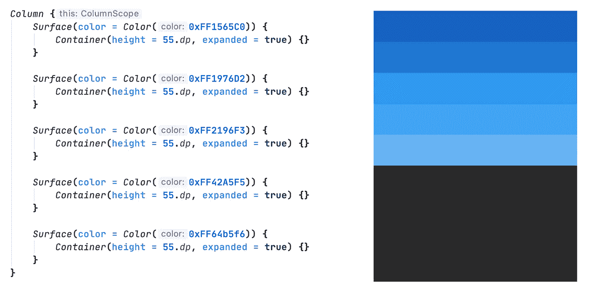
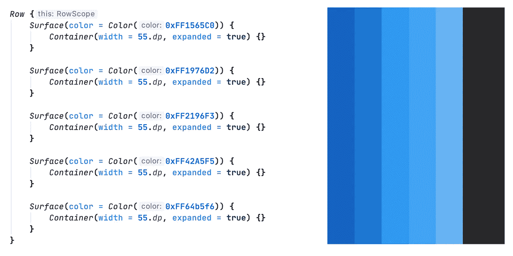
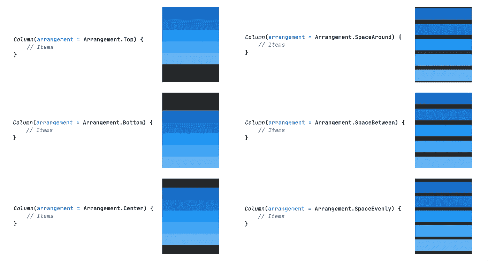
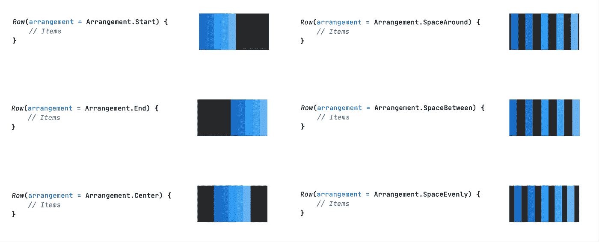
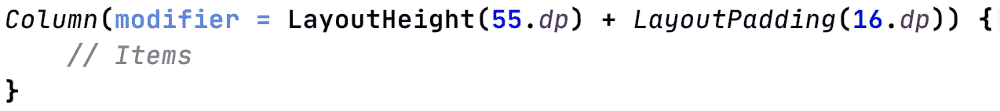

# Jetpack 撰写:列和行

> 原文：<https://levelup.gitconnected.com/jetpack-compose-columns-and-rows-d8ef19a0cef>


随着 Jetpack Compose 库的开发，我想快速浏览一下我们到目前为止的布局选项。这次覆盖了列和行。

之前我介绍过**容器**的布局——你可以在这里查看这篇文章:

[](/jetpack-compose-container-layout-183e655518f2) [## Jetpack 撰写:容器布局

### 随着 Jetpack Compose 库的开发，我想快速浏览一下我们目前拥有的一些布局选项…

levelup.gitconnected.com](/jetpack-compose-container-layout-183e655518f2) 

**列**布局是另一个简单的布局(斜杠视图组)。顾名思义，它垂直排列项目。**行**布局横向排列物品。

它们在 xml 世界中的对应是 **LinearLayout** (垂直和水平方向)。

这是它的样子



列背景是灰色的

划船



行背景颜色为灰色

列布局和行布局具有相同的属性:

```
***Modifier:*** *The modifier to be applied to the Column/Row.* ***Arrangement:*** *The vertical/horizontal arrangement of the layout's children.*
```

让我们检查一下这些。

# 约定

有 6 种不同类型的排列—对于列，默认排列是**排列**。**顶部**和排为**排列**。**启动**。

列排列:



这些是行的排列:



# 修饰语

这是所有布局/组件的通用属性——用于设置高度、宽度、填充等。

设置修饰符的语法是:



您可以根据需要设置任意数量的修改器。

> *免责声明:由于 Jetpack Compose 处于开发阶段，这些 API 中的任何一个都可能随时发生变化。所以作为真理的来源，请总是参考官方的* [*文献*](https://developer.android.com/jetpack/compose) *。*

这就是现在，感谢阅读——我将很快涵盖其余的布局，所以请保持关注。编码快乐！