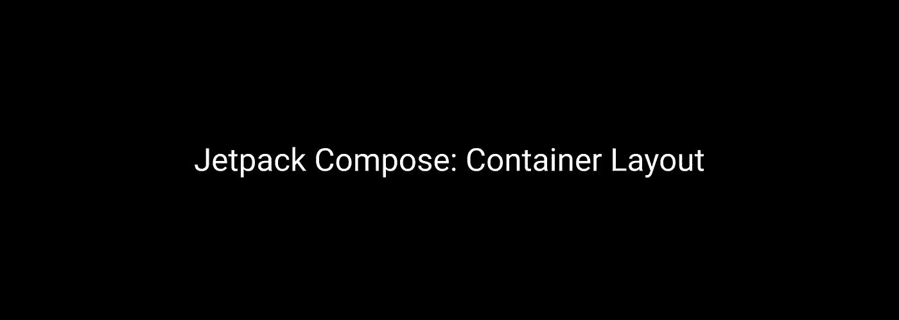
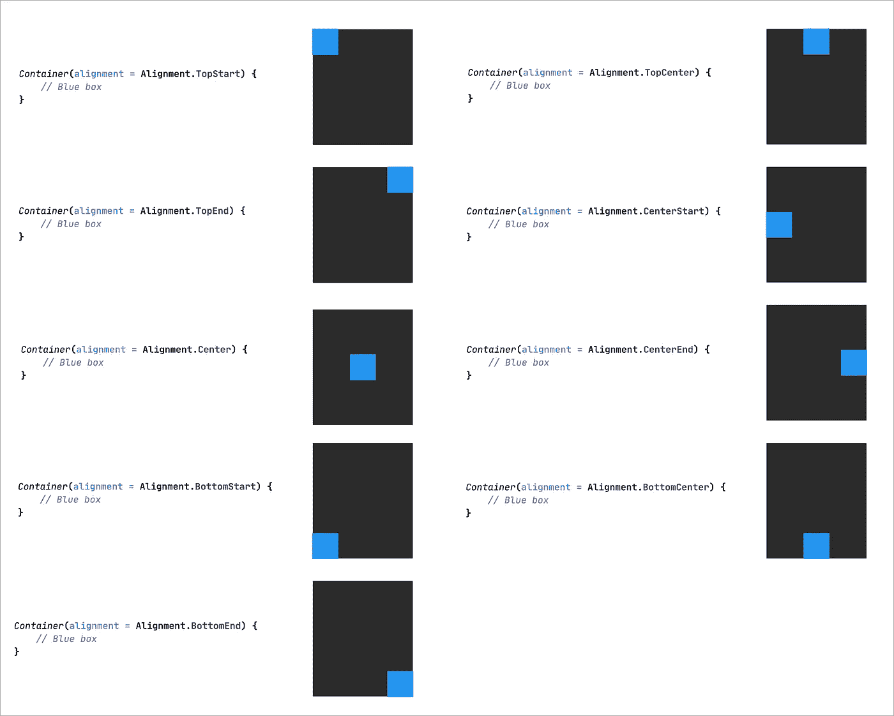
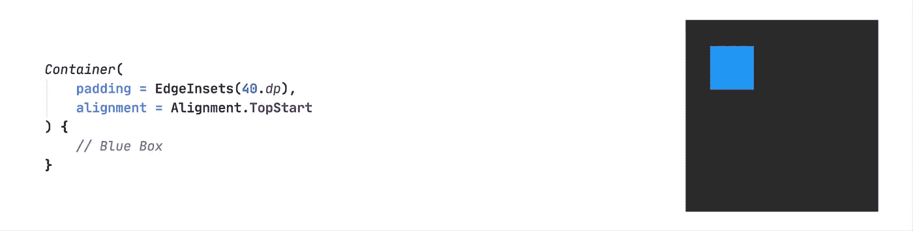
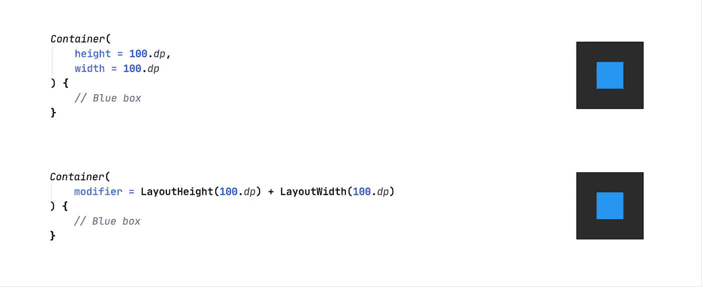
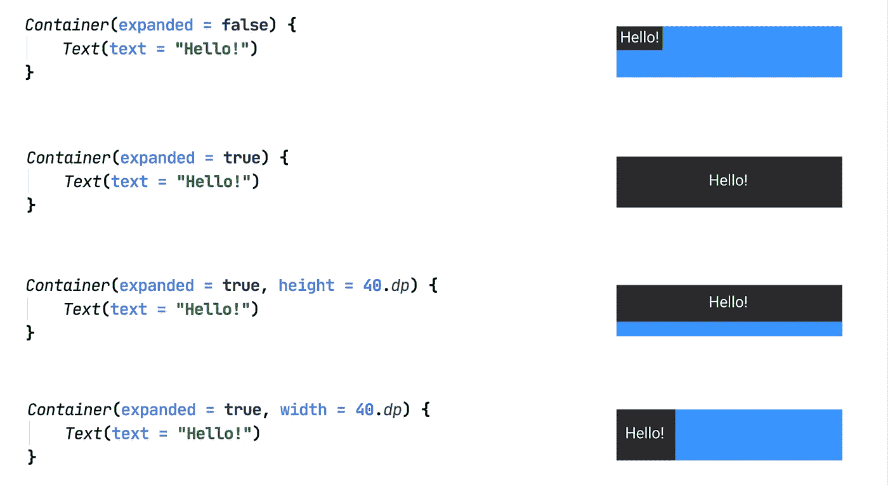
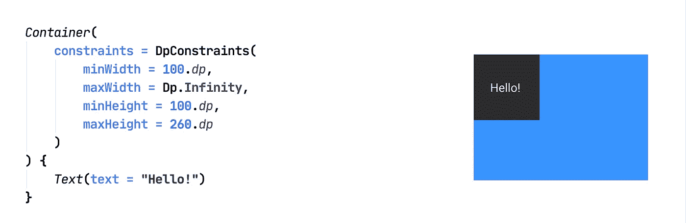
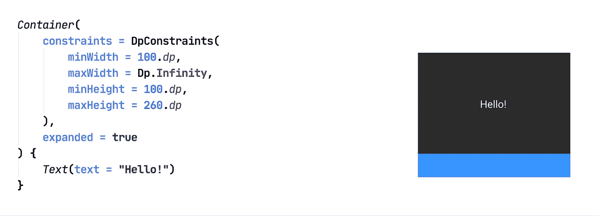
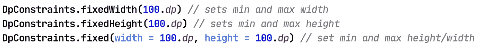
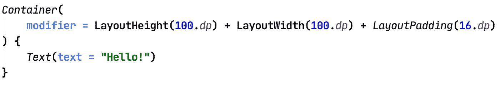

# Jetpack 撰写:容器布局

> 原文：<https://levelup.gitconnected.com/jetpack-compose-container-layout-183e655518f2>



随着 Jetpack Compose 库的开发——我想快速浏览一下我们目前拥有的布局选项。从容器布局开始。

> 更新:从 compose 版本 **0.1.0-dev08** 开始，容器布局已被弃用，取而代之的是使用**[**Box**](https://developer.android.com/reference/kotlin/androidx/ui/foundation/package-summary.html#Box(androidx.ui.core.Modifier,%20androidx.ui.graphics.Shape,%20androidx.ui.graphics.Color,%20androidx.ui.foundation.Border,%20androidx.ui.unit.Dp,%20androidx.ui.unit.Dp,%20androidx.ui.unit.Dp,%20androidx.ui.unit.Dp,%20androidx.ui.unit.Dp,%20androidx.ui.foundation.ContentGravity,%20kotlin.Function0))**——您仍然可以阅读关于容器的详细信息，因为它与 Box 相似——不同之处在于容器只能容纳一个子容器。****

****我们已经熟悉了 xml 世界中的**视图组**，例如 *LinearLayout* 、 *FrameLayout* 、 *ConstraintLayout* 等等。Jetpack Compose 中也有类似的布局选项。****

******容器**布局是这些布局中的一种，并且可能是最简单的一种。这只是一个单个子视图的容器布局，也就是说，它只能有一个子视图。****

****使用容器的优点是，您可以在容器本身上设置不同的属性，以调整内部子容器的位置和大小。****

****这些是我们得到的一些选择:****

```
*****Alignment****: how to position the child if the* ***[Container]*** *is larger than the child* ***Padding****: the padding to be applied to the child* ***Width****: the width to be used for the Container* ***Height****: the height to be used for the Container* ***Expanded****: expands the container to parent's height/width* ***Constraints****: additional Constraints to be enforced when measuring the Container***
```

****让我们一个一个地检查这些属性。****

> ****注意:在写这篇文章的时候，我使用的是 Jetpack Compose 版本 **0.1.0-dev06** 。****

# ****对齐****

****我们可以为子视图设置 9 种不同的对齐方式。默认校准设置是**居中**。****

****如果我们有一个 80dp x 80dp 的蓝色盒子作为子视图，并假设容器大约为 220dp x 220dp，那么设置不同的对齐方式将如下所示:****

********

****黑色的盒子是容器——蓝色的是盒子组件****

# ****填料****

****设置填充的简单选项。****

********

****我们还可以为左、上、右和下设置单独的填充。****

# ****高度和宽度****

****我们可以显式设置容器的高度和宽度。这可以通过两种方式实现****

****1 —使用**高度**和**宽度**属性****

****2 —使用**布局高度**和**布局宽度**修改器****

****两者效果相同。****

********

****注意蓝框(子视图)在中间，因为这是容器上的默认对齐设置。****

# ******展开******

****除非明确指定，否则该属性如果设置为 true，将扩展容器以匹配父视图的高度和宽度。默认情况下，它被设置为 false。****

********

****父布局为蓝色—包含文本的容器为深灰色****

# ****限制****

****Constraints 属性用于设置容器的最小和最大高度/宽度**。******

********

****注意:蓝色背景是容器布局的父级——它可以是行、列或任何其他布局****

****如果我们这样做，容器在没有展开的时候将占用最小的高度/宽度。****

********

****展开时—采用最大高度/宽度。因为 maxWidth 设置为无穷大(即 match_parent)，所以它采用父级的全宽，但将高度设置为 260dp。****

****还有用于设置约束的助手扩展。****

********

# ****修饰语****

****这是所有布局/组件的通用属性——在容器的情况下并不真正有用，因为它有显式的修饰符属性(高度、宽度、填充等)。但是如果你愿意，你可以使用修饰符来设置布局规格。****

****设置修饰符的语法是:****

********

****您可以根据需要设置任意数量的修改器。****

> ****免责声明:由于 Jetpack Compose 处于开发阶段，这些 API 可能会随时更改。所以作为真相的来源，请始终以官方[文档](https://developer.android.com/jetpack/compose)为准。****

****这就是现在，感谢阅读——我将很快涵盖其余的布局，所以请保持关注。编码快乐！****