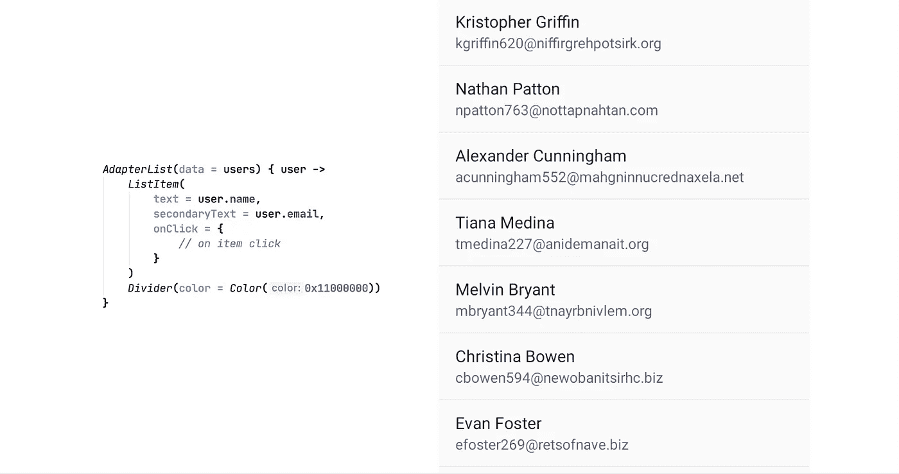
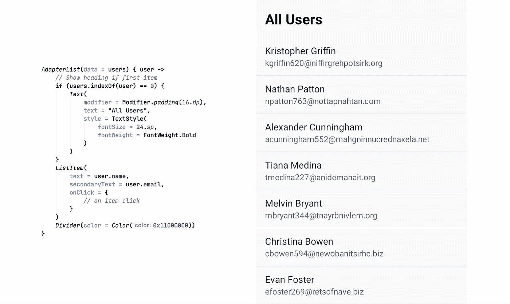
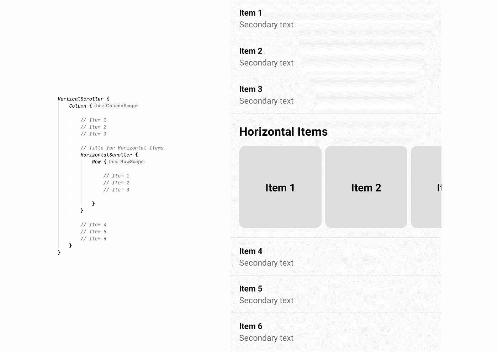

# Jetpack 撰写:列表

> 原文：<https://levelup.gitconnected.com/jetpack-compose-lists-3599d3ee5970>

我们可以用两种方式在 Jetpack 中实现列表。

> *注:我在写这篇文章的时候正在使用 Jetpack Compose 版本****0 . 1 . 0-dev 08****。*

# 使用 AdapterList

我们可以使用**adapter list**composable——它相当于*RecyclerViews*+*recyclervieadapters*——但是代码要少得多😍

AdapterList 构造函数接收数据，这是您想要显示的项目列表，并将各个项目传递给 lambda。您可以在那里定义列表项。

目前它仅限于垂直滚动。这在未来的版本中可能会有所改变。

## **多种类型**

我们可以很容易地区分不同的视图类型——只需添加 if 条件。如果我们想在列表的开头显示一个标题，这里有一个例子:

# 使用垂直和水平滚动条

实现列表的另一种方式是使用简单的滚动条——这些滚动条不会使用循环视图。所以对于大列表来说并不理想。

我们可以嵌套这些滚动条来使用列和行构建布局。

下面是实际的布局:

> *免责声明:由于 Jetpack Compose 处于开发阶段，这些 API 中的任何一个都可能随时发生变化。所以作为真理的来源，请总是参考官方的* [*文献*](https://developer.android.com/jetpack/compose) *。*

之前我还介绍了其他可组合的布局——请务必也查看一下:

 [## Jetpack 撰写:容器布局

### 随着 Jetpack Compose 库的开发，我想快速浏览一下我们目前拥有的一些布局选项…

levelup.gitconnected.com](/jetpack-compose-container-layout-183e655518f2)  [## Jetpack 撰写:列和行

### Jetpack Compose 中列和行布局选项的快速概述。

levelup.gitconnected.com](/jetpack-compose-columns-and-rows-d8ef19a0cef) 

目前就这些，感谢阅读——我将很快报道更多与 Jetpack Compose 相关的内容，敬请关注。编码快乐！