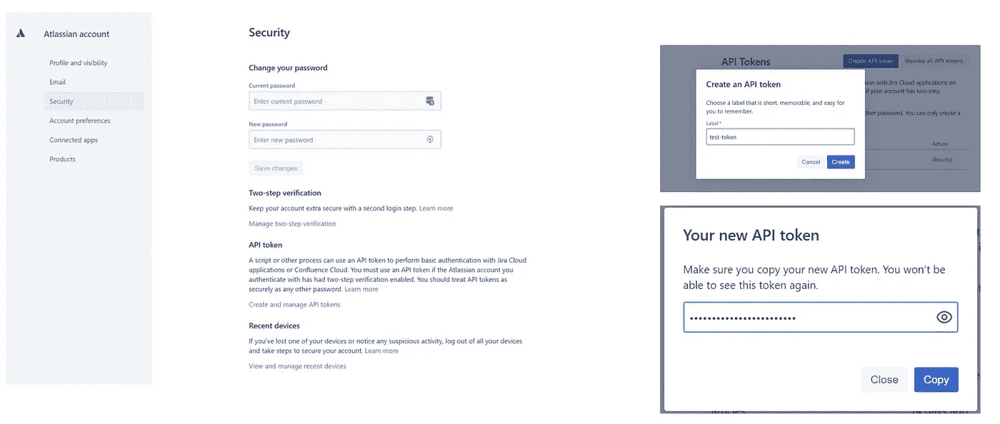
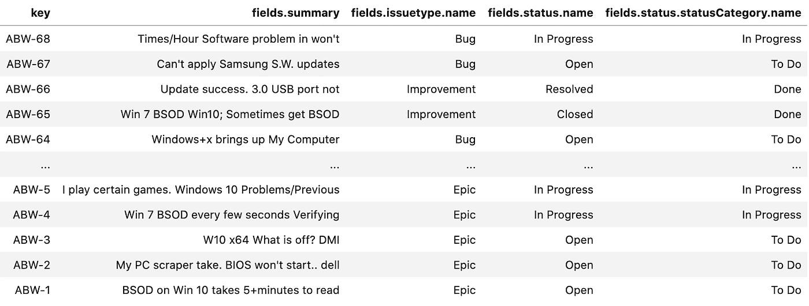
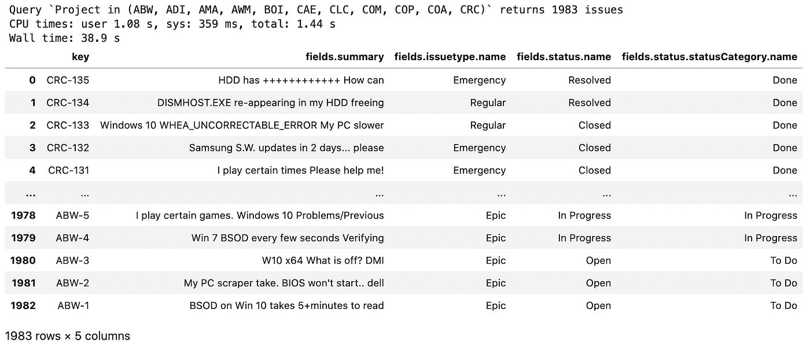
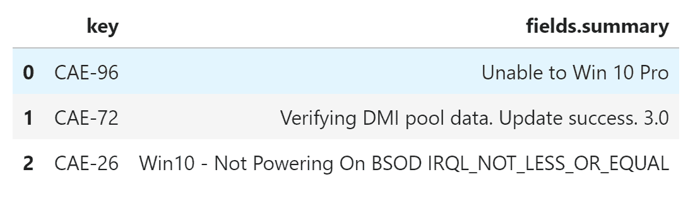
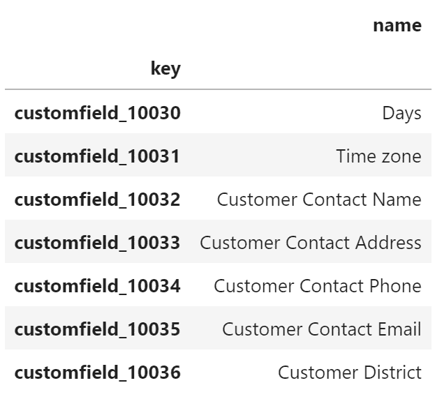
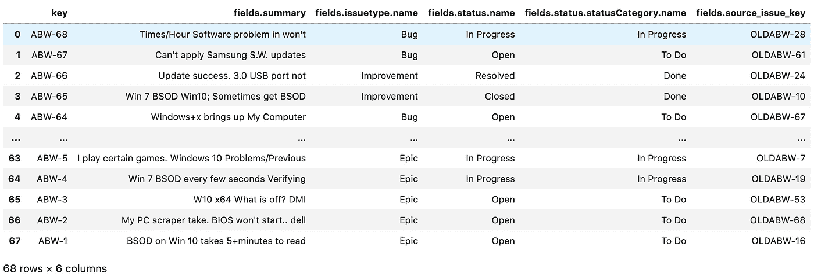
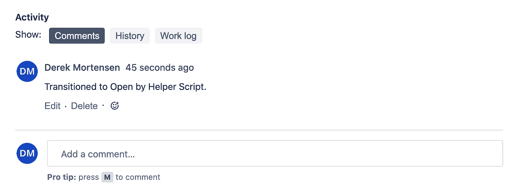
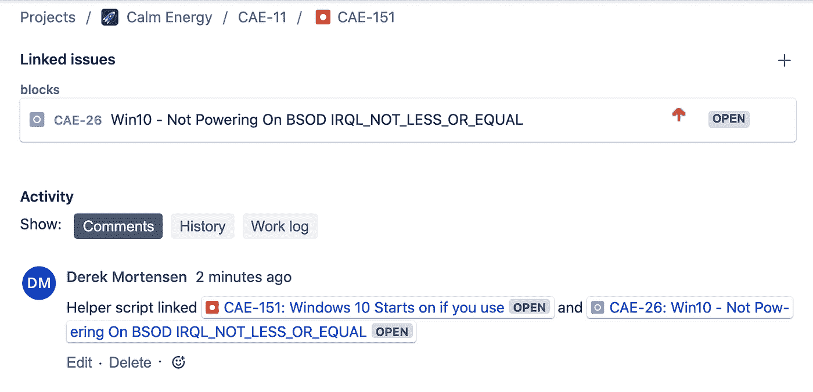
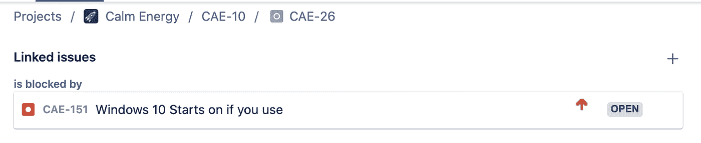

# Python 和熊猫的吉拉 API

> 原文：<https://levelup.gitconnected.com/jira-api-with-python-and-pandas-c1226fd41219>

# 介绍

API 很棒。它们将对数据的访问和控制从围绕数据构建的 UI 中分离出来。它就像是为计算机构建的 UI。本文将介绍与吉拉 API 交互的基础知识，以便使用 Python 检索数据并将其加载到 Pandas 数据帧中。从那里，你可以清理，过滤，图表，或存储它。

我们还将通过 API 介绍一些基本的 *write* 操作:创建问题、转换问题、链接问题和添加注释。吉拉 API 非常丰富，但是这些基本构件为自动化提供了很多机会。最后，我们将通过实现一个场景将这一切联系起来。

1.  **令牌认证**
2.  **最简单的案例**
3.  **吉拉会给你什么回报**
4.  **用 JQL 滤波**
5.  **载入熊猫数据帧**
6.  **查询限制**
7.  **自定义字段**
8.  **过渡问题**
9.  **评论问题**
10.  **联系问题**
11.  **创建问题**
12.  **把它们绑在一起**

# 令牌认证

在脚本中使用普通的用户名和密码可能很诱人，但是我强烈建议，即使您只是在探索 API，也要花几秒钟来生成一个令牌。

令牌充当临时密码，您可以独立于所有其他令牌撤销该密码。这意味着，如果使用您的某个令牌的服务器受到威胁，您可以撤销该令牌，而不会影响其他服务器。

*使用您的用户名+密码(启用的话+ 2FA)登录后，吉拉允许您创建唯一的令牌，在通过 API 进行身份验证时代替您的密码使用。如果您的帐户使用双因素身份验证，您将需要生成一个令牌，因为您的脚本无法访问第二个因素。*

创建令牌字符串时，您只能访问一次。

*令牌可以独立撤销，因此为您将要访问 API 的每个环境创建一个令牌。这样，如果该环境受到威胁，您可以撤销对受威胁令牌的访问，而不会影响任何其他环境。*

*吉拉用户界面还会显示每个令牌的上次使用时间。一些 API 还允许您设置令牌的到期日期或基于每个令牌配置权限(例如，允许对一些 API 令牌进行只读访问，对其他令牌进行读写访问)。在撰写本文时，吉拉还不支持这些特性。*

要创建令牌，请转到帐户设置→安全→ API 令牌。记住复制字符串，因为你只能访问它一次！你将用它来代替你的真实密码。



创建 API 令牌。这比在脚本中输入密码要简单和安全得多。

# 最简单的例子

让我们从最简单的情况开始，以确保身份验证正常工作。贯穿本文，我们将使用 atlassian-python-api python 库。

[亚特兰蒂斯-python-api](https://pypi.org/project/atlassian-python-api/)

首先，我们通过传入`url`、`username`和`password`(上面创建的令牌)来实例化 atlassian-python-api 库提供的`Jira`类的实例。

```
from atlassian import Jirajira_instance = Jira(
    url = "https://YOUR_DOMAIN.atlassian.net/",
    username = "YOUR_USERNAME",
    password = "YOUR_TOKEN",
)
```

现在我们可以尝试一个简单的请求，通过一个问题的键来请求这个问题。我们将限制字段以保持响应大小可读。

```
jira_instance.issue(key = "CAE-1", fields = ["issuetype", "status", "summary"])
```

# 吉拉给了你什么回报

吉拉返回一个带有几个顶级键的 JSON 对象

*   **展开:**此时不感兴趣
*   **id:** 问题的内部唯一 id，因为有时`key`可以改变
*   **自我:**问题的链接。加上额外的字段参数，这就是我们刚刚访问的端点
*   **密钥:**我们指定的吉拉发行密钥
*   **字段:**我们关心这里的一些子字段，下面会详细介绍。

```
{
  "expand": "renderedFields,names,schema,operations,editmeta,changelog,versionedRepresentations",
  "id": "11702",
  "self": "https: //dmort.atlassian.net/rest/api/2/issue/11702",
  "key": "CAE-1",
  "fields": {
    "summary": "PC rebooting itself/ screen turning off.",
    "issuetype": {
      "self": "https: //dmort.atlassian.net/rest/api/2/issuetype/10000",
      "id": "10000",
      "description": "A big user story that needs to be broken down. Created by Jira Software - do not edit or delete.",
      "iconUrl": "https: //dmort.atlassian.net/images/icons/issuetypes/epic.svg",
      "name": "Epic",
      "subtask": False
    },
    "status": {
      "self": "https: //dmort.atlassian.net/rest/api/2/status/1",
      "description": "The issue is open and ready for the assignee to start work on it.",
      "iconUrl": "https: //dmort.atlassian.net/images/icons/statuses/open.png",
      "name": "Open",
      "id": "1",
      "statusCategory": {
        "self": "https: //dmort.atlassian.net/rest/api/2/statuscategory/2",
        "id": 2,
        "key": "new",
        "colorName": "blue-gray",
        "name": "To Do"
      }
    }
  }
}
```

您已经可以看到事情开始成形，我们可以通过编程获得任何问题的 JSON 表示。

# 用 JQL 滤波

让我们扩展我们的请求，以包括一系列问题。这个 JQL 查询将返回 ABW 项目中的所有问题。

```
jira_instance.jql("project = ABW", limit = 100, fields=["issuetype", "status", "summary"])
```

这将在响应的`issues`键下的列表中返回 68 个问题。请注意，当我们要求一个特定的关键字时，每期的结构与上面的相同。

```
{'expand': 'schema,names',
 'startAt': 0,
 'maxResults': 100,
 'total': 68,
 'issues': [{'expand': 'operations,versionedRepresentations,editmeta,changelog,renderedFields',
   'id': '14317',
   'self': '<https://dmort.atlassian.net/rest/api/2/issue/14317>',
   'key': 'ABW-68',
   'fields': {'summary': "Times/Hour Software problem in won't",
...
```

# 载入熊猫数据框

为了将它加载到 DataFrame 中，我们使用 pandas `json_normalize`函数(有关将嵌套的 JSON 转换为表格格式的更多信息，请参见:

[将嵌套的 JSON 结构转换为 Pandas 数据帧](https://medium.com/swlh/converting-nested-json-structures-to-pandas-dataframes-e8106c59976e)

```
# Get results of jql query
results = jira_instance.jql("project = ABW", limit = 100, fields=["issuetype", "status", "summary"])# Load the results into a DataFrame. The list of issues is under the "issues" key of the results object.
df = pd.json_normalize(results["issues"])# Define which fields we care about using dot notation for nested fields.
FIELDS_OF_INTEREST = ["key", "fields.summary", "fields.issuetype.name", "fields.status.name", "fields.status.statusCategory.name"]# Filter to only display the fields we care about. To actually filter them out use df = df[FIELDS_OF_INTEREST].
df[FIELDS_OF_INTEREST]
```



JQL 结果的数据图表。

瞧，可以导出、过滤、绘制或透视吉拉数据的表格表示。

# 查询限制

你可能已经注意到了上面的`jql`函数中的`limit`参数。默认情况下，吉拉 API 从 JQL 查询中返回前 50 个问题。我们可以设置一个更高的限制，通常在请求中使用`limit`参数达到 1000 个问题，但是有时甚至 1000 个问题也不够。为了解决这个问题，我们定义了一个函数来处理分页。

吉拉对策包括以下要点

```
{...
 'startAt': 0,
 'maxResults': 100,
 'total': 1983,
...}
```

这个函数调用 API 来查找查询结果集中有多少个问题，然后循环，直到所有问题都被收集到一个返回给调用者的列表中。

```
def retrieve_all_query_results(jira_instance: Jira, query_string: str) -> list:
    issues_per_query = 100
    list_of_jira_issues = []

    # Get the total issues in the results set. This is one extra request but it keeps things simple.
    num_issues_in_query_result_set = jira_instance.jql(query_string, limit = 0)["total"]
    print(f"Query `{query_string}` returns {num_issues_in_query_result_set} issues")

    # Use floor division + 1 to calculate the number of requests needed
    for query_number in range(0, (num_issues_in_query_result_set // issues_per_query) + 1):
        results = jira_instance.jql(query_string, limit = issues_per_query, start = query_number * issues_per_query)
        list_of_jira_issues.extend(results["issues"])

    return list_of_jira_issues
```



所有 1983 年的查询结果都包括在内，但是所有的网络活动花费了将近 39 秒！

# 子查询

JQL 可能非常强大，但它不是 SQL，您可能会发现自己遇到了瓶颈，无法过滤出正确的问题集。对此的一个解决方案是子查询，使用一个查询的结果作为第二个查询的输入。在这些场景中，您可能需要子查询

*   给定一组问题，找出处于某种状态的所有*链接的*问题
*   当父问题列表来自查询时，仅查找子问题
*   给定一个查询结果，查找具有分配给任何这些问题的任何标签的所有问题。

因为我们的查询是用 pythn 编写的，所以从查询中解析出结果并使用这些值作为第二个请求的输入相对简单。或者，在某些情况下，我们可以直接在 python 中进行二次过滤，而不需要更多的 API 请求。我们将在这里使用 python 方法，在最后的练习中使用 API 方法作为例子，以防第一个查询没有为子查询返回足够的数据。

```
first_query_results = retrieve_all_query_results(jira_instance, "Project = CAE and issueLinkType = 'is blocked by'", fields = ["issuelinks", "summary"])# Create an empty list to add issues when not all the blocking issues are closed.
blocked_by_unclosed_issues = []for issue in first_query_results:
    print(issue["key"], issue["fields"]["summary"], "is blocked by", [(link["inwardIssue"]["key"], link["inwardIssue"]["fields"]["status"]["name"]) for link in issue["fields"]["issuelinks"]])

    # Convert the list of links into a DataFrame
    df_sub_query_example = pd.json_normalize(issue["fields"]["issuelinks"])

    # This step does the filtering, we only want to count issues where the link type is "is blocked by" and the linked issue isn't closed.
    if len(df_sub_query_example.loc[(df_sub_query_example["inwardIssue.fields.status.name"] != "Closed") & (df_sub_query_example["type.inward"] == "is blocked by")]) > 0:
        blocked_by_unclosed_issues.append(issue)

print()
print(f"There are {len(blocked_by_unclosed_issues)} issues where at least one linked issue isn't Closed")
display(pd.json_normalize(blocked_by_unclosed_issues)[["key", "fields.summary"]])CAE-96 Unable to Win 10 Pro is blocked by [('CAE-142', 'Open'), ('CAE-159', 'Open'), ('WOM-119', 'Open'), ('CAE-167', 'In Progress'), ('CAE-133', 'In Progress'), ('CAE-167', 'In Progress'), ('CAE-169', 'In Progress')]
CAE-72 Verifying DMI pool data. Update success. 3.0 is blocked by [('CAE-145', 'Open'), ('CAE-136', 'Open'), ('CAE-158', 'Open'), ('CAE-167', 'In Progress'), ('CAE-144', 'In Progress'), ('CAE-25', 'Closed'), ('CAE-167', 'In Progress'), ('CAE-169', 'In Progress')]
CAE-43 I get the a PC slower is blocked by [('CAE-118', 'Closed'), ('CAE-25', 'Closed'), ('CAE-47', 'Closed')]
CAE-26 Win10 - Not Powering On BSOD IRQL_NOT_LESS_OR_EQUAL is blocked by [('CAE-151', 'Open'), ('CAE-167', 'In Progress'), ('CAE-167', 'In Progress'), ('CAE-169', 'In Progress')]
```



使用 python 过滤问题列表。

# 自定义字段

上面我们使用了`fields`参数来指定从 API 返回的字段名列表。定制字段的处理方式需要稍有不同。吉拉不强制自定义字段名称的唯一性。相反，在幕后，它会创建一个`customfield_#`名称，而*就是您需要包含在`fields`列表中的*名称。

有几种方法可以找到自定义字段的名称。

**使用 API**

```
custom_fields_list = jira_instance.get_all_custom_fields()
df_custom_fields = pd.DataFrame.from_records(custom_fields_list, index = ["key"])
df_custom_fields[["name"]].head()
```



我们得到所有定制字段的列表，过滤出感兴趣的列(`key`是我们正在寻找的`customfield_#`字符串，`name`是给定的名称。然后使用 Pandas `.loc`函数过滤列表。

```
df_custom_fields.loc[df_custom_fields["name"] == "Customer Contact Phone"]
```


**使用管理控制台(类似于)**

如果您是管理员，您可以转到管理→问题→自定义字段→编辑自定义字段详细信息。

然后 id 会显示在 URL 中。

```
[https://YOUR_DOMAIN.atlassian.net/secure/admin/EditCustomField!default.jspa?id=10003](https://YOUR_DOMAIN.atlassian.net/secure/admin/EditCustomField!default.jspa?id=10003)
```

使用`customfield_<your_custom_field_id_number>`将其包含在结果中。

这里有一些包含`Source Issue Key`定制字段的代码。

```
# Get results of jql query
results = jira_instance.jql("project = ABW", limit = 100, fields=["issuetype", "status", "summary", "customfield_10037"])# Load the results into a DataFrame
df = pd.json_normalize(results["issues"])# Rename the custom field in our table
df = df.rename(columns = {"fields.customfield_10037": "fields.source_issue_key"})# Define which fields we care about using dot notation for nested fields
FIELDS_OF_INTEREST = ["key", "fields.summary", "fields.issuetype.name", "fields.status.name", "fields.status.statusCategory.name", "fields.source_issue_key"]# Filter to only display the fields we care about. To actually filter them out use df = df[FIELDS_OF_INTEREST].
df[FIELDS_OF_INTEREST]
```



结果现在包括我们的自定义字段(source_issue_key)

# 过渡问题

到目前为止，我们只讨论了从 API 中读取数据的*，但是读取只是 API 特性的一部分。如果你总是想在满足某一组条件时转换一组问题，那么在脚本中设置这些条件可以节省大量时间。吉拉已经开始在应用程序中内置这一点，但是仍然有一些场景需要外部脚本。*

*   转换吉拉不支持的查询中的一组问题
*   决定移交问题时，使用来自其他系统的数据

吉拉的每个转换都有一个`id`，例如从`In Progress`到`Resolved`的转换可能有`id = 5`，转换可以在工作流之间共享，因此您可能会发现同一个`id`有多个问题类型。

可用的转换显然取决于问题的当前状态和工作流程。幸运的是，API 提供了一个端点，给定一个问题键，它返回一个可用转换和转换 id 的列表。

```
jira_instance.get_issue_transitions("CAE-1")
```

退货:

```
[
 {'name': 'Stop Progress', 'id': 301, 'to': 'Open'},
 {'name': 'Resolve Issue', 'id': 5, 'to': 'Resolved'},
 {'name': 'Close Issue', 'id': 2, 'to': 'Closed'}
]
```

由于`CAE-1`目前是`In Progress`。

```
jira_instance.issue("CAE-1")["fields"]["status"]["name"]
> "In Progress"
```

atlassian-python-api 库接受状态名而不是转换 id(上面的`to:`字段),如果您使用的是 http 库，则需要使用`id`。

```
jira_instance.issue_transition("CAE-1", "Open")
jira_instance.issue("CAE-1")["fields"]["status"]["name"]
> "Open"
```

# 评论问题

吉拉记录了详细的历史记录，但在更新或转换问题时添加注释可能对其他人有所帮助。

```
jira_instance.issue_add_comment("CAE-1", "Transitioned to Open by Helper Script.")
```



# 链接问题

链接问题是一个稍微不同的过程。我们定义`inwardIssue`和`outwardIssue`这是因为有些环节是不对称的:

*   对称`CAE-151` `relates to` `CAE-26`
*   `CAE-151` `blocks` `CAE-26`和`CAE-26` `is blocked by` `CAE-151`不对称

这里我们在`CAE-151`和`CAE-26`之间建立一个链接

```
inward_issue_key = "CAE-151"
outward_issue_key = "CAE-26"jira_instance.create_issue_link(
    data = {
        "type": {"name": "Blocks" }, # The type of link being created
        "inwardIssue": { "key": inward_issue_key }, # We're saying that the "inward issue" is Blocking the "outward issue"
        "outwardIssue": {"key": outward_issue_key }, # The "outward issue" will be a "is blocked by" link to to CAE-151
        "comment": { "body": f"Helper script linked {inward_issue_key} and {outward_issue_key}" } # Include a comment that we are linking these issues by a script
    }
)
```



# 制造问题

与过渡问题类似，创建问题需要一个字段字典。如果项目中有必填字段，您需要定义所有字段，否则请求将失败。

```
jira_instance.create_issue(
    fields =  {
       "project":
       {
          "key": "CAE"
       },
       "summary": "Investigate these blocked issues.",
       "description": "Creating of an issue using project keys and issue type names using the REST API",
       "issuetype": {
          "name": "Internal Task"
       }
   }
)
```

响应包括问题密钥、隐藏的 id 和一个到问题的 JSON 表示的链接。

```
{
 'id': '15454',
 'key': 'CAE-161',
 'self': '<https://dmort.atlassian.net/rest/api/2/issue/15454>'
}
```

# 把它们绑在一起

让我们用一个场景把这一切联系起来。

*   查询被一个或多个未解决的其他问题阻止的问题
*   这里我们需要一个子查询，因为阻塞问题和*的状态所有阻塞问题*都是过滤的一部分
*   创建一个链接到所有被阻止问题的`Internal Task`
*   给`Internal Task`添加注释
*   将此`Internal Task`转换为`In Progress`

```
# Get an initial list of issues
initial_issue_list = retrieve_all_query_results(jira_instance, "Project in (ABW, ADI, AMA, AWM, BOI, CAE, CLC, COM, COP, COA, CRC) and issueLinkType = 'is blocked by'", fields = ["issuelinks"])def extract_list_of_issues_blocking(issue: dict):
    # Turn the issue links from a list of dictionaries into a table
    df_issue_links = pd.json_normalize(issue["fields"]["issuelinks"])

    # Filter the table of links to only "is blocked by" links. Then select the key column and convert that into a list.
    blocking_issue_keys = df_issue_links.loc[df_issue_links["type.inward"] == "is blocked by"]["inwardIssue.key"].to_list()

    # The list of issues linked to the original e.g. ["CAE-45", "CAE-73", "CAE-88", "CAE-91"]
    return blocking_issue_keys# Check the blocking issues status and filter down the list of keys to only those blocked by unresolved issues
blocked_by_open_issues = []
blocking_issues = []for issue in initial_issue_list:
    # Extract a list of blocking issue keys for this specific issue
    blocking_issue_keys = extract_list_of_issues_blocking(issue)

    # Do a sub-query for the issues blocking a specific key. Only return linked issues that are unresolved. All we need is the key so don't include any fields.
    blocking_issues_not_done = jira_instance.jql(f"key in ({', '.join(blocking_issue_keys)}) AND resolution is EMPTY", fields = "None")["issues"]

    if len(blocking_issues_not_done) > 0:
        # Extract just the keys from the list of unresolved blocking issues returned by the query
        blocking_issues_not_done_keys = pd.DataFrame(blocking_issues_not_done)["key"].to_list()

        # Add the blocked issue to our list
        blocked_by_open_issues.append(issue["key"])

        # Add the unresolved blocking issues to the list. Use extend because we want each item in the list not the whole list as a single new entry.
        blocking_issues.extend(blocking_issues_not_done_keys)

        print(issue["key"], "is blocked by these unresolved issues:", ", ".join(blocking_issues_not_done_keys))

    else:
        print(issue["key"], "is not blocked by any unresolved issues.")print()
print("These keys are blocked by unresolved issues", ", ".join(blocked_by_open_issues))# Create the "Internal Task" issue for someone to go clean things up.
created_issue = jira_instance.create_issue(
    fields =  {
       "project":
       {
          "key": "CAE"
       },
       "summary": "Investigate these blocked issues.",
       "description": "Creating of an issue using project keys and issue type names using the REST API",
       "issuetype": {
          "name": "Internal Task"
       }
   }
)print(created_issue)
created_issue_key = created_issue["key"]# Link the new issue to the blocking issues
for key in blocked_by_open_issues:
    jira_instance.create_issue_link(
    data = 
        {
            "type": {"name": "Relates" }, # The type of link being created
            "inwardIssue": { "key": created_issue_key },
            "outwardIssue": {"key": key },
        }
    )# Transition the created task to In Progress
jira_instance.issue_transition(created_issue_key, "In Progress")# Add a comment with what we did
jira_instance.issue_add_comment(created_issue_key, f"These keys {' ,'.join(blocked_by_open_issues)} are blocked by unresolved issues. Please investigate {' ,'.join(set(blocking_issues))}")
```

感谢阅读。我希望这是有帮助的，并给你一些想法，如何改善这些基本的构建块您的工作流程。

# **此处提供示例代码**

[https://gist . github . com/dmort-ca/a3 bbe AAC 4729 ba 2c 72 a9 a 33512402 AE 4](https://gist.github.com/dmort-ca/a3bbeaac4729ba2c72a9a33512402ae4)

# 参考

*   [https://developer . atlassian . com/cloud/jira/platform/rest/v3/](https://developer.atlassian.com/cloud/jira/platform/rest/v3/)
*   [https://pypi.org/project/atlassian-python-api/](https://pypi.org/project/atlassian-python-api/)

[](https://skilled.dev) [## 编写面试问题

### 一个完整的平台，在这里我会教你找到下一份工作所需的一切，以及…

技术开发](https://skilled.dev)