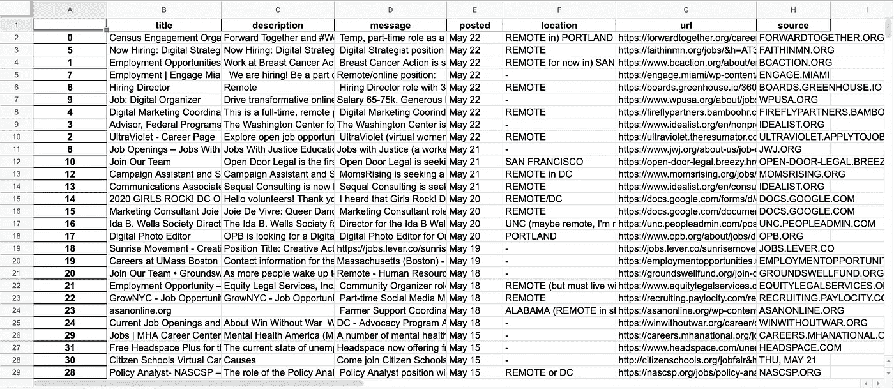
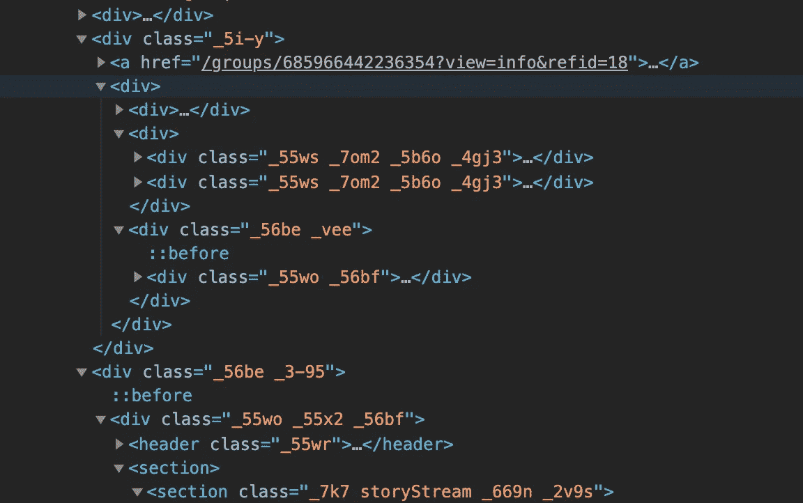

# 没有社交媒体的求职

> 原文：<https://levelup.gitconnected.com/job-hunting-without-social-media-152ada0639db>

## 使用 python、selenium、smtplib 和对脸书的健康厌恶匿名挖掘数据

自从我的言论自由教授说服我删除所有社交媒体账户以来，已经过去了将近三年。为我的毕业论文做研究，探索脸书、Twitter 和 Youtube 等公司的历史和实践，我对基于注意力的数字平台对个人和社会的影响产生了持久的偏执感。

我正在慢慢克服对社交媒体的悲观看法，回到那些我可以花时间主要消费他人内容的网站。但我仍然坚决“关闭”一些平台，包括脸书。

以我目前找工作的经验来看，把脸书排除在外会让在线就业市场看起来像瑞士奶酪。

今年早些时候，我加入了 LinkedIn，这是我 3 月份在波士顿大会上完成的数据科学“训练营”的毕业要求。学校的职业成果计划可能很严格，但该组织声称工作安置率在 90%左右，我发现这很有帮助。

尽管 LinkedIn 有很多好处，但它对可用的工作列表和潜在的联系提供了一个有限的视角。

我的女朋友是一个社区组织者和熟练的研究员，经常分享找工作的独特资源。但他们中的许多人在脸书以群体的形式存在，所以我被困在就业市场的黑暗中，或者在一个可疑的社交媒体平台上花费不必要的时间。

在她向我展示了一个特别有趣的社区 [Justice Jobs 2.0](https://m.facebook.com/groups/685966442236354/?ref=group_header&view=group) 之后，我开始着手弥补我的知识缺口。我使用 python、一个名为 selenium 的网络抓取库和一个自动发送电子邮件的脚本，创建了一个工具，从脸书的一个群组中匿名收集帖子数据，删除脸书的链接跟踪系统，并将结果以 Excel 电子表格的形式通过电子邮件发送给自己。

## 之前:

从桌面访问“公共”脸书群组页面时看到

挖掘和解析后的最终数据

# 该过程

最初的计划是使用 python 和 Selenium 从我女朋友的帐户中收集脸书集团的数据，在她的 Z shell 上创建一个别名，这样她就可以使用一行代码从自己的计算机上触发脚本。

但进一步的修补显示，虽然脸书屏蔽了没有账户的桌面用户，但在手机上却不是这样。撇开脸书在“公共”定义上的不一致不谈，我有一个出发点:在 URL 的开头添加`m.`。因此，该脚本可以在任何机器上运行，不需要脸书帐户。

运行上面两行代码启动一个 Selenium 驱动的 Web 驱动程序，这是一个虚拟浏览器，允许从我选择的 python 环境 Jupyter Notebook 与目标页面进行交互。加载了移动版的群组页面后，现在是棘手的部分:解析脸书迷宫般的 HTML 代码。不是一个漂亮的景象(没有双关语):

脸书集团网页。可解释性:4/10

尽管代码非常混乱，但我发现脸书手机页面上的元素表现出一些一致性。因此，虽然这不像告诉 Selenium 用“post”类(它不存在)找到所有元素那么简单，但一点猜测和检查有助于在页面代码中建立元素类型及其相应属性的词汇表。

## 擦

首先，我找到了 post 容器，并创建了一个可迭代的 selenium 对象，用下面的代码覆盖了每个帖子。我还创建了一个空列表，在脚本遍历`articles`时存储 post 数据。

然后，我确定了所有帖子中对应于特定元素类型的类，包括消息的内容(`post_text`)和附加链接的缩略图的内容，将这些细节存储在一个名为`a_data`的临时字典中。

没有`link_box`的帖子通常代表小组讨论或投票——有趣，但不是我的目的所需要的——所以我用`try` / `except continue`块从集合中省略了这些帖子。

时间戳需要稍微不同的方法，使用 Selenium 的`find_element_by_css_selector`函数和`data-sigil`属性，但是同样的原理也适用于上面。该脚本还会抓取每个帖子中的第一个外部链接(大概是职位列表):

脸书通过在 URL 的开头和结尾附加组件来操作外部链接，将脸书标识为推荐人并分配一个客户端 ID，因此为了最大限度地减少我将来与平台的交互，我使用了以下代码来删除这些元素并返回原始链接。

例如`https://lm.facebook.com/l.php?u=https%3A%2F%2Fgoogle.com&h={*lengthy alphanumeric client ID*}`变成了→ `google.com`

为了结束这个循环，我调用了`**posts**.append(a_data)`，为页面上每个帖子的数据建立了一个字典列表。一旦所有的帖子都被删除，调用`pd.DataFrame(**posts**)`将数据投射成电子表格格式。

## 附加解析

通过进一步解析每个帖子的内容，由于大多数群组帖子的结构一致，我们可以从链接附带的消息中推断出位置和描述。

有时脸书上的时间戳会显示“3 小时前”或“昨天”，所以我还创建了一个函数来标准化日期。

将别名添加到我的。zshrc 文件，包括几个`print`语句，使从终端观察这个过程更有趣，我自己有一个单行命令来运行整个脚本:

## 将结果发送到我的收件箱

考虑到我最初的计划是在别人的电脑上运行这个脚本，我从 geeksforgeeks.org 的[这篇文章](https://www.geeksforgeeks.org/send-mail-attachment-gmail-account-using-python/)中借用了代码，自动将结果以电子邮件的形式发送给我自己。刮擦和清洁后的 xls 附件。

# 演示

成功！

## 让它成为你自己的

要创建您自己的脚本实现，请随意从 GitHub 上的项目报告中借用我的代码:

 [## js-菲茨/脸书-刮刀

### 没有脸书，找工作会很难。因此，使用 python、selenium 和一个自动化的电子邮件脚本，我创建了一个…

github.com](https://github.com/js-fitz/Facebook-scraper) 

刮的开心！