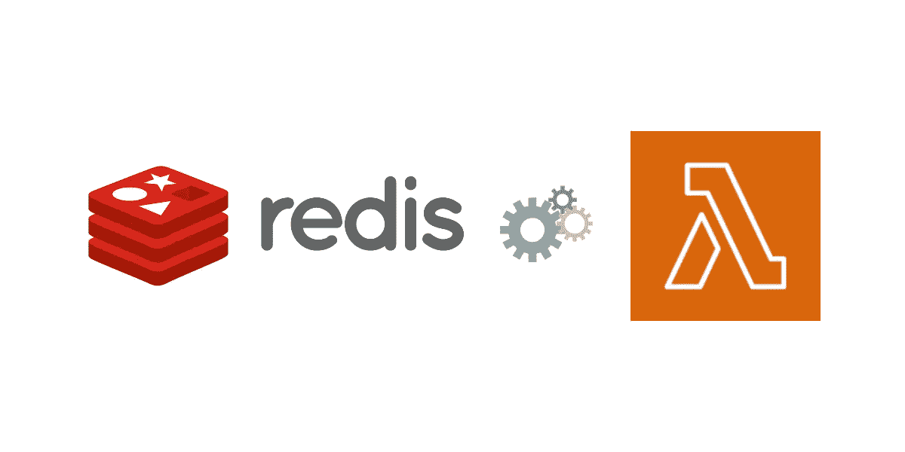

# 使用 AWS Lambda 和无服务器 Redis 的作业处理和事件队列

> 原文：<https://levelup.gitconnected.com/job-processing-and-event-queue-with-aws-lambda-and-serverless-redis-d84a05dff0de>



# 动机

无服务器功能凭借其动态伸缩和灵活的定价模式非常适合许多任务。但是当你有一个由长时间运行的复杂步骤组成的任务时，在一个单一的无服务器功能中运行它是不可行的。一个简单的解决方案就是从无服务器功能中卸载复杂的任务。您可以在自己喜欢的环境中异步处理这些功能，这也可以是其他无服务器功能、无服务器容器或传统的基于服务器的流程。为了减轻您的任务，您需要一个可靠的事件队列。在本文中，我们将使用 Upstash Redis 来实现这一目的。

# 方案

你正在为你的公司开发一个`New Employee Registration`表格。将员工记录保存到数据库中是比较容易的部分。以下是可以做的事情:

*   创建帐户(电子邮件、slack 等)。
*   向员工发送电子邮件。
*   给招聘经理和其他人发邮件。
*   为 IT 部门创建一张 JIRA 票证，以便他们安装员工的计算机。

对于更大的公司，这个列表可能会更长。

*   您希望表单具有响应性。您确实希望新员工在单击提交后等待几分钟。
*   以上步骤可能会有变化。每当添加新过程时，您都不希望更新您的代码。

解耦侧过程将解决上述问题。当新员工注册时，您可以将新事件推送到相关的任务队列中；那么另一个进程将消耗该任务。

让我们构建示例应用程序:

# 项目设置

该项目将包括两个模块:

*   生产者将是一个无服务器的功能，将接收注册新员工所需的输入参数。它还会为任务队列生成事件。
*   消费者将是一个工作者应用程序，它将不断地消耗任务队列。

(源代码见)

# 技术堆栈

*   用于无服务器计算的 AWS Lambda
*   作为无服务器分销商，抢了的风头
*   [公牛](https://github.com/OptimalBits/bull)为任务队列实现
*   用于项目部署的无服务器框架

# 上传数据库

您可以从 [Upstash](https://docs.upstash.com/) 创建一个免费的 Redis 数据库。Upstash 的好处是它的每请求定价，价格上限为 120 美元。所以你将支付你所使用的，但不高于 120 美元。

创建数据库后，复制端点、端口和密码，在接下来的步骤中会用到。

# 生产者代码

我们的生产者将是无服务器函数，它将获得请求参数并为队列产生任务。在现实世界中，这段代码应该做保存到数据库这样的事情，但是为了简单起见，我不会实现它。

1-通过`serverless`命令创建一个无服务器项目。

```
➜  serverlessServerless: No project detected. Do you want to create a new one? YesServerless: What do you want to make? AWS Node.jsServerless: What do you want to call this project? producerProject successfully created in 'producer' folder.You can monitor, troubleshoot, and test your new service with a free Serverless account.Serverless: Would you like to enable this? NoYou can run the “serverless” command again if you change your mind later.
```

2-安装[公牛](https://github.com/OptimalBits/bull):

`npm install bull`

三功能代码:

```
var Queue = require('bull');var settings = {
stalledInterval: 300000, // How often check for stalled jobs (use 0 for never checking).
guardInterval: 5000, // Poll interval for delayed jobs and added jobs.
drainDelay: 300 // A timeout for when the queue is in drained state (empty waiting for jobs).
}module.exports.hello = async (event) => {
var taskQueue = new Queue('employee registration',
{redis: {port: 32016, host: 'us1-upward-ant-32016.upstash.io', password: 'ake4ff120d6b4216df220736be7eab087', tls: {}}}
, settings);
await taskQueue.add({event: event})// TODO save the employee record to a database
return { message: 'New employee event enqueued! 34', event };
};
```

注 1:不要忘记替换您自己的 Redis 端点、端口和密码。如果禁用了 TLS，请移除 TLS 部分。

注 2:我们为事件队列(Bull)提供了额外的参数(设置),因此它将不会利用 Upstash 配额。根据您对事件延迟的容忍度来更新间隔参数。

# 消费者代码

```
var Queue = require('bull');var settings = {
stalledInterval: 300000, // How often check for stalled jobs (use 0 for never checking).
guardInterval: 5000, // Poll interval for delayed jobs and added jobs.
drainDelay: 300 // A timeout for when the queue is in drained state (empty waiting for jobs).
}var taskQueue = new Queue('employee registration',
{redis: {port: 32016, host: 'us1-upward-ant-32016.upstash.io', password: 'ake4ff120d6b4216df220736be7eab087', tls: {}}}
, settings);taskQueue.process(function (job, done) {
console.log(job.data)
// TODO process the new employee event
done();
}).catch(err => {
console.log(err)
});
```

我们将编写一个基本的节点应用程序来使用这些事件。创建一个新目录，运行`npm init`和`npm install bull`。然后创建 index.js，如下所示:

注 1:不要忘记替换您自己的 Redis 端点、端口和密码。如果禁用了 TLS，请移除 TLS 部分。

注 2:我们为事件队列(Bull)提供了额外的参数(设置),因此它将不会利用 Upstash 配额。根据您对事件延迟的容忍度来更新间隔参数。

# 测试应用程序

首先使用以下命令运行消费者应用程序

`node index`

要测试生成器代码，请运行:

```
serverless invoke local -f hello -d "{name:'Bill Gates', email:'[bill@upstash.com](mailto:bill@upstash.com)', position:'Developer', date:'20210620'}"
```

您将看到生成器将记录如下:


消费者将登录如下:


*最初发表于*[*https://docs.upstash.com*](https://docs.upstash.com/tutorials/job_processing)*。*